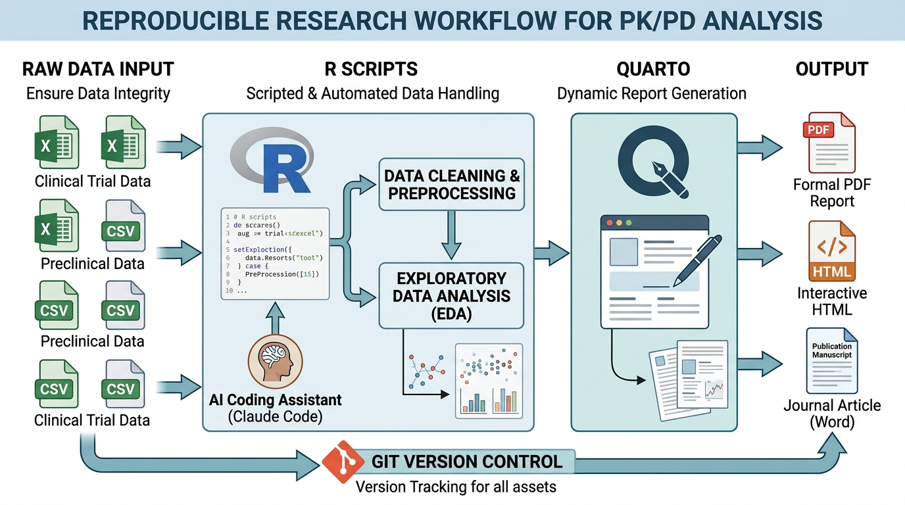
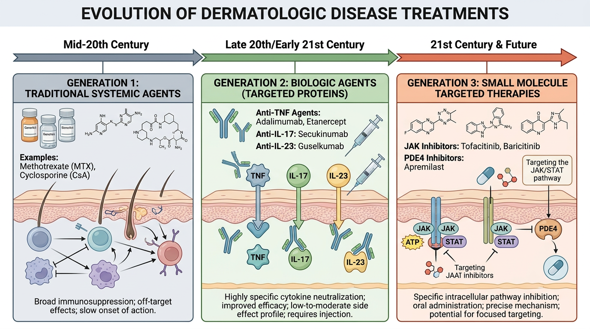

# 서론: 과정 소개 및 환경 설정 {#sec-introduction}

## 이 과정에 대하여

이 교재는 피부과 및 자가면역 질환 분야의 의학대학원생을 위한 **약동학/약력학(Pharmacokinetics/Pharmacodynamics, PK/PD) 자료처리** 과정입니다. 임상에서 접하는 약물의 체내 동태를 이해하고, 실제 데이터를 R 프로그래밍 언어로 분석하는 능력을 기르는 것을 목표로 합니다.

피부과 전문의가 되려는 여러분에게 약동학이 왜 필요한지 의문이 들 수 있습니다. 하지만 생물학적 제제(biologics)의 시대에 접어들면서, 약물의 혈중 농도와 임상 반응의 관계를 이해하는 것은 더 이상 약리학자만의 영역이 아닙니다. Adalimumab의 면역원성(immunogenicity)으로 인한 약물 농도 저하, Dupilumab의 체중별 용량 조절, Tofacitinib의 약물 상호작용 -- 이 모든 것이 PK/PD에 대한 기본적 이해를 요구합니다.

이 과정을 마치면 여러분은 다음을 할 수 있게 됩니다:

- 임상시험 데이터의 구조를 이해하고 정리할 수 있다
- R을 사용하여 PK 파라미터(AUC, Cmax, t~1/2~ 등)를 산출할 수 있다
- 농도-시간 곡선을 시각화하고 해석할 수 있다
- 비구획분석(Non-Compartmental Analysis, NCA)을 직접 수행할 수 있다
- 기본적인 PK 모델링의 원리를 이해하고 시뮬레이션을 수행할 수 있다

---

## 약동학/약력학 자료처리의 중요성 {#sec-importance}

{#fig-ch01-3 width=100%}

### 신약 개발 과정에서의 PK/PD 분석 역할

신약이 환자에게 도달하기까지는 평균 10-15년의 기간과 수조 원의 비용이 소요됩니다. 이 과정에서 PK/PD 분석은 거의 모든 단계에 관여합니다.

**전임상 단계(Preclinical Phase)**에서는 동물 실험 데이터를 바탕으로 인체 최초 투여 용량(First-in-Human dose)을 예측합니다. Allometric scaling을 통해 동물에서의 청소율(clearance)과 분포용적(volume of distribution)을 인체로 외삽(extrapolation)하는 작업이 필요합니다.

**임상 1상(Phase I)**에서는 건강한 자원자를 대상으로 약물의 안전성과 PK 특성을 평가합니다. 용량-비례성(dose proportionality), 음식의 영향(food effect), 약물 상호작용(drug-drug interaction) 등을 평가하며, 이 모든 것이 PK 데이터 분석에 기반합니다.

**임상 2상(Phase II)**에서는 PK/PD 관계를 규명하여 최적 용량을 탐색합니다. 예를 들어, Apremilast의 경우 PDE4 억제율과 PASI 점수 개선의 관계를 모델링하여 하루 2회 30mg이라는 최종 용량이 결정되었습니다.

**임상 3상(Phase III)** 이후에도 PK/PD 분석은 계속됩니다. 용량 조절 가이드라인 수립, 특수 집단(신장애, 간장애 환자)에서의 용량 권고, 치료적 약물 모니터링(Therapeutic Drug Monitoring, TDM) 전략 수립 등에 활용됩니다.

:::{.callout-note}
## 피부과에서의 PK/PD 사례

건선 치료에 사용되는 **Adalimumab**의 경우, 혈중 약물 농도(trough level)가 일정 수준 이하로 떨어지면 치료 반응이 감소합니다. 이는 중화항체(Anti-Drug Antibody, ADA) 생성과 관련이 있으며, PK/PD 분석을 통해 "목표 최저 농도(target trough concentration)"를 설정하고 용량을 조절하는 TDM 전략이 개발되었습니다. 이러한 개인 맞춤형 치료(personalized medicine)는 PK/PD에 대한 이해 없이는 불가능합니다.
:::

### 재현 가능한 연구의 필요성

과학 연구의 핵심 원칙 중 하나는 **재현가능성(reproducibility)**입니다. 같은 데이터를 같은 방법으로 분석하면 같은 결과를 얻어야 합니다. 그러나 현실에서는 이것이 쉽지 않습니다.

2010년대 중반, 생물의학 연구에서 재현성 위기(reproducibility crisis)가 크게 대두되었습니다. Nature 저널의 설문조사에 따르면, 연구자의 70% 이상이 다른 연구자의 실험을 재현하는 데 실패한 경험이 있다고 응답했습니다. 이는 데이터 분석 과정의 불투명성과도 깊은 관련이 있습니다.

재현 가능한 연구를 위해서는 다음이 필요합니다:

1. **원본 데이터(raw data)**가 보존되어야 합니다
2. **분석 과정**이 코드로 문서화되어야 합니다
3. **분석 환경**(소프트웨어 버전 등)이 기록되어야 합니다
4. **결과 생성 과정**이 자동화되어야 합니다

R과 Quarto를 사용하면 이 네 가지를 모두 충족할 수 있습니다. 코드와 결과가 하나의 문서에 통합되어, 누구나 같은 코드를 실행하여 같은 결과를 얻을 수 있습니다.

### 왜 코딩이 필요한가: 엑셀의 한계 vs R의 장점

많은 임상 연구자들이 Microsoft Excel을 데이터 분석의 주요 도구로 사용합니다. Excel은 직관적이고 배우기 쉽다는 장점이 있지만, PK/PD 데이터 분석에는 심각한 한계가 있습니다.

**Excel의 한계:**

- **재현성 부재**: 마우스 클릭으로 수행한 분석은 기록이 남지 않습니다. 한 달 후에 같은 분석을 반복하려면 처음부터 다시 해야 합니다.
- **유전자 이름 문제**: Excel은 "MARCH1"이나 "SEPT4" 같은 유전자 이름을 자동으로 날짜로 변환합니다. 이 문제로 인해 2020년에 HUGO Gene Nomenclature Committee가 일부 유전자의 공식 명칭을 변경해야 했을 정도입니다.
- **대용량 데이터 처리 한계**: Excel은 행 수가 약 100만 행으로 제한되며, 대규모 임상시험 데이터를 다루기에 부족합니다.
- **통계 분석 제한**: 비선형 회귀(nonlinear regression), 혼합효과 모형(mixed-effects model) 등 고급 분석이 불가능합니다.
- **그래프 품질**: 학술지 투고에 적합한 고품질 그래프를 만들기 어렵습니다.

**R의 장점:**

- **무료 오픈소스**: 누구나 무료로 사용할 수 있으며, 전 세계 커뮤니티가 지속적으로 발전시키고 있습니다.
- **완전한 재현성**: 모든 분석이 코드로 기록되어 언제든 동일한 결과를 재현할 수 있습니다.
- **강력한 패키지 생태계**: CRAN에 20,000개 이상의 패키지가 등록되어 있으며, PK/PD 분석에 특화된 패키지(NonCompart, PKNCA, mrgsolve, nlmixr2 등)가 풍부합니다.
- **출판 품질 시각화**: ggplot2를 통해 학술지 수준의 그래프를 쉽게 만들 수 있습니다.
- **문서화와 분석의 통합**: Quarto/R Markdown을 통해 분석 코드와 보고서를 하나의 문서로 작성할 수 있습니다.

:::{.callout-warning}
## Excel 사용 시 흔한 실수

PK 데이터 분석에서 Excel을 사용할 때 가장 흔한 실수는 **시간 데이터의 자동 서식 변환**입니다. 예를 들어, 투약 후 0.5시간을 입력하면 Excel이 이를 "12:00:00 PM"으로 변환할 수 있습니다. 또한 복사-붙여넣기 과정에서 행이 밀리거나, 숨겨진 행/열이 계산에서 제외되는 등의 문제가 빈번하게 발생합니다. 이러한 오류는 감사(audit) 과정에서 발견하기 매우 어렵습니다.
:::

---

## ADME 기초 약리학 {#sec-adme}

{#fig-ch01-1 width=100%}

약동학을 이해하기 위한 가장 기본적인 프레임워크가 바로 **ADME**입니다. ADME는 흡수(Absorption), 분포(Distribution), 대사(Metabolism), 배설(Excretion)의 약자로, 약물이 체내에 들어와서 나가기까지의 전 과정을 설명합니다.

### 흡수 (Absorption) {#sec-absorption}

약물의 흡수란 투여 부위에서 전신 순환(systemic circulation)으로 약물이 이동하는 과정입니다. 흡수 경로에 따라 약물의 생체이용률(bioavailability, F)과 흡수 속도가 크게 달라집니다.

**경구 투여(Oral Administration)**

경구 투여는 가장 흔한 약물 투여 경로입니다. 약물은 위장관에서 흡수되어 간문맥(portal vein)을 통해 간을 먼저 거친 후 전신 순환에 도달합니다. 이 과정에서 발생하는 약물의 손실을 **초회 통과 효과(first-pass effect)**라고 합니다.

- **Methotrexate**: 경구 생체이용률이 약 64%이며, 용량 증가에 따라 흡수 포화가 나타나 비선형 약동학을 보입니다. 저용량(7.5-15mg/주)에서는 경구 투여가 적절하지만, 고용량에서는 피하주사가 선호됩니다.
- **Apremilast**: 경구 생체이용률이 약 73%로 양호하며, 용량에 비례한 선형 약동학을 보입니다.
- **Tofacitinib**: 경구 생체이용률이 약 74%이며, 빠른 흡수(T~max~ 0.5-1시간)를 보입니다.
- **Cyclosporine**: 경구 생체이용률이 20-50%로 변이가 크며, 이는 장관 내 P-glycoprotein에 의한 유출(efflux)과 CYP3A4에 의한 장벽 대사 때문입니다. 마이크로에멀전 제형(Neoral)이 기존 제형(Sandimmune)보다 흡수를 개선하였습니다.

**피하주사(Subcutaneous Injection)**

생물학적 제제(단클론항체 등)는 분자량이 크고(약 150 kDa) 위장관에서 분해되기 때문에 경구 투여가 불가능합니다. 피하주사 후 약물은 림프계(lymphatic system)를 통해 서서히 전신 순환에 흡수됩니다.

- **Adalimumab**: 피하주사 후 절대 생체이용률은 약 64%이며, T~max~는 약 5일(131시간)입니다. 느린 흡수 과정이 2주 간격 투여를 가능하게 합니다.
- **Dupilumab**: 피하주사 후 절대 생체이용률은 약 61%이며, T~max~는 약 1주일입니다. 초회 600mg 부하용량(loading dose) 후 300mg을 2주 간격으로 투여합니다.

:::{.callout-note}
## 단클론항체의 피하주사 흡수

단클론항체의 피하주사 후 흡수 과정은 소분자 약물과 근본적으로 다릅니다. 소분자 약물은 모세혈관을 통해 직접 혈류로 흡수되지만, 항체와 같은 고분자 단백질(>20 kDa)은 주로 **림프관(lymphatic vessels)**을 통해 흡수됩니다. 주사 부위에서 림프절을 거쳐 흉관(thoracic duct)을 통해 정맥계로 유입되는 이 과정은 수일이 소요되며, 이것이 단클론항체의 느린 T~max~를 설명합니다. 또한 림프계로 이동하는 과정에서 단백질 분해(proteolysis)가 일어나 생체이용률이 60-80% 수준에 머무릅니다.
:::

### 분포 (Distribution) {#sec-distribution}

약물이 전신 순환에 도달한 후, 혈액에서 조직으로 이동하는 과정을 분포라고 합니다. 분포에 영향을 미치는 주요 인자로는 혈장단백결합(plasma protein binding), 조직 친화도, 혈류량 등이 있습니다.

**혈장단백결합(Plasma Protein Binding)**

혈중 약물은 유리형(free, unbound)과 결합형(bound)으로 존재합니다. 유리형 약물만이 약리작용을 나타내고 대사와 배설의 대상이 됩니다.

| 약물 | 혈장단백결합률 | 주요 결합 단백질 |
|------|--------------|----------------|
| Methotrexate | 약 50% | 알부민(Albumin) |
| Cyclosporine | 약 90% | 적혈구, 리포프로틴 |
| Apremilast | 약 68% | 알부민 |
| Tofacitinib | 약 40% | 알부민 |
| Adalimumab | N/A (항체) | 표적항원(TNF-α) |
| Dupilumab | N/A (항체) | 표적항원(IL-4Rα) |

**분포용적(Volume of Distribution, V~d~)**

분포용적은 약물이 체내에서 어느 정도 넓게 분포하는지를 나타내는 약동학적 파라미터입니다. 혈장 농도와 체내 총 약물량의 관계를 나타내는 비례상수로, 실제 생리학적 공간을 의미하지는 않습니다.

$$V_d = \frac{\text{체내 약물의 총량(Amount)}}{\text{혈장 약물 농도(Concentration)}}$$

- **V~d~가 작은 약물** (< 혈장량 ~3L): 혈장 내에 주로 머무름
- **V~d~가 혈장량과 유사한 약물** (~3-15L): 세포외액에 분포
- **V~d~가 큰 약물** (> 체중 ~42L): 조직에 광범위하게 분포

| 약물 | 분포용적 | 해석 |
|------|---------|------|
| Methotrexate | 0.4-0.8 L/kg | 세포외액에 주로 분포 |
| Cyclosporine | 3-5 L/kg | 조직 광범위 분포 |
| Tofacitinib | 87 L | 중등도 조직 분포 |
| Adalimumab | ~5-6 L | 혈관 내 주로 분포 (항체 특성) |
| Dupilumab | ~4.8 L | 혈관 내 주로 분포 (항체 특성) |

단클론항체(Adalimumab, Dupilumab)의 분포용적이 혈장량(~3L)에 가까운 것은, 이들이 거대 분자(~150 kDa)이기 때문에 모세혈관 벽을 자유롭게 통과하지 못하고 혈관 내에 주로 머무르기 때문입니다.

### 대사 (Metabolism) {#sec-metabolism}

약물 대사는 체내에서 약물의 화학적 구조를 변환하여 보다 수용성이 높은(hydrophilic) 형태로 만들어 배설을 촉진하는 과정입니다. 주로 간에서 일어나며, **Phase I 반응**과 **Phase II 반응**으로 나뉩니다.

**Phase I 반응 (기능화 반응, Functionalization)**

Phase I 반응은 산화(oxidation), 환원(reduction), 가수분해(hydrolysis) 등을 통해 약물에 반응기(-OH, -NH~2~, -SH 등)를 도입하거나 노출시키는 반응입니다. 이 중 가장 중요한 것이 **Cytochrome P450 (CYP) 효소 시스템**에 의한 산화 반응입니다.

CYP450 효소는 간의 소포체(endoplasmic reticulum)에 존재하는 일련의 효소군으로, 약물 대사의 약 75%를 담당합니다. 주요 CYP 아형(isoform)과 피부과 관련 약물의 관계는 다음과 같습니다:

- **CYP3A4**: 가장 많은 약물을 대사하는 아형 (전체 약물의 ~50%)
  - **Cyclosporine**: CYP3A4에 의해 주로 대사됨. Ketoconazole(CYP3A4 억제제) 병용 시 Cyclosporine 혈중 농도 크게 상승 → 독성 위험
  - **Tofacitinib**: 주로 CYP3A4에 의해 대사 (~70%)되며, 일부 CYP2C19도 관여
- **CYP2C19**: Tofacitinib 대사에 보조적으로 관여
- **CYP1A2, CYP2D6**: Methotrexate의 간 대사에 부분적으로 관여 (주된 제거 경로는 신배설)

**Phase II 반응 (결합 반응, Conjugation)**

Phase I에서 생성된 반응기에 큰 극성 분자(글루쿠론산, 황산, 글루타티온 등)를 결합시켜 수용성을 더욱 높이는 반응입니다.

- Methotrexate → 7-OH-MTX (산화) → 폴리글루타메이트(polyglutamate) 결합
- Tofacitinib → 글루쿠론산 포합(glucuronide conjugation)

**단클론항체의 대사: 전통적 CYP 대사와 다른 경로**

단클론항체(Adalimumab, Dupilumab)는 단백질이므로 CYP450 효소에 의해 대사되지 않습니다. 대신 다음과 같은 경로로 제거됩니다:

1. **표적 매개 약물 처분(Target-Mediated Drug Disposition, TMDD)**: 항체가 표적 항원에 결합한 후 세포 내로 내재화(internalization)되어 리소좀(lysosome)에서 분해
2. **비특이적 IgG 대사**: 세포의 피노사이토시스(pinocytosis)에 의해 세포 내로 유입된 후 리소좀에서 분해
3. **FcRn recycling**: 신생아 Fc 수용체(Neonatal Fc Receptor, FcRn)가 IgG를 구조하여 다시 혈류로 되돌림 → 이것이 항체의 긴 반감기(~2-3주)를 가능하게 하는 핵심 메커니즘

:::{.callout-important}
## CYP3A4 약물 상호작용: 임상적 중요성

Cyclosporine은 CYP3A4의 기질(substrate)이자 억제제(inhibitor)입니다. 따라서 다음과 같은 약물 상호작용에 주의해야 합니다:

- **CYP3A4 억제제** (Ketoconazole, Itraconazole, Erythromycin, 자몽주스 등) 병용 → Cyclosporine 혈중 농도 **상승** → 신독성(nephrotoxicity), 간독성 위험
- **CYP3A4 유도제** (Rifampicin, Phenytoin, St. John's wort 등) 병용 → Cyclosporine 혈중 농도 **하강** → 치료 실패 위험

Tofacitinib 역시 CYP3A4로 대사되므로, 강력한 CYP3A4 억제제(Ketoconazole 등) 병용 시 용량을 **절반으로 감량**(5mg 1일 2회 → 5mg 1일 1회)해야 합니다.
:::

### 배설 (Excretion) {#sec-excretion}

약물과 그 대사체가 체외로 제거되는 과정입니다. 주요 배설 경로는 신장(renal)과 간/담즙(hepatic/biliary)입니다.

**신장 배설(Renal Excretion)**

신장은 사구체 여과(glomerular filtration), 세뇨관 분비(tubular secretion), 세뇨관 재흡수(tubular reabsorption)를 통해 약물을 배설합니다.

- **Methotrexate**: 80-90%가 신장으로 배설되며, 주로 사구체 여과와 세뇨관 분비를 통해 제거됩니다. **신기능 저하 환자에서 Methotrexate 축적으로 인한 골수억제, 점막염 등 중증 부작용 위험이 크게 증가합니다.**
- **Tofacitinib**: 약 30%가 변화 없이 신장으로 배설됩니다.

**간/담즙 배설(Hepatic/Biliary Excretion)**

- **Cyclosporine**: 주로 간에서 CYP3A4에 의해 대사된 후 담즙으로 배설됩니다. 원형 약물의 6% 미만만이 신장으로 배설됩니다.

**단클론항체의 배설**

단클론항체는 크기가 크기 때문에(~150 kDa) 사구체에서 여과되지 않으며, 간에서 담즙으로 배설되지도 않습니다. 앞서 설명한 바와 같이, 세포 내 단백질 분해(proteolytic degradation)를 통해 아미노산으로 분해되어 재활용됩니다. FcRn에 의한 재활용(recycling)이 이 과정의 속도를 조절합니다.

:::{.callout-note}
## 피부과 약물의 ADME 요약

| 특성 | Methotrexate | Cyclosporine | Apremilast | Tofacitinib | Adalimumab | Dupilumab |
|------|-------------|-------------|-----------|------------|-----------|----------|
| 투여경로 | PO/SC | PO | PO | PO | SC | SC |
| F (%) | ~64 (PO) | 20-50 | ~73 | ~74 | ~64 | ~61 |
| 주요 대사 | 신배설 (80-90%) | CYP3A4 | CYP3A4 외 다수 | CYP3A4 (70%) | TMDD/FcRn | TMDD/FcRn |
| 반감기 | 3-10시간 | 6-24시간 | 6-9시간 | ~3시간 | ~14일 | ~26일 |
| 주요 배설 | 신장 | 담즙 | 신장 (58%) | 신장 (30%) | 단백질 분해 | 단백질 분해 |

소분자 약물(Methotrexate, Cyclosporine, Apremilast, Tofacitinib)은 전통적 ADME 원리를 따르지만, 단클론항체(Adalimumab, Dupilumab)는 근본적으로 다른 체내동태를 보입니다. 이 차이를 이해하는 것이 PK/PD 자료를 올바르게 해석하는 출발점입니다.
:::

---

## 피부과 질환과 약물치료 개관 {#sec-dermatology}

{#fig-ch01-2 width=100%}

### 건선 (Psoriasis) {#sec-psoriasis}

건선은 전 세계 인구의 2-3%에 영향을 미치는 만성 염증성 피부질환으로, T세포 매개 면역 반응이 핵심 병태생리입니다.

**병태생리(Pathophysiology)**

건선의 면역학적 기전은 다음과 같은 축(axis)으로 요약됩니다:

1. **TNF-α 축**: 활성화된 수지상세포(dendritic cell)가 TNF-α를 분비 → 각질세포(keratinocyte) 증식 촉진, 혈관신생(angiogenesis) 유도
2. **IL-23/IL-17 축**: 수지상세포가 IL-23을 분비 → Th17 세포 분화 촉진 → IL-17A, IL-17F 분비 → 각질세포의 과증식 및 호중구(neutrophil) 동원
3. **IL-12/IFN-γ 축**: IL-12가 Th1 세포 분화를 유도 → IFN-γ 분비 → 염증 반응 유지

이 중 **IL-23/IL-17 축**이 건선의 핵심 병태생리로 인정되어, 이를 표적으로 하는 생물학적 제제들이 가장 높은 치료 효과를 보이고 있습니다.

**건선 치료의 PK/PD 관점**

건선의 중증도는 PASI (Psoriasis Area and Severity Index) 점수로 평가합니다. PK/PD 모델링에서는 약물 농도와 PASI 개선율(PASI 75, PASI 90, PASI 100)의 관계를 분석합니다. 예를 들어:

- Adalimumab의 경우, 혈중 최저 농도(C~trough~) > 5 μg/mL 유지 시 PASI 75 달성률이 유의하게 높습니다
- IL-17 억제제(Secukinumab 등)는 급속한 IL-17 농도 감소와 함께 빠른 PASI 개선을 보여, 직접적인 PK/PD 관계가 입증되었습니다

### 아토피 피부염 (Atopic Dermatitis) {#sec-atopic-dermatitis}

아토피 피부염은 소아에서 가장 흔한 만성 염증성 피부질환으로, 성인에서도 유병률이 증가하고 있습니다.

**병태생리(Pathophysiology)**

아토피 피부염의 면역학적 특징은 **Th2 면역반응의 과활성**입니다:

1. **피부 장벽 기능 저하**: Filaggrin 등 피부장벽 단백질의 결손/기능 저하
2. **Th2 사이토카인 과발현**: IL-4, IL-13이 핵심 사이토카인
   - IL-4: Th2 세포 분화 촉진, IgE 생성 유도
   - IL-13: 피부장벽 기능 저하, 점액 분비 촉진
3. **IL-31**: 소양증(pruritus)의 주요 매개체
4. **TSLP (Thymic Stromal Lymphopoietin)**: 상피세포에서 분비, Th2 면역반응 개시

**아토피 피부염 치료의 PK/PD 관점**

아토피 피부염의 중증도는 EASI (Eczema Area and Severity Index) 또는 IGA (Investigator's Global Assessment) 점수로 평가합니다.

- **Dupilumab**: IL-4Rα를 차단하여 IL-4와 IL-13 신호를 동시에 억제합니다. 노출-반응 분석에서 체중이 PK의 주요 변동 요인으로 확인되었으며, 이에 따라 소아에서 체중 기반 용량 조절이 이루어집니다.
- **Tofacitinib**: JAK1/JAK3 억제를 통해 IL-4, IL-13 등 다수의 사이토카인 신호를 차단합니다.

### 치료 약물 스펙트럼 {#sec-treatment-spectrum}

피부과 면역 질환의 치료는 다음과 같은 단계적 발전을 거쳐왔습니다:

```
전통적 전신치료제    →    생물학적 제제       →    소분자 표적 치료제
(1970-90년대)           (2000년대~)                (2010년대~)

Methotrexate            Adalimumab (TNF-α)        Apremilast (PDE4)
Cyclosporine            Dupilumab (IL-4Rα)        Tofacitinib (JAK)
                        Secukinumab (IL-17A)       Upadacitinib (JAK1)
                        Guselkumab (IL-23)         Baricitinib (JAK1/2)
```

### 6가지 핵심 약물 소개 {#sec-six-drugs}

이 과정에서 집중적으로 다룰 6가지 약물을 소개합니다. 이 약물들은 피부과 면역 질환 치료의 스펙트럼을 대표하며, 서로 다른 PK 특성을 보여 학습에 이상적입니다.

**1. Methotrexate (MTX)**

- **분류**: 전통적 전신치료제 (항대사제, Antimetabolite)
- **기전**: Dihydrofolate reductase (DHFR) 억제 → 엽산 대사 차단 → 세포 증식 억제; 저용량에서 adenosine 방출 증가 → 항염증 효과
- **적응증**: 건선, 류마티스 관절염, 크론병
- **PK 특징**: 선형 → 비선형 전환 (용량 의존적 흡수 포화), 신배설 80-90%
- **용량**: 7.5-25 mg/주 (1주 1회)
- **주요 부작용**: 골수억제, 간독성, 폐독성, 최기형성(teratogenicity)

**2. Cyclosporine (CsA)**

- **분류**: 전통적 전신치료제 (칼시뉴린 억제제, Calcineurin inhibitor)
- **기전**: Cyclophilin에 결합 → Calcineurin 억제 → NFAT 탈인산화 차단 → IL-2 전사 억제 → T세포 활성화 억제
- **적응증**: 아토피 피부염, 건선, 장기이식 거부반응 예방
- **PK 특징**: 높은 개체간 변이, CYP3A4/P-gp 기질, 좁은 치료역(narrow therapeutic index)
- **용량**: 2.5-5 mg/kg/일
- **주요 부작용**: 신독성, 고혈압, 고칼륨혈증, 감염 위험

**3. Apremilast**

- **분류**: 소분자 표적 치료제 (PDE4 억제제)
- **기전**: Phosphodiesterase 4 (PDE4) 억제 → cAMP 증가 → 염증성 사이토카인(TNF-α, IL-17 등) 감소, 항염증성 사이토카인(IL-10) 증가
- **적응증**: 건선, 건선성 관절염, 베체트병 구강궤양
- **PK 특징**: 양호한 경구 생체이용률, 선형 약동학
- **용량**: 30 mg 1일 2회 (초기 증량 요법 후)
- **주요 부작용**: 설사, 오심, 두통, 체중 감소, 우울증

**4. Adalimumab**

- **분류**: 생물학적 제제 (완전 인간 anti-TNF-α 단클론항체)
- **기전**: TNF-α에 결합 → TNF-α 매개 염증 반응 차단
- **적응증**: 건선, 건선성 관절염, 류마티스 관절염, 크론병, 화농성 한선염(hidradenitis suppurativa)
- **PK 특징**: TMDD, FcRn recycling, 면역원성(ADA 생성)에 의한 청소율 변화
- **용량**: 40 mg 격주 피하주사 (건선 초기 80 mg 부하용량)
- **주요 부작용**: 감염(특히 결핵 재활성화), 주사 부위 반응, 탈수초질환

**5. Dupilumab**

- **분류**: 생물학적 제제 (완전 인간 anti-IL-4Rα 단클론항체)
- **기전**: IL-4Rα에 결합 → IL-4와 IL-13 신호 동시 차단 → Th2 면역반응 억제
- **적응증**: 아토피 피부염, 천식, 만성 비부비동염(chronic rhinosinusitis with nasal polyps)
- **PK 특징**: 비선형 약동학(TMDD), 체중 의존적 분포, 면역원성 낮음
- **용량**: 초회 600 mg 후 300 mg 격주 피하주사
- **주요 부작용**: 결막염, 주사 부위 반응, 호산구 증가

**6. Tofacitinib**

- **분류**: 소분자 표적 치료제 (JAK1/JAK3 억제제)
- **기전**: JAK1/JAK3 억제 → STAT 인산화 차단 → IL-4, IL-13, IL-6, IFN-γ 등 다수 사이토카인 신호 억제
- **적응증**: 류마티스 관절염, 건선성 관절염, 궤양성 대장염, 아토피 피부염(일부 국가)
- **PK 특징**: 빠른 흡수/소실, CYP3A4 주대사, 선형 약동학
- **용량**: 5 mg 1일 2회 또는 서방형 11 mg 1일 1회
- **주요 부작용**: 감염(대상포진 위험 증가), 혈전색전증, 이상지질혈증, 림프구감소증

:::{.callout-important}
## 임상 안전성 고려사항

이 교재에서 다루는 약물들은 모두 면역억제 효과를 가지고 있어, **감염 위험 증가**가 공통적인 주요 부작용입니다. 특히:

- **Methotrexate, Cyclosporine**: 기회감염(opportunistic infection) 위험
- **Adalimumab (TNF-α 억제제)**: 결핵(TB) 재활성화 위험 → 투여 전 잠복결핵 선별검사 필수
- **Tofacitinib (JAK 억제제)**: 대상포진(herpes zoster) 위험 2-3배 증가, 심혈관계 및 혈전색전증 위험에 대한 FDA 경고(boxed warning)

이러한 약물의 PK/PD를 이해하는 것은 효과적이고 안전한 치료를 위한 기반입니다.
:::

---

## R 환경 설정 {#sec-r-setup}

이 과정의 모든 실습은 R 프로그래밍 언어를 사용합니다. 이 절에서는 R과 관련 도구들을 설치하고 기본 사용법을 익힙니다.

### R과 RStudio 설치 {#sec-install-r}

**R 설치**

R은 통계 계산과 그래픽을 위한 오픈소스 프로그래밍 언어입니다.

1. [https://cran.r-project.org/](https://cran.r-project.org/) 접속
2. 운영체제(Windows, macOS, Linux)에 맞는 최신 버전 다운로드
3. 설치 프로그램 실행 (기본 옵션으로 설치)

**RStudio 설치**

RStudio는 R을 편리하게 사용할 수 있게 해주는 통합 개발 환경(IDE)입니다.

1. [https://posit.co/download/rstudio-desktop/](https://posit.co/download/rstudio-desktop/) 접속
2. 무료 버전(RStudio Desktop Free) 다운로드
3. 설치 프로그램 실행

:::{.callout-tip}
## RStudio 화면 구성

RStudio를 처음 열면 4개의 패널(pane)이 보입니다:

- **좌상단**: 소스 편집기(Source Editor) - R 스크립트를 작성하는 곳
- **좌하단**: 콘솔(Console) - R 명령어를 직접 입력하고 결과를 확인하는 곳
- **우상단**: 환경(Environment) - 현재 생성된 변수와 데이터를 확인하는 곳
- **우하단**: 파일/그래프/도움말(Files/Plots/Help) - 파일 탐색, 그래프 출력, 도움말 확인

처음에는 콘솔에서 직접 명령어를 입력하며 연습하고, 익숙해지면 소스 편집기에서 스크립트를 작성하는 것을 권장합니다.
:::

### Quarto 설치 및 기본 사용법 {#sec-quarto}

Quarto는 R Markdown의 차세대 버전으로, 코드와 문서를 하나로 통합할 수 있는 출판 시스템입니다.

**Quarto 설치**

1. [https://quarto.org/docs/get-started/](https://quarto.org/docs/get-started/) 접속
2. 운영체제에 맞는 설치 프로그램 다운로드 및 설치
3. 최신 RStudio에는 Quarto가 기본 내장되어 있으므로, RStudio를 최신 버전으로 업데이트하는 것만으로도 충분합니다

**Quarto 문서 기본 구조**

Quarto 문서(.qmd)는 YAML 헤더, 마크다운 텍스트, 코드 청크(code chunk)로 구성됩니다:

````markdown
---
title: "나의 첫 Quarto 문서"
author: "홍길동"
format: html
---

## 제목

일반 텍스트를 작성합니다.

```{r}
# R 코드를 작성합니다
1 + 1
```
````

### 필수 패키지 설치 {#sec-packages}

이 과정에서 사용할 R 패키지들을 설치합니다. RStudio 콘솔에 다음 코드를 입력하여 실행합니다:

```{r}
#| eval: false
#| label: install-packages

# 기본 데이터 처리 및 시각화 패키지
install.packages("tidyverse")   # dplyr, ggplot2, tidyr, readr 등 포함

# PK 분석 전용 패키지
install.packages("NonCompart")  # 비구획분석 (NCA)
install.packages("PKNCA")       # PK 비구획분석 (또 다른 도구)

# PK 모델링 및 시뮬레이션
install.packages("mrgsolve")    # ODE 기반 PK/PD 시뮬레이션

# 표 작성
install.packages("gt")          # 출판 품질의 표 생성

# 기타 유용한 패키지
install.packages("readxl")      # Excel 파일 읽기
install.packages("writexl")     # Excel 파일 쓰기
install.packages("plotly")      # 인터랙티브 그래프
```

설치가 완료되면 각 패키지를 불러와서 정상적으로 작동하는지 확인합니다:

```{r}
#| eval: false
#| label: load-packages

library(tidyverse)
library(NonCompart)
library(PKNCA)
library(mrgsolve)
library(gt)

# 버전 확인
sessionInfo()
```

:::{.callout-warning}
## 패키지 설치 시 흔한 문제

1. **Rtools 필요 (Windows)**: 일부 패키지(mrgsolve 등)는 C++ 컴파일이 필요하므로 Windows에서는 Rtools를 먼저 설치해야 합니다. [https://cran.r-project.org/bin/windows/Rtools/](https://cran.r-project.org/bin/windows/Rtools/)에서 다운로드할 수 있습니다.
2. **Xcode Command Line Tools 필요 (macOS)**: macOS에서는 터미널에 `xcode-select --install`을 입력하여 개발 도구를 설치해야 할 수 있습니다.
3. **패키지 의존성 오류**: 패키지 설치 중 다른 패키지 설치를 요청하는 메시지가 나오면 "Yes"를 선택합니다.
4. **패키지 버전 충돌**: `update.packages(ask = FALSE)`를 실행하여 모든 패키지를 최신 버전으로 업데이트할 수 있습니다.
:::

### RStudio 프로젝트 설정 {#sec-rstudio-project}

효율적인 작업을 위해 RStudio 프로젝트를 만들어 사용합니다. 프로젝트는 작업 디렉토리, 작업 환경, 설정을 하나로 묶어 관리해 줍니다.

**프로젝트 생성 방법:**

1. RStudio 메뉴: File → New Project
2. "New Directory" → "New Project" 선택
3. 프로젝트 이름 입력 (예: `pkpd-course`)
4. 저장 위치 선택
5. "Create Project" 클릭

**권장 폴더 구조:**

```
pkpd-course/
├── pkpd-course.Rproj     # RStudio 프로젝트 파일
├── data/                  # 원본 데이터 파일
│   ├── raw/               # 가공 전 데이터
│   └── processed/         # 가공 후 데이터
├── R/                     # R 스크립트 파일
├── output/                # 분석 결과 (그래프, 표 등)
└── reports/               # Quarto 보고서
```

```{r}
#| eval: false
#| label: create-project-dirs

# 프로젝트 디렉토리 구조 생성
dir.create("data/raw", recursive = TRUE, showWarnings = FALSE)
dir.create("data/processed", recursive = TRUE, showWarnings = FALSE)
dir.create("R", showWarnings = FALSE)
dir.create("output", showWarnings = FALSE)
dir.create("reports", showWarnings = FALSE)
```

### 첫 번째 R 스크립트 작성 및 실행 {#sec-first-script}

이제 R의 기본 문법을 익히면서 첫 번째 스크립트를 작성해 봅시다.

**변수 할당과 기본 연산:**

```{r}
#| eval: false
#| label: basic-r

# 변수 할당 (R에서는 <- 를 주로 사용합니다)
dose <- 40          # Adalimumab 투여량 (mg)
weight <- 70        # 체중 (kg)
volume <- 5.5       # 분포용적 (L)

# 초기 혈중 농도 계산 (IV bolus 가정)
c0 <- (dose * 1000) / volume  # mg → μg 변환 후 계산
cat("초기 혈중 농도:", c0, "μg/L\n")

# 반감기로부터 소실 속도상수 계산
half_life <- 14 * 24   # 14일을 시간으로 변환
kel <- log(2) / half_life
cat("소실 속도상수 (kel):", round(kel, 6), "hr⁻¹\n")
```

**벡터와 데이터프레임:**

```{r}
#| eval: false
#| label: vectors-df

# 투여 후 시간 벡터 (시간 단위)
time_hr <- c(0, 1, 2, 4, 8, 12, 24, 48, 72, 168, 336)

# 1-구획 모형 기반 농도 계산 (IV bolus)
conc <- c0 * exp(-kel * time_hr)

# 데이터프레임 생성
pk_data <- data.frame(
  Time_hr = time_hr,
  Time_day = time_hr / 24,
  Concentration = round(conc, 2)
)

# 데이터 확인
print(pk_data)
```

**기본 그래프 그리기:**

```{r}
#| eval: false
#| label: first-plot
#| fig-cap: "Adalimumab 가상 농도-시간 곡선 (1-구획 IV bolus 모형)"
#| fig-width: 8
#| fig-height: 5

library(ggplot2)

ggplot(pk_data, aes(x = Time_day, y = Concentration)) +
  geom_line(color = "steelblue", linewidth = 1) +
  geom_point(color = "steelblue", size = 3) +
  scale_y_log10() +
  labs(
    x = "시간 (일)",
    y = "혈중 농도 (μg/L)",
    title = "Adalimumab 가상 농도-시간 곡선",
    subtitle = "1-구획 IV bolus 모형 (반감기 14일)"
  ) +
  theme_bw(base_family = "AppleGothic") +
  theme(
    plot.title = element_text(face = "bold", size = 14),
    axis.title = element_text(size = 12)
  )
```

:::{.callout-tip}
## R 코딩 팁: 단축키

RStudio에서 자주 사용하는 단축키입니다:

| 단축키 | Windows/Linux | macOS | 기능 |
|--------|-------------|-------|------|
| 실행 | Ctrl + Enter | Cmd + Enter | 현재 줄 또는 선택 영역 실행 |
| 할당 | Alt + - | Option + - | `<-` 입력 |
| 파이프 | Ctrl + Shift + M | Cmd + Shift + M | `|>` 또는 `%>%` 입력 |
| 주석 | Ctrl + Shift + C | Cmd + Shift + C | 선택 영역 주석 처리/해제 |
| 자동완성 | Tab | Tab | 변수명/함수명 자동완성 |
| 도움말 | F1 | F1 | 커서 위치의 함수 도움말 열기 |
:::

**tidyverse를 활용한 데이터 처리:**

```{r}
#| eval: false
#| label: tidyverse-intro

library(tidyverse)

# 6가지 핵심 약물 정보 데이터프레임 생성
drug_info <- tibble(
  Drug = c("Methotrexate", "Cyclosporine", "Apremilast",
           "Tofacitinib", "Adalimumab", "Dupilumab"),
  Class = c("Antimetabolite", "Calcineurin inhibitor", "PDE4 inhibitor",
            "JAK inhibitor", "Anti-TNF-α mAb", "Anti-IL-4Rα mAb"),
  Route = c("PO/SC", "PO", "PO", "PO", "SC", "SC"),
  Half_life_hr = c(6, 12, 7.5, 3, 336, 624),
  Molecular_type = c("Small molecule", "Small molecule", "Small molecule",
                      "Small molecule", "Monoclonal antibody", "Monoclonal antibody")
)

# 데이터 확인
glimpse(drug_info)

# 소분자 약물만 필터링
drug_info |>
  filter(Molecular_type == "Small molecule") |>
  arrange(Half_life_hr)

# 반감기 기준으로 정렬 및 새로운 변수 생성
drug_info |>
  mutate(
    Half_life_day = Half_life_hr / 24,
    Dosing_interval_approx = case_when(
      Half_life_hr < 12 ~ "1일 1-2회",
      Half_life_hr < 48 ~ "1일 1회",
      Half_life_hr < 500 ~ "격주",
      TRUE ~ "월 1회 이하"
    )
  ) |>
  select(Drug, Half_life_day, Dosing_interval_approx) |>
  arrange(Half_life_day)
```

**gt 패키지로 출판 품질의 표 만들기:**

```{r}
#| eval: false
#| label: gt-table

library(gt)

drug_info |>
  mutate(Half_life_day = round(Half_life_hr / 24, 1)) |>
  select(Drug, Class, Route, Half_life_day) |>
  gt() |>
  tab_header(
    title = "피부과 핵심 약물의 약동학적 특성",
    subtitle = "이 과정에서 다루는 6가지 약물"
  ) |>
  cols_label(
    Drug = "약물명",
    Class = "약물 분류",
    Route = "투여 경로",
    Half_life_day = "반감기 (일)"
  ) |>
  tab_footnote(
    footnote = "mAb = monoclonal antibody (단클론항체)",
    locations = cells_column_labels(columns = Class)
  )
```

---

## Claude Code 활용 팁 {#sec-claude-code}

### Claude Code 소개 {#sec-claude-intro}

Claude Code는 Anthropic에서 개발한 AI 코딩 어시스턴트로, 터미널(명령줄)에서 직접 사용할 수 있는 도구입니다. 코드 작성, 디버깅, 데이터 분석 등 다양한 프로그래밍 작업에서 도움을 받을 수 있습니다.

**Claude Code의 주요 특징:**

- 터미널 환경에서 직접 실행 — IDE를 벗어나지 않고 사용 가능
- 파일 읽기/쓰기, 코드 편집 기능
- 프로젝트 컨텍스트를 이해하고 관련 코드를 참조할 수 있음
- R, Python, 기타 프로그래밍 언어 모두 지원

### Claude Code 설치 방법 {#sec-claude-install}

Claude Code는 npm(Node.js 패키지 매니저)을 통해 설치합니다:

```bash
# Node.js가 설치되어 있어야 합니다 (https://nodejs.org/)
npm install -g @anthropic-ai/claude-code

# 설치 확인
claude --version

# 처음 실행 시 인증 과정을 거칩니다
claude
```

:::{.callout-tip}
## Claude Code 시작하기

Claude Code를 처음 사용할 때는:

1. **Node.js 설치**: [https://nodejs.org/](https://nodejs.org/)에서 LTS 버전 설치
2. **Claude Code 설치**: 터미널에서 `npm install -g @anthropic-ai/claude-code`
3. **인증**: `claude` 명령어 실행 후 Anthropic 계정으로 로그인
4. **프로젝트 디렉토리에서 실행**: `cd pkpd-course && claude`

프로젝트 디렉토리에서 실행하면 Claude Code가 프로젝트의 파일 구조와 내용을 파악하여 더 정확한 도움을 줄 수 있습니다.
:::

### CLAUDE.md 파일의 역할 {#sec-claude-md}

`CLAUDE.md`는 Claude Code에게 프로젝트의 맥락과 규칙을 알려주는 설정 파일입니다. 프로젝트 루트 디렉토리에 이 파일을 두면, Claude Code가 자동으로 읽어 프로젝트에 맞는 답변을 생성합니다.

**CLAUDE.md 예시:**

```markdown
# PK/PD Data Wrangling Course

## 프로젝트 개요
- 피부과/자가면역 질환 분야 의학대학원생을 위한 PK/PD 자료처리 교재
- R과 tidyverse를 사용한 데이터 분석
- Quarto를 사용한 교재 작성

## 코딩 규칙
- tidyverse 스타일 가이드를 따른다
- 파이프 연산자는 |> (base R pipe)를 사용한다
- 한글 주석을 사용한다
- ggplot2 테마는 theme_bw()를 기본으로 한다

## 핵심 약물 (6가지)
Methotrexate, Cyclosporine, Apremilast, Adalimumab, Dupilumab, Tofacitinib

## 주요 패키지
tidyverse, NonCompart, PKNCA, mrgsolve, ggplot2, gt
```

이 파일을 프로젝트에 포함하면 Claude Code가 일관된 코딩 스타일과 프로젝트 맥락에 맞는 코드를 생성해 줍니다.

### 기본 프롬프트 작성법 {#sec-prompting}

Claude Code에 효과적으로 질문하는 방법을 알아봅시다.

**좋은 프롬프트의 원칙:**

1. **구체적으로 요청하기**: "R로 그래프 그려줘"보다는 "Adalimumab의 농도-시간 데이터를 ggplot2로 반로그 스케일로 시각화해줘"가 더 좋습니다.
2. **입력과 출력 명시하기**: 어떤 데이터를 사용하고, 어떤 결과를 원하는지 명확히 합니다.
3. **제약 조건 알려주기**: 사용할 패키지, 코딩 스타일, 데이터 형식 등을 지정합니다.

### R 코드 생성 요청 예시 {#sec-claude-examples}

다음은 이 과정에서 활용할 수 있는 Claude Code 프롬프트 예시입니다:

**예시 1: 데이터 정리**

```
다음 CSV 파일(data/raw/pk_study.csv)을 읽어서
tidyverse를 사용해 다음과 같이 처리해줘:
1. 결측치(BLQ) 행 확인
2. 시간 변수를 숫자형으로 변환
3. 피험자별 농도-시간 그래프 생성
4. 결과를 data/processed/pk_clean.csv로 저장
```

**예시 2: NCA 분석**

```
NonCompart 패키지를 사용해서
data/processed/pk_clean.csv 파일의 NCA 분석을 수행해줘.
- 피험자별 AUClast, Cmax, Tmax, half-life를 계산
- 결과를 gt 표로 정리
- 단위: 농도 μg/mL, 시간 hr
```

**예시 3: PK 시뮬레이션**

```
mrgsolve를 사용해서 Adalimumab의 1-구획 PK 모형을 만들어줘:
- CL = 0.012 L/hr, V = 5.5 L, ka = 0.003 hr⁻¹, F = 0.64
- 40 mg SC 격주 투여, 24주간 시뮬레이션
- 항정 상태 도달 시점 확인
- 농도-시간 곡선 그래프 생성
```

:::{.callout-tip}
## 효과적인 Claude Code 활용 전략

1. **단계적 접근**: 복잡한 작업은 한 번에 요청하지 말고 단계별로 나누어 요청합니다. 먼저 데이터를 읽고 확인하고, 다음으로 정리하고, 마지막으로 분석합니다.

2. **오류 시 맥락 제공**: 코드 실행 중 오류가 발생하면, 오류 메시지 전체를 복사하여 Claude Code에 보여주세요. 오류 메시지에 해결의 단서가 있습니다.

3. **코드 이해 요청**: 생성된 코드가 이해되지 않으면 "이 코드를 줄별로 설명해줘"라고 요청하세요. AI가 생성한 코드를 이해하지 못한 채 사용하는 것은 학습에 도움이 되지 않습니다.

4. **검증 습관**: Claude Code가 생성한 코드의 결과를 항상 검증하세요. 특히 PK 파라미터 계산 결과는 문헌 값과 비교하여 타당성을 확인해야 합니다.
:::

---

## 이 장의 핵심 요약 {#sec-summary}

이 장에서는 다음 내용을 다루었습니다:

1. **PK/PD 자료처리의 중요성**: 신약 개발의 모든 단계에서 PK/PD 분석이 필수적이며, 재현 가능한 연구를 위해 코딩 기반 분석이 필요합니다.

2. **ADME 기초**: 흡수, 분포, 대사, 배설의 기본 원리와 소분자 약물과 단클론항체의 체내동태 차이를 이해했습니다.

3. **피부과 질환과 약물치료**: 건선과 아토피 피부염의 병태생리를 면역학적 관점에서 이해하고, 6가지 핵심 약물의 작용 기전과 PK 특성을 학습했습니다.

4. **R 환경 설정**: R, RStudio, Quarto를 설치하고, 필수 패키지를 설치하며, 기본 R 코드를 작성해 보았습니다.

5. **Claude Code**: AI 코딩 어시스턴트의 설치와 활용 방법을 배웠습니다.

다음 장에서는 임상시험 데이터의 구조를 이해하고, CDISC/SDTM 표준에 따른 데이터 형식을 학습합니다.

---

## 연습 문제 {#sec-exercises}

### 확인 문제

다음 질문에 답하세요.

**문제 1.** 약동학에서 ADME는 각각 무엇을 의미하는지 한글과 영어로 쓰시오.

:::{.callout-note collapse="true"}
## 정답 보기
- **A**: 흡수 (Absorption) - 투여 부위에서 전신 순환으로의 약물 이동
- **D**: 분포 (Distribution) - 혈액에서 조직으로의 약물 이동
- **M**: 대사 (Metabolism) - 체내에서의 약물 화학적 변환
- **E**: 배설 (Excretion) - 약물 및 대사체의 체외 제거
:::

**문제 2.** Adalimumab과 같은 단클론항체가 경구 투여가 불가능한 이유를 두 가지 이상 설명하시오.

:::{.callout-note collapse="true"}
## 정답 보기
1. **분자량이 매우 크다** (~150 kDa): 소장 상피세포를 통한 흡수가 불가능
2. **단백질이므로 위장관에서 분해된다**: 위산과 소화효소(pepsin, trypsin 등)에 의해 아미노산으로 분해
3. **극성이 높고 친수성이다**: 지질 이중층(lipid bilayer)을 통한 수동 확산이 불가능
:::

**문제 3.** Cyclosporine의 CYP3A4 관련 약물 상호작용에서, Ketoconazole 병용 시 나타나는 변화와 그 이유를 설명하시오.

:::{.callout-note collapse="true"}
## 정답 보기
Ketoconazole은 CYP3A4의 강력한 **억제제**입니다. Cyclosporine은 CYP3A4에 의해 주로 대사되므로, Ketoconazole 병용 시 CYP3A4 활성이 감소하여 Cyclosporine의 대사가 억제됩니다. 결과적으로 Cyclosporine의 **혈중 농도가 상승**하며, 이는 **신독성(nephrotoxicity)**, 간독성 등 용량 의존적 부작용 위험을 증가시킵니다. 따라서 병용 시 Cyclosporine 용량 감량 및 혈중 농도 모니터링(TDM)이 필수적입니다.
:::

**문제 4.** 생체이용률(bioavailability, F)의 정의를 쓰고, Methotrexate의 경구 생체이용률이 고용량에서 감소하는 이유를 설명하시오.

:::{.callout-note collapse="true"}
## 정답 보기
**생체이용률(F)**은 투여된 약물 중 전신 순환에 도달하는 분율(fraction)로, 정맥 투여 대비 경구(또는 기타 경로) 투여 시의 AUC 비율로 산출합니다.

$$F = \frac{AUC_{PO}}{AUC_{IV}} \times \frac{Dose_{IV}}{Dose_{PO}}$$

Methotrexate의 경구 생체이용률은 저용량(7.5-15 mg)에서 약 64%이지만, 고용량(>25 mg)에서 감소합니다. 이는 Methotrexate의 소장 흡수가 **능동수송(active transport)**에 의존하기 때문입니다. 고용량에서는 수송체가 **포화(saturation)**되어 추가 용량의 흡수가 제한됩니다. 이러한 이유로 고용량 Methotrexate 투여가 필요한 경우 피하주사(SC)나 근육주사(IM) 경로가 선호됩니다.
:::

**문제 5.** 건선의 핵심 면역학적 축(axis)을 설명하고, 이 축을 표적으로 하는 약물을 하나 이상 쓰시오.

:::{.callout-note collapse="true"}
## 정답 보기
건선의 핵심 면역학적 축은 **IL-23/IL-17 축**입니다:

1. 수지상세포(dendritic cell)가 **IL-23**을 분비
2. IL-23이 **Th17 세포**의 분화와 유지를 촉진
3. Th17 세포가 **IL-17A, IL-17F**를 분비
4. IL-17이 각질세포(keratinocyte)의 과증식, 호중구 동원, 염증 반응을 유발

이 축을 표적으로 하는 약물:
- **IL-23 억제제**: Guselkumab, Risankizumab, Tildrakizumab
- **IL-17A 억제제**: Secukinumab, Ixekizumab
- **IL-17A/F 억제제**: Bimekizumab

이 과정에서 다루는 약물 중에서는 **Adalimumab** (TNF-α 억제)이 건선 치료에 사용되며, TNF-α는 IL-23/IL-17 축의 상위 조절인자 역할을 합니다.
:::

### R 실습 과제

**실습 1.** 다음 R 코드를 실행하여 6가지 핵심 약물의 반감기를 막대 그래프(bar chart)로 시각화하세요. `scale_y_log10()`을 적용하여 반로그 스케일로 표현하고, 소분자 약물과 단클론항체를 다른 색상으로 구분하세요.

```{r}
#| eval: false
#| label: exercise-1

library(tidyverse)

# 아래 코드를 완성하세요
drug_data <- tibble(
  drug = c("Methotrexate", "Cyclosporine", "Apremilast",
           "Tofacitinib", "Adalimumab", "Dupilumab"),
  half_life_hr = c(6, 12, 7.5, 3, 336, 624),
  type = c("소분자", "소분자", "소분자",
           "소분자", "단클론항체", "단클론항체")
)

# ggplot2로 막대 그래프를 그리세요
# 힌트: geom_col(), scale_y_log10(), fill = type
# 여러분의 코드를 여기에 작성하세요:

```

:::{.callout-note collapse="true"}
## 예시 답안
```{r}
#| eval: false
ggplot(drug_data, aes(x = reorder(drug, half_life_hr),
                      y = half_life_hr, fill = type)) +
  geom_col(width = 0.7) +
  scale_y_log10(labels = scales::comma) +
  coord_flip() +
  labs(
    x = NULL,
    y = "반감기 (시간, log 스케일)",
    fill = "약물 유형",
    title = "피부과 핵심 약물의 반감기 비교"
  ) +
  scale_fill_manual(values = c("소분자" = "#4DAF4A", "단클론항체" = "#377EB8")) +
  theme_bw() +
  theme(legend.position = "bottom")
```
:::

**실습 2.** 1-구획 모형(1-compartment model)에서 경구 투여 후의 농도-시간 곡선을 시뮬레이션하는 R 함수를 작성하세요. 다음 파라미터를 입력으로 받아야 합니다: 투여량(Dose), 생체이용률(F), 흡수속도상수(ka), 소실속도상수(kel), 분포용적(Vd).

```{r}
#| eval: false
#| label: exercise-2

# 1-구획 경구투여 PK 모형 함수를 완성하세요
simulate_oral_pk <- function(dose, F_bio, ka, kel, Vd, times) {
  # Bateman equation: C(t) = (F * Dose * ka) / (Vd * (ka - kel)) * (exp(-kel*t) - exp(-ka*t))
  # 여러분의 코드를 여기에 작성하세요:

}

# 테스트: Tofacitinib 5mg 경구 투여
# ka = 1.5 hr⁻¹, kel = 0.23 hr⁻¹, Vd = 87 L, F = 0.74
times <- seq(0, 24, by = 0.1)
# result <- simulate_oral_pk(...)
# plot(times, result, type = "l")
```

:::{.callout-note collapse="true"}
## 예시 답안
```{r}
#| eval: false
simulate_oral_pk <- function(dose, F_bio, ka, kel, Vd, times) {
  conc <- (F_bio * dose * ka) / (Vd * (ka - kel)) *
    (exp(-kel * times) - exp(-ka * times))
  return(conc)
}

times <- seq(0, 24, by = 0.1)
conc <- simulate_oral_pk(
  dose = 5,       # 5 mg
  F_bio = 0.74,   # 74%
  ka = 1.5,       # hr⁻¹
  kel = 0.23,     # hr⁻¹
  Vd = 87,        # L
  times = times
)

pk_df <- data.frame(time = times, concentration = conc * 1000)  # mg/L → μg/L

ggplot(pk_df, aes(x = time, y = concentration)) +
  geom_line(color = "darkred", linewidth = 1) +
  labs(
    x = "시간 (hr)",
    y = "혈중 농도 (μg/L)",
    title = "Tofacitinib 5mg 경구 투여 후 농도-시간 곡선"
  ) +
  theme_bw()
```
:::

**실습 3.** tidyverse의 `dplyr` 함수들을 사용하여 다음 작업을 수행하세요:

```{r}
#| eval: false
#| label: exercise-3

library(tidyverse)

# 가상의 PK 데이터 생성
set.seed(42)
pk_study <- tibble(
  subject_id = rep(paste0("SUBJ-", sprintf("%03d", 1:10)), each = 8),
  time_hr = rep(c(0, 0.5, 1, 2, 4, 8, 12, 24), 10),
  concentration = round(
    (50 * 0.74 * 1.2) / (87 * (1.2 - 0.23)) *
      (exp(-0.23 * rep(c(0, 0.5, 1, 2, 4, 8, 12, 24), 10)) -
       exp(-1.2 * rep(c(0, 0.5, 1, 2, 4, 8, 12, 24), 10))) *
      rnorm(80, mean = 1, sd = 0.2) * 1000, 1
  ),
  weight_kg = rep(round(rnorm(10, mean = 70, sd = 12), 1), each = 8),
  sex = rep(sample(c("M", "F"), 10, replace = TRUE), each = 8)
)

# 과제:
# 1. 피험자별 Cmax(최고 농도)와 Tmax(최고 농도 도달 시간)를 계산하세요
# 2. 성별(sex)에 따른 평균 Cmax를 비교하세요
# 3. 체중(weight_kg)과 Cmax의 관계를 산점도로 시각화하세요

# 여러분의 코드를 여기에 작성하세요:

```

:::{.callout-note collapse="true"}
## 예시 답안
```{r}
#| eval: false
# 1. 피험자별 Cmax, Tmax 계산
pk_summary <- pk_study |>
  group_by(subject_id) |>
  summarise(
    Cmax = max(concentration, na.rm = TRUE),
    Tmax = time_hr[which.max(concentration)],
    weight_kg = first(weight_kg),
    sex = first(sex),
    .groups = "drop"
  )

print(pk_summary)

# 2. 성별에 따른 평균 Cmax 비교
pk_summary |>
  group_by(sex) |>
  summarise(
    n = n(),
    mean_Cmax = round(mean(Cmax), 1),
    sd_Cmax = round(sd(Cmax), 1),
    .groups = "drop"
  )

# 3. 체중과 Cmax의 관계 산점도
ggplot(pk_summary, aes(x = weight_kg, y = Cmax, color = sex)) +
  geom_point(size = 3) +
  geom_smooth(method = "lm", se = FALSE, linetype = "dashed") +
  labs(
    x = "체중 (kg)",
    y = "Cmax (μg/L)",
    color = "성별",
    title = "체중과 최고 혈중 농도(Cmax)의 관계"
  ) +
  theme_bw()
```
:::

### Claude Code 도전 과제

**도전 과제:** Claude Code를 사용하여 다음 작업을 수행해 보세요.

터미널에서 Claude Code를 실행하고 다음과 같이 요청합니다:

```
Adalimumab 40mg을 격주(every 2 weeks)로 피하 투여할 때의
혈중 농도-시간 곡선을 시뮬레이션하는 R 코드를 작성해줘.

조건:
- 1-구획 모형, SC 투여
- CL = 0.012 L/hr, V = 5.5 L, ka = 0.003 hr⁻¹, F = 0.64
- 초회 80mg (부하용량) 후 40mg 격주
- 24주(168일)간 시뮬레이션
- ggplot2로 시각화 (x축: 주, y축: 농도 μg/mL)
- 항정 상태(steady state) 도달 시점을 표시
```

이 과제를 통해 Claude Code와의 대화형 코딩을 경험하고, 생성된 코드를 직접 실행하여 결과를 확인해 보세요. 결과가 기대와 다르면 추가 요청을 통해 수정해 나가는 과정을 연습합니다.

:::{.callout-tip}
## 도전 과제 수행 팁

1. 먼저 프로젝트 디렉토리에서 `claude`를 실행합니다
2. 위의 프롬프트를 입력합니다
3. 생성된 코드를 R에서 실행합니다
4. 오류가 발생하면 오류 메시지를 Claude Code에 보여주고 수정을 요청합니다
5. 결과 그래프에서 항정 상태가 언제 도달하는지 확인합니다
6. 추가로 "투여 간격을 4주로 변경하면 어떻게 달라지는지 비교해줘"와 같이 후속 질문을 해봅니다
:::

---

## 참고 문헌 {#sec-references-ch1}

이 장의 내용은 다음 자료를 참고하였습니다:

1. Rowland M, Tozer TN. *Clinical Pharmacokinetics and Pharmacodynamics: Concepts and Applications*. 5th ed. Lippincott Williams & Wilkins; 2019.
2. Mehvar R. The relationship among pharmacokinetic parameters: effects of altered kinetics on the drug plasma concentration-time profiles. *Am J Pharm Educ*. 2004;68(2):Article 36.
3. Mould DR, Meibohm B. Drug development of therapeutic monoclonal antibodies. *BioDrugs*. 2016;30(4):275-293.
4. Nestle FO, Kaplan DH, Barker J. Psoriasis. *N Engl J Med*. 2009;361(5):496-509.
5. Weidinger S, Beck LA, Bieber T, Kabashima K, Irvine AD. Atopic dermatitis. *Nat Rev Dis Primers*. 2018;4(1):1.
6. 식품의약품안전처. 의약품 허가 정보 (각 약물 허가사항).
