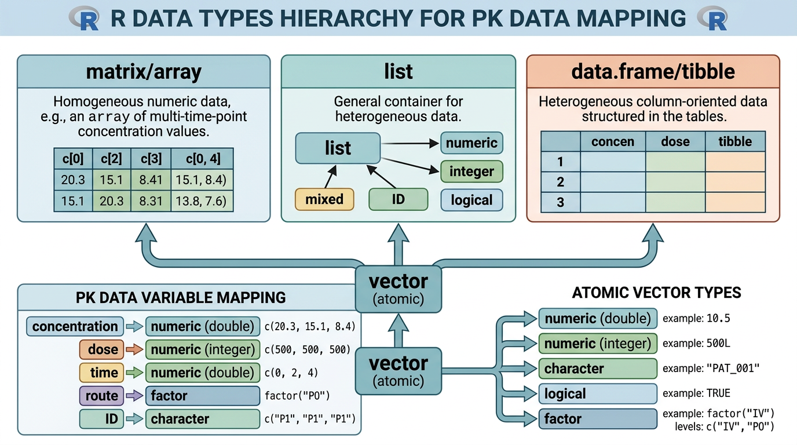
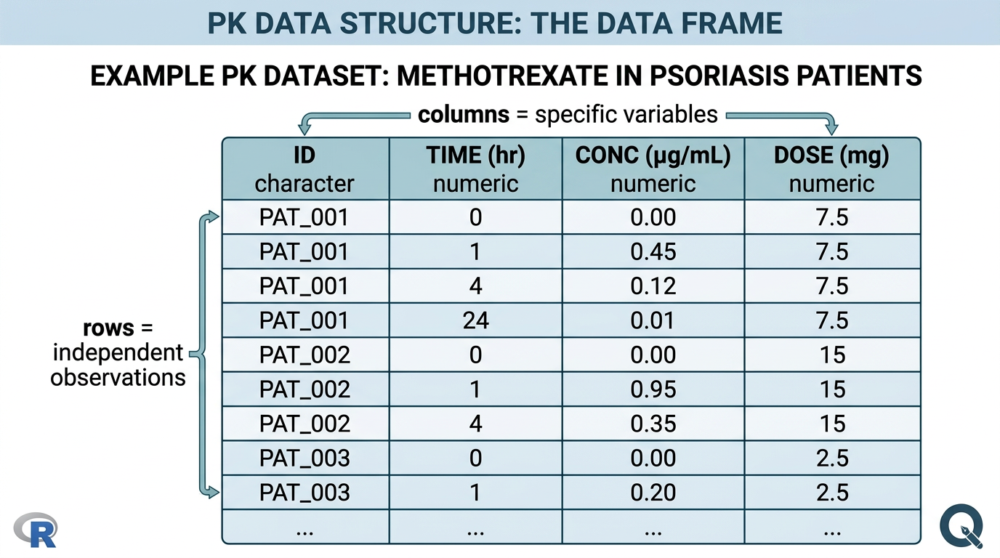
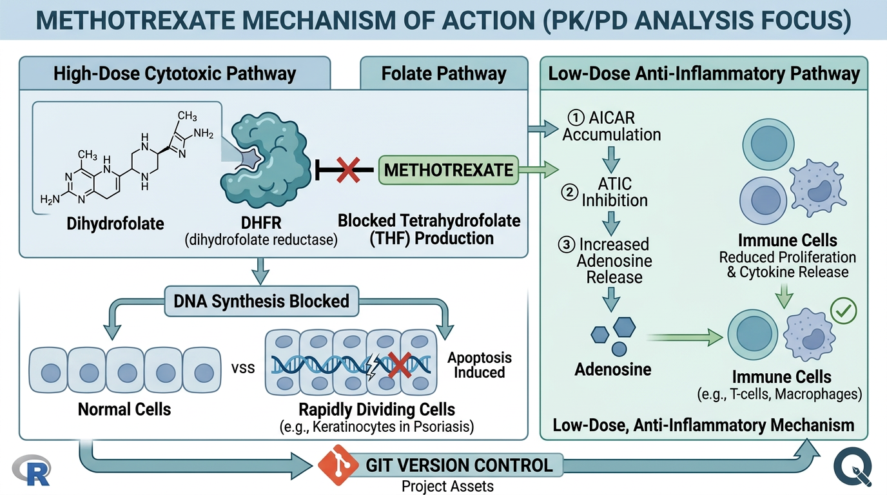

# R 객체의 이해 {#sec-r-object}

R은 데이터를 다루기 위해 설계된 언어입니다. 약동학/약력학(PK/PD) 데이터를 효과적으로 처리하려면, R이 데이터를 어떤 형태로 저장하고 관리하는지를 이해하는 것이 필수적입니다. 이 장에서는 R의 기본 데이터 타입부터 시작하여 벡터, 행렬, 리스트, 데이터프레임까지 단계적으로 학습합니다. 모든 예시는 건선(psoriasis) 치료에 사용되는 **Methotrexate**의 약동학 데이터를 중심으로 구성하였습니다.

## R의 기본 데이터 타입 {#sec-data-types}

{#fig-ch02-1 width=100%}

R에서 모든 데이터는 특정한 **타입(type)**을 가집니다. 약동학 데이터를 다룰 때 각 변수가 어떤 타입인지를 정확히 이해하는 것은 데이터 오류를 방지하고 올바른 분석을 수행하는 데 핵심적입니다.

### 다섯 가지 기본 타입

R에는 다섯 가지 기본 데이터 타입(atomic type)이 있습니다.

```{r}
#| eval: false

# 1. numeric (실수형) - 가장 흔한 숫자 타입
conc <- 12.5          # 약물 농도 (ng/mL)
class(conc)           # "numeric"

# 2. integer (정수형) - L 접미사로 명시
n_patients <- 30L     # 환자 수
class(n_patients)     # "integer"

# 3. character (문자형) - 따옴표로 감싸기
route <- "SC"         # 투여 경로
class(route)          # "character"

# 4. logical (논리형) - TRUE 또는 FALSE
is_blq <- FALSE       # 정량한계 미만(Below Limit of Quantification) 여부
class(is_blq)         # "logical"

# 5. complex (복소수형) - 실무에서 거의 사용 안 함
z <- 3 + 2i
class(z)              # "complex"
```

약동학 데이터에서 각 타입이 사용되는 실제 맥락을 정리하면 다음과 같습니다.

| 데이터 타입 | 약동학 변수 예시 | 설명 |
|:---|:---|:---|
| `numeric` | 농도(DV), 용량(AMT), 체중(WT), AUC | 소수점이 포함될 수 있는 연속형 측정값 |
| `integer` | 투여 횟수(ADDL), 구획 번호(CMT) | 정수로만 의미가 있는 값 |
| `character` | 환자 ID(ID), 투여 경로, 약물명 | 텍스트 정보 |
| `logical` | BLQ 여부, MDV(missing DV) 플래그 | 참/거짓 판단 |
| `complex` | (거의 사용되지 않음) | PK/PD에서는 사실상 불필요 |

### 타입 확인 함수

데이터를 불러온 후 각 변수의 타입을 확인하는 습관은 매우 중요합니다. R은 여러 가지 확인 함수를 제공합니다.

```{r}
#| eval: false

# class() - 객체의 클래스 확인
x <- 3.14
class(x)              # "numeric"

# typeof() - 내부 저장 타입 확인 (더 세부적)
typeof(x)             # "double"

# is.*() 계열 함수 - 특정 타입인지 논리값으로 반환
is.numeric(x)         # TRUE
is.character(x)       # FALSE
is.integer(30L)       # TRUE
is.logical(TRUE)      # TRUE
```

`class()`와 `typeof()`의 차이를 아는 것이 중요합니다. `class()`는 R 객체 시스템의 관점에서 분류를 반환하고, `typeof()`는 메모리에 저장되는 실제 내부 타입을 반환합니다. 예를 들어 `class(3.14)`는 `"numeric"`이지만 `typeof(3.14)`는 `"double"`입니다.

### 타입 변환

데이터를 불러올 때 타입이 의도와 다르게 읽히는 경우가 빈번합니다. `as.*()` 함수를 사용하여 명시적으로 변환할 수 있습니다.

```{r}
#| eval: false

# 문자를 숫자로 변환
conc_char <- "12.5"
conc_num <- as.numeric(conc_char)
conc_num               # 12.5

# 숫자를 문자로 변환
dose <- 15
dose_char <- as.character(dose)
dose_char              # "15"

# 숫자를 논리값으로 (0 = FALSE, 그 외 = TRUE)
mdv_num <- 0
as.logical(mdv_num)    # FALSE
as.logical(1)          # TRUE

# 논리값을 숫자로
as.numeric(TRUE)       # 1
as.numeric(FALSE)      # 0

# 정수 변환
as.integer(3.7)        # 3 (소수점 이하 버림)
```

:::{.callout-warning}
### 흔한 실수: 변환 불가능한 경우

`as.numeric()`으로 변환할 수 없는 문자열을 변환하면 `NA`가 생성되고 경고 메시지가 나타납니다.

```{r}
#| eval: false
as.numeric("BLQ")      # NA (경고 발생)
as.numeric("< 0.05")   # NA (경고 발생)
```

PK 데이터에서 정량한계 미만(BLQ) 값이 `"BLQ"` 또는 `"< 0.05"` 같은 문자열로 기록되어 있으면, 해당 열 전체가 `character`로 읽힐 수 있습니다. 이런 경우 사전에 데이터 정제가 필요합니다.
:::

:::{.callout-tip}
### 약학적 맥락에서의 타입 설계

NONMEM 데이터셋을 구성할 때 각 열의 타입을 미리 결정해 두면 오류를 줄일 수 있습니다.

- **농도(DV)**: `numeric` - BLQ는 별도 처리 (예: MDV=1, BLQ=1)
- **투여 경로**: `character` → 이후 `factor`로 변환
- **환자 ID**: `character`로 유지 (숫자처럼 보여도 산술연산 대상이 아님)
- **시간(TIME)**: `numeric` (시간 단위 통일 주의)
- **이벤트 유형(EVID)**: `integer` (0, 1, 2, 3, 4 등)
:::


## 벡터(Vector) {#sec-vector}

벡터는 R에서 가장 기본적인 데이터 구조입니다. **동일한 타입**의 값들을 일렬로 나열한 것으로, R의 거의 모든 연산은 벡터를 기반으로 합니다.

### 벡터 생성

```{r}
#| eval: false

# c() 함수로 벡터 생성
conc <- c(0, 1.2, 4.5, 8.3, 6.1, 3.2, 1.5, 0.7)
time <- c(0, 0.5, 1, 2, 4, 6, 8, 12)

# seq() 함수로 규칙적인 수열 생성
time_seq <- seq(from = 0, to = 24, by = 0.5)
time_seq    # 0.0, 0.5, 1.0, ..., 24.0 (49개 원소)

# rep() 함수로 반복 벡터 생성
dose_group <- rep("15mg", times = 5)        # "15mg"을 5번 반복
dose_groups <- rep(c("7.5mg", "15mg", "25mg"), each = 3)
# "7.5mg" "7.5mg" "7.5mg" "15mg" "15mg" "15mg" "25mg" "25mg" "25mg"

# 1:n 연산자
patient_id <- 1:10    # 1, 2, 3, ..., 10
```

### 벡터화 연산(Vectorized Operations)

R의 가장 큰 장점 중 하나는 **벡터화 연산**입니다. 반복문(for loop) 없이도 벡터 전체에 대해 연산을 수행할 수 있어 코드가 간결하고 실행 속도도 빠릅니다.

```{r}
#| eval: false

# 혈장 농도 (ng/mL) -> μg/L 변환 (단위 변환)
conc_ng <- c(0, 1.2, 4.5, 8.3, 6.1, 3.2, 1.5, 0.7)
conc_ug <- conc_ng / 1000    # 모든 원소에 동시 적용

# 체중 보정 청소율 (CL/F를 체중으로 나누기)
cl_f <- c(8.5, 12.3, 9.7, 11.2)    # L/hr
weight <- c(65, 80, 55, 72)         # kg
cl_f_per_kg <- cl_f / weight         # L/hr/kg

# 로그 변환 (PK 분석에서 매우 흔함)
log_conc <- log(conc_ng + 0.001)     # 0에 소량 추가하여 log(0) 방지

# 논리 연산
is_above_mic <- conc_ng > 2.0       # MIC 이상인지 판별
# FALSE FALSE  TRUE  TRUE  TRUE  TRUE FALSE FALSE
sum(is_above_mic)                    # MIC 이상인 시점 수: 4
```

### 벡터 인덱싱

벡터의 특정 원소에 접근하려면 **대괄호 `[ ]`**를 사용합니다. 인덱싱 방법은 크게 세 가지입니다.

```{r}
#| eval: false

conc <- c(0, 1.2, 4.5, 8.3, 6.1, 3.2, 1.5, 0.7)
time <- c(0, 0.5, 1, 2, 4, 6, 8, 12)

# 1) 양수 인덱싱 - 원하는 위치 지정
conc[1]               # 0 (첫 번째 원소, R은 1부터 시작!)
conc[c(3, 4)]         # 4.5, 8.3 (세 번째, 네 번째)
conc[2:5]             # 1.2, 4.5, 8.3, 6.1 (두 번째~다섯 번째)

# 2) 음수 인덱싱 - 특정 위치 제외
conc[-1]              # 첫 번째 원소 제외
conc[-c(1, 8)]        # 첫 번째와 여덟 번째 제외

# 3) 논리 인덱싱 - 조건에 맞는 원소만 선택
conc[conc > 2.0]      # 2.0 초과인 값만: 4.5, 8.3, 6.1, 3.2
time[conc > 2.0]      # 농도가 2.0 초과인 시점: 1, 2, 4, 6

# Cmax와 Tmax 구하기
cmax <- max(conc)              # 8.3
tmax <- time[which.max(conc)]  # 2
```

### Named Vector (이름이 있는 벡터)

벡터의 각 원소에 이름을 부여하면 의미를 명확히 할 수 있습니다.

```{r}
#| eval: false

# PK 파라미터를 named vector로 저장
pk_params <- c(CL = 8.5, Vd = 45.2, ka = 1.2, F = 0.75)
pk_params["CL"]        # 8.5
pk_params[c("CL", "Vd")]  # 8.5, 45.2

# names() 함수로 이름 확인/설정
names(pk_params)       # "CL" "Vd" "ka" "F"

# 환자별 AUC
auc <- c(150, 220, 185, 310, 175)
names(auc) <- c("PT001", "PT002", "PT003", "PT004", "PT005")
auc["PT004"]           # 310
```

### 실습: Methotrexate 건선 환자 약물 농도 벡터

건선(psoriasis) 환자 3명에게 Methotrexate 15mg을 피하주사(SC)로 투여한 후 혈장 농도를 측정한 데이터를 벡터로 구성해 봅시다.

```{r}
#| eval: false

# 채혈 시점 (hr)
time_hr <- c(0, 0.5, 1, 1.5, 2, 3, 4, 6, 8, 12, 24)

# 환자 1: PT001 (체중 65 kg, CrCL 95 mL/min)
conc_pt001 <- c(0, 85, 320, 480, 410, 280, 180, 75, 35, 12, 2.5)

# 환자 2: PT002 (체중 80 kg, CrCL 110 mL/min)
conc_pt002 <- c(0, 70, 290, 430, 380, 250, 155, 60, 28, 8, 1.2)

# 환자 3: PT003 (체중 55 kg, CrCL 65 mL/min - 경도 신기능 저하)
conc_pt003 <- c(0, 95, 380, 560, 510, 370, 260, 130, 72, 30, 8.5)

# 각 환자의 Cmax와 Tmax 계산
cat("PT001: Cmax =", max(conc_pt001), "ng/mL, Tmax =",
    time_hr[which.max(conc_pt001)], "hr\n")
cat("PT002: Cmax =", max(conc_pt002), "ng/mL, Tmax =",
    time_hr[which.max(conc_pt002)], "hr\n")
cat("PT003: Cmax =", max(conc_pt003), "ng/mL, Tmax =",
    time_hr[which.max(conc_pt003)], "hr\n")

# BLQ (정량한계 미만) 판별 - LLOQ = 1.0 ng/mL로 가정
lloq <- 1.0
blq_pt001 <- conc_pt001 < lloq
sum(blq_pt001)    # BLQ인 시점 수

# AUC 추정 (사다리꼴 공식, trapezoidal rule)
auc_trap <- function(time, conc) {
  n <- length(time)
  auc <- 0
  for (i in 2:n) {
    auc <- auc + (time[i] - time[i-1]) * (conc[i] + conc[i-1]) / 2
  }
  return(auc)
}

auc_pt001 <- auc_trap(time_hr, conc_pt001)
auc_pt002 <- auc_trap(time_hr, conc_pt002)
auc_pt003 <- auc_trap(time_hr, conc_pt003)

cat("AUC(0-24h):\n")
cat("  PT001:", round(auc_pt001, 1), "ng*hr/mL\n")
cat("  PT002:", round(auc_pt002, 1), "ng*hr/mL\n")
cat("  PT003:", round(auc_pt003, 1), "ng*hr/mL\n")
```

:::{.callout-note}
### 임상적 해석

PT003은 신기능이 저하된 환자로, Methotrexate의 주요 배설 경로가 신장이기 때문에 동일 용량에서도 더 높은 농도와 AUC를 보입니다. 이러한 환자에서는 용량 조절이나 더 면밀한 모니터링이 필요합니다.
:::


## 행렬(Matrix)과 배열(Array) {#sec-matrix}

### 행렬(Matrix) 생성

행렬은 2차원 구조로, **동일한 타입**의 원소들을 행(row)과 열(column)로 배치한 것입니다.

```{r}
#| eval: false

# 앞서 만든 농도 데이터를 행렬로 구성
# 행 = 환자, 열 = 시점
conc_matrix <- matrix(
  c(conc_pt001, conc_pt002, conc_pt003),
  nrow = 3,
  byrow = TRUE
)

conc_matrix
#      [,1] [,2] [,3]  [,4]  [,5]  [,6]  [,7] [,8] [,9] [,10] [,11]
# [1,]    0   85  320   480   410   280   180   75   35    12   2.5
# [2,]    0   70  290   430   380   250   155   60   28     8   1.2
# [3,]    0   95  380   560   510   370   260  130   72    30   8.5
```

### 행/열 이름 지정

```{r}
#| eval: false

# 행 이름과 열 이름 지정
rownames(conc_matrix) <- c("PT001", "PT002", "PT003")
colnames(conc_matrix) <- paste0("t", time_hr, "h")

conc_matrix
#       t0h t0.5h t1h t1.5h t2h t3h t4h t6h t8h t12h t24h
# PT001   0    85 320   480 410 280 180  75  35   12  2.5
# PT002   0    70 290   430 380 250 155  60  28    8  1.2
# PT003   0    95 380   560 510 370 260 130  72   30  8.5
```

### 행렬 인덱싱

```{r}
#| eval: false

# [행, 열]로 접근
conc_matrix[1, 4]          # PT001의 1.5시간 농도: 480
conc_matrix["PT003", ]     # PT003의 모든 시점
conc_matrix[, "t2h"]       # 모든 환자의 2시간 농도: 410, 380, 510

# 부분 행렬 추출
conc_matrix[c("PT001", "PT003"), c("t1h", "t2h", "t4h")]

# 행렬 연산
apply(conc_matrix, 1, max)      # 각 환자(행)의 Cmax
apply(conc_matrix, 2, mean)     # 각 시점(열)의 평균 농도
```

### 실습: 시간-농도 행렬의 활용

```{r}
#| eval: false

# 각 환자의 Cmax 시점 찾기
tmax_indices <- apply(conc_matrix, 1, which.max)
tmax_values <- time_hr[tmax_indices]
names(tmax_values) <- rownames(conc_matrix)
tmax_values
# PT001 PT002 PT003
#   1.5   1.5   1.5

# 특정 시점(2h) 기준으로 농도 비교
conc_2h <- conc_matrix[, "t2h"]
barplot(conc_2h, main = "Methotrexate 투여 후 2시간 농도",
        ylab = "농도 (ng/mL)", col = c("steelblue", "coral", "seagreen"))

# 행렬의 전치 (transpose) - 시점별 비교 시 유용
t(conc_matrix)
```

:::{.callout-tip}
### 행렬 vs 데이터프레임

행렬은 **모든 원소가 같은 타입**이어야 합니다. PK 데이터처럼 숫자와 문자가 혼합된 경우에는 데이터프레임이 더 적합합니다. 행렬은 주로 수치 계산(선형대수, 공분산 행렬 등)에서 사용됩니다. NONMEM의 $OMEGA, $SIGMA 블록이 바로 행렬(공분산 행렬)의 예입니다.
:::

### 배열(Array)

배열은 행렬을 3차원 이상으로 확장한 것입니다. PK 분석에서는 시뮬레이션 결과를 저장할 때 유용할 수 있습니다.

```{r}
#| eval: false

# 3차원 배열: 환자 x 시점 x 시뮬레이션 반복
# 예: 3명 환자, 11시점, 100번 시뮬레이션
sim_array <- array(
  data = rnorm(3 * 11 * 100, mean = 200, sd = 50),
  dim = c(3, 11, 100),
  dimnames = list(
    patient = c("PT001", "PT002", "PT003"),
    time = paste0("t", time_hr),
    sim = paste0("sim", 1:100)
  )
)

# 접근 예
sim_array["PT001", "t2", "sim1"]    # PT001의 2시간, 시뮬레이션1
sim_array["PT001", , 1:5]           # PT001의 처음 5번 시뮬레이션
```


## 리스트(List) {#sec-list}

리스트는 R에서 가장 유연한 데이터 구조입니다. **서로 다른 타입과 길이**의 객체를 하나로 묶을 수 있습니다.

### 리스트 생성 및 접근

```{r}
#| eval: false

# 환자 한 명의 정보를 리스트로 구성
patient_info <- list(
  id       = "PT001",
  age      = 45,
  sex      = "M",
  weight   = 65,
  height   = 170,
  disease  = "Plaque Psoriasis",
  pasi     = 18.5,      # PASI (Psoriasis Area and Severity Index) 점수
  comedication = c("Folic acid", "Omeprazole")
)

# 접근 방법 1: $ 연산자 (가장 흔함)
patient_info$id          # "PT001"
patient_info$weight      # 65

# 접근 방법 2: [[ ]] (이름 또는 인덱스)
patient_info[["age"]]    # 45
patient_info[[2]]        # 45 (두 번째 원소)

# 접근 방법 3: [ ] - 부분 리스트 반환 (리스트 그대로 유지)
patient_info[c("id", "weight")]   # id와 weight만 포함하는 리스트
```

:::{.callout-warning}
### `[ ]`와 `[[ ]]`의 차이

- `patient_info["age"]`는 **리스트**를 반환합니다 (원소가 하나인 리스트).
- `patient_info[["age"]]`는 **값 자체**를 반환합니다 (숫자 45).

이 차이는 후속 연산에 영향을 줍니다. 예를 들어 `patient_info["age"] + 1`은 오류가 발생하지만 `patient_info[["age"]] + 1`은 46을 반환합니다.
:::

### 중첩 리스트 (Nested List)

리스트 안에 또 다른 리스트를 넣을 수 있습니다. 이를 활용하면 환자의 전체 정보를 구조화하여 저장할 수 있습니다.

```{r}
#| eval: false

# 환자 전체 정보를 중첩 리스트로 구성
patient_full <- list(
  demographics = list(
    id     = "PT001",
    age    = 45,
    sex    = "M",
    weight = 65,
    height = 170,
    bsa    = 1.78,       # 체표면적 (m²)
    crcl   = 95           # 크레아티닌 청소율 (mL/min)
  ),
  disease = list(
    diagnosis = "Plaque Psoriasis",
    duration_years = 8,
    pasi_baseline = 18.5,
    pasi_week12 = 7.2,
    affected_area = c("Scalp", "Trunk", "Extremities")
  ),
  dosing = list(
    drug  = "Methotrexate",
    dose  = 15,           # mg
    route = "SC",
    frequency = "QW",     # 주 1회
    start_date = "2024-01-15",
    folic_acid = TRUE
  ),
  pk_data = list(
    time = c(0, 0.5, 1, 1.5, 2, 3, 4, 6, 8, 12, 24),
    conc = c(0, 85, 320, 480, 410, 280, 180, 75, 35, 12, 2.5),
    unit = "ng/mL",
    lloq = 1.0
  )
)

# 중첩 리스트 접근
patient_full$demographics$weight    # 65
patient_full$pk_data$conc           # 농도 벡터
patient_full$disease$affected_area  # "Scalp" "Trunk" "Extremities"

# PASI 개선율 계산
pasi_improvement <- (patient_full$disease$pasi_baseline -
                     patient_full$disease$pasi_week12) /
                     patient_full$disease$pasi_baseline * 100
cat("PASI 개선율:", round(pasi_improvement, 1), "%\n")
# PASI 개선율: 61.1 %
```

### 실습: 여러 환자를 리스트로 관리

```{r}
#| eval: false

# 여러 환자를 리스트의 리스트로 구성
study_data <- list(
  PT001 = list(
    demo = list(age = 45, sex = "M", wt = 65, crcl = 95),
    dose = list(amt = 15, route = "SC"),
    pk   = list(
      time = c(0, 0.5, 1, 1.5, 2, 3, 4, 6, 8, 12, 24),
      conc = c(0, 85, 320, 480, 410, 280, 180, 75, 35, 12, 2.5)
    )
  ),
  PT002 = list(
    demo = list(age = 38, sex = "F", wt = 80, crcl = 110),
    dose = list(amt = 15, route = "SC"),
    pk   = list(
      time = c(0, 0.5, 1, 1.5, 2, 3, 4, 6, 8, 12, 24),
      conc = c(0, 70, 290, 430, 380, 250, 155, 60, 28, 8, 1.2)
    )
  ),
  PT003 = list(
    demo = list(age = 62, sex = "M", wt = 55, crcl = 65),
    dose = list(amt = 15, route = "SC"),
    pk   = list(
      time = c(0, 0.5, 1, 1.5, 2, 3, 4, 6, 8, 12, 24),
      conc = c(0, 95, 380, 560, 510, 370, 260, 130, 72, 30, 8.5)
    )
  )
)

# 모든 환자의 Cmax를 한번에 추출
sapply(study_data, function(pt) max(pt$pk$conc))
# PT001 PT002 PT003
#   480   430   560

# 모든 환자의 체중 추출
sapply(study_data, function(pt) pt$demo$wt)
# PT001 PT002 PT003
#    65    80    55
```

:::{.callout-tip}
### 리스트와 JSON

리스트는 JSON 형식과 구조가 매우 유사합니다. `jsonlite` 패키지를 사용하면 리스트와 JSON 간 변환이 쉽습니다. API에서 데이터를 가져오거나 웹 기반 도구와 데이터를 주고받을 때 유용합니다.

```{r}
#| eval: false
library(jsonlite)
json_text <- toJSON(patient_full, pretty = TRUE)
cat(json_text)
```
:::


## 데이터프레임(data.frame)과 tibble {#sec-dataframe}

{#fig-ch02-2 width=100%}

데이터프레임은 R에서 **표 형태의 데이터**를 저장하는 가장 핵심적인 구조입니다. 약동학 데이터 분석의 대부분은 데이터프레임을 기반으로 이루어집니다. 데이터프레임은 사실 **동일한 길이의 벡터들을 열(column)으로 묶은 리스트**입니다.

### data.frame 생성

```{r}
#| eval: false

# Methotrexate PK 데이터를 data.frame으로 생성
mtx_pk <- data.frame(
  ID   = rep(c("PT001", "PT002", "PT003"), each = 11),
  TIME = rep(c(0, 0.5, 1, 1.5, 2, 3, 4, 6, 8, 12, 24), times = 3),
  DV   = c(
    0, 85, 320, 480, 410, 280, 180, 75, 35, 12, 2.5,    # PT001
    0, 70, 290, 430, 380, 250, 155, 60, 28,  8, 1.2,    # PT002
    0, 95, 380, 560, 510, 370, 260, 130, 72, 30, 8.5     # PT003
  ),
  AMT  = rep(c(15, rep(NA, 10)), times = 3),
  EVID = rep(c(1, rep(0, 10)), times = 3),
  MDV  = rep(c(1, rep(0, 10)), times = 3),
  CMT  = rep(c(1, rep(2, 10)), times = 3),
  stringsAsFactors = FALSE
)

# 상위 행 확인
head(mtx_pk)
#      ID TIME  DV AMT EVID MDV CMT
# 1 PT001  0.0 0.0  15    1   1   1
# 2 PT001  0.5 85.0  NA    0   0   2
# 3 PT001  1.0 320.0 NA    0   0   2
# ...
```

### 열 접근 및 행 필터링

```{r}
#| eval: false

# 열 접근
mtx_pk$DV                 # DV 열 전체 (벡터)
mtx_pk[, "TIME"]          # TIME 열
mtx_pk[, c("ID", "TIME", "DV")]  # 여러 열 선택

# 행 필터링
mtx_pk[mtx_pk$ID == "PT001", ]           # PT001만
mtx_pk[mtx_pk$EVID == 0, ]               # 관측 데이터만
mtx_pk[mtx_pk$DV > 100 & mtx_pk$EVID == 0, ]  # 농도 > 100인 관측

# 새 열 추가
mtx_pk$LNDV <- ifelse(mtx_pk$DV > 0, log(mtx_pk$DV), NA)  # 로그 변환 농도
mtx_pk$WT <- rep(c(65, 80, 55), each = 11)                  # 체중 추가
```

### tibble vs data.frame

`tibble`은 tidyverse에서 제공하는 현대적인 데이터프레임입니다. 기본 `data.frame`과 비교하여 몇 가지 개선점이 있습니다.

```{r}
#| eval: false

library(tidyverse)

# tibble 생성
mtx_pk_tbl <- tibble(
  ID   = rep(c("PT001", "PT002", "PT003"), each = 11),
  TIME = rep(c(0, 0.5, 1, 1.5, 2, 3, 4, 6, 8, 12, 24), times = 3),
  DV   = c(
    0, 85, 320, 480, 410, 280, 180, 75, 35, 12, 2.5,
    0, 70, 290, 430, 380, 250, 155, 60, 28,  8, 1.2,
    0, 95, 380, 560, 510, 370, 260, 130, 72, 30, 8.5
  )
)

# data.frame을 tibble로 변환
mtx_pk_tbl <- as_tibble(mtx_pk)
```

`tibble`과 `data.frame`의 주요 차이점은 다음과 같습니다.

| 특성 | `data.frame` | `tibble` |
|:---|:---|:---|
| 출력 | 전체 출력 (매우 길어질 수 있음) | 처음 10행만 출력, 열 타입 표시 |
| 문자열 처리 | 기본적으로 factor로 변환 가능 | 문자열 그대로 유지 |
| 부분 매칭 | `df$w`로 `df$weight` 접근 가능 | 부분 매칭 불가 (안전) |
| `[` 동작 | 열 하나 선택 시 벡터 반환 | 항상 tibble 반환 |
| 행 이름 | 지원 | 미지원 (별도 열로 관리) |

```{r}
#| eval: false

# tibble의 장점 1: 깔끔한 출력
mtx_pk_tbl      # 처음 10행만 보여주며 타입 정보 포함

# tibble의 장점 2: 부분 매칭 방지 (안전)
# data.frame의 경우
df <- data.frame(weight = c(65, 80))
df$w     # 65 80 (부분 매칭 - 위험!)

# tibble의 경우
tbl <- tibble(weight = c(65, 80))
tbl$w    # NULL + 경고 (안전!)
```

### 구조 파악 함수: str(), summary(), glimpse()

데이터를 불러온 후 **가장 먼저** 해야 할 일은 구조를 파악하는 것입니다.

```{r}
#| eval: false

# str() - 구조(structure) 확인
str(mtx_pk)
# 'data.frame':	33 obs. of  9 variables:
#  $ ID  : chr  "PT001" "PT001" "PT001" ...
#  $ TIME: num  0 0.5 1 1.5 2 3 4 6 8 12 ...
#  $ DV  : num  0 85 320 480 410 280 180 75 35 12 ...
#  $ AMT : num  15 NA NA NA NA NA NA NA NA NA ...
#  $ EVID: num  1 0 0 0 0 0 0 0 0 0 ...
#  ...

# summary() - 기술통계 요약
summary(mtx_pk)
#       ID                TIME             DV              AMT
#  Length:33          Min.   : 0.00   Min.   :  0.0   Min.   :15
#  Class :character   1st Qu.: 1.25   1st Qu.: 18.8   1st Qu.:15
#  ...

# glimpse() - tidyverse의 str() 대안 (더 깔끔)
glimpse(mtx_pk)
# Rows: 33
# Columns: 9
# $ ID   <chr> "PT001", "PT001", "PT001", ...
# $ TIME <dbl> 0, 0.5, 1, 1.5, 2, 3, 4, ...
# $ DV   <dbl> 0, 85, 320, 480, 410, 280, ...
# ...
```

### 실습: CSV 파일에서 PK 데이터 읽기 및 탐색

실제 분석에서는 CSV 파일로 데이터를 받는 경우가 대부분입니다.

```{r}
#| eval: false

library(tidyverse)

# CSV 파일 읽기
mtx_pk <- read_csv("data/pk_methotrexate.csv")

# 1단계: 구조 파악
str(mtx_pk)
glimpse(mtx_pk)

# 2단계: 요약 통계
summary(mtx_pk)

# 3단계: 결측치 확인
colSums(is.na(mtx_pk))

# 4단계: 고유값 확인
unique(mtx_pk$ID)           # 환자 ID 목록
n_distinct(mtx_pk$ID)       # 환자 수
table(mtx_pk$EVID)          # 이벤트 유형별 빈도

# 5단계: 간단한 시각화
ggplot(mtx_pk %>% filter(EVID == 0), aes(x = TIME, y = DV, color = ID)) +
  geom_line() +
  geom_point() +
  scale_y_log10() +
  labs(
    title = "Methotrexate PK Profile",
    x = "Time (hr)",
    y = "Concentration (ng/mL)",
    color = "Patient ID"
  ) +
  theme_bw()
```

:::{.callout-note}
### NONMEM 데이터셋과 데이터프레임

NONMEM에서 사용하는 데이터셋은 본질적으로 CSV 형태의 표 데이터이므로 R 데이터프레임으로 자연스럽게 대응됩니다. 주요 열들의 의미를 알아두면 좋습니다:

- **ID**: 개체(환자) 식별자
- **TIME**: 시간 (첫 투여 기준)
- **DV**: 종속변수 (주로 관측 농도)
- **AMT**: 투여량 (투여 이벤트에서만 값이 존재)
- **EVID**: 이벤트 ID (0=관측, 1=투여, 2=기타 타입 이벤트)
- **CMT**: 구획 번호 (1=투여 구획, 2=관측 구획 등)
- **MDV**: Missing DV 플래그 (0=DV 사용, 1=DV 무시)
- **WT, AGE, SEX, ...**: 공변량(covariates)
:::


## Factor: 범주형 데이터 {#sec-factor}

### Factor의 필요성

문자열(`character`)은 텍스트를 저장하지만, **범주형 데이터**로서의 의미(순서, 수준)를 담지 못합니다. 예를 들어 투여 경로가 `"PO"`, `"SC"`, `"IV"` 세 가지라면, 이것이 세 개의 정해진 범주임을 R에게 알려주어야 합니다. 이때 사용하는 것이 `factor`입니다.

### factor() 생성과 levels 지정

```{r}
#| eval: false

# 기본 factor 생성
route <- c("SC", "PO", "SC", "IV", "PO", "SC")
route_factor <- factor(route)
route_factor
# [1] SC PO SC IV PO SC
# Levels: IV PO SC    <- 알파벳 순서 (기본)

# levels 순서 직접 지정
route_factor <- factor(route, levels = c("PO", "SC", "IV"))
route_factor
# Levels: PO SC IV    <- 지정한 순서

# levels 확인
levels(route_factor)    # "PO" "SC" "IV"
nlevels(route_factor)   # 3

# factor의 내부 구조: 정수 + 라벨
as.integer(route_factor)  # 2 1 2 3 1 2
```

### 순서형 Factor (Ordered Factor)

용량군처럼 순서가 의미를 갖는 범주에는 **순서형 factor**를 사용합니다.

```{r}
#| eval: false

# 용량군 - 순서가 있는 범주
dose_group <- c("Low", "High", "Medium", "Low", "High", "Medium")

# 순서 없는 factor (기본)
factor(dose_group)
# Levels: High Low Medium    <- 알파벳 순서 (의미 없음)

# 순서형 factor
dose_ordered <- factor(
  dose_group,
  levels = c("Low", "Medium", "High"),
  ordered = TRUE
)
dose_ordered
# Levels: Low < Medium < High

# 비교 연산 가능
dose_ordered[1] < dose_ordered[2]   # TRUE (Low < High)
```

### 약학적 맥락에서의 Factor 활용

```{r}
#| eval: false

# 투여 경로
route <- factor(
  c("PO", "SC", "SC", "IV", "PO"),
  levels = c("PO", "SC", "IV")
)

# 질환 중증도 (건선)
severity <- factor(
  c("Mild", "Moderate", "Severe", "Moderate", "Severe"),
  levels = c("Mild", "Moderate", "Severe"),
  ordered = TRUE
)

# BLQ 상태
blq_status <- factor(
  c("Above LLOQ", "BLQ", "Above LLOQ", "Above LLOQ", "BLQ"),
  levels = c("BLQ", "Above LLOQ")
)

# PASI 반응 분류
pasi_response <- factor(
  c("PASI75", "PASI50", "PASI90", "PASI75", "Non-responder"),
  levels = c("Non-responder", "PASI50", "PASI75", "PASI90", "PASI100"),
  ordered = TRUE
)
```

:::{.callout-warning}
### Factor 관련 흔한 실수

1. **의도치 않은 factor 변환**: 옛날 R에서는 `data.frame()`이 문자열을 자동으로 factor로 변환했습니다. `stringsAsFactors = FALSE`를 쓰거나 `tibble`을 사용하면 방지됩니다.

2. **숫자가 factor인 경우**: `as.numeric(factor("3"))`은 `3`이 아니라 해당 level의 내부 정수를 반환합니다.

```{r}
#| eval: false
x <- factor(c("10", "20", "30"))
as.numeric(x)              # 1 2 3 (원래 값이 아님!)
as.numeric(as.character(x))  # 10 20 30 (올바른 변환)
```

3. **존재하지 않는 level**: 데이터에 없는 level이 유지될 수 있습니다. `droplevels()`로 제거합니다.
:::

### forcats 패키지 기초

`forcats`는 tidyverse에 포함된 factor 전용 패키지로, factor 조작을 위한 편리한 함수를 제공합니다.

```{r}
#| eval: false

library(forcats)

# fct_relevel() - level 순서 변경
route <- factor(c("PO", "SC", "IV", "SC", "PO"))
fct_relevel(route, "IV", "SC", "PO")  # 원하는 순서로 지정

# fct_infreq() - 빈도 순으로 정렬
fct_infreq(route)    # SC, PO, IV 순 (SC가 가장 많으므로)

# fct_lump_n() - 상위 n개만 남기고 나머지 "Other"
drugs <- factor(c("MTX", "MTX", "MTX", "ADA", "ADA", "ETN",
                  "UST", "SEC", "IXE", "GUS"))
fct_lump_n(drugs, n = 3)
# MTX, MTX, MTX, ADA, ADA, Other, Other, Other, Other, Other

# fct_recode() - level 이름 변경
route_kr <- fct_recode(route,
  "경구" = "PO",
  "피하주사" = "SC",
  "정맥주사" = "IV"
)

# fct_collapse() - 여러 level을 하나로 합치기
response <- factor(c("PASI50", "PASI75", "PASI90", "PASI100", "Non-responder"))
response_binary <- fct_collapse(response,
  "Responder" = c("PASI50", "PASI75", "PASI90", "PASI100"),
  "Non-responder" = "Non-responder"
)
```


## 약리학 노트: Methotrexate의 약리학 {#sec-pharmacology-mtx}

{#fig-ch02-3 width=100%}

:::{.callout-note}
### Methotrexate (MTX) 약리학 개요

**작용 기전**

Methotrexate(MTX)는 엽산(folic acid) 유사체로서 **디히드로엽산 환원효소(dihydrofolate reductase, DHFR)**를 경쟁적으로 억제합니다. 이로 인해 퓨린(purine) 및 피리미딘(pyrimidine) 합성에 필요한 테트라히드로엽산(tetrahydrofolate)의 생성이 차단되어 DNA 합성이 억제됩니다. 또한 MTX는 아미노이미다졸카르복사미드(AICAR) 변환효소를 억제하여 세포 내 아데노신(adenosine) 농도를 증가시키는데, 이 아데노신이 항염증 효과를 매개하는 것으로 알려져 있습니다.

**건선에서의 사용**

- **적응증**: 중등도~중증 판상 건선(plaque psoriasis)에서 전신 치료제로 사용
- **용량**: 저용량 요법 - 주 1회 **7.5~25 mg** (경구 또는 피하주사)
- **시작 용량**: 보통 7.5~10 mg/week로 시작, 효과에 따라 점진적 증량
- **반응 평가**: PASI (Psoriasis Area and Severity Index) 점수로 12~16주 후 평가
- **엽산 보충**: MTX 투여 24~48시간 후 **엽산(folic acid) 5 mg** 복용 (부작용 감소)
:::

:::{.callout-important}
### MTX의 약동학(Pharmacokinetics) 특성

**흡수(Absorption)**

- **경구(PO)**: 생체이용률(bioavailability, F) 약 60~80%, 고용량에서 감소 (포화성 흡수)
- **피하주사(SC)**: F 거의 100%, 고용량에서도 안정적 흡수
- **Tmax**: PO 1~2시간, SC 0.5~1.5시간
- 음식의 영향은 미미하나 유제품과의 동시 투여는 흡수 감소 가능

**분포(Distribution)**

- 혈장 단백 결합률: 약 50% (주로 알부민)
- 분포용적(Vd): 약 0.4~0.8 L/kg
- 적혈구 내 축적 (polyglutamate 형태로 - 수주에 걸쳐 서서히 제거)

**대사(Metabolism) 및 배설(Excretion)**

- 주요 배설 경로: **신장 배설** (70~90%, 주로 사구체 여과 + 세뇨관 분비)
- 간 대사: 7-hydroxy-methotrexate (활성 대사체)
- 반감기(t1/2): **3~10시간** (저용량), 고용량에서는 8~15시간
- **신기능에 따라 청소율이 크게 변함** → 신기능 저하 환자에서 주의 필요

**독성 프로파일**

- **골수 억제**: 범혈구감소증 (가장 중요한 급성 독성)
- **간독성**: 장기 사용 시 간섬유화/경변 가능 → 정기적 간기능 검사
- **폐독성**: MTX 폐렴 (과민 반응, 용량 비의존적)
- **위장관**: 구내염, 오심, 설사
- **기형 유발성**: 임신 금기 (카테고리 X)

**치료약물모니터링(TDM)**

- 저용량(건선 치료): 일반적으로 TDM 불필요, CBC와 간기능 정기 모니터링
- **고용량(항암 요법, >500 mg/m²)**: 반드시 TDM 시행
  - 24시간 농도 > 10 μmol/L → leucovorin rescue 강화
  - 48시간 농도 > 1 μmol/L → 지연 배설, 적극적 수액/알칼리화
:::


## Claude Code 활용 팁 {#sec-claude-tips}

:::{.callout-tip}
### Claude Code로 R 객체 이해하기

**패턴 1: 데이터프레임 구조 설명 요청**

새로운 데이터를 받았을 때, Claude Code에게 구조를 설명해달라고 요청할 수 있습니다.

> "이 데이터프레임에는 ID, TIME, DV, AMT, EVID, CMT, MDV 열이 있어. 각 열의 의미와 적절한 R 타입을 설명해줘."

Claude Code는 NONMEM 데이터셋 형식을 이해하고 있으므로 각 열의 의미, 기대되는 타입, 일반적인 값 범위 등을 설명해줄 것입니다.

**패턴 2: 타입 변환 디버깅**

데이터 타입 문제로 오류가 발생했을 때:

> "read_csv로 데이터를 불렀는데, DV 열이 character로 읽혔어. BLQ 값이 '<0.05'로 들어있을 때 어떻게 처리해야 해?"

```{r}
#| eval: false

# Claude Code가 제안할 수 있는 해결 코드
mtx_pk <- read_csv("data/pk_methotrexate.csv")

# BLQ 처리 방법 1: BLQ 플래그 생성 후 숫자 변환
mtx_pk <- mtx_pk %>%
  mutate(
    BLQ = ifelse(grepl("<", DV) | DV == "BLQ", 1, 0),
    DV_numeric = case_when(
      BLQ == 1 ~ 0,        # 또는 LLOQ/2 등
      TRUE ~ as.numeric(DV)
    ),
    MDV = ifelse(BLQ == 1, 1, 0)
  )
```

**패턴 3: 데이터 구조 문서화**

> "이 코드에서 사용하는 데이터프레임의 각 열에 대한 설명을 주석으로 작성해줘."

Claude Code는 다음과 같은 문서화 코드를 생성할 수 있습니다:

```{r}
#| eval: false

# Methotrexate PK 데이터셋 변수 정의
# ===================================
# ID   : chr  - 환자 식별자 (예: "PT001")
# TIME : dbl  - 투여 후 경과 시간 (단위: hr)
# DV   : dbl  - 종속변수, 혈장 농도 (단위: ng/mL)
# AMT  : dbl  - 투여량 (단위: mg), 관측 행에서는 NA
# EVID : int  - 이벤트 ID (1=투여, 0=관측)
# CMT  : int  - 구획 번호 (1=투여, 2=관측)
# MDV  : int  - Missing DV 플래그 (1=DV 무시, 0=DV 사용)
# WT   : dbl  - 체중 (단위: kg)
# CRCL : dbl  - 크레아티닌 청소율 (단위: mL/min)
# ROUTE: fct  - 투여 경로 (levels: PO, SC, IV)
```

**패턴 4: 객체 변환 코드 생성**

> "이 리스트 형태의 환자 데이터를 NONMEM 형식의 데이터프레임으로 변환하는 코드를 작성해줘."

이처럼 Claude Code는 R 객체 간 변환, 특히 PK/PD 데이터 구조와 관련된 작업에서 큰 도움이 됩니다.
:::

:::{.callout-tip}
### 효과적인 프롬프트 예시

다음과 같은 프롬프트를 사용하면 더 정확한 답변을 얻을 수 있습니다:

1. **구체적인 데이터 명시**: "Methotrexate SC 15mg 투여 후 PK 데이터를 tibble로 만들어줘. 채혈 시점은 0, 0.5, 1, 2, 4, 8, 12, 24시간이야."

2. **원하는 출력 형식 지정**: "이 데이터를 NONMEM 입력 형식(ID, TIME, DV, AMT, EVID, CMT, MDV)으로 변환해줘."

3. **맥락 제공**: "건선 환자 30명의 Methotrexate PK 연구에서, 체중별로 AUC를 비교하는 코드를 작성해줘. 체중은 3개 그룹(<60, 60-80, >80 kg)으로 나눠줘."
:::


## 연습 문제 {#sec-exercises}

### 확인 문제

**문제 1.** 다음 R 객체들의 `class()`를 각각 예측하시오.

```{r}
#| eval: false

a <- 42
b <- 42L
c <- "42"
d <- TRUE
e <- factor("High", levels = c("Low", "Medium", "High"))
```

**문제 2.** 다음 코드의 결과를 예측하시오.

```{r}
#| eval: false

x <- c(1, "2", TRUE)
class(x)     # ?
x            # ?
```

:::{.callout-tip}
### 힌트
R에서 벡터는 하나의 타입만 가질 수 있습니다. 여러 타입이 섞이면 **자동 형변환(coercion)**이 일어납니다. 우선순위: `character` > `numeric` > `logical`.
:::

**문제 3.** `data.frame`과 `tibble`의 차이점을 세 가지 이상 서술하시오.

**문제 4.** 다음 상황에서 적절한 R 데이터 타입(또는 구조)을 선택하시오.

| 상황 | 적절한 타입/구조 |
|:---|:---|
| 환자의 시간별 혈장 농도 데이터 (ID, TIME, DV, AMT, EVID) | ? |
| Methotrexate의 PK 파라미터 (CL=8.5, Vd=45.2, ka=1.2) | ? |
| 투여 경로 (PO, SC, IV) | ? |
| 건선 중증도 (Mild < Moderate < Severe) | ? |
| 단일 환자의 인구통계 + 투약정보 + PK 데이터 | ? |

**문제 5.** Factor에서 `levels`의 순서가 중요한 이유를 ggplot2 시각화와 관련지어 설명하시오.


### R 실습 과제

**실습 1: 벡터 연산과 NCA**

아래 데이터를 사용하여 비구획분석(Non-Compartmental Analysis, NCA)의 기초 파라미터를 계산하시오.

```{r}
#| eval: false

# Methotrexate 15mg SC 투여 후 데이터 (환자 PT004)
time <- c(0, 0.25, 0.5, 1, 1.5, 2, 3, 4, 6, 8, 12, 24)
conc <- c(0, 45, 180, 390, 520, 470, 310, 200, 85, 42, 15, 2.8)

# 과제:
# 1) Cmax와 Tmax를 구하시오.
# 2) 사다리꼴 공식으로 AUC(0-24h)를 계산하시오.
# 3) 마지막 3개 시점을 이용하여 소실 속도 상수(λz)를 추정하시오.
#    (힌트: log(conc) vs time의 기울기 = -λz)
# 4) 소실 반감기(t1/2 = ln(2)/λz)를 계산하시오.
# 5) AUC(0-inf)를 추정하시오. (AUC(0-24) + Clast/λz)
```

**실습 2: 데이터프레임 다루기**

아래 코드로 생성한 데이터프레임을 사용하여 각 문항을 수행하시오.

```{r}
#| eval: false

# 데이터프레임 생성
mtx_study <- data.frame(
  ID    = rep(paste0("PT", sprintf("%03d", 1:6)), each = 8),
  TIME  = rep(c(0, 0.5, 1, 2, 4, 6, 8, 12), times = 6),
  DV    = c(
    0,  80, 310, 460, 270, 170,  80, 28,    # PT001
    0,  65, 280, 420, 240, 145,  65, 20,    # PT002
    0, 100, 370, 540, 350, 230, 120, 45,    # PT003
    0,  75, 300, 440, 260, 160,  75, 25,    # PT004
    0,  55, 250, 380, 210, 125,  55, 15,    # PT005
    0,  90, 350, 510, 330, 220, 110, 40     # PT006
  ),
  DOSE  = rep(c(15, 15, 25, 15, 10, 25), each = 8),
  ROUTE = rep(c("SC", "PO", "SC", "SC", "PO", "SC"), each = 8),
  WT    = rep(c(65, 80, 55, 72, 90, 60), each = 8),
  SEX   = rep(c("M", "F", "M", "F", "M", "F"), each = 8),
  CRCL  = rep(c(95, 110, 65, 88, 120, 78), each = 8),
  stringsAsFactors = FALSE
)

# 과제:
# 1) 이 데이터프레임의 구조를 str()과 glimpse()로 확인하시오.
# 2) SC 투여 환자만 필터링하시오.
# 3) 각 환자의 Cmax를 구하시오. (tapply 또는 aggregate 사용)
# 4) 용량 보정 Cmax (Cmax/Dose)를 구하여 새로운 열로 추가하시오.
# 5) ROUTE를 factor로 변환하고, levels을 "PO", "SC"로 지정하시오.
```

**실습 3: 리스트에서 데이터프레임으로**

아래의 리스트 형태 데이터를 NONMEM 형식의 데이터프레임으로 변환하시오.

```{r}
#| eval: false

# 리스트 형태의 환자 데이터
patients <- list(
  list(
    id = "PT010", wt = 68, dose = 15, route = "SC",
    time = c(0, 1, 2, 4, 8, 12),
    conc = c(0, 350, 440, 250, 70, 20)
  ),
  list(
    id = "PT011", wt = 75, dose = 20, route = "SC",
    time = c(0, 1, 2, 4, 8, 12),
    conc = c(0, 450, 580, 340, 100, 32)
  ),
  list(
    id = "PT012", wt = 58, dose = 15, route = "PO",
    time = c(0, 1, 2, 4, 8, 12),
    conc = c(0, 280, 390, 200, 55, 14)
  )
)

# 과제:
# 위 리스트를 아래 형식의 데이터프레임으로 변환하시오.
# 열: ID, TIME, DV, AMT, EVID, MDV, CMT, WT, ROUTE
# 힌트: 각 환자에 대해 투여 행(EVID=1)과 관측 행(EVID=0)을 모두 포함해야 합니다.
# lapply() 또는 purrr::map()을 활용할 수 있습니다.
```


### Claude Code 도전 과제

다음 과제를 Claude Code를 활용하여 수행하시오.

**과제: PK 데이터 구조 설계 및 검증**

Claude Code에게 다음을 단계별로 요청하시오:

1. "Methotrexate 건선 PK 연구의 모의 데이터셋을 만들어줘. 환자 10명, SC 투여, 용량은 10/15/25mg 세 그룹, 채혈 시점 8개. NONMEM 형식으로."

2. 생성된 데이터프레임에 대해: "이 데이터의 각 열 타입이 적절한지 확인하고, 필요한 변환을 수행해줘."

3. "이 데이터에서 용량군별로 농도-시간 프로파일을 그래프로 그려줘. 개별 환자 곡선과 평균 곡선을 함께 표시해줘."

4. 최종 결과를 평가하시오: 생성된 데이터의 타입이 올바른지, PK 프로파일이 약리학적으로 타당한지(Tmax, Cmax의 용량 비례성 등)를 검토합니다.

:::{.callout-tip}
### 도전 과제 수행 요령

Claude Code와 대화할 때 한 번에 모든 것을 요구하기보다 **단계별로** 진행하는 것이 좋습니다. 각 단계의 출력을 확인한 후 다음 단계로 넘어가면 오류를 조기에 발견하고 수정할 수 있습니다.

또한, 생성된 코드를 그대로 사용하기보다 **이해하고 필요에 따라 수정**하는 습관을 들이는 것이 중요합니다. Claude Code는 도구이지, 여러분의 약학적 판단을 대체하는 것이 아닙니다.
:::


## 요약 {#sec-summary-ch02}

이 장에서 학습한 R 객체 체계를 정리하면 다음과 같습니다.

| 객체 | 차원 | 타입 제한 | PK/PD 활용 예 |
|:---|:---|:---|:---|
| 벡터(vector) | 1차원 | 동일 타입 | 시간 벡터, 농도 벡터, PK 파라미터 |
| 행렬(matrix) | 2차원 | 동일 타입 | 공분산 행렬, 시뮬레이션 결과 |
| 배열(array) | n차원 | 동일 타입 | 다중 시뮬레이션 결과 |
| 리스트(list) | 1차원 | 혼합 가능 | 환자 전체 정보, 모델 결과 |
| 데이터프레임 | 2차원 | 열별 동일 | NONMEM 데이터셋, 분석 데이터 |
| tibble | 2차원 | 열별 동일 | tidyverse 기반 분석 데이터 |
| factor | 1차원 | 범주형 | 투여 경로, 용량군, 중증도 |

핵심 원칙을 다시 정리합니다:

1. **데이터를 불러오면 가장 먼저 `str()`과 `glimpse()`로 구조를 확인**합니다.
2. **각 변수의 타입이 의도한 대로인지 확인**합니다. 특히 숫자여야 할 열이 문자로 읽혔는지, BLQ 값 때문에 타입이 꼬이지 않았는지 점검합니다.
3. **벡터화 연산을 적극 활용**합니다. for 루프 대신 벡터 연산을 사용하면 코드가 간결하고 빠릅니다.
4. **범주형 데이터는 factor로 관리**합니다. 특히 시각화와 모델링에서 level 순서가 중요합니다.
5. **tidyverse(tibble)를 기본으로 사용**하는 것을 권장합니다. 더 안전하고 일관된 동작을 보장합니다.

다음 장에서는 이러한 R 객체들을 본격적으로 조작하는 **tidyverse 데이터 전처리** 기법을 학습합니다. `dplyr`의 `filter()`, `select()`, `mutate()`, `group_by()`, `summarize()` 등의 함수를 사용하여 PK 데이터를 효율적으로 다루는 방법을 배울 것입니다.
