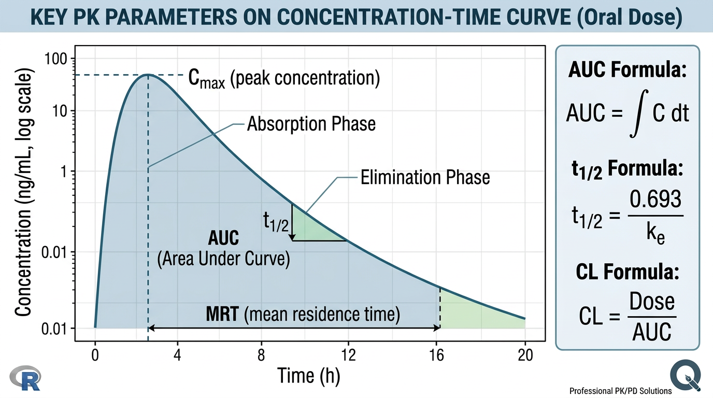
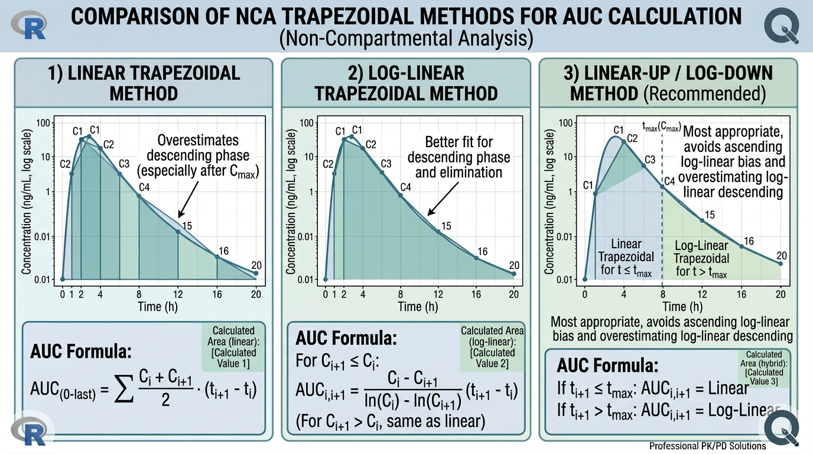
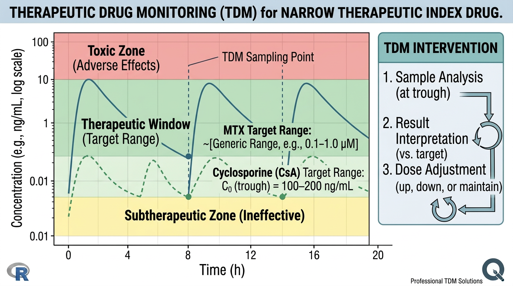

# 약동학 분석의 핵심 정보 {#sec-pk-information}

이전 장에서 R을 활용한 데이터 전처리 기법을 학습했습니다. 이제 정리된 데이터로부터 **약동학(PK) 정보를 추출하는 방법**을 배울 차례입니다. 이 장에서는 PK 파라미터의 정의와 임상적 의미, 비구획분석(Non-Compartmental Analysis, NCA)의 원리, 치료적 약물 모니터링(TDM)의 개념, 그리고 R을 사용한 실제 NCA 수행 방법을 다룹니다.

이 장에서 다루는 내용은 약동학 분석의 **가장 기본이 되는 핵심 지식**입니다. 여기서 배우는 PK 파라미터와 NCA 원리는 이후 모든 PK/PD 분석의 토대가 됩니다.

```{r}
#| eval: false
# 이 장에서 사용하는 패키지
library(tidyverse)    # 데이터 처리 및 시각화
library(NonCompart)   # 비구획분석 (NCA)
library(PKNCA)        # PK 비구획분석 (대안)
library(gt)           # 출판 품질 표 생성
```

## PK 파라미터의 정의와 임상적 의미 {#sec-pk-parameters}

{#fig-ch05-1 width=100%}

@fig-ch05-1 은 약동학 분석에서 산출하는 주요 PK 파라미터를 보여줍니다. PK 파라미터는 약물의 체내 동태를 정량적으로 기술하는 핵심 지표입니다. 각 파라미터가 무엇을 의미하고, 임상적으로 어떤 판단에 활용되는지 이해하는 것이 중요합니다.

### Cmax: 최고 혈중 농도 {#sec-cmax}

**Cmax** (Maximum Concentration)는 약물 투여 후 관찰된 **최고 혈중(혈장) 농도**를 말합니다. 농도-시간 곡선에서 가장 높은 지점에 해당합니다.

$$C_{max} = \max\{C(t_i) : i = 1, 2, \ldots, n\}$$

**임상적 의미:**

- **약효 발현**: Cmax가 최소 유효 농도(Minimum Effective Concentration, MEC) 이상에 도달해야 약리학적 효과가 나타납니다.
- **독성 평가**: Cmax가 최소 독성 농도(Minimum Toxic Concentration, MTC)를 초과하면 부작용 위험이 증가합니다. Cyclosporine의 경우 과도한 Cmax는 급성 신독성과 관련됩니다.
- **생물학적 동등성(Bioequivalence)**: 제네릭 의약품 허가에서 Cmax는 AUC와 함께 핵심 평가 지표입니다 (기준약 대비 80-125% 범위).
- **농도 의존적 독성**: Methotrexate 고용량 요법에서 Cmax가 높을수록 점막염(mucositis) 및 골수억제 위험이 증가합니다.

### Tmax: 최고 혈중 농도 도달 시간 {#sec-tmax}

**Tmax** (Time to Maximum Concentration)는 약물 투여 후 **Cmax에 도달하는 데 걸리는 시간**입니다. NCA에서 Tmax는 관찰된 시간점 중에서 선택되므로 채혈 스케줄에 의존합니다.

$$T_{max} = \arg\max_{t_i} C(t_i)$$

**임상적 의미:**

- **흡수 속도의 지표**: Tmax가 짧을수록 흡수가 빠릅니다. Tofacitinib의 Tmax는 0.5-1시간으로 매우 빠르며, Adalimumab(SC)의 Tmax는 약 5일로 느립니다.
- **음식 효과(Food Effect)**: 음식과 함께 복용 시 Tmax가 지연될 수 있습니다. 이는 생물학적 동등성 시험에서 중요한 평가 항목입니다.
- **제형 특성**: 서방형(Extended-Release) 제형은 속방형(Immediate-Release)보다 Tmax가 길어지도록 설계됩니다. Tofacitinib 서방형(11mg QD)은 속방형(5mg BID)보다 Tmax가 약 4시간으로 연장됩니다.

:::{.callout-note}
## Cmax와 Tmax의 통계적 특성

Cmax는 연속형 변수이므로 기하평균(geometric mean)과 변동계수(CV%)로 요약합니다. 반면 Tmax는 **이산형(discrete) 변수**로, 관찰된 채혈 시점에만 값이 존재합니다. 따라서 Tmax는 산술평균이 아닌 **중앙값(median)**과 범위(range)로 보고하는 것이 적절합니다. Tmax의 통계 검정에는 비모수 검정(Wilcoxon 검정 등)을 사용합니다.
:::

### AUC: 곡선하 면적 {#sec-auc}

**AUC** (Area Under the Curve)는 농도-시간 곡선 아래의 면적으로, 약물의 **총 전신 노출량(total systemic exposure)**을 나타내는 가장 중요한 PK 파라미터입니다.

$$AUC = \int_0^{\infty} C(t) \, dt$$

AUC는 계산 범위에 따라 여러 종류가 있습니다:

| AUC 종류 | 정의 | 용도 |
|----------|------|------|
| $AUC_{last}$ | 시간 0부터 마지막 정량 가능 농도 시점까지 | 관찰된 데이터 기반, 가장 신뢰할 수 있음 |
| $AUC_{inf}$ ($AUC_{0-\infty}$) | 시간 0부터 무한대까지 (외삽 포함) | 단회 투여 후 총 노출량 평가 |
| $AUC_{\tau}$ | 한 투여 간격(dosing interval, $\tau$) 동안 | 항정상태에서의 노출량 평가 |
| $AUC_{0-t}$ | 시간 0부터 특정 시간 t까지 | 부분 AUC, 흡수 속도 비교 |

$$AUC_{inf} = AUC_{last} + \frac{C_{last}}{\lambda_z}$$

여기서 $C_{last}$는 마지막 정량 가능 농도, $\lambda_z$는 말기 소실 속도상수(terminal elimination rate constant)입니다.

**임상적 의미:**

- **총 약물 노출**: AUC는 청소율(CL)과 투여량(Dose)의 함수입니다: $AUC = \frac{F \cdot Dose}{CL}$
- **생물학적 동등성**: AUC~last~와 AUC~inf~는 제네릭 의약품의 동등성 판정 핵심 기준입니다.
- **노출-반응 관계**: Dupilumab에서 AUC~τ~가 높을수록 EASI 점수 개선이 큰 노출-반응 관계가 보고되었습니다.
- **약물 상호작용 평가**: 병용약에 의한 AUC 변화 비율로 상호작용 정도를 평가합니다 (예: AUC 비율 > 5배 → 강력한 억제).

:::{.callout-important}
## AUClast vs AUCinf: 어느 것을 사용할 것인가?

- **AUC~last~**: 관찰된 데이터만 사용하므로 **외삽 오류가 없습니다**. 데이터의 신뢰도가 높습니다.
- **AUC~inf~**: 말기 소실까지 포함하므로 **총 노출량을 대표**하지만, lambda_z 추정의 정확도에 의존합니다.

일반적 지침:
- **외삽 비율** (= (AUC~inf~ - AUC~last~) / AUC~inf~ x 100%) 이 **20% 미만**이면 AUC~inf~를 신뢰할 수 있습니다.
- 외삽 비율이 20% 이상이면 AUC~last~를 사용하거나, 채혈 기간을 연장한 재시험을 고려합니다.
- 반감기가 매우 긴 약물(단클론항체 등)에서는 충분한 기간 동안 채혈하지 않으면 외삽 비율이 클 수 있습니다.
:::

### t~1/2~: 반감기 {#sec-half-life}

**t~1/2~** (Half-life)는 혈중 약물 농도가 **절반으로 감소하는 데 걸리는 시간**입니다. 말기 소실 속도상수(lambda_z)로부터 계산합니다.

$$t_{1/2} = \frac{\ln 2}{\lambda_z} = \frac{0.693}{\lambda_z}$$

**임상적 의미:**

- **투여 간격 결정**: 일반적으로 투여 간격은 반감기의 1-2배로 설정합니다. Tofacitinib(t~1/2~ ≈ 3시간)은 1일 2회, Adalimumab(t~1/2~ ≈ 14일)은 격주 투여입니다.
- **항정상태 도달 시간**: 항정상태(Steady State)는 약 **4-5 반감기** 후 도달합니다. Dupilumab(t~1/2~ ≈ 26일)은 항정상태 도달에 약 3-4개월이 필요합니다.
- **약물 소실 시간**: 약물이 체내에서 실질적으로 소실되는 시간도 약 4-5 반감기입니다.
- **부하용량(Loading Dose) 필요성**: 반감기가 긴 약물에서 빠른 치료 효과를 위해 부하용량을 투여합니다. Dupilumab은 초회 600mg(유지용량의 2배)을 투여합니다.

| 경과 반감기 수 | 항정상태 도달률 | 체내 잔류량 (투약 중단 시) |
|----------------|-----------------|---------------------------|
| 1 | 50% | 50% |
| 2 | 75% | 25% |
| 3 | 87.5% | 12.5% |
| 4 | 93.75% | 6.25% |
| 5 | 96.875% | 3.125% |

:::{.callout-warning}
## 반감기 해석 시 주의사항

반감기는 CL(청소율)과 Vd(분포용적) 모두의 함수입니다:

$$t_{1/2} = \frac{0.693 \cdot V_d}{CL}$$

따라서 반감기가 길어진 것이 **청소율 감소**(예: 신부전에서 Methotrexate) 때문인지, **분포용적 증가** 때문인지를 구분해야 합니다. 반감기만으로는 약물의 제거 효율을 정확히 판단할 수 없으며, CL과 Vd를 함께 고려해야 합니다.
:::

### CL: 청소율 {#sec-clearance}

**CL** (Clearance)은 단위 시간당 약물이 완전히 제거되는 **가상적인 혈장 부피**를 나타내며, 약물의 제거 효율을 정량화하는 파라미터입니다.

$$CL = \frac{F \cdot Dose}{AUC_{inf}}$$

경구 투여 시에는 생체이용률(F)과 분리할 수 없으므로 **겉보기 청소율(apparent clearance, CL/F)**로 보고합니다.

$$CL/F = \frac{Dose}{AUC_{inf}}$$

**청소율의 종류:**

| 종류 | 기호 | 의미 |
|------|------|------|
| 전신 청소율 | $CL$ | 체내 모든 경로에 의한 총 제거율 |
| 신 청소율 | $CL_R$ | 신장에 의한 제거율 |
| 간 청소율 | $CL_H$ | 간에 의한 제거율 |
| 겉보기 청소율 | $CL/F$ | 경구 투여 시 관찰되는 청소율 |

$$CL = CL_R + CL_H + CL_{other}$$

**임상적 의미:**

- **용량 결정**: 목표 평균 항정상태 농도($C_{ss,avg}$)를 달성하기 위한 투여속도(Dosing Rate)는 $DR = CL \cdot C_{ss,avg}$로 계산합니다.
- **신기능/간기능에 따른 용량 조절**: Methotrexate(CL~R~ ≈ 80%)는 신기능 저하 시 청소율이 크게 감소하므로 용량 감량이 필요합니다.
- **약물 상호작용**: CYP3A4 억제제 병용 시 Cyclosporine의 CL~H~가 감소하여 혈중 농도가 상승합니다.
- **개체간 변이**: CL의 개체간 변이(inter-individual variability)는 용량 개인화(dose individualization)의 근거가 됩니다.

### Vd: 분포용적 {#sec-volume-distribution}

**Vd** (Volume of Distribution)은 체내 약물의 총량을 혈장 농도와 연결하는 **비례상수**로, 약물이 체내에서 얼마나 넓게 분포하는지를 나타냅니다.

$$V_d = \frac{A_{body}}{C_{plasma}} = \frac{Dose}{C_0}$$

여기서 $A_{body}$는 체내 약물의 총량, $C_{plasma}$는 혈장 농도, $C_0$는 정맥 투여 직후의 초기 농도입니다.

**경구 투여 시에는 겉보기 분포용적(Vd/F)으로 보고합니다:**

$$V_d/F = \frac{Dose}{AUC_{inf} \cdot \lambda_z}$$

**임상적 의미:**

- **약물의 조직 분포 정도**: Vd가 체액 총량(~42L)보다 크면 약물이 조직에 광범위하게 분포함을 의미합니다. Cyclosporine(Vd = 3-5 L/kg, 즉 약 210-350L)은 지방 조직과 적혈구에 광범위하게 분포합니다.
- **항체 약물의 특성**: Adalimumab(Vd ≈ 5-6L)과 Dupilumab(Vd ≈ 4.8L)의 Vd가 혈장량(~3L)에 근접한 것은 거대 분자가 혈관 내에 주로 머무름을 반영합니다.
- **부하용량 산출**: 목표 농도를 빠르게 달성하기 위한 부하용량은 $LD = V_d \cdot C_{target}$으로 계산합니다.
- **비만 환자에서의 고려**: Vd가 체중에 비례하는 약물은 비만 환자에서 용량 조절이 필요할 수 있습니다.

### F: 생체이용률 {#sec-bioavailability}

**F** (Bioavailability)는 혈관외 투여(경구, 피하주사 등) 시 투여된 약물 중 **전신 순환에 도달하는 분율**을 나타냅니다. 정맥 투여를 기준(F = 1)으로 합니다.

$$F = \frac{AUC_{extravascular}}{AUC_{IV}} \times \frac{Dose_{IV}}{Dose_{extravascular}}$$

**임상적 의미:**

- **경구 vs 피하 경로 비교**: Methotrexate의 경구 F는 30-70%(용량 의존적)인 반면, 피하주사 F는 약 90%입니다. 따라서 경구 15mg과 피하주사 15mg은 노출량이 다릅니다.
- **용량 의존적 변화**: Methotrexate는 고용량에서 흡수 수송체 포화로 F가 감소하는 비선형 약동학을 보입니다.
- **제형 간 비교**: Cyclosporine의 마이크로에멀전 제형(Neoral)은 기존 제형(Sandimmune)보다 F가 높고 개체간 변이가 적습니다.
- **식이의 영향**: 일부 약물은 음식과 함께 복용 시 F가 변할 수 있습니다.

### MRT: 평균 체류 시간 {#sec-mrt}

**MRT** (Mean Residence Time)은 약물 분자가 체내에 **평균적으로 머무르는 시간**을 나타냅니다.

$$MRT = \frac{AUMC}{AUC}$$

여기서 AUMC (Area Under the first Moment Curve)는 농도 x 시간 곡선의 면적입니다:

$$AUMC = \int_0^{\infty} t \cdot C(t) \, dt$$

**경구 투여 시:**

$$MRT_{oral} = \frac{AUMC_{oral}}{AUC_{oral}} - \frac{AUMC_{IV}}{AUC_{IV}} = MRT_{observed} - MRT_{IV}$$

이론적으로 1-구획 모형에서 IV bolus 투여 시:

$$MRT = \frac{1}{\lambda_z} = \frac{t_{1/2}}{0.693} \approx 1.44 \cdot t_{1/2}$$

**임상적 의미:**

- **체내 약물 체류의 종합적 지표**: 반감기와 달리 다구획(multi-compartment) 모형에서도 적용 가능합니다.
- **MAT(Mean Absorption Time) 계산**: $MAT = MRT_{oral} - MRT_{IV}$로 평균 흡수 시간을 추정할 수 있습니다.
- **분포용적 계산**: 항정상태 분포용적 $V_{ss} = CL \cdot MRT$

### PK 파라미터 종합 요약

```{r}
#| eval: false
# PK 파라미터 종합 정리
pk_params <- tibble(
  parameter = c("Cmax", "Tmax", "AUClast", "AUCinf", "t1/2",
                "CL (또는 CL/F)", "Vd (또는 Vd/F)", "F", "MRT"),
  definition = c(
    "최고 혈중 농도",
    "최고 혈중 농도 도달 시간",
    "마지막 정량 시점까지의 AUC",
    "무한대까지 외삽한 AUC",
    "혈중 농도가 절반이 되는 시간",
    "단위 시간당 약물 제거 혈장 부피",
    "체내 약물량과 혈장 농도의 비례상수",
    "전신 순환에 도달하는 약물 분율",
    "약물의 평균 체내 체류 시간"
  ),
  formula = c(
    "max{C(ti)}",
    "argmax C(ti)",
    "sum of trapezoids (0 to tlast)",
    "AUClast + Clast/lambda_z",
    "0.693 / lambda_z",
    "F*Dose / AUCinf",
    "Dose / (AUCinf * lambda_z)",
    "AUCpo/AUCiv * Doseiv/Dosepo",
    "AUMC / AUC"
  ),
  unit_example = c(
    "ng/mL, ug/mL",
    "hr, day",
    "ng*hr/mL",
    "ng*hr/mL",
    "hr, day",
    "L/hr",
    "L",
    "무단위 (0-1)",
    "hr"
  )
)

pk_params |>
  gt() |>
  tab_header(
    title = "주요 PK 파라미터 종합 정리",
    subtitle = "비구획분석(NCA)에서 산출하는 핵심 파라미터"
  ) |>
  cols_label(
    parameter = "파라미터",
    definition = "정의",
    formula = "계산 공식",
    unit_example = "단위 예시"
  )
```

## 비구획분석(NCA) 원리 {#sec-nca-principles}

{#fig-ch05-2 width=100%}

비구획분석(Non-Compartmental Analysis, NCA)은 약물의 구획 모형(1-구획, 2-구획 등)을 가정하지 않고, **관찰된 농도-시간 데이터로부터 직접 PK 파라미터를 산출**하는 방법입니다 (@fig-ch05-2). NCA는 가정이 적고 계산이 간단하며, 규제 기관에서 가장 널리 사용되는 PK 분석 방법입니다.

### 사다리꼴 법칙(Trapezoidal Rule) {#sec-trapezoidal}

AUC 계산의 핵심은 **사다리꼴 법칙(trapezoidal rule)**입니다. 연속적인 두 데이터 포인트 사이의 면적을 사다리꼴로 근사하여 전체 AUC를 합산합니다.

#### Linear Trapezoidal Method

가장 기본적인 방법으로, 두 인접한 데이터 포인트를 **직선으로 연결**하여 사다리꼴을 형성합니다.

$$AUC_{t_i \to t_{i+1}} = \frac{(C_i + C_{i+1})}{2} \times (t_{i+1} - t_i)$$

$$AUC_{last} = \sum_{i=1}^{n-1} \frac{(C_i + C_{i+1})}{2} \times (t_{i+1} - t_i)$$

**장점**: 계산이 간단하고 직관적입니다.

**단점**: 농도가 감소하는 구간(소실상)에서 AUC를 **과대평가(overestimate)** 하는 경향이 있습니다. 이는 실제 농도 감소가 지수적(exponential)이지만 직선으로 근사하기 때문입니다.

#### Log-linear Trapezoidal Method

농도가 감소하는 구간에서 두 데이터 포인트를 **로그-선형(log-linear)으로 연결**합니다. 이는 약물 소실이 1차 속도론(first-order kinetics)을 따른다는 가정에 기반합니다.

$$AUC_{t_i \to t_{i+1}} = \frac{(C_i - C_{i+1})}{\ln(C_i) - \ln(C_{i+1})} \times (t_{i+1} - t_i)$$

단, $C_i \neq C_{i+1}$이고 $C_i > 0$, $C_{i+1} > 0$인 경우에만 적용 가능합니다.

**장점**: 소실상(elimination phase)에서 AUC를 더 정확하게 계산합니다.

**단점**: 농도가 증가하는 구간(흡수상)에서는 AUC를 **과소평가(underestimate)** 할 수 있습니다.

#### Linear-up/Log-down Method (권장) {#sec-linear-up-log-down}

현재 가장 널리 권장되는 방법으로, **흡수상(ascending)에서는 Linear 방법을, 소실상(descending)에서는 Log-linear 방법을 적용**합니다.

$$AUC_{t_i \to t_{i+1}} = \begin{cases} \frac{(C_i + C_{i+1})}{2} \times (t_{i+1} - t_i) & \text{if } C_{i+1} \geq C_i \text{ (ascending)} \\ \frac{(C_i - C_{i+1})}{\ln(C_i/C_{i+1})} \times (t_{i+1} - t_i) & \text{if } C_{i+1} < C_i \text{ (descending)} \end{cases}$$

:::{.callout-tip}
## NCA 분석 소프트웨어의 기본 설정

대부분의 상용 NCA 소프트웨어(Phoenix WinNonlin)와 R 패키지(NonCompart, PKNCA)에서 Linear-up/Log-down이 기본(default) 방법입니다. FDA와 EMA 가이드라인에서도 이 방법을 권장합니다. 특별한 이유가 없는 한 Linear-up/Log-down을 사용하세요.
:::

다음 예시로 세 가지 방법의 차이를 직관적으로 이해할 수 있습니다:

```{r}
#| eval: false
# 세 가지 trapezoidal method 비교
# 예시 데이터: 소실 구간 (100 -> 50 ng/mL, 4시간 간격)
C1 <- 100  # ng/mL
C2 <- 50   # ng/mL
dt <- 4    # hours

# Linear trapezoidal
auc_linear <- (C1 + C2) / 2 * dt
cat("Linear:    ", auc_linear, "ng*hr/mL\n")

# Log-linear trapezoidal
auc_loglin <- (C1 - C2) / (log(C1) - log(C2)) * dt
cat("Log-linear:", round(auc_loglin, 1), "ng*hr/mL\n")

# 실제 면적 (1차 속도론 가정)
kel <- log(C1/C2) / dt
auc_true <- C1 / kel * (1 - exp(-kel * dt))
cat("True (1st order):", round(auc_true, 1), "ng*hr/mL\n")

# Linear method는 과대평가, Log-linear는 정확
cat("\nLinear 오차:", round((auc_linear - auc_true) / auc_true * 100, 1), "%\n")
cat("Log-linear 오차:", round((auc_loglin - auc_true) / auc_true * 100, 1), "%\n")
```

### Lambda_z 추정 {#sec-lambda-z}

말기 소실 속도상수(**$\lambda_z$**, Lambda_z)는 농도-시간 곡선의 말기 소실상(terminal phase)에서의 기울기로, 반감기와 AUC~inf~ 계산에 필수적입니다.

#### 추정 방법

1. **데이터 선택**: 농도-시간 곡선의 말기 소실상(Cmax 이후, 로그 농도가 직선적으로 감소하는 구간)에서 최소 3개의 데이터 포인트를 선택합니다.
2. **로그-선형 회귀(log-linear regression)**: 선택된 포인트에 대해 $\ln C(t)$ vs $t$의 선형 회귀를 수행합니다.
3. **기울기가 $-\lambda_z$**: $\ln C(t) = \ln C_0 - \lambda_z \cdot t$에서 기울기의 절대값이 $\lambda_z$입니다.

$$\lambda_z = -\text{slope of } [\ln C(t) \text{ vs } t] \text{ in terminal phase}$$

#### 적합도 평가: 조정 R^2^ 기준

Lambda_z 추정의 신뢰성은 **조정 R^2^ (adjusted R-squared)**로 평가합니다.

- **조정 R^2^ $\geq$ 0.90**: 일반적으로 허용 가능
- **조정 R^2^ $\geq$ 0.95**: 양호
- **조정 R^2^ $\geq$ 0.99**: 우수

:::{.callout-warning}
## Lambda_z 추정 시 흔한 오류

1. **분포상(distribution phase) 포인트 포함**: Cmax 직후의 급격한 농도 감소는 소실이 아닌 분포에 의한 것일 수 있습니다. 이 포인트를 포함하면 lambda_z가 과대평가됩니다.
2. **데이터 포인트 부족**: 최소 3개, 바람직하게는 4-5개 이상의 포인트가 필요합니다. 반감기의 2-3배에 해당하는 기간 동안 채혈이 이루어져야 합니다.
3. **BLQ 포인트의 부적절한 포함**: 말기에 BLQ로 떨어진 포인트는 제외해야 합니다.
4. **자동 선택의 맹신**: 소프트웨어의 자동 포인트 선택 결과를 반드시 시각적으로 확인해야 합니다.
:::

### AUCinf 외삽 비율 {#sec-extrapolation}

AUC~inf~ 계산 시 마지막 관측 이후의 외삽(extrapolation) 부분이 전체의 몇 %를 차지하는지 확인해야 합니다.

$$\text{외삽 비율 (\%)} = \frac{AUC_{inf} - AUC_{last}}{AUC_{inf}} \times 100 = \frac{C_{last} / \lambda_z}{AUC_{inf}} \times 100$$

- **20% 미만**: AUC~inf~를 신뢰할 수 있음 (일반적 기준)
- **20-30%**: 주의 필요, AUC~last~ 병행 보고 권장
- **30% 이상**: AUC~inf~의 신뢰성 낮음, AUC~last~를 주요 지표로 사용

### 구획분석 vs 비구획분석 비교 {#sec-ca-vs-nca}

```{r}
#| eval: false
# 구획분석(CA) vs 비구획분석(NCA) 비교
comparison <- tibble(
  feature = c(
    "모형 가정", "계산 복잡도", "소프트웨어",
    "파라미터 종류", "주요 용도",
    "규제 기관 선호", "개체간 변이 분석",
    "예측/시뮬레이션", "학습 곡선"
  ),
  NCA = c(
    "모형 가정 없음 (model-independent)",
    "낮음 (수학적 공식 적용)",
    "Phoenix WinNonlin, R (NonCompart, PKNCA)",
    "Cmax, Tmax, AUC, t1/2, CL/F, Vd/F",
    "BE 시험, 단회 PK 시험, 약물 상호작용 시험",
    "높음 (표준 방법)",
    "개별 파라미터 산출 후 기술통계",
    "불가",
    "낮음"
  ),
  CA = c(
    "구획 모형 가정 (1-구획, 2-구획 등)",
    "높음 (비선형 회귀, MCMC 등)",
    "NONMEM, Monolix, nlmixr2",
    "CL, V, ka + 모집단 파라미터 (IIV, IOV)",
    "용량 최적화, 시뮬레이션, 특수 집단 분석",
    "모집단 PK 분석에서 사용",
    "혼합효과 모형으로 직접 추정",
    "가능 (농도 예측, 시뮬레이션)",
    "높음"
  )
)

comparison |>
  gt() |>
  tab_header(
    title = "구획분석(CA) vs 비구획분석(NCA) 비교"
  ) |>
  cols_label(
    feature = "특성",
    NCA = "비구획분석 (NCA)",
    CA = "구획분석 (CA)"
  )
```

:::{.callout-note}
## NCA와 구획분석: 상호보완적 관계

NCA와 구획분석(compartmental analysis)은 경쟁 관계가 아니라 **상호보완적**입니다. 일반적으로:

1. **NCA를 먼저 수행**하여 기본 PK 파라미터를 산출하고 데이터의 품질을 확인합니다.
2. 이후 필요에 따라 **구획분석(모집단 PK 모델링)**을 수행하여 공변량 효과, 개체간 변이 등을 분석합니다.

NCA 결과는 구획분석 모형의 타당성을 검증하는 데에도 활용됩니다. 예를 들어, 구획 모형에서 예측한 CL과 NCA에서 산출한 CL/F가 일관성이 있는지 확인합니다.
:::

## TDM: 치료적 약물 모니터링 {#sec-tdm}

### TDM의 개념과 필요성 {#sec-tdm-concept}

**TDM (Therapeutic Drug Monitoring)**은 환자의 혈중 약물 농도를 측정하여 **약물 용량을 개인화(individualize)**하는 임상 실무입니다. 모든 약물에 TDM이 필요한 것은 아니며, 다음 조건을 만족하는 약물에서 특히 유용합니다:

1. **좁은 치료역(Narrow Therapeutic Index, NTI)**: 유효 농도와 독성 농도의 차이가 작은 약물
2. **높은 개체간 변이**: 같은 용량을 투여해도 환자마다 혈중 농도가 크게 다른 약물
3. **농도-반응 관계가 잘 확립됨**: 혈중 농도와 효과/독성의 관계가 명확한 약물
4. **혈중 농도 측정법이 확립됨**: 신뢰할 수 있는 분석법(immunoassay, LC-MS/MS 등)이 존재하는 약물

```{r}
#| eval: false
# TDM이 필요한 약물의 특성
tdm_criteria <- tibble(
  criterion = c(
    "좁은 치료역 (NTI)",
    "높은 개체간 변이 (IIV)",
    "비선형 약동학",
    "농도-효과/독성 관계 확립",
    "순응도(compliance) 확인 필요"
  ),
  Methotrexate = c("O (고용량)", "O", "O (흡수)", "O", "O"),
  Cyclosporine = c("O", "O", "X", "O", "O"),
  Adalimumab = c("X", "O", "O (TMDD)", "O (연구중)", "O"),
  Tofacitinib = c("X", "X", "X", "X", "X")
)

tdm_criteria |>
  gt() |>
  tab_header(
    title = "TDM 적용 기준과 피부과 약물의 해당 여부"
  ) |>
  cols_label(criterion = "기준")
```

### 좁은 치료역(Narrow Therapeutic Index) 약물 {#sec-nti}

{#fig-ch05-3 width=100%}

@fig-ch05-3 은 좁은 치료역 약물의 TDM 개념을 보여줍니다. 좁은 치료역 약물은 **유효 농도 범위**가 좁아서, 농도가 조금만 변해도 치료 실패(농도 부족)나 독성(농도 과다)이 발생할 수 있는 약물입니다.

```{r}
#| eval: false
# NTI 약물의 치료역 예시
nti_drugs <- tibble(
  drug = c("Cyclosporine (이식)", "Cyclosporine (피부과)",
           "Methotrexate (저용량)", "Methotrexate (고용량)",
           "Tacrolimus", "Vancomycin", "Lithium"),
  target_range = c(
    "C0: 150-300 ng/mL",
    "C0: 100-200 ng/mL",
    "일반적으로 TDM 불필요",
    "24h: <10 uM, 48h: <1 uM, 72h: <0.1 uM",
    "C0: 5-15 ng/mL",
    "AUC24: 400-600 mg*hr/L",
    "0.6-1.2 mEq/L"
  ),
  toxicity_threshold = c(
    "C0 > 400 ng/mL: 신독성 위험 증가",
    "C0 > 250 ng/mL: 신독성 위험 증가",
    "-",
    "48h > 1 uM: leucovorin 구제요법 연장",
    "C0 > 20 ng/mL: 신독성 위험",
    "AUC24 > 600: 신독성 위험",
    "> 1.5 mEq/L: 독성 증상"
  )
)

nti_drugs |>
  gt() |>
  tab_header(
    title = "좁은 치료역 약물의 목표 농도 범위"
  ) |>
  cols_label(
    drug = "약물",
    target_range = "목표 농도 범위",
    toxicity_threshold = "독성 농도 기준"
  )
```

### Methotrexate TDM {#sec-mtx-tdm}

Methotrexate의 TDM은 주로 **고용량 요법(High-Dose Methotrexate, HDMTX)**에서 시행됩니다. 고용량 MTX(1-12 g/m^2^)는 골육종, 림프종, 급성 림프구성 백혈병 등에 사용되며, 투여 후 혈중 농도를 시간별로 모니터링하여 **leucovorin 구제요법(rescue therapy)**의 시점과 용량을 결정합니다.

**HDMTX 모니터링 프로토콜:**

| 시간 (투여 후) | 목표 농도 | 초과 시 조치 |
|----------------|-----------|-------------|
| 24시간 | < 10 $\mu$M | Leucovorin 증량 |
| 48시간 | < 1 $\mu$M | Leucovorin 계속, 수액 요법 |
| 72시간 | < 0.1 $\mu$M | Leucovorin 중단 가능 |

```{r}
#| eval: false
# MTX 고용량 요법 농도 모니터링 예시 데이터
mtx_tdm <- tibble(
  patient_id = rep(c("PT001", "PT002"), each = 5),
  time_hr = rep(c(0, 24, 48, 72, 96), 2),
  concentration_uM = c(
    # PT001: 정상 제거 패턴
    0, 8.5, 0.6, 0.05, 0.01,
    # PT002: 지연 제거 (delayed elimination)
    0, 15.2, 3.8, 0.45, 0.08
  ),
  status = c(
    "투여 전", "목표 미달", "목표 달성", "목표 달성", "제거 완료",
    "투여 전", "목표 초과!", "목표 초과!", "목표 초과!", "목표 달성"
  )
)

# 시각화
ggplot(mtx_tdm |> filter(time_hr > 0),
       aes(x = time_hr, y = concentration_uM,
           color = patient_id, group = patient_id)) +
  geom_line(linewidth = 1) +
  geom_point(size = 3) +
  geom_hline(yintercept = c(10, 1, 0.1),
             linetype = "dashed", color = "red", alpha = 0.5) +
  annotate("text", x = 95, y = c(10, 1, 0.1),
           label = c("24h 기준: 10 uM", "48h 기준: 1 uM", "72h 기준: 0.1 uM"),
           hjust = 1, size = 3) +
  scale_y_log10() +
  labs(
    x = "투여 후 시간 (hr)",
    y = "MTX 농도 (uM, log scale)",
    color = "환자",
    title = "High-Dose Methotrexate TDM 모니터링"
  ) +
  theme_bw()
```

:::{.callout-important}
## MTX 지연 제거(Delayed Elimination)의 위험성

HDMTX 투여 후 혈중 농도가 예상보다 느리게 감소하는 "지연 제거"는 중대한 임상적 응급상황입니다. 원인으로는:

- **신기능 저하**: MTX는 80-90%가 신장으로 배설되므로, 탈수나 신독성 약물 병용 시 제거가 지연됩니다.
- **Third space accumulation**: 복수(ascites)나 흉수(pleural effusion)에 MTX가 축적되었다가 서서히 방출됩니다.
- **약물 상호작용**: NSAIDs, PPIs 등이 MTX의 신장 배설을 감소시킬 수 있습니다.

지연 제거 시 leucovorin 용량을 증량하고, 충분한 수액 공급과 소변 알칼리화(urinary alkalinization)를 시행합니다. 중증의 경우 glucarpidase(carboxypeptidase G2)로 MTX를 효소적으로 분해할 수 있습니다.
:::

### Cyclosporine TDM: C0 vs C2 모니터링 {#sec-csa-tdm}

Cyclosporine의 TDM은 장기 이식과 자가면역 질환 치료 모두에서 중요합니다. 전통적으로 투약 전 최저 농도(trough level, C0)를 모니터링했으나, 2000년대 이후 투약 후 2시간 농도(C2)가 더 나은 지표라는 연구 결과가 보고되었습니다.

#### C0 모니터링 (Trough Level)

- **측정 시점**: 다음 투약 직전 (투약 간격 12시간 기준, 투약 후 12시간)
- **장점**: 측정 시점이 유연하고, 환자 순응도가 높음
- **단점**: Cyclosporine의 흡수 변이를 반영하지 못함. C0가 같아도 AUC는 크게 다를 수 있음

#### C2 모니터링 (Peak Absorption)

- **측정 시점**: 투약 후 정확히 2시간 (±15분)
- **장점**: AUC~0-4h~와 높은 상관관계 (r > 0.9). 급성 거부반응 예측에 C0보다 우수
- **단점**: 측정 시점이 엄격하여 실행 가능성(feasibility) 문제

```{r}
#| eval: false
# C0 vs C2 목표 농도 범위 비교
csa_targets <- tibble(
  indication = c(
    "신장 이식 (유지기)",
    "간 이식 (유지기)",
    "아토피 피부염",
    "건선"
  ),
  c0_target = c(
    "100-200 ng/mL",
    "100-200 ng/mL",
    "80-150 ng/mL",
    "100-200 ng/mL"
  ),
  c2_target = c(
    "800-1200 ng/mL",
    "600-1000 ng/mL",
    "600-900 ng/mL",
    "800-1000 ng/mL"
  )
)

csa_targets |>
  gt() |>
  tab_header(
    title = "Cyclosporine C0 vs C2 목표 농도 범위",
    subtitle = "적응증별 목표 혈중 농도"
  ) |>
  cols_label(
    indication = "적응증",
    c0_target = "C0 목표 (ng/mL)",
    c2_target = "C2 목표 (ng/mL)"
  )
```

:::{.callout-tip}
## 피부과에서의 Cyclosporine TDM 실무

피부과에서 Cyclosporine을 사용할 때(아토피 피부염, 건선 등)의 TDM은 이식 분야만큼 엄격하지 않은 경우가 많습니다. 그러나 다음 상황에서는 TDM이 권장됩니다:

1. **치료 반응이 불충분할 때**: 순응도 확인 및 용량 조절
2. **신독성 의심 시**: 혈청 크레아티닌(SCr) 상승 + 고혈압 발생
3. **약물 상호작용이 예상될 때**: CYP3A4 억제제/유도제 병용 시작/중단
4. **소아 또는 고령 환자**: 약동학적 변이가 큰 집단
5. **장기간 사용 시**: 누적 신독성 모니터링 (보통 1-2년 이내 사용 권장)

측정 방법으로는 면역분석법(immunoassay, 예: CMIA, EMIT)과 LC-MS/MS가 있으며, LC-MS/MS가 더 특이적입니다. 면역분석법은 대사체와의 교차 반응(cross-reactivity)으로 농도가 약 10-20% 높게 측정될 수 있습니다.
:::

#### 치료역 종합 비교

```{r}
#| eval: false
# Methotrexate와 Cyclosporine의 TDM 파라미터 비교
tdm_comparison <- tibble(
  feature = c(
    "TDM 필요 상황",
    "주요 모니터링 지표",
    "측정 방법",
    "목표 농도 범위",
    "측정 빈도",
    "용량 조절 기준",
    "주요 독성 지표"
  ),
  Methotrexate = c(
    "고용량 요법 (>500 mg/m2)",
    "혈중 농도 (24h, 48h, 72h)",
    "면역분석법, HPLC",
    "24h: <10 uM, 48h: <1 uM, 72h: <0.1 uM",
    "고용량 투여 시 매 24시간",
    "농도 기준 초과 시 leucovorin 증량",
    "골수억제 (WBC, PLT), 간기능, 신기능"
  ),
  Cyclosporine = c(
    "이식, 자가면역질환 치료 전반",
    "C0 (trough) 또는 C2 (peak absorption)",
    "CMIA, EMIT, LC-MS/MS",
    "적응증별 상이 (표 참조)",
    "초기 주 2회, 안정화 후 월 1회",
    "C0/C2가 목표 범위 밖이면 용량 조절",
    "신기능 (SCr, eGFR), 혈압, K+, Mg2+"
  )
)

tdm_comparison |>
  gt() |>
  tab_header(
    title = "Methotrexate vs Cyclosporine TDM 비교"
  ) |>
  cols_label(feature = "특성")
```

## R 실습: NCA 수행 {#sec-nca-r-practice}

이 절에서는 R을 사용하여 NCA를 직접 수행합니다. 먼저 AUC를 수동으로 계산하는 함수를 작성하여 원리를 이해한 후, NonCompart와 PKNCA 패키지를 활용하여 실제 NCA를 수행합니다.

### AUC 수동 계산 함수 작성 {#sec-manual-auc}

#### Linear Trapezoidal AUC

```{r}
#| eval: false
# Linear Trapezoidal AUC 계산 함수
calc_auc_linear <- function(time, conc) {
  auc <- 0
  for (i in 2:length(time)) {
    auc <- auc + (time[i] - time[i-1]) * (conc[i] + conc[i-1]) / 2
  }
  return(auc)
}

# 테스트 데이터: Cyclosporine 경구 투여 후 PK 프로파일
time_hr <- c(0, 0.5, 1, 1.5, 2, 3, 4, 6, 8, 12)
conc_ngml <- c(85, 350, 680, 920, 1050, 780, 520, 280, 150, 90)

auc_linear_result <- calc_auc_linear(time_hr, conc_ngml)
cat("Linear Trapezoidal AUClast:", round(auc_linear_result, 1), "ng*hr/mL\n")
```

#### Log-linear Trapezoidal AUC

```{r}
#| eval: false
# Log-linear Trapezoidal AUC 계산 함수
calc_auc_loglinear <- function(time, conc) {
  auc <- 0
  for (i in 2:length(time)) {
    if (conc[i] > 0 & conc[i-1] > 0 & conc[i] != conc[i-1]) {
      # Log-linear trapezoidal
      auc <- auc + (conc[i-1] - conc[i]) /
        (log(conc[i-1]) - log(conc[i])) * (time[i] - time[i-1])
    } else {
      # 동일한 농도이거나 0이면 linear 사용
      auc <- auc + (time[i] - time[i-1]) * (conc[i] + conc[i-1]) / 2
    }
  }
  return(auc)
}

auc_loglin_result <- calc_auc_loglinear(time_hr, conc_ngml)
cat("Log-linear Trapezoidal AUClast:", round(auc_loglin_result, 1), "ng*hr/mL\n")
```

#### Linear-up/Log-down AUC (권장 방법)

```{r}
#| eval: false
# Linear-up/Log-down AUC 계산 함수
calc_auc_linuplogdown <- function(time, conc) {
  auc <- 0
  for (i in 2:length(time)) {
    dt <- time[i] - time[i-1]
    if (conc[i] >= conc[i-1]) {
      # 농도 상승 구간 (ascending): Linear trapezoidal
      auc <- auc + dt * (conc[i] + conc[i-1]) / 2
    } else if (conc[i] > 0 & conc[i-1] > 0) {
      # 농도 하강 구간 (descending): Log-linear trapezoidal
      auc <- auc + (conc[i-1] - conc[i]) /
        (log(conc[i-1]) - log(conc[i])) * dt
    } else {
      # 0 포함 시: Linear trapezoidal
      auc <- auc + dt * (conc[i] + conc[i-1]) / 2
    }
  }
  return(auc)
}

auc_luld_result <- calc_auc_linuplogdown(time_hr, conc_ngml)
cat("Linear-up/Log-down AUClast:", round(auc_luld_result, 1), "ng*hr/mL\n")

# 세 가지 방법 비교
cat("\n=== 세 가지 방법의 AUClast 비교 ===\n")
cat("Linear:             ", round(auc_linear_result, 1), "ng*hr/mL\n")
cat("Log-linear:         ", round(auc_loglin_result, 1), "ng*hr/mL\n")
cat("Linear-up/Log-down: ", round(auc_luld_result, 1), "ng*hr/mL\n")
cat("Linear vs LuLd 차이:", round((auc_linear_result - auc_luld_result) /
      auc_luld_result * 100, 2), "%\n")
```

### Lambda_z 수동 계산 {#sec-manual-lambda}

```{r}
#| eval: false
# Lambda_z 수동 계산
# 말기 소실상 데이터 선택 (Cmax 이후, 마지막 3개 이상의 포인트)
# 여기서는 4h, 6h, 8h, 12h (Cmax 시점인 2h 이후의 하강 구간)

# 소실상 데이터
term_idx <- which(time_hr >= 4)  # 4시간 이후 포인트 선택
term_time <- time_hr[term_idx]
term_conc <- conc_ngml[term_idx]

# 로그-선형 회귀
fit <- lm(log(term_conc) ~ term_time)
summary(fit)

# Lambda_z = 기울기의 절대값
lambda_z <- -coef(fit)[2]
cat("Lambda_z:", round(lambda_z, 4), "hr^-1\n")

# 조정 R-squared
adj_r2 <- summary(fit)$adj.r.squared
cat("Adjusted R²:", round(adj_r2, 4), "\n")

# 반감기
t_half <- log(2) / lambda_z
cat("Terminal half-life:", round(t_half, 2), "hr\n")

# AUCinf 계산
c_last <- tail(conc_ngml[conc_ngml > 0], 1)
auc_extrap <- c_last / lambda_z
auc_inf <- auc_luld_result + auc_extrap
cat("\nAUClast:", round(auc_luld_result, 1), "ng*hr/mL\n")
cat("AUC 외삽 부분:", round(auc_extrap, 1), "ng*hr/mL\n")
cat("AUCinf:", round(auc_inf, 1), "ng*hr/mL\n")
cat("외삽 비율:", round(auc_extrap / auc_inf * 100, 1), "%\n")

# CL/F 계산
dose_mg <- 200  # Cyclosporine 200mg 가정
cl_f <- dose_mg * 1e6 / auc_inf  # ng -> pg 보정 불필요 (단위 맞춤)
# dose를 ng로 변환: 200mg = 200,000,000 ng
cl_f <- (dose_mg * 1e6) / auc_inf  # mL/hr
cat("CL/F:", round(cl_f / 1000, 2), "L/hr\n")  # mL -> L

# Vd/F 계산
vd_f <- cl_f / lambda_z / 1000  # L
cat("Vd/F:", round(vd_f, 1), "L\n")
```

### NonCompart 패키지를 사용한 NCA {#sec-noncompart}

**NonCompart** 패키지는 한국에서 개발된 R 패키지로, FDA 및 EMA 가이드라인을 준수하는 NCA를 수행합니다. `tblNCA()` 함수 하나로 모든 NCA 파라미터를 한 번에 산출할 수 있습니다.

```{r}
#| eval: false
library(NonCompart)

# 예시 데이터: 5명의 환자에 대한 Methotrexate PK 데이터
mtx_pk <- tibble(
  Subject = rep(paste0("PT", sprintf("%03d", 1:5)), each = 9),
  Time = rep(c(0, 0.5, 1, 2, 4, 6, 8, 12, 24), 5),
  Conc = c(
    # PT001: 15mg 경구
    0, 180, 420, 350, 210, 120, 68, 22, 2.5,
    # PT002
    0, 210, 480, 380, 230, 135, 75, 25, 3.0,
    # PT003
    0, 150, 380, 310, 185, 105, 58, 18, 1.8,
    # PT004
    0, 195, 450, 365, 225, 128, 72, 24, 2.8,
    # PT005
    0, 165, 400, 330, 200, 115, 65, 20, 2.2
  )
)

# NonCompart::tblNCA()로 NCA 수행
nca_result <- tblNCA(
  mtx_pk,
  key = "Subject",    # 피험자 ID 열
  colTime = "Time",    # 시간 열
  colConc = "Conc",    # 농도 열
  dose = 15,           # 투여량 (mg)
  adm = "Extravascular",  # 혈관외 투여 (경구)
  dur = 0,             # 주입 시간 (IV infusion 시)
  doseUnit = "mg",
  timeUnit = "hr",
  concUnit = "ng/mL"
)

# 결과 확인
head(nca_result)

# 주요 파라미터만 추출
key_params <- c("Subject", "CMAX", "TMAX", "AUCLST", "AUCIFO",
                "AUCPEO", "LAMZHL", "CLFO", "VZFO", "MRTEVLST")

nca_summary <- nca_result |>
  as_tibble() |>
  select(any_of(key_params))

nca_summary
```

```{r}
#| eval: false
# 결과를 gt 표로 정리
nca_summary |>
  mutate(across(where(is.numeric), ~ round(.x, 2))) |>
  gt() |>
  tab_header(
    title = "Methotrexate 15mg 경구 투여 NCA 결과",
    subtitle = "NonCompart::tblNCA() 분석 결과"
  ) |>
  cols_label(
    Subject = "피험자",
    CMAX = "Cmax (ng/mL)",
    TMAX = "Tmax (hr)",
    AUCLST = "AUClast (ng*hr/mL)",
    AUCIFO = "AUCinf (ng*hr/mL)",
    AUCPEO = "외삽비율 (%)",
    LAMZHL = "t1/2 (hr)",
    CLFO = "CL/F (L/hr)",
    VZFO = "Vd/F (L)",
    MRTEVLST = "MRT (hr)"
  )
```

:::{.callout-note}
## NonCompart의 주요 파라미터 이름

NonCompart 패키지에서 사용하는 파라미터 이름은 CDISC ADaM 표준을 따릅니다:

| NonCompart 이름 | 의미 | 비고 |
|-----------------|------|------|
| `CMAX` | 최고 혈중 농도 | |
| `TMAX` | Cmax 도달 시간 | |
| `AUCLST` | AUClast | 마지막 정량 시점까지 |
| `AUCIFO` | AUCinf (관찰) | Lambda_z 기반 외삽 |
| `AUCPEO` | 외삽 비율 (%) | (AUCinf-AUClast)/AUCinf*100 |
| `LAMZHL` | Terminal half-life | 0.693/Lambda_z |
| `LAMZ` | Lambda_z | 말기 소실 속도상수 |
| `CLFO` | CL/F (관찰) | 경구 겉보기 청소율 |
| `VZFO` | Vd/F (관찰) | 경구 겉보기 분포용적 |
| `MRTEVLST` | MRT (혈관외, last) | |
| `LAMZNPT` | Lambda_z에 사용된 포인트 수 | |
| `LAMZADJ` | Lambda_z 조정 R² | |
:::

### PKNCA 패키지로 NCA 수행 {#sec-pknca}

**PKNCA** 패키지는 또 다른 R NCA 패키지로, tidyverse 스타일과 잘 호환되며 더 유연한 설정이 가능합니다.

```{r}
#| eval: false
library(PKNCA)

# 농도 데이터 설정
conc_obj <- PKNCAconc(
  mtx_pk,
  Conc ~ Time | Subject  # formula: 농도 ~ 시간 | 그룹
)

# 투여 데이터 설정
dose_data <- tibble(
  Subject = paste0("PT", sprintf("%03d", 1:5)),
  Time = 0,
  Dose = 15  # mg
)

dose_obj <- PKNCAdose(
  dose_data,
  Dose ~ Time | Subject
)

# NCA 데이터 객체 생성
nca_data <- PKNCAdata(conc_obj, dose_obj)

# NCA 수행
nca_pknca <- pk.nca(nca_data)

# 결과 확인
summary(nca_pknca)

# 결과를 tibble로 변환
pknca_results <- as.data.frame(nca_pknca) |>
  as_tibble()

# 주요 파라미터 추출 및 wide format으로 변환
pknca_wide <- pknca_results |>
  select(Subject, PPTESTCD, PPORRES) |>
  filter(PPTESTCD %in% c("cmax", "tmax", "auclast", "aucinf.obs",
                          "half.life", "cl.obs", "vd.obs")) |>
  pivot_wider(
    names_from = PPTESTCD,
    values_from = PPORRES
  )

pknca_wide
```

### NonCompart vs PKNCA 결과 비교 {#sec-nca-comparison}

```{r}
#| eval: false
# 두 패키지의 결과를 나란히 비교
# (실제 수행 시 결과 값을 삽입합니다)
cat("=== NonCompart vs PKNCA 결과 비교 (PT001 기준) ===\n\n")
cat(sprintf("%-20s %15s %15s\n", "파라미터", "NonCompart", "PKNCA"))
cat(paste(rep("-", 52), collapse = ""), "\n")
cat("두 패키지의 결과는 동일한 알고리즘 적용 시 일치해야 합니다.\n")
cat("차이가 있다면 trapezoidal method 설정을 확인하세요.\n")
```

:::{.callout-tip}
## NonCompart vs PKNCA: 어떤 것을 선택할까?

| 특성 | NonCompart | PKNCA |
|------|-----------|-------|
| **학습 곡선** | 낮음 (함수 1개) | 중간 (객체 설정 필요) |
| **출력 형식** | 넓은 형태 (Wide) | 긴 형태 (Long) |
| **유연성** | 기본 설정으로 충분 | 파라미터별 세부 설정 가능 |
| **규제 검증** | FDA/EMA 호환 | FDA/EMA 호환 |
| **대규모 데이터** | 적합 | 매우 적합 |
| **tidyverse 호환** | 보통 | 우수 |
| **개발 국가** | 한국 (가톨릭대) | 미국 |

**권장**: 처음 NCA를 배울 때는 **NonCompart**의 단순한 인터페이스가 좋고, 대규모 임상시험 데이터 분석에는 **PKNCA**의 유연성이 유리합니다.
:::

### Cyclosporine C0/C2 데이터에서 TDM 분석 {#sec-csa-tdm-analysis}

```{r}
#| eval: false
# Cyclosporine TDM 데이터 예시
csa_tdm_data <- tibble(
  patient_id = rep(paste0("PT", sprintf("%03d", 1:8)), each = 4),
  visit = rep(c("Week 2", "Week 4", "Week 8", "Week 12"), 8),
  visit_num = rep(c(2, 4, 8, 12), 8),
  dose_mg_bid = rep(c(100, 100, 125, 125, 75, 150, 100, 100), each = 4),
  weight_kg = rep(c(65, 78, 55, 82, 60, 70, 68, 72), each = 4),
  C0 = c(
    # PT001 (100mg BID, 65kg)
    125, 145, 155, 160,
    # PT002 (100mg BID, 78kg)
    95, 110, 120, 118,
    # PT003 (125mg BID, 55kg)
    210, 235, 248, 255,
    # PT004 (125mg BID, 82kg)
    130, 148, 155, 158,
    # PT005 (75mg BID, 60kg)
    78, 85, 92, 88,
    # PT006 (150mg BID, 70kg)
    245, 268, 285, 290,
    # PT007 (100mg BID, 68kg)
    135, 152, 162, 165,
    # PT008 (100mg BID, 72kg)
    115, 128, 138, 140
  ),
  C2 = c(
    820, 880, 920, 940,
    680, 720, 750, 745,
    1350, 1420, 1480, 1500,
    850, 910, 950, 960,
    520, 560, 580, 570,
    1580, 1650, 1720, 1740,
    880, 940, 980, 990,
    750, 800, 840, 850
  )
)

# TDM 분석: 목표 범위 평가
csa_tdm_analysis <- csa_tdm_data |>
  mutate(
    dose_per_kg = dose_mg_bid * 2 / weight_kg,  # mg/kg/day
    c0_status = case_when(
      C0 < 80 ~ "목표 미달 (<80)",
      C0 > 200 ~ "목표 초과 (>200)",
      TRUE ~ "목표 범위 내"
    ),
    c2_status = case_when(
      C2 < 600 ~ "목표 미달 (<600)",
      C2 > 1200 ~ "목표 초과 (>1200)",
      TRUE ~ "목표 범위 내"
    ),
    c2_c0_ratio = round(C2 / C0, 1)
  )

# C0 기준 요약
csa_tdm_analysis |>
  count(c0_status) |>
  mutate(pct = round(n / sum(n) * 100, 1))

# C2 기준 요약
csa_tdm_analysis |>
  count(c2_status) |>
  mutate(pct = round(n / sum(n) * 100, 1))
```

```{r}
#| eval: false
# TDM 결과 시각화
# C0 추이 그래프
p1 <- ggplot(csa_tdm_analysis,
       aes(x = visit_num, y = C0, group = patient_id, color = patient_id)) +
  geom_line(linewidth = 0.8) +
  geom_point(size = 2) +
  geom_hline(yintercept = c(80, 200), linetype = "dashed",
             color = "red", alpha = 0.5) +
  annotate("rect", xmin = 1, xmax = 13, ymin = 80, ymax = 200,
           alpha = 0.1, fill = "green") +
  labs(
    x = "방문 (주)", y = "C0 (ng/mL)",
    title = "Cyclosporine C0 (Trough Level) 추이",
    subtitle = "녹색 영역: 목표 범위 (80-200 ng/mL)",
    color = "환자"
  ) +
  theme_bw()

# C2 추이 그래프
p2 <- ggplot(csa_tdm_analysis,
       aes(x = visit_num, y = C2, group = patient_id, color = patient_id)) +
  geom_line(linewidth = 0.8) +
  geom_point(size = 2) +
  geom_hline(yintercept = c(600, 1200), linetype = "dashed",
             color = "red", alpha = 0.5) +
  annotate("rect", xmin = 1, xmax = 13, ymin = 600, ymax = 1200,
           alpha = 0.1, fill = "green") +
  labs(
    x = "방문 (주)", y = "C2 (ng/mL)",
    title = "Cyclosporine C2 (2h Post-dose) 추이",
    subtitle = "녹색 영역: 목표 범위 (600-1200 ng/mL)",
    color = "환자"
  ) +
  theme_bw()

p1
p2
```

```{r}
#| eval: false
# TDM 결과 종합 테이블 (gt)
csa_tdm_summary <- csa_tdm_analysis |>
  group_by(patient_id) |>
  summarise(
    dose_mg_bid = first(dose_mg_bid),
    weight_kg = first(weight_kg),
    dose_mgkg_day = round(first(dose_per_kg), 2),
    mean_C0 = round(mean(C0), 0),
    mean_C2 = round(mean(C2), 0),
    mean_ratio = round(mean(c2_c0_ratio), 1),
    c0_in_range = sum(c0_status == "목표 범위 내"),
    c2_in_range = sum(c2_status == "목표 범위 내"),
    .groups = "drop"
  )

csa_tdm_summary |>
  gt() |>
  tab_header(
    title = "Cyclosporine TDM 종합 결과",
    subtitle = "아토피 피부염 환자 8명 (목표 C0: 80-200, C2: 600-1200 ng/mL)"
  ) |>
  cols_label(
    patient_id = "환자",
    dose_mg_bid = "용량 (mg BID)",
    weight_kg = "체중 (kg)",
    dose_mgkg_day = "용량 (mg/kg/day)",
    mean_C0 = "평균 C0",
    mean_C2 = "평균 C2",
    mean_ratio = "C2/C0 비",
    c0_in_range = "C0 목표내 (n/4)",
    c2_in_range = "C2 목표내 (n/4)"
  ) |>
  tab_style(
    style = cell_fill(color = "#FFE0E0"),
    locations = cells_body(
      columns = mean_C0,
      rows = mean_C0 > 200 | mean_C0 < 80
    )
  ) |>
  tab_style(
    style = cell_fill(color = "#FFE0E0"),
    locations = cells_body(
      columns = mean_C2,
      rows = mean_C2 > 1200 | mean_C2 < 600
    )
  )
```

### Methotrexate NCA 결과에서 PK 파라미터 추출 {#sec-mtx-nca-extract}

```{r}
#| eval: false
# Methotrexate NCA 결과에서 주요 PK 파라미터 추출 및 기술통계
# (앞서 NonCompart로 수행한 결과 사용)

# 기술통계 요약 함수
pk_descriptive <- function(x) {
  tibble(
    N = length(x[!is.na(x)]),
    Mean = round(mean(x, na.rm = TRUE), 2),
    SD = round(sd(x, na.rm = TRUE), 2),
    CV_pct = round(sd(x, na.rm = TRUE) / mean(x, na.rm = TRUE) * 100, 1),
    Median = round(median(x, na.rm = TRUE), 2),
    Min = round(min(x, na.rm = TRUE), 2),
    Max = round(max(x, na.rm = TRUE), 2),
    Geo_Mean = round(exp(mean(log(x[x > 0]), na.rm = TRUE)), 2),
    Geo_CV_pct = round(sqrt(exp(var(log(x[x > 0]), na.rm = TRUE)) - 1) * 100, 1)
  )
}

# NCA 결과에서 파라미터별 요약 통계
# (nca_result가 NonCompart의 출력이라 가정)
nca_result_tbl <- nca_result |> as_tibble()

param_summary <- bind_rows(
  pk_descriptive(nca_result_tbl$CMAX) |> mutate(Parameter = "Cmax (ng/mL)", .before = 1),
  pk_descriptive(nca_result_tbl$TMAX) |> mutate(Parameter = "Tmax (hr)", .before = 1),
  pk_descriptive(nca_result_tbl$AUCLST) |> mutate(Parameter = "AUClast (ng*hr/mL)", .before = 1),
  pk_descriptive(nca_result_tbl$AUCIFO) |> mutate(Parameter = "AUCinf (ng*hr/mL)", .before = 1),
  pk_descriptive(nca_result_tbl$LAMZHL) |> mutate(Parameter = "t1/2 (hr)", .before = 1),
  pk_descriptive(nca_result_tbl$CLFO) |> mutate(Parameter = "CL/F (L/hr)", .before = 1),
  pk_descriptive(nca_result_tbl$VZFO) |> mutate(Parameter = "Vd/F (L)", .before = 1)
)

# 출판 품질 표
param_summary |>
  gt() |>
  tab_header(
    title = "Methotrexate 15mg 경구 투여 PK 파라미터 요약",
    subtitle = "비구획분석(NCA) 결과, N=5"
  ) |>
  tab_footnote(
    footnote = "Geo_Mean = 기하평균, Geo_CV = 기하 변동계수",
    locations = cells_column_labels(columns = c(Geo_Mean, Geo_CV_pct))
  ) |>
  tab_footnote(
    footnote = "Tmax는 산술평균 대신 중앙값과 범위로 보고하는 것이 적절합니다.",
    locations = cells_body(columns = Parameter, rows = Parameter == "Tmax (hr)")
  )
```

## 약리학 노트: Methotrexate와 Cyclosporine의 PK 비교 {#sec-pk-comparison}

이 절에서는 피부과에서 가장 오래 사용되어 온 두 가지 전통적 전신치료제인 Methotrexate와 Cyclosporine의 약동학적 특성을 비교합니다.

### Methotrexate의 PK 특성

- **경구 생체이용률(F)**: 30-70% (용량 의존적 감소)
  - 저용량 (7.5-15mg): F ≈ 60-70%
  - 고용량 (>25mg): F ≈ 30-40% (흡수 수송체 포화)
- **피하주사 생체이용률**: 약 90% (Biocon/Antares 연구)
- **임상적 함의**: 경구 MTX로 충분한 반응이 없을 때 SC로 전환하면 노출량이 약 30-50% 증가할 수 있음
- **분포**: Vd ≈ 0.4-0.8 L/kg, 혈장 단백 결합 ≈ 50% (알부민)
- **대사**: 7-OH-MTX (산화 대사체), polyglutamate 형태로 세포 내 축적
- **배설**: **신장 배설 80-90%** (사구체 여과 + 세뇨관 분비)
  - 신기능 저하 시 MTX 축적 → 중증 독성 위험
- **반감기**: 3-10시간 (저용량), 8-15시간 (고용량, 말기상)
- **비선형 약동학**: 용량 증가에 따른 흡수 포화로 비선형성 보임

### Cyclosporine의 PK 특성

- **경구 생체이용률(F)**: 20-50% (높은 개체간 변이)
  - 마이크로에멀전 제형(Neoral): F ≈ 30-50%
  - 기존 제형(Sandimmune): F ≈ 20-30%
- **높은 변이의 원인**:
  - 장관 CYP3A4에 의한 초회 통과 대사(presystemic metabolism)
  - 장관 P-glycoprotein에 의한 유출(efflux)
  - 담즙산과의 상호작용 (식이에 의한 담즙 분비가 흡수에 영향)
- **분포**: Vd ≈ 3-5 L/kg, 적혈구와 리포프로틴에 광범위하게 분포
  - 혈장 단백 결합 ≈ 90% (전혈 기준으로 농도 측정)
- **대사**: **CYP3A4** (주요), CYP3A5 (보조) → 30개 이상의 대사체
  - P-glycoprotein(P-gp)의 기질이자 억제제
- **배설**: 주로 **담즙(biliary excretion)** 경로, 신장 배설 < 6%
- **반감기**: 6-24시간 (제형, 개인에 따라 변이 큼)
- **신독성 모니터링**: 혈청 크레아티닌(SCr), 사구체 여과율(eGFR), 혈압

### 두 약물의 PK 파라미터 비교

```{r}
#| eval: false
# MTX vs CsA PK 파라미터 비교 표
pk_comparison <- tibble(
  parameter = c(
    "분자량 (Da)",
    "생체이용률 (경구 F)",
    "Tmax (경구)",
    "혈장 단백 결합",
    "분포용적 (Vd)",
    "주요 대사 경로",
    "주요 배설 경로",
    "반감기 (t1/2)",
    "치료역 (Therapeutic Index)",
    "TDM 필요성",
    "CYP450 관여",
    "주요 약물 상호작용",
    "신기능 영향",
    "비선형 약동학"
  ),
  Methotrexate = c(
    "454.4",
    "30-70% (용량 의존적)",
    "1-2시간",
    "~50% (알부민)",
    "0.4-0.8 L/kg",
    "세포 내 polyglutamation, 7-OH-MTX",
    "신장 (80-90%)",
    "3-10시간 (저용량)",
    "중간-좁음 (고용량 시)",
    "고용량 요법에서 필수",
    "CYP1A2, 2D6 (보조적)",
    "NSAIDs, PPIs, TMP-SMX",
    "신기능 저하 → 축적 → 독성",
    "있음 (흡수 포화)"
  ),
  Cyclosporine = c(
    "1,202.6",
    "20-50% (높은 변이)",
    "1.5-2시간 (Neoral)",
    "~90% (적혈구, 리포프로틴)",
    "3-5 L/kg",
    "CYP3A4 (주요), CYP3A5",
    "담즙 (>90%)",
    "6-24시간",
    "좁음 (NTI)",
    "치료 전반에서 필요",
    "CYP3A4 (기질 + 억제제), P-gp",
    "Ketoconazole, Rifampicin, 자몽주스",
    "CsA가 신독성 유발 → eGFR 모니터링",
    "없음 (선형 약동학)"
  )
)

pk_comparison |>
  gt() |>
  tab_header(
    title = "Methotrexate vs Cyclosporine PK 특성 비교",
    subtitle = "피부과 전통적 전신치료제의 약동학적 차이"
  ) |>
  cols_label(
    parameter = "파라미터"
  ) |>
  tab_style(
    style = cell_text(weight = "bold"),
    locations = cells_body(columns = parameter)
  )
```

:::{.callout-note}
## MTX와 CsA의 임상적 시사점

두 약물의 PK 특성 차이는 다음과 같은 임상적 시사점을 제공합니다:

1. **MTX는 신기능, CsA는 간기능/약물 상호작용에 주의**: MTX는 신배설이 80-90%이므로 신기능 저하 시 독성 위험이 높고, CsA는 CYP3A4 대사가 주요 경로이므로 CYP3A4 억제제/유도제와의 상호작용에 주의해야 합니다.

2. **MTX는 SC 전환, CsA는 제형 선택이 중요**: MTX의 경구 흡수가 불충분할 때(특히 고용량) SC로 전환하면 노출량을 높일 수 있습니다. CsA는 Neoral(마이크로에멀전) 제형이 흡수의 변이를 줄여줍니다.

3. **TDM 전략의 차이**: MTX의 TDM은 주로 고용량 요법의 안전성 모니터링에 사용되고, CsA의 TDM은 효능과 안전성 모두를 위한 지속적 모니터링에 사용됩니다.
:::

## Claude Code 활용 팁 {#sec-claude-tips-ch5}

### NCA 파라미터 계산 과정을 단계별로 설명 요청

NCA 분석 과정이 복잡하게 느껴질 때, Claude Code에 단계별 설명을 요청하면 효과적입니다.

:::{.callout-tip}
## Claude Code 프롬프트 예시: NCA 단계별 설명

> "다음 농도-시간 데이터에서 AUClast, AUCinf, Cmax, Tmax, t1/2을 계산하는 과정을 단계별로 설명해줘. 각 단계에서 어떤 수학적 공식이 사용되는지, 왜 그 방법을 사용하는지 이유도 함께 설명해줘."
>
> ```
> Time (hr): 0, 0.5, 1, 2, 4, 6, 8, 12, 24
> Conc (ng/mL): 0, 180, 420, 350, 210, 120, 68, 22, 2.5
> Dose: 15 mg (경구)
> ```

이 프롬프트를 사용하면 Claude Code가 다음과 같은 단계로 설명합니다:
1. 데이터 확인 및 Cmax/Tmax 직접 판독
2. Linear-up/Log-down trapezoidal 방법으로 AUClast 계산 (각 구간별)
3. Lambda_z 추정을 위한 말기 소실상 데이터 선택 및 회귀분석
4. 반감기 계산
5. AUCinf 외삽 및 외삽 비율 확인
6. CL/F, Vd/F 산출
:::

### 농도-시간 데이터에서 AUC 계산 코드 요청 패턴

:::{.callout-tip}
## Claude Code 프롬프트 예시: AUC 계산 코드

> "이 농도-시간 데이터에서 AUC를 계산하는 R 코드를 작성해줘. Linear-up/Log-down 방법을 사용하고, NonCompart 패키지의 결과와 수동 계산 결과를 비교해줘."

또는 더 구체적으로:

> "5명의 환자에 대한 Cyclosporine PK 데이터가 있어. NonCompart::tblNCA()로 NCA를 수행하고, 결과에서 Cmax, Tmax, AUClast, AUCinf, t1/2, CL/F를 추출해서 gt 표로 정리해줘. 기술통계(N, Mean, SD, CV%, Median, Min, Max, Geometric Mean)도 계산해줘."
:::

### 수식 검증: Claude Code에게 수식 확인 요청

PK 관련 수식이 올바른지 확인할 때도 Claude Code를 활용할 수 있습니다.

:::{.callout-tip}
## Claude Code 프롬프트 예시: 수식 검증

> "다음 수식이 맞는지 확인해줘. 틀린 부분이 있으면 올바른 수식을 알려줘."
>
> 1. AUCinf = AUClast + Clast / lambda_z
> 2. t1/2 = ln(2) / lambda_z
> 3. CL = Dose / AUCinf (경구 투여)
> 4. Vd = CL * t1/2 / 0.693
> 5. MRT = AUMC / AUC
>
> "특히 3번에서 경구 투여 시 F를 고려해야 하는지 설명해줘."

이런 요청을 통해 CL과 CL/F의 차이, 경구 투여 시 겉보기 파라미터의 의미 등을 명확히 이해할 수 있습니다.
:::

## 연습 문제 {#sec-exercises-ch5}

### 확인 문제

:::{.callout-note}
## 확인 문제 1

AUC~last~와 AUC~inf~의 차이를 설명하고, 외삽 비율(extrapolation ratio)이 높을 때(예: 40%) 어떤 문제가 있는지 설명하세요.

<details>
<summary>정답 보기</summary>

- **AUC~last~**: 시간 0부터 마지막 정량 가능 농도 시점(t~last~)까지의 면적. 관찰된 데이터만 사용하므로 외삽 오류가 없습니다.
- **AUC~inf~**: AUC~last~에 $C_{last}/\lambda_z$를 더하여 무한대까지 외삽한 면적. 총 노출량을 대표합니다.
- **외삽 비율 40%의 문제**: 전체 AUC의 40%가 추정(extrapolation)에 의존한다는 의미입니다. Lambda_z 추정의 오차가 AUC~inf~에 크게 영향을 미치므로, 이 결과는 신뢰하기 어렵습니다. 이 경우 AUC~last~를 주요 지표로 사용하거나, 채혈 기간을 연장하여 재시험을 수행해야 합니다.
</details>
:::

:::{.callout-note}
## 확인 문제 2

Linear trapezoidal, Log-linear trapezoidal, Linear-up/Log-down 방법의 차이를 설명하고, 왜 Linear-up/Log-down이 권장되는지 이유를 쓰세요.

<details>
<summary>정답 보기</summary>

- **Linear trapezoidal**: 모든 구간에서 직선으로 연결. 소실상에서 AUC를 과대평가합니다.
- **Log-linear trapezoidal**: 모든 구간에서 로그-선형 연결. 흡수상에서 AUC를 과소평가할 수 있습니다.
- **Linear-up/Log-down**: 농도가 상승하는 구간(흡수상)에서는 Linear, 감소하는 구간(소실상)에서는 Log-linear를 적용합니다.

Linear-up/Log-down이 권장되는 이유는 흡수상과 소실상의 특성에 맞는 최적의 근사를 적용하기 때문입니다. 흡수상에서는 농도 변화가 다양한 패턴을 보이므로 Linear 근사가 적절하고, 소실상에서는 1차 속도론에 따라 지수적으로 감소하므로 Log-linear 근사가 더 정확합니다.
</details>
:::

:::{.callout-note}
## 확인 문제 3

반감기(t~1/2~)가 14일인 Adalimumab을 격주(2주 간격)로 투여할 때, 항정상태에 도달하는 데 약 몇 주가 걸리며, 그 근거는 무엇입니까?

<details>
<summary>정답 보기</summary>

항정상태는 약 **4-5 반감기** 후 도달합니다.

- 4 반감기 = 4 x 14일 = **56일 (약 8주)** → 항정상태의 약 93.75% 도달
- 5 반감기 = 5 x 14일 = **70일 (약 10주)** → 항정상태의 약 96.875% 도달

따라서 Adalimumab은 격주 투여 시 약 **8-10주** 후 항정상태에 도달합니다. 이것이 임상시험에서 효능 평가를 12-16주 시점에 수행하는 이유 중 하나이며, 빠른 효과를 위해 초회에 80mg 부하용량(유지용량 40mg의 2배)을 투여하는 근거이기도 합니다.
</details>
:::

:::{.callout-note}
## 확인 문제 4

Cyclosporine TDM에서 C0(trough)와 C2(2시간 후 농도) 모니터링의 장단점을 각각 설명하세요.

<details>
<summary>정답 보기</summary>

**C0 (Trough Level) 모니터링:**
- 장점: 측정 시점이 유연(±1시간 허용), 환자 순응도가 높음, 오랜 임상 경험 축적
- 단점: Cyclosporine의 흡수 변이를 반영하지 못함. C0가 동일해도 AUC(총 노출량)는 환자마다 크게 다를 수 있어, C0만으로는 효능/독성 예측이 부정확

**C2 (Peak Absorption) 모니터링:**
- 장점: AUC~0-4h~와 높은 상관관계(r > 0.9), 급성 거부반응 예측에 C0보다 우수, 흡수 변이를 더 잘 반영
- 단점: 투약 후 정확히 2시간(±15분)에 채혈해야 하므로 시행 가능성(feasibility)이 문제. 시간을 벗어난 채혈은 결과 해석을 어렵게 함
</details>
:::

:::{.callout-note}
## 확인 문제 5

CL(청소율)과 t~1/2~(반감기)의 관계를 수식으로 쓰고, "반감기가 길다"는 것이 항상 "청소율이 낮다"를 의미하지 않는 이유를 설명하세요.

<details>
<summary>정답 보기</summary>

$$t_{1/2} = \frac{0.693 \cdot V_d}{CL}$$

반감기는 CL과 Vd 모두에 의존합니다. 반감기가 길어지는 경우는 두 가지입니다:

1. **CL이 감소한 경우**: 약물 제거가 느려짐 (예: 신부전에서 Methotrexate)
2. **Vd가 증가한 경우**: 약물이 조직에 광범위하게 분포하여, 혈장에서 제거되어도 조직에서 계속 방출됨

예를 들어, Cyclosporine(Vd = 3-5 L/kg)의 반감기가 길어진 것은 높은 분포용적 때문이지, 반드시 청소율이 낮기 때문은 아닙니다. 따라서 약물의 제거 효율을 정확히 평가하려면 반감기가 아닌 **CL(청소율)**을 직접 확인해야 합니다.
</details>
:::

### R 과제

:::{.callout-note}
## R 과제 1: AUC 수동 계산 검증

다음 데이터에 대해 Linear trapezoidal, Log-linear trapezoidal, Linear-up/Log-down 세 가지 방법으로 AUClast를 계산하고, NonCompart 패키지의 결과와 비교하세요.

```{r}
#| eval: false
# Tofacitinib 5mg 경구 투여 후 PK 데이터
tofa_pk <- tibble(
  Time = c(0, 0.25, 0.5, 0.75, 1, 1.5, 2, 3, 4, 6, 8, 12),
  Conc = c(0, 8.5, 28.3, 42.1, 48.5, 38.2, 28.8, 16.5, 9.8, 3.4, 1.2, 0.15)
)
```

과제:
1. 앞서 배운 수동 계산 함수 3개를 사용하여 AUClast를 계산하세요.
2. `NonCompart::sNCA()`를 사용하여 AUClast를 계산하세요.
3. 세 가지 수동 계산 결과와 NonCompart 결과를 비교하는 표를 만드세요.
4. 세 방법 간 차이가 발생하는 구간을 설명하세요.

<details>
<summary>힌트 보기</summary>

```{r}
#| eval: false
# NonCompart의 단일 피험자 NCA 함수
result <- sNCA(
  x = tofa_pk$Time,
  y = tofa_pk$Conc,
  dose = 5,
  adm = "Extravascular",
  doseUnit = "mg",
  timeUnit = "hr",
  concUnit = "ng/mL"
)
result["AUCLST"]
```
</details>
:::

:::{.callout-note}
## R 과제 2: NonCompart를 사용한 완전한 NCA 보고서

다음 데이터에 대해 완전한 NCA 분석을 수행하고, 출판 품질의 결과 표를 생성하세요.

```{r}
#| eval: false
# 가상의 Cyclosporine PK 데이터 (6명, 200mg 경구 투여)
set.seed(123)
csa_pk_data <- expand_grid(
  Subject = paste0("PT", sprintf("%03d", 1:6)),
  Time = c(0, 0.5, 1, 1.5, 2, 3, 4, 6, 8, 12)
) |>
  mutate(
    # 기본 농도 프로파일에 개체간 변이 추가
    base_conc = case_when(
      Time == 0 ~ 85,
      Time == 0.5 ~ 350,
      Time == 1 ~ 680,
      Time == 1.5 ~ 920,
      Time == 2 ~ 1050,
      Time == 3 ~ 780,
      Time == 4 ~ 520,
      Time == 6 ~ 280,
      Time == 8 ~ 150,
      Time == 12 ~ 90
    ),
    # 개체간 변이 (CV 30%)
    subject_factor = rep(exp(rnorm(6, 0, 0.3)), each = 10),
    Conc = round(base_conc * subject_factor * exp(rnorm(n(), 0, 0.1)), 1)
  ) |>
  select(Subject, Time, Conc)
```

과제:
1. `NonCompart::tblNCA()`로 전체 NCA 수행
2. 개별 피험자별 Cmax, Tmax, AUClast, AUCinf, t1/2, CL/F 추출
3. 기술통계(N, Mean, SD, CV%, Median, Min, Max, Geometric Mean, Geometric CV%) 계산
4. gt 패키지로 출판 품질의 요약 표 생성
5. 외삽 비율이 20% 이상인 피험자가 있는지 확인

<details>
<summary>힌트 보기</summary>

```{r}
#| eval: false
nca_result <- tblNCA(
  csa_pk_data,
  key = "Subject",
  colTime = "Time",
  colConc = "Conc",
  dose = 200,
  adm = "Extravascular",
  doseUnit = "mg",
  timeUnit = "hr",
  concUnit = "ng/mL"
)
```
</details>
:::

:::{.callout-note}
## R 과제 3: TDM 분석 및 용량 조절 권고

다음 Cyclosporine TDM 데이터를 분석하고, 각 환자에 대한 용량 조절 권고를 생성하세요.

```{r}
#| eval: false
# Cyclosporine TDM 데이터
csa_tdm_exercise <- tibble(
  patient_id = rep(c("PT001", "PT002", "PT003", "PT004", "PT005"), each = 3),
  visit = rep(c("Week 2", "Week 4", "Week 8"), 5),
  dose_mg_bid = c(
    rep(100, 3),  # PT001
    rep(125, 3),  # PT002
    rep(75, 3),   # PT003
    rep(100, 3),  # PT004
    rep(150, 3)   # PT005
  ),
  weight_kg = rep(c(65, 82, 55, 70, 75), each = 3),
  C0 = c(
    145, 158, 165,   # PT001: 목표 범위 내
    220, 245, 260,   # PT002: C0 높음 → 감량 필요?
    55, 62, 68,      # PT003: C0 낮음 → 증량 필요?
    130, 142, 148,   # PT004: 목표 범위 내
    310, 285, 295    # PT005: C0 매우 높음 → 감량 필요!
  ),
  SCr = c(
    0.85, 0.88, 0.90,   # PT001: 정상
    0.92, 1.05, 1.18,   # PT002: SCr 상승 추이
    0.78, 0.80, 0.82,   # PT003: 정상
    0.88, 0.90, 0.92,   # PT004: 정상
    1.10, 1.25, 1.42    # PT005: SCr 상승 (신독성 의심)
  )
)
```

과제:
1. 각 환자의 C0 목표 범위 달성 여부 평가 (목표: 80-200 ng/mL)
2. SCr 변화 추이 평가 (기저치 대비 30% 이상 상승 = 유의한 상승)
3. 용량 조절 권고 생성:
   - C0 > 200 또는 SCr 30% 이상 상승 → 용량 감량 25%
   - C0 < 80 → 용량 증량 25%
   - C0 80-200, SCr 안정 → 현 용량 유지
4. 결과를 gt 표로 정리

<details>
<summary>힌트 보기</summary>

```{r}
#| eval: false
# SCr 변화율 계산
result <- csa_tdm_exercise |>
  group_by(patient_id) |>
  mutate(
    scr_baseline = first(SCr),
    scr_change_pct = (SCr - scr_baseline) / scr_baseline * 100,
    scr_alert = scr_change_pct >= 30,
    c0_status = case_when(
      C0 > 200 ~ "high",
      C0 < 80 ~ "low",
      TRUE ~ "target"
    ),
    recommendation = case_when(
      c0_status == "high" | scr_alert ~ "감량 25%",
      c0_status == "low" ~ "증량 25%",
      TRUE ~ "유지"
    )
  ) |>
  ungroup()
```
</details>
:::

### Claude Code 도전 과제

:::{.callout-tip}
## Claude Code 도전 과제: NCA 자동화 파이프라인 구축

Claude Code에 다음과 같이 요청하세요:

> "임상시험 PK 데이터를 입력받아 NCA 분석을 자동으로 수행하고 보고서를 생성하는 R 함수를 작성해줘.
>
> 함수의 기능:
> 1. 입력: 농도-시간 데이터(tibble), 투여량, 투여 경로
> 2. 데이터 검증: 결측치, BLQ, 시간 순서 확인
> 3. BLQ 처리: M5 방법 자동 적용
> 4. NCA 수행: NonCompart::tblNCA() 사용
> 5. 결과 검증: 외삽 비율 > 20% 경고, 조정 R² < 0.9 경고
> 6. 기술통계 계산: Mean, SD, CV%, Median, Range, Geometric Mean
> 7. gt 표 생성: 개별 결과 표 + 요약 통계 표
> 8. 농도-시간 곡선 그래프 생성: 개별 + 평균 ± SD
>
> 함수 이름: run_nca_analysis()
> 출력: 리스트 (결과 표, 요약 표, 그래프 등)"

생성된 함수를 Methotrexate와 Cyclosporine 데이터에 각각 적용하여 결과를 비교해 보세요. 특히 외삽 비율 경고와 Lambda_z 적합도가 올바르게 작동하는지 확인하세요.
:::

## 이 장의 요약

이 장에서 학습한 핵심 내용을 정리합니다:

1. **PK 파라미터의 정의와 의미**: Cmax, Tmax, AUC, t~1/2~, CL, Vd, F, MRT의 수학적 정의와 임상적 의의를 이해했습니다. 각 파라미터가 용량 결정, 투여 간격 설정, 약물 상호작용 평가 등에 어떻게 활용되는지 학습했습니다.

2. **비구획분석(NCA)의 원리**: 사다리꼴 법칙(Linear, Log-linear, Linear-up/Log-down)을 이해하고, Lambda_z 추정 방법과 AUC~inf~ 외삽 비율의 신뢰성 기준(20% 미만)을 학습했습니다.

3. **TDM의 개념과 실무**: 좁은 치료역 약물에서 TDM의 필요성을 이해하고, Methotrexate(고용량 요법의 안전성 모니터링)와 Cyclosporine(C0 vs C2 모니터링)의 TDM 전략을 학습했습니다.

4. **R을 사용한 NCA 실습**: AUC 수동 계산 함수를 작성하여 원리를 이해하고, NonCompart와 PKNCA 패키지를 활용한 실제 NCA 수행 방법을 익혔습니다.

5. **MTX와 CsA의 PK 비교**: 두 약물의 약동학적 특성 차이(배설 경로, 생체이용률, 약물 상호작용 등)와 그에 따른 임상적 시사점을 학습했습니다.

다음 장에서는 이렇게 산출된 PK 파라미터를 바탕으로 **농도-시간 데이터를 시각화**하고, PK 프로파일을 다양한 관점에서 탐색하는 방법을 학습합니다.
