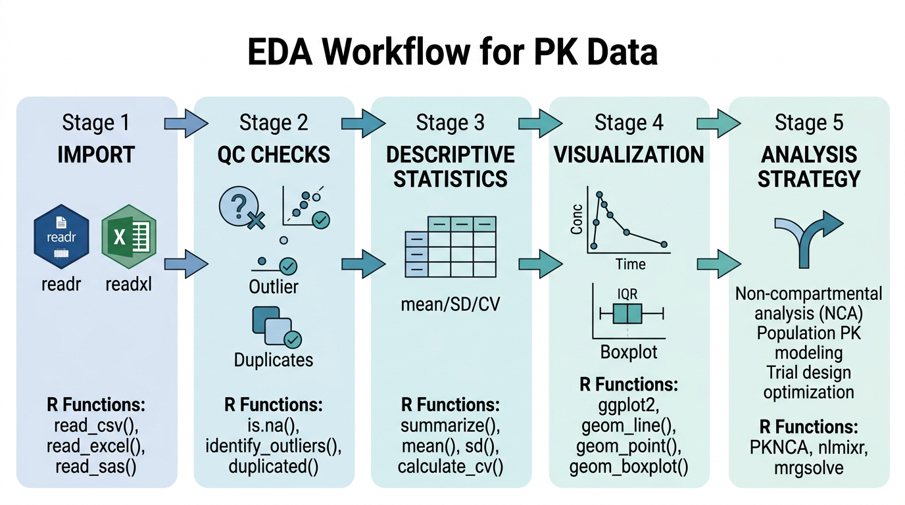
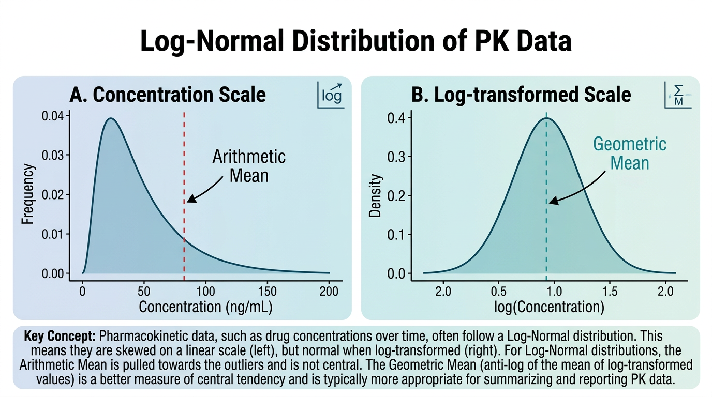
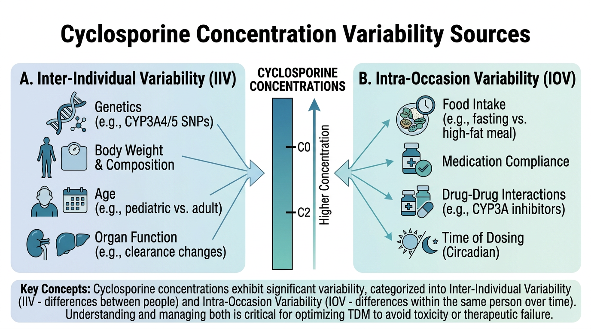

# PK 데이터의 탐색적 분석 {#sec-pk-eda}

탐색적 데이터 분석(Exploratory Data Analysis, EDA)은 본격적인 PK 분석에 앞서 데이터의 특성을 파악하고, 잠재적 문제를 식별하며, 분석 전략을 수립하는 핵심 과정입니다. 이 장에서는 기술통계량 산출, 데이터 품질 확인(QC), ggplot2를 활용한 PK 그래프 작성, 요약 테이블 생성까지 EDA의 전 과정을 다룹니다.

이 장의 예제에서는 **Cyclosporine 아토피 피부염 데이터**를 활용합니다. Cyclosporine은 좁은 치료역(narrow therapeutic index)과 높은 개체간 변이를 가진 약물로, EDA의 중요성을 잘 보여주는 약물입니다.

```{r}
#| eval: false
# 이 장에서 사용하는 패키지
library(tidyverse)    # dplyr, ggplot2, tidyr 등 포함
library(gt)           # 출판 품질 테이블
library(gtsummary)    # 인구통계학적 요약 테이블
library(scales)       # 축 레이블 서식
```

---

## EDA의 목적과 PK 분석에서의 역할 {#sec-eda-purpose}

{#fig-ch06-1 width=100%}

### EDA란 무엇인가

탐색적 데이터 분석(EDA)은 John Tukey가 1977년 저서 *Exploratory Data Analysis*에서 체계화한 접근법으로, 가설 설정 이전에 데이터 자체가 이야기하는 바를 경청하는 분석 철학입니다. PK 분석에서 EDA는 단순한 "그래프 그리기"가 아니라, 데이터의 신뢰성과 분석 방향을 결정짓는 **필수적인 과정**입니다 (@fig-ch06-1).

### PK 분석에서 EDA의 세 가지 핵심 역할

**첫째, 데이터 품질 확인(Quality Check)**입니다. 임상시험 데이터는 수집, 입력, 전송 과정에서 다양한 오류가 발생할 수 있습니다. 음수 농도값, 시간 역전(투약 전 채혈 시간이 투약 후보다 늦게 기록된 경우), 중복 레코드, 비현실적인 농도값 등이 대표적입니다. EDA를 통해 이러한 문제를 조기에 발견하면 잘못된 분석 결과를 예방할 수 있습니다.

**둘째, 분포 확인과 이상값 탐지**입니다. PK 데이터는 일반적으로 **로그정규분포(log-normal distribution)**를 따릅니다. 이는 약물의 체내 동태가 지수적 과정(exponential process)에 의해 지배되기 때문입니다. 데이터의 분포 특성을 파악해야 적절한 통계 방법(산술평균 vs 기하평균, 모수적 vs 비모수적 검정)을 선택할 수 있습니다. 또한 이상값(outlier)이 개체간 변이의 자연스러운 일부인지, 아니면 데이터 오류인지를 판단해야 합니다.

**셋째, 분석 전략 수립을 위한 패턴 파악**입니다. 농도-시간 프로파일의 전반적인 형태를 관찰하면 적합한 PK 모형(1-구획 vs 2-구획, 선형 vs 비선형)을 선택하는 데 도움이 됩니다. 또한 용량 비례성(dose proportionality), 공변량(covariate)의 영향, 투여 간격 내 농도 변화 패턴 등을 시각적으로 탐색할 수 있습니다.

:::{.callout-note}
## EDA는 반복적 과정

EDA는 한 번으로 끝나는 작업이 아닙니다. 데이터를 시각화하고 → 의문점을 발견하고 → 추가 탐색을 수행하고 → 새로운 시각화를 만드는 **반복적(iterative) 과정**입니다. 처음에는 전체적인 패턴을 파악하고, 점차 세부적인 부분으로 좁혀가는 top-down 접근이 효과적입니다.
:::

---

## 기술통계량 {#sec-descriptive-stats}

{#fig-ch06-2 width=100%}

### 중심 경향 측도: 산술평균과 기하평균

@fig-ch06-2 에서 볼 수 있듯이, PK 데이터의 기술통계에서 가장 중요한 구분은 **산술평균(arithmetic mean)**과 **기하평균(geometric mean)**의 선택입니다.

**산술평균(Arithmetic Mean)**은 모든 값을 더한 후 개수로 나눈 값입니다:

$$\bar{x} = \frac{1}{n} \sum_{i=1}^{n} x_i$$

**기하평균(Geometric Mean)**은 모든 값을 곱한 후 $n$제곱근을 취한 값입니다:

$$GM = \left(\prod_{i=1}^{n} x_i\right)^{1/n} = \exp\left(\frac{1}{n} \sum_{i=1}^{n} \ln(x_i)\right)$$

실용적으로는 로그 변환한 값들의 산술평균을 다시 지수 변환하여 계산합니다.

### PK 데이터에서 기하평균을 사용하는 이유

PK 데이터(Cmax, AUC, C0 등)가 로그정규분포를 따르는 이유는 약동학적 과정의 본질에 있습니다:

1. **약물 소실은 지수적 과정**입니다. 1차 소실 속도론에서 농도는 $C(t) = C_0 \cdot e^{-k_e \cdot t}$로 감소하며, 이 지수적 과정의 변이는 로그 스케일에서 정규분포를 따릅니다.

2. **생리적 파라미터의 곱셈적 효과**: 청소율(CL)은 간혈류량, 효소 활성, 단백질 결합 등 여러 인자의 **곱**에 의해 결정됩니다. 중심극한정리의 곱셈 버전에 의해, 독립적인 양의 확률변수들의 곱은 로그정규분포에 근사합니다.

3. **변동계수(CV%)의 일정성**: PK 파라미터의 표준편차는 평균에 비례하는 경향이 있습니다(이분산성, heteroscedasticity). 로그 변환 후에는 분산이 균질화됩니다.

따라서 PK 파라미터의 "대표값"으로는 산술평균보다 **기하평균이 더 적절**합니다. FDA와 EMA의 생물학적동등성(bioequivalence) 가이드라인에서도 Cmax와 AUC의 비교에 기하평균을 사용하도록 규정하고 있습니다.

### 기하평균과 기하표준편차의 R 구현

```{r}
#| eval: false
# 기하평균 계산 함수
geometric_mean <- function(x, na.rm = TRUE) {
  if (na.rm) x <- x[!is.na(x)]
  # 0 또는 음수값이 있으면 기하평균을 계산할 수 없음

  if (any(x <= 0)) {
    warning("0 또는 음수값이 있어 기하평균을 계산할 수 없습니다.")
    return(NA_real_)
  }
  exp(mean(log(x)))
}

# 기하 변동계수 (Geometric CV%)
geometric_cv <- function(x, na.rm = TRUE) {
  if (na.rm) x <- x[!is.na(x)]
  if (any(x <= 0)) return(NA_real_)
  s2 <- var(log(x))  # 로그 변환 후 분산
  sqrt(exp(s2) - 1) * 100  # 퍼센트로 변환
}

# 기하 표준편차 (Geometric Standard Deviation, GSD)
geometric_sd <- function(x, na.rm = TRUE) {
  if (na.rm) x <- x[!is.na(x)]
  if (any(x <= 0)) return(NA_real_)
  exp(sd(log(x)))
}
```

```{r}
#| eval: false
# 예시: Cyclosporine C0(trough) 데이터
set.seed(42)
c0_data <- exp(rnorm(30, mean = log(150), sd = 0.4))  # 로그정규분포 생성

# 산술평균 vs 기하평균 비교
cat("산술평균:", round(mean(c0_data), 1), "ng/mL\n")
cat("기하평균:", round(geometric_mean(c0_data), 1), "ng/mL\n")
cat("중앙값:  ", round(median(c0_data), 1), "ng/mL\n")
cat("\n")
cat("산술 SD:  ", round(sd(c0_data), 1), "ng/mL\n")
cat("산술 CV%: ", round(sd(c0_data) / mean(c0_data) * 100, 1), "%\n")
cat("기하 GSD: ", round(geometric_sd(c0_data), 2), "\n")
cat("기하 CV%: ", round(geometric_cv(c0_data), 1), "%\n")
```

:::{.callout-important}
## 기하평균과 산술평균의 관계

로그정규분포에서 기하평균은 항상 산술평균보다 작습니다. 데이터의 변이가 클수록 두 값의 차이가 커집니다. 변동계수(%CV)가 30% 미만이면 두 값의 차이가 크지 않지만, Cyclosporine처럼 %CV가 40-60%인 약물에서는 기하평균을 사용해야 데이터를 정확하게 대표할 수 있습니다.

| %CV | 산술평균/기하평균 비율 |
|-----|----------------------|
| 10% | 1.005 |
| 30% | 1.044 |
| 50% | 1.118 |
| 80% | 1.278 |
:::

### 산포 측도: SD, %CV, IQR

PK 데이터의 산포를 나타내는 지표들을 정리합니다:

```{r}
#| eval: false
# 산포 측도 계산 함수 모음
pk_summary_stats <- function(x, na.rm = TRUE) {
  if (na.rm) x <- x[!is.na(x)]
  n <- length(x)

  tibble(
    N = n,
    Mean = mean(x),
    SD = sd(x),
    CV_pct = sd(x) / mean(x) * 100,
    Median = median(x),
    Q1 = quantile(x, 0.25),
    Q3 = quantile(x, 0.75),
    IQR = IQR(x),
    Min = min(x),
    Max = max(x),
    GeoMean = geometric_mean(x),
    GeoSD = geometric_sd(x),
    GeoCV_pct = geometric_cv(x)
  )
}

# C0 데이터에 적용
pk_summary_stats(c0_data)
```

### 개체 간 변이 (IIV, Inter-Individual Variability)

개체 간 변이(IIV)는 같은 용량을 투여받은 환자들 사이에서 PK 파라미터가 얼마나 다른지를 나타냅니다. 모집단 PK 모델링에서 IIV는 다음과 같이 표현됩니다:

$$CL_i = \theta_{CL} \cdot e^{\eta_i}, \quad \eta_i \sim N(0, \omega^2)$$

여기서 $\theta_{CL}$은 모집단 전형값(typical value), $\eta_i$는 개체별 변량(random effect), $\omega^2$는 IIV의 분산입니다.

IIV를 %CV로 근사하면:

$$\%CV_{IIV} \approx \sqrt{e^{\omega^2} - 1} \times 100$$

$\omega^2$가 작을 때($< 0.3$)는 다음과 같이 근사할 수 있습니다:

$$\%CV_{IIV} \approx \omega \times 100$$

```{r}
#| eval: false
# 가상 Cyclosporine C0 데이터: 30명 환자, 방문 3회
set.seed(123)
n_patients <- 30
n_visits <- 3

csa_eda <- tibble(
  patient_id = rep(paste0("PT", sprintf("%03d", 1:n_patients)), each = n_visits),
  visit = rep(1:n_visits, n_patients),
  dose_mg = rep(sample(c(100, 125, 150, 175, 200), n_patients,
                       replace = TRUE, prob = c(0.1, 0.2, 0.4, 0.2, 0.1)),
               each = n_visits),
  weight_kg = rep(round(rnorm(n_patients, 68, 12), 1), each = n_visits),
  age = rep(round(rnorm(n_patients, 35, 10)), each = n_visits),
  sex = rep(sample(c("M", "F"), n_patients, replace = TRUE), each = n_visits)
) |>
  mutate(
    # 개체 간 변이 (IIV) 반영
    eta_cl = rep(rnorm(n_patients, 0, 0.4), each = n_visits),  # CL의 IIV ~40%
    # 개체 내 변이 (IOV) 반영
    kappa = rnorm(n_patients * n_visits, 0, 0.15),  # IOV ~15%
    # C0 생성 (용량에 비례, 체중에 반비례, IIV/IOV 포함)
    c0 = (dose_mg / weight_kg) * 25 * exp(eta_cl + kappa) +
      rnorm(n_patients * n_visits, 0, 5),
    c0 = pmax(c0, 5),  # 최소값 5 ng/mL
    c0 = round(c0, 1),
    # C2 (2시간 후 농도) 생성
    c2 = c0 * runif(n_patients * n_visits, 5, 9) +
      rnorm(n_patients * n_visits, 0, 30),
    c2 = pmax(c2, 50),
    c2 = round(c2, 1)
  ) |>
  select(-eta_cl, -kappa)

# IIV 계산
iiv_c0 <- csa_eda |>
  group_by(patient_id) |>
  summarise(mean_c0 = mean(c0), .groups = "drop")

cat("C0의 개체 간 변이:\n")
cat("  산술 CV%:", round(sd(iiv_c0$mean_c0) / mean(iiv_c0$mean_c0) * 100, 1), "%\n")
cat("  기하 CV%:", round(geometric_cv(iiv_c0$mean_c0), 1), "%\n")
```

### 개체 내 변이 (IOV, Intra-Occasion Variability)

개체 내 변이(IOV)는 같은 환자에서 서로 다른 시점(occasion)에 측정한 PK 파라미터의 변이입니다. Cyclosporine의 경우 식사, 병용약물, 질환 활성도 등에 따라 같은 환자에서도 C0가 상당히 변동할 수 있습니다.

```{r}
#| eval: false
# IOV 계산
iov_data <- csa_eda |>
  group_by(patient_id) |>
  filter(n() >= 2) |>  # 2회 이상 측정된 환자만
  summarise(
    n_visits = n(),
    mean_c0 = mean(c0),
    sd_c0 = sd(c0),
    cv_c0 = sd(c0) / mean(c0) * 100,
    .groups = "drop"
  )

cat("개체 내 변이 (IOV):\n")
cat("  평균 환자내 CV%:", round(mean(iov_data$cv_c0, na.rm = TRUE), 1), "%\n")
cat("  중앙값 환자내 CV%:", round(median(iov_data$cv_c0, na.rm = TRUE), 1), "%\n")
```

:::{.callout-note}
## IIV와 IOV의 임상적 의미

Cyclosporine에서 IIV가 크다는 것은 **표준 용량으로는 모든 환자에서 적절한 혈중 농도를 달성할 수 없다**는 의미입니다. 이것이 치료적 약물 모니터링(TDM)이 필요한 이유입니다. IOV가 크다는 것은 **한 번의 측정만으로는 환자의 전형적인 농도를 판단하기 어렵다**는 의미이며, 반복 측정의 필요성을 시사합니다.

일반적으로:

- IIV > 30%: 개인별 용량 조절 고려
- IOV > 20%: 반복 TDM 측정 필요
- Cyclosporine: IIV ~40-60%, IOV ~15-25%
:::

---

## 데이터 품질 확인(QC) 절차 {#sec-qc}

### 결측값 패턴 확인

데이터 품질 확인의 첫 단계는 결측값의 패턴과 비율을 파악하는 것입니다. 결측이 무작위(MCAR, Missing Completely at Random)인지, 특정 패턴이 있는지에 따라 분석 전략이 달라집니다.

```{r}
#| eval: false
# 결측값 현황 파악
check_missing <- function(data) {
  data |>
    summarise(across(everything(), ~ sum(is.na(.x)))) |>
    pivot_longer(
      everything(),
      names_to = "variable",
      values_to = "n_missing"
    ) |>
    mutate(
      n_total = nrow(data),
      pct_missing = round(n_missing / n_total * 100, 1)
    ) |>
    filter(n_missing > 0) |>
    arrange(desc(n_missing))
}

check_missing(csa_eda)
```

```{r}
#| eval: false
# 환자별 결측 패턴 확인
csa_eda |>
  group_by(patient_id) |>
  summarise(
    n_visits = n(),
    n_missing_c0 = sum(is.na(c0)),
    n_missing_c2 = sum(is.na(c2)),
    .groups = "drop"
  ) |>
  filter(n_missing_c0 > 0 | n_missing_c2 > 0)
```

### 이상값(Outlier) 탐지 전략

PK 데이터에서 이상값은 크게 두 가지 원인으로 발생합니다:

1. **데이터 오류**: 기록 실수, 단위 혼동, 잘못된 채혈 시간 등
2. **생물학적 극단값**: 실제로 극단적인 PK 특성을 보이는 환자(예: CYP3A4 poor metabolizer)

이 두 가지를 구분하는 것이 중요합니다. 데이터 오류는 수정해야 하지만, 생물학적 극단값은 분석에 포함해야 합니다.

**IQR 방법 (Tukey's fences)**

$$\text{Lower fence} = Q_1 - 1.5 \times IQR$$
$$\text{Upper fence} = Q_3 + 1.5 \times IQR$$

```{r}
#| eval: false
# IQR 방법으로 이상값 탐지
detect_outliers_iqr <- function(x, multiplier = 1.5) {
  q1 <- quantile(x, 0.25, na.rm = TRUE)
  q3 <- quantile(x, 0.75, na.rm = TRUE)
  iqr <- q3 - q1
  lower <- q1 - multiplier * iqr
  upper <- q3 + multiplier * iqr

  tibble(
    value = x,
    is_outlier = x < lower | x > upper,
    lower_fence = lower,
    upper_fence = upper
  )
}
```

**3-시그마 규칙 (로그 스케일 적용)**

PK 데이터에서는 로그 변환 후 3-시그마 규칙을 적용하는 것이 더 적절합니다:

```{r}
#| eval: false
# 로그 스케일 3-시그마 이상값 탐지
detect_outliers_log3sigma <- function(x) {
  log_x <- log(x[x > 0 & !is.na(x)])
  mu <- mean(log_x)
  sigma <- sd(log_x)

  lower <- exp(mu - 3 * sigma)
  upper <- exp(mu + 3 * sigma)

  tibble(
    value = x,
    is_outlier = x < lower | x > upper | is.na(x),
    lower_bound = lower,
    upper_bound = upper
  )
}
```

### 음수 농도, 시간 역전, 중복 레코드 확인

PK 데이터에서 자주 발생하는 세 가지 오류를 체계적으로 확인합니다:

```{r}
#| eval: false
# PK 데이터 QC 체크 함수
pk_qc_check <- function(data,
                        id_col = "patient_id",
                        time_col = "time_hr",
                        conc_col = "concentration",
                        visit_col = "visit") {

  results <- list()

  # 1. 음수 농도 확인
  neg_conc <- data |>
    filter(.data[[conc_col]] < 0)
  results$negative_concentration <- neg_conc
  cat("1. 음수 농도:", nrow(neg_conc), "건\n")

  # 2. 시간 역전 확인 (같은 환자/방문 내에서 시간이 감소하는 경우)
  time_reversal <- data |>
    arrange(.data[[id_col]], .data[[visit_col]], .data[[time_col]]) |>
    group_by(.data[[id_col]], .data[[visit_col]]) |>
    mutate(time_diff = .data[[time_col]] - lag(.data[[time_col]])) |>
    filter(!is.na(time_diff) & time_diff < 0) |>
    ungroup()
  results$time_reversal <- time_reversal
  cat("2. 시간 역전:", nrow(time_reversal), "건\n")

  # 3. 중복 레코드 확인
  duplicates <- data |>
    group_by(.data[[id_col]], .data[[visit_col]], .data[[time_col]]) |>
    filter(n() > 1) |>
    ungroup()
  results$duplicates <- duplicates
  cat("3. 중복 레코드:", nrow(duplicates), "건\n")

  # 4. 비현실적 농도값 확인 (로그 3-시그마)
  if (sum(!is.na(data[[conc_col]]) & data[[conc_col]] > 0) > 5) {
    valid_conc <- data[[conc_col]][!is.na(data[[conc_col]]) & data[[conc_col]] > 0]
    log_mean <- mean(log(valid_conc))
    log_sd <- sd(log(valid_conc))
    upper_limit <- exp(log_mean + 3 * log_sd)
    lower_limit <- exp(log_mean - 3 * log_sd)

    extreme_values <- data |>
      filter(.data[[conc_col]] > upper_limit | .data[[conc_col]] < lower_limit)
    results$extreme_values <- extreme_values
    cat("4. 극단값 (log 3-sigma):", nrow(extreme_values), "건\n")
    cat("   허용 범위:", round(lower_limit, 1), "-", round(upper_limit, 1), "\n")
  }

  # 5. 결측값 요약
  n_missing <- sum(is.na(data[[conc_col]]))
  pct_missing <- round(n_missing / nrow(data) * 100, 1)
  cat("5. 결측값:", n_missing, "건 (", pct_missing, "%)\n")

  invisible(results)
}
```

```{r}
#| eval: false
# QC 체크 실행 예시
# (실제 데이터에 적용하는 경우)
# qc_results <- pk_qc_check(pk_data,
#                            id_col = "patient_id",
#                            time_col = "time_hr",
#                            conc_col = "concentration",
#                            visit_col = "visit")
```

### QC 체크리스트

다음은 PK 데이터 분석 전에 반드시 확인해야 할 항목들입니다:

```{r}
#| eval: false
# PK 데이터 QC 체크리스트
qc_checklist <- tibble(
  category = c(
    rep("데이터 무결성", 5),
    rep("농도 데이터", 4),
    rep("시간 데이터", 3),
    rep("인구통계학", 3)
  ),
  check_item = c(
    "환자 수가 프로토콜과 일치하는가",
    "방문(visit) 수가 예상과 일치하는가",
    "중복 레코드가 있는가",
    "모든 환자에 인구통계 데이터가 있는가",
    "투약 기록과 농도 기록의 환자 ID가 일치하는가",
    "음수 농도값이 있는가",
    "BLQ 값이 적절히 표시되어 있는가",
    "농도 단위가 일관적인가 (ng/mL vs μg/mL)",
    "비현실적으로 높거나 낮은 농도가 있는가",
    "시간 역전이 있는가 (채혈 시간 순서 오류)",
    "TAD(Time After Dose)가 정확히 계산되었는가",
    "날짜/시간 형식이 일관적인가",
    "체중/신장 값이 합리적 범위인가",
    "나이가 포함/제외 기준에 부합하는가",
    "성별 코딩이 일관적인가"
  )
)

qc_checklist
```

:::{.callout-warning}
## QC에서 발견한 문제의 처리

QC에서 문제가 발견되면 다음 순서로 처리합니다:

1. **원본 데이터 확인**: CRF(Case Report Form)나 원본 데이터와 대조
2. **데이터 매니저에게 질의(query)**: 임상시험 데이터의 경우 공식 query 절차를 거침
3. **문서화**: 발견된 문제와 처리 방법을 기록 (분석 보고서에 포함)
4. **민감도 분석**: 이상값을 포함/제외한 두 가지 분석 결과를 비교

**절대로 원본 데이터를 수정하지 마세요.** 처리 과정은 모두 코드로 기록하여 재현 가능해야 합니다.
:::

---

## ggplot2를 활용한 PK 그래프 {#sec-pk-graphs}

PK 분석에서 시각화는 단순한 결과 보고 도구가 아니라, 데이터의 특성을 이해하고 분석 방향을 설정하는 핵심 도구입니다. 이 절에서는 Cyclosporine 아토피 피부염 데이터를 활용하여 PK 분석에서 필수적인 그래프들을 ggplot2로 작성합니다.

### 예제 데이터 생성

실습을 위해 Cyclosporine의 TDM(Therapeutic Drug Monitoring) 데이터를 시뮬레이션합니다. 실제 임상에서 아토피 피부염 치료 시 사용하는 C0(투약 직전, trough)과 C2(투약 2시간 후, peak absorption) 모니터링 데이터를 반영합니다.

```{r}
#| eval: false
# Cyclosporine TDM 시뮬레이션 데이터 생성
set.seed(2024)
n_patients <- 20
time_points <- c(0, 0.5, 1, 1.5, 2, 3, 4, 6, 8, 12)

# 환자별 PK 파라미터 (개체 간 변이 포함)
patient_params <- tibble(
  patient_id = paste0("PT", sprintf("%03d", 1:n_patients)),
  dose_mg = sample(c(100, 125, 150, 175, 200), n_patients,
                   replace = TRUE, prob = c(0.1, 0.2, 0.4, 0.2, 0.1)),
  weight_kg = round(rnorm(n_patients, 68, 12), 1),
  age = round(rnorm(n_patients, 35, 10)),
  sex = sample(c("M", "F"), n_patients, replace = TRUE),
  # PK 파라미터 (개체 간 변이)
  ka = exp(log(2.5) + rnorm(n_patients, 0, 0.3)),     # 흡수속도상수
  ke = exp(log(0.15) + rnorm(n_patients, 0, 0.35)),    # 소실속도상수
  vd = exp(log(250) + rnorm(n_patients, 0, 0.25)),     # 분포용적(L)
  f_bio = runif(n_patients, 0.20, 0.50)                 # 생체이용률
)

# 농도-시간 프로파일 생성 (Bateman equation)
csa_pk <- patient_params |>
  cross_join(tibble(time_hr = time_points)) |>
  mutate(
    # Bateman equation + 잔차 오류
    conc_pred = (f_bio * dose_mg * 1000 * ka) /
      (vd * (ka - ke)) *
      (exp(-ke * time_hr) - exp(-ka * time_hr)),
    # 비례 잔차 오류 (~20%) + 가산 오류
    residual = conc_pred * rnorm(n(), 0, 0.2) + rnorm(n(), 0, 5),
    concentration = pmax(round(conc_pred + residual, 1), 0),
    # BLQ 처리 (LOQ = 10 ng/mL)
    blq = concentration < 10,
    concentration = if_else(blq, NA_real_, concentration)
  ) |>
  select(patient_id, dose_mg, weight_kg, age, sex,
         time_hr, concentration, blq) |>
  arrange(patient_id, time_hr)

# 데이터 확인
glimpse(csa_pk)
```

### 개인별 농도-시간 그래프 (Spaghetti Plot)

Spaghetti plot은 모든 환자의 농도-시간 프로파일을 하나의 그래프에 겹쳐 그린 것으로, PK EDA에서 가장 기본적이면서 중요한 시각화입니다.

```{r}
#| eval: false
#| fig-cap: "Cyclosporine 개인별 농도-시간 프로파일 (Linear Scale)"
#| fig-width: 10
#| fig-height: 6

# Linear scale spaghetti plot
p_linear <- ggplot(csa_pk |> filter(!blq),
                   aes(x = time_hr, y = concentration,
                       group = patient_id, color = patient_id)) +
  geom_line(alpha = 0.6, linewidth = 0.5) +
  geom_point(size = 1.5, alpha = 0.7) +
  labs(
    x = "투약 후 시간 (hr)",
    y = "Cyclosporine 농도 (ng/mL)",
    title = "Cyclosporine 농도-시간 프로파일 (Linear Scale)",
    subtitle = "아토피 피부염 환자 개인별 프로파일"
  ) +
  theme_bw(base_size = 12) +
  theme(
    legend.position = "none",  # 환자가 많으면 범례 제거
    plot.title = element_text(face = "bold")
  )

p_linear
```

Linear scale에서는 높은 농도의 차이가 강조되고 낮은 농도 영역의 패턴이 잘 보이지 않습니다. **Semi-log scale**을 사용하면 소실 구간(elimination phase)의 평행성을 확인할 수 있습니다.

```{r}
#| eval: false
#| fig-cap: "Cyclosporine 개인별 농도-시간 프로파일 (Semi-log Scale)"
#| fig-width: 10
#| fig-height: 6

# Semi-log scale spaghetti plot
p_semillog <- ggplot(csa_pk |> filter(!blq),
                     aes(x = time_hr, y = concentration,
                         group = patient_id, color = patient_id)) +
  geom_line(alpha = 0.6, linewidth = 0.5) +
  geom_point(size = 1.5, alpha = 0.7) +
  scale_y_log10(
    labels = scales::comma,
    breaks = c(10, 30, 100, 300, 1000, 3000)
  ) +
  annotation_logticks(sides = "l") +   # 왼쪽에 로그 눈금 표시
  labs(
    x = "투약 후 시간 (hr)",
    y = "Cyclosporine 농도 (ng/mL, log scale)",
    title = "Cyclosporine 농도-시간 프로파일 (Semi-log Scale)",
    subtitle = "소실상(elimination phase)의 기울기 = -kel/2.303"
  ) +
  theme_bw(base_size = 12) +
  theme(
    legend.position = "none",
    plot.title = element_text(face = "bold")
  )

p_semillog
```

:::{.callout-tip}
## Semi-log plot 해석 포인트

Semi-log scale에서 확인해야 할 핵심 사항:

1. **소실상의 기울기**: 직선에 가까우면 1차 소실 속도론(first-order elimination)을 따르는 것입니다. 기울기가 $-k_e/2.303$이므로 반감기를 시각적으로 추정할 수 있습니다.
2. **기울기의 평행성**: 환자 간 소실 기울기가 비슷하면 청소율(CL)의 변이가 크지 않다는 의미입니다.
3. **다상(multi-phase) 소실**: 기울기가 바뀌는 지점이 보이면 2-구획 모형을 고려해야 합니다.
4. **이상 프로파일**: 다른 환자들과 확연히 다른 패턴의 환자는 약물 상호작용, 순응도 문제 등을 의심할 수 있습니다.
:::

### 평균 농도-시간 그래프 (Mean +/- SD)

개인 프로파일의 전체적 경향을 요약하는 평균 그래프입니다:

```{r}
#| eval: false
#| fig-cap: "Cyclosporine 평균 농도-시간 프로파일 (Mean +/- SD)"
#| fig-width: 10
#| fig-height: 6

# 시간별 평균 및 SD 계산
csa_summary <- csa_pk |>
  filter(!blq) |>
  group_by(time_hr) |>
  summarise(
    n = n(),
    mean_conc = mean(concentration, na.rm = TRUE),
    sd_conc = sd(concentration, na.rm = TRUE),
    se_conc = sd_conc / sqrt(n),
    median_conc = median(concentration, na.rm = TRUE),
    geomean_conc = exp(mean(log(concentration), na.rm = TRUE)),
    .groups = "drop"
  )

# Mean ± SD 그래프
ggplot(csa_summary, aes(x = time_hr, y = mean_conc)) +
  # 오차 범위 (Mean ± SD)
  geom_ribbon(aes(ymin = pmax(mean_conc - sd_conc, 0),
                  ymax = mean_conc + sd_conc),
              alpha = 0.2, fill = "steelblue") +
  # 평균 선
  geom_line(color = "steelblue", linewidth = 1.2) +
  geom_point(color = "steelblue", size = 3) +
  # 각 시점의 N 표시
  geom_text(aes(y = mean_conc + sd_conc + 30,
                label = paste0("n=", n)),
            size = 3, color = "gray40") +
  labs(
    x = "투약 후 시간 (hr)",
    y = "Cyclosporine 농도 (ng/mL)",
    title = "Cyclosporine 평균 농도-시간 프로파일",
    subtitle = "Mean ± SD, 음영 영역 = 1 SD",
    caption = "BLQ 값은 제외하고 계산"
  ) +
  theme_bw(base_size = 12) +
  theme(plot.title = element_text(face = "bold"))
```

```{r}
#| eval: false
#| fig-cap: "Cyclosporine 기하평균 농도-시간 프로파일 (Semi-log Scale)"
#| fig-width: 10
#| fig-height: 6

# 기하평균과 기하 SD를 활용한 semi-log plot
ggplot(csa_summary, aes(x = time_hr, y = geomean_conc)) +
  geom_line(color = "darkred", linewidth = 1.2) +
  geom_point(color = "darkred", size = 3) +
  scale_y_log10(
    labels = scales::comma,
    breaks = c(10, 30, 100, 300, 1000, 3000)
  ) +
  annotation_logticks(sides = "l") +
  labs(
    x = "투약 후 시간 (hr)",
    y = "Cyclosporine 농도 (ng/mL, log scale)",
    title = "Cyclosporine 기하평균 농도-시간 프로파일",
    subtitle = "Geometric Mean (Semi-log Scale)"
  ) +
  theme_bw(base_size = 12) +
  theme(plot.title = element_text(face = "bold"))
```

### 히스토그램과 Boxplot: Cmax, C0, C2 분포

PK 파라미터의 분포를 확인하는 것은 적절한 통계 방법 선택과 이상값 탐지에 필수적입니다.

```{r}
#| eval: false
#| fig-cap: "Cyclosporine PK 파라미터의 분포"
#| fig-width: 12
#| fig-height: 8

# 환자별 Cmax, C0, C2 계산
pk_params <- csa_pk |>
  filter(!blq) |>
  group_by(patient_id, dose_mg, weight_kg, age, sex) |>
  summarise(
    Cmax = max(concentration, na.rm = TRUE),
    Tmax = time_hr[which.max(concentration)],
    C0 = concentration[time_hr == 0][1],
    C2 = concentration[time_hr == 2][1],
    .groups = "drop"
  )

# Cmax 히스토그램 + 밀도 곡선
p_hist_cmax <- ggplot(pk_params, aes(x = Cmax)) +
  geom_histogram(aes(y = after_stat(density)),
                 bins = 12, fill = "steelblue", alpha = 0.7,
                 color = "white") +
  geom_density(color = "darkred", linewidth = 1) +
  geom_vline(xintercept = mean(pk_params$Cmax, na.rm = TRUE),
             linetype = "dashed", color = "blue", linewidth = 0.8) +
  geom_vline(xintercept = geometric_mean(pk_params$Cmax),
             linetype = "dashed", color = "red", linewidth = 0.8) +
  annotate("text", x = mean(pk_params$Cmax, na.rm = TRUE),
           y = Inf, label = "산술평균", vjust = 2, color = "blue", size = 3) +
  annotate("text", x = geometric_mean(pk_params$Cmax),
           y = Inf, label = "기하평균", vjust = 4, color = "red", size = 3) +
  labs(x = "Cmax (ng/mL)", y = "밀도", title = "Cmax 분포") +
  theme_bw()

# C0 vs C2 비교 boxplot
c0_c2_long <- pk_params |>
  select(patient_id, C0, C2) |>
  pivot_longer(cols = c(C0, C2),
               names_to = "parameter", values_to = "concentration") |>
  filter(!is.na(concentration))

p_box <- ggplot(c0_c2_long,
                aes(x = parameter, y = concentration, fill = parameter)) +
  geom_boxplot(alpha = 0.7, outlier.shape = 21, outlier.size = 3) +
  geom_jitter(width = 0.15, alpha = 0.5, size = 2) +
  scale_fill_manual(values = c("C0" = "#E69F00", "C2" = "#56B4E9")) +
  labs(
    x = "PK 파라미터", y = "농도 (ng/mL)",
    title = "C0 vs C2 분포 비교"
  ) +
  theme_bw() +
  theme(legend.position = "none")

# Cmax 히스토그램 (로그 스케일)
p_hist_log <- ggplot(pk_params, aes(x = Cmax)) +
  geom_histogram(bins = 12, fill = "#009E73", alpha = 0.7, color = "white") +
  scale_x_log10(labels = scales::comma) +
  labs(
    x = "Cmax (ng/mL, log scale)", y = "빈도",
    title = "Cmax 분포 (Log Scale)"
  ) +
  theme_bw()

# Tmax 분포
p_tmax <- ggplot(pk_params, aes(x = factor(Tmax))) +
  geom_bar(fill = "#CC79A7", alpha = 0.7) +
  labs(x = "Tmax (hr)", y = "환자 수", title = "Tmax 분포") +
  theme_bw()

# 4개 그래프 배치 (patchwork 또는 cowplot 사용)
library(patchwork)
(p_hist_cmax | p_hist_log) / (p_box | p_tmax) +
  plot_annotation(
    title = "Cyclosporine PK 파라미터 분포",
    theme = theme(plot.title = element_text(face = "bold", size = 16))
  )
```

### 용량별 농도 비교 그래프

용량 비례성(dose proportionality)을 시각적으로 평가하는 그래프입니다:

```{r}
#| eval: false
#| fig-cap: "Cyclosporine 용량별 농도-시간 프로파일"
#| fig-width: 10
#| fig-height: 6

# 용량군별 색상 구분
csa_pk <- csa_pk |>
  mutate(dose_group = paste0(dose_mg, " mg"))

# 용량군별 평균 프로파일
dose_summary <- csa_pk |>
  filter(!blq) |>
  group_by(dose_group, time_hr) |>
  summarise(
    n = n(),
    mean_conc = mean(concentration, na.rm = TRUE),
    se_conc = sd(concentration, na.rm = TRUE) / sqrt(n()),
    .groups = "drop"
  )

ggplot(dose_summary, aes(x = time_hr, y = mean_conc,
                         color = dose_group, fill = dose_group)) +
  geom_ribbon(aes(ymin = pmax(mean_conc - se_conc, 0),
                  ymax = mean_conc + se_conc),
              alpha = 0.15, color = NA) +
  geom_line(linewidth = 1) +
  geom_point(size = 2.5) +
  scale_color_brewer(palette = "Set1") +
  scale_fill_brewer(palette = "Set1") +
  labs(
    x = "투약 후 시간 (hr)",
    y = "Cyclosporine 농도 (ng/mL)",
    color = "용량군",
    fill = "용량군",
    title = "용량군별 평균 Cyclosporine 농도-시간 프로파일",
    subtitle = "Mean ± SE"
  ) +
  theme_bw(base_size = 12) +
  theme(
    legend.position = "bottom",
    plot.title = element_text(face = "bold")
  )
```

```{r}
#| eval: false
#| fig-cap: "Cyclosporine 용량 정규화 농도 비교"
#| fig-width: 10
#| fig-height: 6

# 용량 정규화 농도 (Dose-normalized concentration)
csa_pk_dn <- csa_pk |>
  filter(!blq) |>
  mutate(conc_dn = concentration / dose_mg * 100)  # 100mg 기준 정규화

# 용량 정규화 후 프로파일 비교
dn_summary <- csa_pk_dn |>
  group_by(dose_group, time_hr) |>
  summarise(
    mean_conc_dn = mean(conc_dn, na.rm = TRUE),
    .groups = "drop"
  )

ggplot(dn_summary, aes(x = time_hr, y = mean_conc_dn,
                       color = dose_group)) +
  geom_line(linewidth = 1) +
  geom_point(size = 2.5) +
  scale_color_brewer(palette = "Set1") +
  labs(
    x = "투약 후 시간 (hr)",
    y = "용량 정규화 농도 (ng/mL per 100mg)",
    color = "용량군",
    title = "용량 정규화 농도-시간 프로파일",
    subtitle = "용량 비례성이 있으면 곡선들이 겹침"
  ) +
  theme_bw(base_size = 12) +
  theme(
    legend.position = "bottom",
    plot.title = element_text(face = "bold")
  )
```

:::{.callout-note}
## 용량 비례성 평가

용량 정규화(dose-normalized) 프로파일에서 각 용량군의 곡선이 겹치면 **용량 비례성(dose proportionality)**이 있다고 판단합니다. 즉, 용량을 2배로 늘리면 AUC와 Cmax도 2배로 증가하는 선형 약동학을 보인다는 의미입니다.

Cyclosporine은 비교적 넓은 임상 용량 범위에서 선형 약동학을 보이지만, 매우 고용량에서는 흡수 포화로 인해 비선형성이 나타날 수 있습니다.
:::

### facet_wrap으로 환자별 개인 프로파일

Spaghetti plot에서는 개별 환자의 패턴을 자세히 살펴보기 어렵습니다. `facet_wrap()`을 사용하면 환자별 프로파일을 개별 패널에 표시할 수 있습니다:

```{r}
#| eval: false
#| fig-cap: "Cyclosporine 환자별 개인 프로파일 (Semi-log Scale)"
#| fig-width: 14
#| fig-height: 10

# 처음 12명만 표시 (지면 제한)
selected_patients <- unique(csa_pk$patient_id)[1:12]

csa_pk |>
  filter(patient_id %in% selected_patients, !blq) |>
  ggplot(aes(x = time_hr, y = concentration)) +
  geom_line(color = "steelblue", linewidth = 0.8) +
  geom_point(color = "steelblue", size = 2) +
  scale_y_log10(
    labels = scales::comma,
    breaks = c(10, 30, 100, 300, 1000, 3000)
  ) +
  facet_wrap(~ patient_id, ncol = 4, scales = "free_y") +
  labs(
    x = "투약 후 시간 (hr)",
    y = "농도 (ng/mL, log scale)",
    title = "환자별 Cyclosporine 농도-시간 프로파일",
    subtitle = "Semi-log scale, 개별 y축 스케일 적용"
  ) +
  theme_bw(base_size = 10) +
  theme(
    plot.title = element_text(face = "bold"),
    strip.background = element_rect(fill = "lightblue"),
    strip.text = element_text(face = "bold")
  )
```

```{r}
#| eval: false
#| fig-cap: "Cyclosporine 환자별 개인 프로파일 (인구통계 정보 포함)"
#| fig-width: 14
#| fig-height: 10

# 패널 레이블에 인구통계 정보 포함
csa_pk_labeled <- csa_pk |>
  filter(patient_id %in% selected_patients) |>
  mutate(
    panel_label = paste0(
      patient_id, " (",
      sex, ", ", age, "세, ",
      weight_kg, "kg, ",
      dose_mg, "mg)"
    )
  )

csa_pk_labeled |>
  filter(!blq) |>
  ggplot(aes(x = time_hr, y = concentration)) +
  geom_line(aes(color = factor(dose_mg)), linewidth = 0.8) +
  geom_point(aes(color = factor(dose_mg)), size = 2) +
  scale_y_log10(labels = scales::comma) +
  scale_color_brewer(palette = "Set1", name = "용량 (mg)") +
  facet_wrap(~ panel_label, ncol = 4) +
  labs(
    x = "투약 후 시간 (hr)",
    y = "농도 (ng/mL, log scale)",
    title = "환자별 Cyclosporine 농도-시간 프로파일",
    subtitle = "패널: 환자ID (성별, 나이, 체중, 용량)"
  ) +
  theme_bw(base_size = 9) +
  theme(
    plot.title = element_text(face = "bold"),
    legend.position = "bottom",
    strip.text = element_text(size = 7)
  )
```

### 추가 유용한 그래프

**C0과 C2의 상관관계 산점도:**

```{r}
#| eval: false
#| fig-cap: "C0와 C2의 상관관계"
#| fig-width: 8
#| fig-height: 7

ggplot(pk_params |> filter(!is.na(C0) & !is.na(C2)),
       aes(x = C0, y = C2)) +
  geom_point(aes(color = factor(dose_mg), size = weight_kg),
             alpha = 0.7) +
  geom_smooth(method = "lm", color = "gray30",
              linetype = "dashed", se = TRUE, alpha = 0.2) +
  scale_color_brewer(palette = "Set1", name = "용량 (mg)") +
  scale_size_continuous(name = "체중 (kg)", range = c(2, 6)) +
  labs(
    x = "C0 - Trough 농도 (ng/mL)",
    y = "C2 - 2시간 후 농도 (ng/mL)",
    title = "Cyclosporine C0 vs C2 상관관계",
    subtitle = paste0(
      "r = ",
      round(cor(pk_params$C0, pk_params$C2, use = "complete.obs"), 3)
    )
  ) +
  theme_bw(base_size = 12) +
  theme(plot.title = element_text(face = "bold"))
```

**체중별 Cmax 분포 (공변량 탐색):**

```{r}
#| eval: false
#| fig-cap: "체중과 Cmax의 관계 (공변량 탐색)"
#| fig-width: 10
#| fig-height: 6

ggplot(pk_params, aes(x = weight_kg, y = Cmax)) +
  geom_point(aes(color = sex, shape = sex), size = 3, alpha = 0.8) +
  geom_smooth(method = "lm", color = "gray40",
              linetype = "dashed", se = TRUE, alpha = 0.15) +
  scale_color_manual(values = c("M" = "#2166AC", "F" = "#B2182B"),
                     name = "성별") +
  scale_shape_manual(values = c("M" = 17, "F" = 16), name = "성별") +
  labs(
    x = "체중 (kg)",
    y = "Cmax (ng/mL)",
    title = "체중과 Cmax의 관계",
    subtitle = "공변량 탐색: 체중이 클수록 Cmax가 낮아지는 경향"
  ) +
  theme_bw(base_size = 12) +
  theme(
    plot.title = element_text(face = "bold"),
    legend.position = "bottom"
  )
```

---

## 기술통계 테이블 작성 {#sec-summary-tables}

### gtsummary::tbl_summary()로 인구통계학적 요약

인구통계학적 요약표(demographic summary table)는 모든 임상시험 보고서의 첫 번째 표입니다. `gtsummary` 패키지를 사용하면 출판 수준의 요약표를 쉽게 만들 수 있습니다.

```{r}
#| eval: false
library(gtsummary)

# 인구통계학적 요약표
demo_table <- patient_params |>
  select(dose_mg, weight_kg, age, sex) |>
  mutate(dose_group = paste0(dose_mg, " mg")) |>
  select(-dose_mg) |>
  tbl_summary(
    by = dose_group,
    statistic = list(
      all_continuous() ~ "{mean} ({sd})",
      all_categorical() ~ "{n} ({p}%)"
    ),
    digits = list(
      all_continuous() ~ 1,
      all_categorical() ~ c(0, 1)
    ),
    label = list(
      weight_kg ~ "체중 (kg)",
      age ~ "나이 (세)",
      sex ~ "성별"
    ),
    missing_text = "결측"
  ) |>
  add_overall() |>
  modify_header(label ~ "**변수**") |>
  modify_spanning_header(
    all_stat_cols() ~ "**용량군**"
  ) |>
  bold_labels()

demo_table
```

```{r}
#| eval: false
# 연속형 변수에 중앙값(범위) 추가
demo_table_extended <- patient_params |>
  select(dose_mg, weight_kg, age, sex) |>
  mutate(dose_group = paste0(dose_mg, " mg")) |>
  select(-dose_mg) |>
  tbl_summary(
    by = dose_group,
    statistic = list(
      all_continuous() ~ c(
        "{mean} ({sd})",
        "{median} [{min}, {max}]"
      ),
      all_categorical() ~ "{n} ({p}%)"
    ),
    type = list(
      all_continuous() ~ "continuous2"
    ),
    label = list(
      weight_kg ~ "체중 (kg)",
      age ~ "나이 (세)",
      sex ~ "성별"
    )
  ) |>
  add_overall()

demo_table_extended
```

### gt 패키지로 PK 파라미터 요약표

PK 파라미터 요약표는 기하평균, %CV를 포함하는 것이 표준입니다:

```{r}
#| eval: false
library(gt)

# PK 파라미터 요약 계산
pk_param_summary <- pk_params |>
  group_by(dose_group = paste0(dose_mg, " mg")) |>
  summarise(
    N = n(),
    # Cmax
    Cmax_mean = round(mean(Cmax, na.rm = TRUE), 1),
    Cmax_sd = round(sd(Cmax, na.rm = TRUE), 1),
    Cmax_cv = round(sd(Cmax, na.rm = TRUE) / mean(Cmax, na.rm = TRUE) * 100, 1),
    Cmax_gmean = round(geometric_mean(Cmax), 1),
    Cmax_gcv = round(geometric_cv(Cmax), 1),
    Cmax_median = round(median(Cmax, na.rm = TRUE), 1),
    Cmax_range = paste0(round(min(Cmax, na.rm = TRUE), 1), " - ",
                        round(max(Cmax, na.rm = TRUE), 1)),
    # Tmax
    Tmax_median = median(Tmax, na.rm = TRUE),
    Tmax_range = paste0(min(Tmax, na.rm = TRUE), " - ",
                        max(Tmax, na.rm = TRUE)),
    .groups = "drop"
  )

# gt 테이블 생성
pk_param_summary |>
  gt() |>
  tab_header(
    title = md("**Cyclosporine PK 파라미터 요약**"),
    subtitle = "아토피 피부염 환자 대상 약동학 연구"
  ) |>
  cols_label(
    dose_group = "용량군",
    N = "N",
    Cmax_mean = "평균",
    Cmax_sd = "SD",
    Cmax_cv = "%CV",
    Cmax_gmean = "기하평균",
    Cmax_gcv = "기하%CV",
    Cmax_median = "중앙값",
    Cmax_range = "범위",
    Tmax_median = "중앙값",
    Tmax_range = "범위"
  ) |>
  tab_spanner(
    label = md("**Cmax (ng/mL)**"),
    columns = starts_with("Cmax")
  ) |>
  tab_spanner(
    label = md("**Tmax (hr)**"),
    columns = starts_with("Tmax")
  ) |>
  tab_footnote(
    footnote = "기하평균 = exp(mean(log(x))); 기하%CV = sqrt(exp(var(log(x)))-1) × 100",
    locations = cells_column_labels(columns = c(Cmax_gmean, Cmax_gcv))
  ) |>
  tab_footnote(
    footnote = "Tmax는 중앙값(범위)으로 보고 (순서형 변수)",
    locations = cells_column_labels(columns = Tmax_median)
  ) |>
  tab_source_note(
    source_note = "BLQ 값은 분석에서 제외"
  ) |>
  tab_options(
    table.font.size = px(12),
    heading.title.font.size = px(16)
  )
```

### 기하평균, %CV 포함 종합 테이블

실제 임상시험 보고서에서 사용하는 형태의 종합 PK 파라미터 요약표를 작성합니다:

```{r}
#| eval: false
# 종합 PK 요약 함수
create_pk_summary_table <- function(data, param_col, param_name, unit) {

  data |>
    summarise(
      Parameter = param_name,
      Unit = unit,
      N = sum(!is.na(.data[[param_col]])),
      `Arithmetic Mean` = round(mean(.data[[param_col]], na.rm = TRUE), 1),
      SD = round(sd(.data[[param_col]], na.rm = TRUE), 1),
      `%CV` = round(sd(.data[[param_col]], na.rm = TRUE) /
                      mean(.data[[param_col]], na.rm = TRUE) * 100, 1),
      `Geometric Mean` = round(geometric_mean(.data[[param_col]]), 1),
      `Geometric %CV` = round(geometric_cv(.data[[param_col]]), 1),
      Median = round(median(.data[[param_col]], na.rm = TRUE), 1),
      Min = round(min(.data[[param_col]], na.rm = TRUE), 1),
      Max = round(max(.data[[param_col]], na.rm = TRUE), 1)
    )
}

# 전체 데이터에 대한 요약표 (Tmax 제외 - 별도 처리)
pk_overall_summary <- bind_rows(
  create_pk_summary_table(pk_params, "Cmax", "Cmax", "ng/mL"),
  create_pk_summary_table(pk_params, "C0", "C0 (Trough)", "ng/mL"),
  create_pk_summary_table(pk_params, "C2", "C2", "ng/mL")
)

# gt 테이블
pk_overall_summary |>
  gt() |>
  tab_header(
    title = md("**Cyclosporine PK 파라미터 요약 (전체)**"),
    subtitle = "N=20, 아토피 피부염 환자"
  ) |>
  fmt_number(
    columns = c(`Arithmetic Mean`, SD, `%CV`,
                `Geometric Mean`, `Geometric %CV`,
                Median, Min, Max),
    decimals = 1
  ) |>
  tab_options(
    table.font.size = px(11),
    heading.title.font.size = px(15)
  )
```

---

## 약리학 노트: Cyclosporine 농도 변이와 약물상호작용 {#sec-pharma-note}

{#fig-ch06-3 width=100%}

:::{.callout-note}
## CYP3A4 기질로서의 Cyclosporine

Cyclosporine은 CYP3A4와 P-glycoprotein(P-gp)의 기질(substrate)이자 억제제(inhibitor)입니다. @fig-ch06-3 에서 보듯이, 이 약물의 혈중 농도는 매우 많은 요인에 의해 영향을 받으며, 이것이 높은 개체간 변이(IIV ~40-60%)의 주된 원인입니다.

Cyclosporine의 경구 생체이용률이 20-50%로 넓은 범위를 보이는 이유:

1. **장벽 CYP3A4**: 소장 상피세포에 발현된 CYP3A4가 흡수 전에 약물을 대사(presystemic metabolism)
2. **장벽 P-gp**: 소장 상피세포의 P-gp가 흡수된 약물을 다시 장관 내로 유출(efflux)
3. **간 초회통과 대사**: 간문맥을 통해 간으로 들어간 약물이 간의 CYP3A4에 의해 대사
4. **유전적 다형성**: CYP3A4 및 ABCB1(MDR1, P-gp 유전자)의 유전적 다형성
:::

### 주요 약물상호작용

Cyclosporine과 병용 시 혈중 농도에 영향을 미치는 주요 약물들을 정리합니다:

**CYP3A4 억제제 (Cyclosporine 농도 상승)**

| 약물 | 분류 | C0 변화 | 임상 권고 |
|------|------|---------|-----------|
| Ketoconazole | Azole 항진균제 | +100-200% | 용량 50% 감량 + 빈번한 TDM |
| Fluconazole | Azole 항진균제 | +50-100% | 용량 감량 + TDM |
| Itraconazole | Azole 항진균제 | +80-150% | 용량 감량 + TDM |
| Erythromycin | Macrolide 항생제 | +50-100% | 용량 감량 고려 |
| Clarithromycin | Macrolide 항생제 | +50-100% | Azithromycin으로 대체 권장 |
| Diltiazem | CCB | +30-50% | 용량 조절 + TDM |
| Verapamil | CCB | +30-50% | 용량 조절 + TDM |

**CYP3A4 유도제 (Cyclosporine 농도 하강)**

| 약물 | 분류 | C0 변화 | 임상 권고 |
|------|------|---------|-----------|
| Rifampicin | 항결핵제 | -50-70% | **병용 금기** (급격한 농도 저하) |
| Phenytoin | 항경련제 | -30-50% | 용량 증량 + 빈번한 TDM |
| Carbamazepine | 항경련제 | -30-50% | 용량 증량 + TDM |
| St. John's wort | 건강기능식품 | -30-50% | **병용 금기** |
| Rifabutin | 항결핵제 | -20-40% | 용량 증량 + TDM |

### 식이 영향: 자몽주스

자몽주스(grapefruit juice)는 소장 상피세포의 CYP3A4를 비가역적으로 억제하여 Cyclosporine의 장벽 대사(intestinal first-pass metabolism)를 감소시킵니다. 이로 인해:

- Cyclosporine의 경구 생체이용률이 20-50% 증가
- C0가 약 38% 상승한다는 보고
- 효과는 자몽주스 섭취 후 72시간까지 지속될 수 있음 (CYP3A4 단백질의 재합성에 소요되는 시간)

:::{.callout-important}
## 약물상호작용이 C0에 미치는 영향 사례

**사례 1: Ketoconazole 병용**

30세 여성, 아토피 피부염으로 Cyclosporine 150mg BID 복용 중, C0 모니터링에서 안정적으로 120-140 ng/mL 유지. 두피 백선(tinea capitis) 치료를 위해 Ketoconazole 200mg QD 추가 처방 후 2주 뒤 C0가 320 ng/mL로 급상승.

- **원인**: Ketoconazole이 CYP3A4를 강력히 억제하여 Cyclosporine 청소율이 약 60% 감소
- **처치**: Cyclosporine 용량을 100mg BID로 감량, 1주 간격 TDM 시행

**사례 2: Rifampicin 병용**

45세 남성, 이식 후 Cyclosporine 복용 중 잠복결핵 치료를 위해 Rifampicin 추가. 1주 내 C0가 250 ng/mL에서 80 ng/mL로 급감, 거부반응 징후 발생.

- **원인**: Rifampicin이 CYP3A4와 P-gp를 강력히 유도하여 Cyclosporine 청소율이 3배 이상 증가
- **교훈**: Rifampicin은 Cyclosporine과 **병용 금기**. 잠복결핵 치료 시 Isoniazid + Ethambutol 조합 사용 권장

이러한 사례들은 PK EDA에서 **병용약물 정보를 반드시 확인**하고, 병용약물 시작/변경 시점과 농도 변화의 시간적 관계를 탐색해야 하는 이유를 보여줍니다.
:::

```{r}
#| eval: false
#| fig-cap: "약물상호작용에 의한 C0 변화 시각화 예시"
#| fig-width: 10
#| fig-height: 6

# 약물상호작용 시나리오 시뮬레이션
ddi_scenario <- tibble(
  week = 0:12,
  c0_baseline = c(130, 125, 135, 128, 140, 133, 138, 130, 135, 128, 132, 127, 135),
  c0_inhibitor = c(130, 125, 135, 128, 220, 285, 310, 295, 180, 145, 132, 127, 135),
  c0_inducer = c(130, 125, 135, 128, 95, 72, 65, 60, 58, 80, 110, 127, 135)
) |>
  pivot_longer(
    cols = starts_with("c0_"),
    names_to = "scenario",
    names_prefix = "c0_",
    values_to = "c0"
  ) |>
  mutate(
    scenario = factor(scenario,
                      levels = c("baseline", "inhibitor", "inducer"),
                      labels = c("기저상태", "CYP3A4 억제제 병용", "CYP3A4 유도제 병용"))
  )

ggplot(ddi_scenario, aes(x = week, y = c0, color = scenario)) +
  geom_line(linewidth = 1.2) +
  geom_point(size = 2.5) +
  geom_hline(yintercept = c(100, 200), linetype = "dashed",
             color = "gray50", linewidth = 0.5) +
  annotate("rect", xmin = -Inf, xmax = Inf, ymin = 100, ymax = 200,
           alpha = 0.1, fill = "green") +
  annotate("text", x = 0.5, y = 205, label = "치료 범위 상한",
           size = 3, color = "gray40", hjust = 0) +
  annotate("text", x = 0.5, y = 95, label = "치료 범위 하한",
           size = 3, color = "gray40", hjust = 0) +
  geom_vline(xintercept = 4, linetype = "dotted", color = "gray60") +
  annotate("text", x = 4.2, y = 320, label = "병용약물 시작",
           size = 3, color = "gray40", hjust = 0) +
  geom_vline(xintercept = 8, linetype = "dotted", color = "gray60") +
  annotate("text", x = 8.2, y = 320, label = "병용약물 중단",
           size = 3, color = "gray40", hjust = 0) +
  scale_color_manual(values = c("기저상태" = "gray40",
                                "CYP3A4 억제제 병용" = "#D73027",
                                "CYP3A4 유도제 병용" = "#4575B4")) +
  labs(
    x = "주 (Week)",
    y = "Cyclosporine C0 (ng/mL)",
    color = "시나리오",
    title = "CYP3A4 약물상호작용이 Cyclosporine C0에 미치는 영향",
    subtitle = "녹색 영역: 치료 범위 (100-200 ng/mL)"
  ) +
  theme_bw(base_size = 12) +
  theme(
    plot.title = element_text(face = "bold"),
    legend.position = "bottom"
  )
```

---

## Claude Code 활용 팁 {#sec-claude-tips-eda}

### ggplot2 코드 생성

EDA 그래프를 효율적으로 생성하기 위해 Claude Code를 활용할 수 있습니다. 핵심은 **원하는 그래프를 구체적으로 설명**하는 것입니다.

:::{.callout-tip}
## Claude Code 프롬프트 예시: Spaghetti Plot

**기본 요청:**

> "csa_pk 데이터프레임에서 환자별 농도-시간 spaghetti plot을 그려줘. x축은 시간(time_hr), y축은 농도(concentration), 환자별로 선과 점을 그리고, semi-log scale로 표시해줘."

**더 구체적인 요청:**

> "csa_pk 데이터프레임으로 다음과 같은 ggplot2 그래프를 만들어줘:
> 1. Spaghetti plot (개인별 농도-시간)
> 2. Semi-log scale (y축 log10)
> 3. 용량군별로 다른 색상 사용
> 4. 범례는 하단에 배치
> 5. BLQ 값은 제외
> 6. 축 레이블은 한글로
> 7. theme_bw() 사용
> 8. 제목: 'Cyclosporine 개인별 농도-시간 프로파일'"
:::

### 그래프 커스터마이징 자연어 요청

이미 생성된 그래프에 대한 수정도 자연어로 요청할 수 있습니다:

:::{.callout-tip}
## Claude Code 프롬프트 예시: 그래프 수정

> "방금 만든 그래프에서 다음을 수정해줘:
> - 폰트 크기를 14pt로 키워줘
> - 색상 팔레트를 viridis로 변경해줘
> - x축에 0, 2, 4, 6, 8, 12만 표시해줘
> - y축 범위를 10-5000으로 제한해줘
> - 치료 범위(100-200 ng/mL)를 녹색 음영으로 표시해줘"
:::

### QC 자동화 스크립트 생성 요청

반복적으로 수행하는 QC 작업을 Claude Code로 자동화할 수 있습니다:

:::{.callout-tip}
## Claude Code 프롬프트 예시: QC 자동화

> "PK 데이터 QC를 자동화하는 R 함수를 작성해줘. 다음 체크를 포함하고, 결과를 HTML 보고서로 출력해줘:
>
> 1. 결측값 패턴 (열별, 환자별)
> 2. 음수 농도값 확인
> 3. 시간 역전 확인
> 4. 중복 레코드 탐지
> 5. IQR 이상값 탐지 (시간별)
> 6. 환자별 프로파일 시각화 (이상값 표시)
>
> 함수 입력: 데이터프레임, 환자ID 열, 시간 열, 농도 열
> 함수 출력: QC 결과 리스트 + 요약 보고서"

이러한 자동화 스크립트는 한 번 작성하면 새로운 데이터셋이 도착할 때마다 재사용할 수 있어 분석의 일관성과 효율성을 크게 높입니다.
:::

---

## 연습 문제 {#sec-exercises-eda}

### 확인 문제

**문제 1.** PK 데이터에서 산술평균 대신 기하평균을 사용해야 하는 이유를 두 가지 이상 설명하시오.

:::{.callout-note collapse="true"}
## 정답 보기
1. **PK 파라미터는 로그정규분포를 따른다**: 약물의 소실이 지수적 과정(exponential process)이므로, Cmax, AUC 등의 PK 파라미터는 로그 변환 후 정규분포에 가까워집니다. 로그정규분포에서는 기하평균이 분포의 중심을 더 정확하게 대표합니다.
2. **규제기관의 요구사항**: FDA와 EMA의 생물학적동등성(BE) 가이드라인에서 Cmax와 AUC의 비교에 기하평균과 기하평균 비율(geometric mean ratio)을 사용하도록 규정하고 있습니다.
3. **이상값에 덜 민감하다**: 산술평균은 극단적으로 높은 값에 큰 영향을 받지만, 기하평균은 로그 스케일에서 계산되므로 이상값의 영향이 줄어듭니다.
4. **곱셈적 효과의 적절한 요약**: PK 파라미터에 영향을 미치는 인자들(효소 활성, 혈류량 등)은 곱셈적으로 작용하며, 기하평균은 이러한 곱셈적 과정의 자연스러운 요약 통계량입니다.
:::

**문제 2.** IQR 방법과 3-시그마 규칙을 사용한 이상값 탐지에서 PK 데이터에는 왜 로그 변환 후 적용하는 것이 더 적절한지 설명하시오.

:::{.callout-note collapse="true"}
## 정답 보기
PK 데이터는 로그정규분포를 따르므로 원시 스케일에서는 **오른쪽으로 치우친(right-skewed) 분포**를 보입니다. 원시 스케일에서 3-시그마 규칙이나 IQR 방법을 적용하면:

1. **상한(upper fence)이 너무 넓어진다**: 치우친 분포에서 Q3와 IQR이 커지므로, 실제로는 비현실적으로 높은 농도도 정상 범위로 판정될 수 있습니다.
2. **하한(lower fence)이 음수가 될 수 있다**: 농도는 음수가 될 수 없으므로 의미 없는 하한이 설정됩니다.

로그 변환 후에는 분포가 대칭적으로 변하므로, IQR이나 3-시그마 규칙이 상한과 하한 모두에서 합리적인 경계를 제공합니다. 로그 스케일에서 설정된 경계를 다시 원시 스케일로 변환하면 자연스러운 배수 관계의 경계가 됩니다(예: 기하평균의 3배 이상이면 이상값).
:::

**문제 3.** 아래 semi-log 농도-시간 그래프에서 소실상(elimination phase)의 기울기가 환자마다 다른 것이 관찰되었다. 이것이 의미하는 바와 가능한 원인 두 가지를 제시하시오.

:::{.callout-note collapse="true"}
## 정답 보기
Semi-log plot에서 소실상의 기울기는 $-k_e / 2.303$이며, 이는 반감기($t_{1/2} = 0.693/k_e$)와 직접 관련됩니다. 기울기가 다르다는 것은 **환자 간 소실속도상수($k_e$) 또는 청소율(CL)에 변이가 있다**는 의미입니다.

가능한 원인:

1. **CYP3A4 활성의 유전적 다형성**: CYP3A4의 발현량과 활성은 유전적으로 개인 차가 크며, 이는 Cyclosporine의 대사 속도에 직접 영향을 미칩니다.
2. **병용약물에 의한 약물상호작용**: CYP3A4 억제제(azole 항진균제, macrolide 등) 또는 유도제(rifampicin 등)의 병용이 개별 환자의 소실 속도에 영향을 미칠 수 있습니다.
3. (추가) **간기능 차이**: 간혈류량과 간세포 기능의 차이가 전신 청소율에 영향을 미칩니다.
4. (추가) **체구 조성 차이**: 체중, 체지방률 등의 차이가 분포용적과 청소율에 영향을 미칩니다.
:::

**문제 4.** 개체 간 변이(IIV)와 개체 내 변이(IOV)의 차이를 설명하고, Cyclosporine에서 각각의 임상적 의미를 서술하시오.

:::{.callout-note collapse="true"}
## 정답 보기
- **개체 간 변이(IIV, Inter-Individual Variability)**: 같은 용량을 투여받은 서로 다른 환자들 사이의 PK 파라미터 변이입니다. IIV가 크면 표준 용량으로 모든 환자에서 적절한 혈중 농도를 달성하기 어려우므로 **개인별 용량 조절(individualized dosing)**이 필요합니다.

- **개체 내 변이(IOV, Intra-Occasion Variability)**: 같은 환자에서 서로 다른 시점(occasion)에 측정한 PK 파라미터의 변이입니다. IOV가 크면 한 번의 TDM 측정만으로는 환자의 전형적인 농도를 판단하기 어려우므로 **반복 측정**이 필요합니다.

Cyclosporine에서:
- **IIV (~40-60%)**: CYP3A4/P-gp 활성의 유전적 다양성, 체구 차이, 질환 상태 차이 등에 기인합니다. 이것이 Cyclosporine에서 **TDM이 필수적인 이유**입니다.
- **IOV (~15-25%)**: 식사, 위장관 운동, 병용약물 변화, 순응도 등 일시적 요인에 기인합니다. 따라서 C0가 비정상적으로 높거나 낮을 때 **한 번의 측정으로 성급하게 용량을 변경하지 말고**, 원인 탐색과 재측정을 먼저 고려해야 합니다.
:::

**문제 5.** PK 데이터 QC에서 "시간 역전(time reversal)"이란 무엇이며, 어떤 문제를 유발할 수 있는지 설명하시오.

:::{.callout-note collapse="true"}
## 정답 보기
**시간 역전(time reversal)**이란 같은 환자의 같은 투여 주기 내에서 채혈 시간의 순서가 뒤바뀐 상태를 말합니다. 예를 들어, 투약 후 2시간 채혈이 4시간 채혈보다 나중에 기록된 경우입니다.

시간 역전이 발생하는 주요 원인:
1. CRF 데이터 입력 시 시간 기록 오류
2. 실제 채혈 시간과 계획된 채혈 시간의 혼동
3. 날짜 변경(자정 전후) 처리 오류

유발할 수 있는 문제:
1. **NCA 분석 오류**: AUC 계산(사다리꼴 법칙)에서 음수 면적이 발생하여 부정확한 AUC가 산출됩니다.
2. **소실속도상수(kel) 추정 오류**: 회귀분석에서 잘못된 기울기가 계산됩니다.
3. **Tmax 오판**: 최고 농도 도달 시간이 잘못 결정됩니다.
4. **모델링 실패**: NONMEM 등에서 데이터 정렬 오류로 모형 적합이 실패할 수 있습니다.

따라서 QC에서 시간 역전을 반드시 확인하고, 발견 시 원본 기록과 대조하여 수정해야 합니다.
:::

### R 과제

**R 과제 1.** 아래 데이터에서 기하평균, 기하 %CV, 산술평균, 산술 %CV를 계산하고, 두 값의 차이가 왜 발생하는지 해석하세요.

```{r}
#| eval: false
# 20명 환자의 Cyclosporine Cmax
set.seed(100)
cmax_data <- exp(rnorm(20, mean = log(800), sd = 0.5))
cmax_data <- round(cmax_data, 1)
print(cmax_data)

# 여기에 기하평균, 기하 %CV, 산술평균, 산술 %CV를 계산하는 코드를 작성하세요.
# 히스토그램으로 분포를 확인하고, 로그 변환 후 분포도 확인하세요.
```

:::{.callout-note collapse="true"}
## 예시 답안

```{r}
#| eval: false
# 기하평균, 기하 %CV 계산
gm <- exp(mean(log(cmax_data)))
gcv <- sqrt(exp(var(log(cmax_data))) - 1) * 100

# 산술평균, 산술 %CV 계산
am <- mean(cmax_data)
acv <- sd(cmax_data) / mean(cmax_data) * 100

cat("산술평균:", round(am, 1), "ng/mL\n")
cat("산술 %CV:", round(acv, 1), "%\n")
cat("기하평균:", round(gm, 1), "ng/mL\n")
cat("기하 %CV:", round(gcv, 1), "%\n")
cat("산술평균/기하평균 비율:", round(am/gm, 3), "\n")

# 히스토그램 비교
library(patchwork)

p1 <- ggplot(tibble(x = cmax_data), aes(x = x)) +
  geom_histogram(bins = 10, fill = "steelblue", alpha = 0.7) +
  geom_vline(xintercept = am, color = "blue", linetype = "dashed") +
  geom_vline(xintercept = gm, color = "red", linetype = "dashed") +
  labs(title = "원시 스케일", x = "Cmax (ng/mL)") +
  theme_bw()

p2 <- ggplot(tibble(x = log(cmax_data)), aes(x = x)) +
  geom_histogram(bins = 10, fill = "#009E73", alpha = 0.7) +
  geom_vline(xintercept = log(am), color = "blue", linetype = "dashed") +
  geom_vline(xintercept = log(gm), color = "red", linetype = "dashed") +
  labs(title = "로그 변환 후", x = "log(Cmax)") +
  theme_bw()

p1 + p2

# 해석: 로그정규분포에서 산술평균은 기하평균보다 항상 크며,
# %CV가 클수록 차이가 커집니다. 로그 변환 후에는 대칭적 분포를
# 보이며, log(기하평균) = 로그 변환 값들의 산술평균입니다.
```
:::

**R 과제 2.** 아래 데이터를 사용하여 (1) spaghetti plot (linear & semi-log), (2) 용량군별 평균 프로파일, (3) 환자별 facet plot을 작성하세요.

```{r}
#| eval: false
# Cyclosporine PK 데이터 생성
set.seed(77)
n <- 15
times <- c(0, 0.5, 1, 1.5, 2, 3, 4, 6, 8, 12)

task_data <- tibble(
  patient_id = rep(paste0("P", sprintf("%02d", 1:n)), each = length(times)),
  dose_mg = rep(sample(c(100, 150, 200), n, replace = TRUE), each = length(times)),
  time_hr = rep(times, n)
) |>
  mutate(
    # 개인별 PK 파라미터
    ka = rep(exp(rnorm(n, log(2.0), 0.3)), each = length(times)),
    ke = rep(exp(rnorm(n, log(0.12), 0.3)), each = length(times)),
    vd = rep(exp(rnorm(n, log(200), 0.2)), each = length(times)),
    f = rep(runif(n, 0.25, 0.45), each = length(times)),
    conc = (f * dose_mg * 1000 * ka) / (vd * (ka - ke)) *
      (exp(-ke * time_hr) - exp(-ka * time_hr)),
    concentration = pmax(round(conc * (1 + rnorm(n(), 0, 0.15)), 1), 0)
  ) |>
  select(patient_id, dose_mg, time_hr, concentration)

# 여기에 그래프 코드를 작성하세요
```

:::{.callout-note collapse="true"}
## 예시 답안

```{r}
#| eval: false
library(patchwork)

# 1. Spaghetti plot (linear)
p1 <- ggplot(task_data, aes(x = time_hr, y = concentration,
                            group = patient_id, color = patient_id)) +
  geom_line(alpha = 0.6) + geom_point(size = 1) +
  labs(x = "시간 (hr)", y = "농도 (ng/mL)", title = "Linear Scale") +
  theme_bw() + theme(legend.position = "none")

# 1. Spaghetti plot (semi-log)
p2 <- ggplot(task_data |> filter(concentration > 0),
             aes(x = time_hr, y = concentration,
                 group = patient_id, color = patient_id)) +
  geom_line(alpha = 0.6) + geom_point(size = 1) +
  scale_y_log10(labels = scales::comma) +
  labs(x = "시간 (hr)", y = "농도 (ng/mL, log)", title = "Semi-log Scale") +
  theme_bw() + theme(legend.position = "none")

# 2. 용량군별 평균 프로파일
dose_avg <- task_data |>
  mutate(dose_group = paste0(dose_mg, " mg")) |>
  group_by(dose_group, time_hr) |>
  summarise(mean_conc = mean(concentration), se = sd(concentration)/sqrt(n()),
            .groups = "drop")

p3 <- ggplot(dose_avg, aes(x = time_hr, y = mean_conc, color = dose_group)) +
  geom_ribbon(aes(ymin = pmax(mean_conc - se, 0), ymax = mean_conc + se,
                  fill = dose_group), alpha = 0.15, color = NA) +
  geom_line(linewidth = 1) + geom_point(size = 2) +
  labs(x = "시간 (hr)", y = "농도 (ng/mL)", color = "용량", fill = "용량",
       title = "용량군별 Mean ± SE") +
  theme_bw() + theme(legend.position = "bottom")

# 3. Facet plot
p4 <- task_data |>
  filter(concentration > 0) |>
  ggplot(aes(x = time_hr, y = concentration)) +
  geom_line(color = "steelblue") + geom_point(color = "steelblue", size = 1) +
  scale_y_log10() +
  facet_wrap(~ patient_id, ncol = 5) +
  labs(x = "시간 (hr)", y = "농도 (log)") +
  theme_bw(base_size = 9)

(p1 | p2) / p3
# p4는 별도 출력 (크기가 크므로)
p4
```
:::

**R 과제 3.** `pk_qc_check()` 함수를 참고하여 아래의 "의도적으로 오염된" 데이터에서 모든 QC 문제를 찾아내고 보고하세요.

```{r}
#| eval: false
# 의도적 오류가 포함된 데이터
set.seed(999)
dirty_data <- tibble(
  patient_id = c(rep("PT001", 6), rep("PT002", 6),
                 rep("PT003", 6), rep("PT001", 6)),  # PT001 중복!
  visit = c(rep(1, 6), rep(1, 6), rep(1, 6), rep(1, 6)),
  time_hr = c(0, 1, 2, 4, 8, 12,    # PT001-V1: 정상
              0, 1, 2, 4, 8, 12,     # PT002-V1: 정상
              0, 2, 1, 4, 8, 12,     # PT003-V1: 시간 역전! (2h와 1h 순서 바뀜)
              0, 1, 2, 4, 8, 12),    # PT001-V1: 중복!
  concentration = c(
    120, 850, 620, 310, 150, 75,      # PT001: 정상
    -5, 780, 550, 280, 130, 60,       # PT002: 음수 농도!
    130, 950, 890, 340, 160, 82,      # PT003: 정상값이지만 시간 역전
    120, 850, 620, 310, 150, 75       # PT001: 중복
  )
)

# 여기에 QC 코드를 작성하여 모든 문제를 식별하세요
# 1. 음수 농도
# 2. 시간 역전
# 3. 중복 레코드
# 4. 각 문제의 해당 행을 출력하세요
```

:::{.callout-note collapse="true"}
## 예시 답안

```{r}
#| eval: false
cat("=== PK 데이터 QC 보고서 ===\n\n")

# 1. 음수 농도
neg <- dirty_data |> filter(concentration < 0)
cat("1. 음수 농도:", nrow(neg), "건\n")
print(neg)
cat("\n")

# 2. 시간 역전
time_rev <- dirty_data |>
  arrange(patient_id, visit, time_hr) |>
  group_by(patient_id, visit) |>
  mutate(
    original_row = row_number(),
    time_diff = time_hr - lag(time_hr)
  ) |>
  filter(!is.na(time_diff) & time_diff < 0) |>
  ungroup()
cat("2. 시간 역전:", nrow(time_rev), "건\n")
print(time_rev)
cat("\n")

# 3. 중복 레코드
dupes <- dirty_data |>
  group_by(patient_id, visit, time_hr) |>
  filter(n() > 1) |>
  ungroup()
cat("3. 중복 레코드:", nrow(dupes), "건 (", n_distinct(dupes$patient_id), "명)\n")
print(dupes)
```
:::

### Claude Code 도전 과제

**도전 과제:** Claude Code를 사용하여 PK EDA 자동화 보고서를 생성하세요.

터미널에서 Claude Code를 실행하고 다음과 같이 요청합니다:

```
Cyclosporine 아토피 피부염 PK 데이터의 EDA를 자동화하는
Quarto 보고서(.qmd)를 작성해줘.

포함할 내용:
1. 데이터 개요 (환자 수, 관측값 수, BLQ 비율)
2. 인구통계학적 요약표 (gtsummary 사용)
3. QC 체크 결과 (음수 농도, 시간 역전, 중복)
4. Spaghetti plot (linear + semi-log)
5. 용량군별 평균 프로파일
6. PK 파라미터 분포 (Cmax, C0, C2 히스토그램 + boxplot)
7. PK 파라미터 요약표 (기하평균, %CV 포함, gt 사용)
8. 공변량 탐색 (체중 vs Cmax 산점도)

데이터는 시뮬레이션으로 생성하고, 모든 코드에 한글 주석을 달아줘.
theme_bw()를 기본 테마로 사용하고, 그래프 크기는 적절히 조절해줘.
```

이 과제를 통해 Claude Code가 생성한 코드를 직접 실행하고, 필요한 수정을 반복하는 과정을 경험합니다. 생성된 보고서를 `quarto render`로 HTML/PDF로 출력해 보세요.

:::{.callout-tip}
## 도전 과제 수행 팁

1. 한 번에 모든 것을 요청하기보다, **섹션별로 나누어** 생성하고 검증하는 것이 효과적입니다.
2. 생성된 코드를 실행한 후 오류가 있으면 **오류 메시지 전체를 Claude Code에 보여주세요**.
3. 그래프가 기대와 다르면 "y축 범위를 변경해줘" 등 **구체적인 수정 사항**을 요청하세요.
4. 최종 보고서가 완성되면 "이 코드를 함수로 만들어서 새 데이터에도 적용할 수 있게 해줘"라고 요청하여 **재사용 가능한 코드**로 만들어 보세요.
:::

---

## 이 장의 핵심 요약 {#sec-summary-eda}

이 장에서는 PK 데이터의 탐색적 분석(EDA) 전 과정을 다루었습니다:

1. **EDA의 목적**: 데이터 품질 확인, 분포/이상값 파악, 분석 전략 수립의 세 가지 핵심 역할을 이해했습니다. EDA는 PK 분석의 선택이 아닌 **필수** 과정입니다.

2. **기술통계량**: PK 데이터가 로그정규분포를 따르는 이유를 이해하고, **기하평균**과 **기하 %CV**를 중심 경향과 산포의 대표 통계량으로 사용해야 함을 배웠습니다. IIV와 IOV의 개념과 임상적 의미를 학습했습니다.

3. **QC 절차**: 결측값, 이상값, 음수 농도, 시간 역전, 중복 레코드 등 PK 데이터의 주요 QC 항목을 체계적으로 확인하는 방법을 익혔습니다. QC는 **코드로 자동화**하여 재현 가능하게 수행해야 합니다.

4. **ggplot2 시각화**: Spaghetti plot(linear & semi-log), 평균 프로파일(Mean +/- SD), 히스토그램/boxplot, 용량별 비교, facet 개인 프로파일 등 PK EDA에 필수적인 그래프들을 ggplot2로 작성하는 방법을 배웠습니다.

5. **요약 테이블**: gtsummary로 인구통계학적 요약표를, gt로 기하평균과 %CV를 포함한 PK 파라미터 요약표를 작성하는 방법을 익혔습니다.

6. **Cyclosporine의 높은 변이**: CYP3A4 기질로서 다양한 약물상호작용(azole 항진균제, macrolide, CCB, rifampicin 등)과 식이 영향(자몽주스)이 혈중 농도에 미치는 영향을 이해했습니다.

다음 장에서는 이렇게 탐색된 데이터를 바탕으로 실제 분석용 데이터셋을 구축하는 방법을 학습합니다.

---

## 참고 문헌 {#sec-references-ch6}

이 장의 내용은 다음 자료를 참고하였습니다:

1. Tukey JW. *Exploratory Data Analysis*. Addison-Wesley; 1977.
2. Wickham H. *ggplot2: Elegant Graphics for Data Analysis*. 3rd ed. Springer; 2024.
3. Bonate PL. *Pharmacokinetic-Pharmacodynamic Modeling and Simulation*. 3rd ed. Springer; 2024.
4. Fahr A. Cyclosporin clinical pharmacokinetics. *Clin Pharmacokinet*. 1993;24(6):472-495.
5. Mould DR, Upton RN. Basic concepts in population modeling, simulation, and model-based drug development -- Part 2: Introduction to pharmacokinetic modeling methods. *CPT Pharmacometrics Syst Pharmacol*. 2013;2(4):e38.
6. FDA Guidance for Industry. *Bioequivalence Studies With Pharmacokinetic Endpoints for Drugs Submitted Under an ANDA*. 2021.
7. European Medicines Agency. *Guideline on the Investigation of Bioequivalence*. CPMP/EWP/QWP/1401/98 Rev. 1. 2010.
8. Obach RS, et al. The prediction of human pharmacokinetic parameters from preclinical and in vitro metabolism data. *J Pharmacol Exp Ther*. 1997;283(1):46-58.
