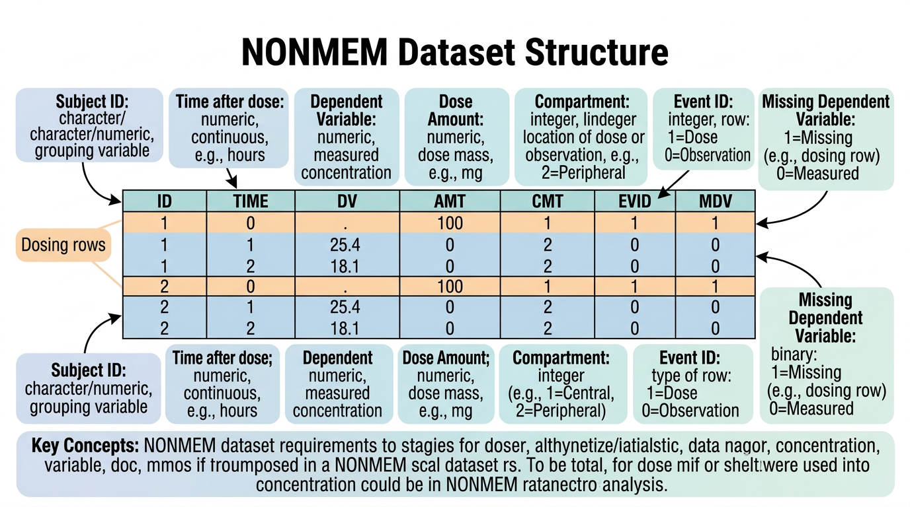
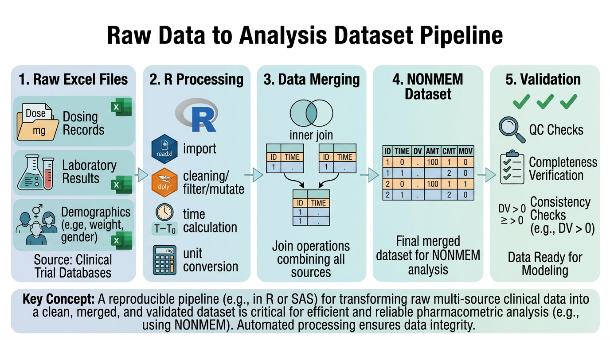
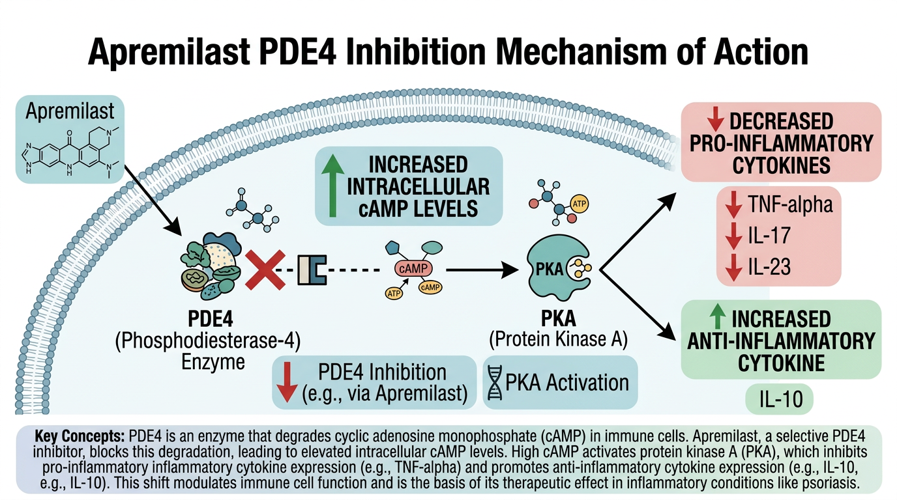

# 원시 데이터에서 분석용 데이터셋 구축 {#sec-building-data}

이 장에서는 임상시험에서 수집된 원시 데이터(raw data)를 약동학 분석에 사용할 수 있는 **분석용 데이터셋(analysis-ready dataset)**으로 변환하는 전 과정을 다룹니다. 특히 비구획분석(NCA)과 집단약동학(Population PK) 모델링에 사용되는 NONMEM 데이터셋 형식을 중심으로 학습합니다.

이 장의 실습 예제에서는 건선 치료에 사용되는 PDE4 억제제 **Apremilast**의 Phase I 임상시험 데이터를 활용합니다.

```{r}
#| eval: false
# 이 장에서 사용하는 패키지
library(tidyverse)    # dplyr, tidyr, stringr, readr 등 포함
library(lubridate)    # 날짜/시간 처리
library(readxl)       # Excel 파일 읽기
library(haven)        # SAS 데이터셋 읽기
```

---

## 임상시험 데이터 구조 {#sec-clinical-data-structure}

### CDISC 표준 개요

임상시험 데이터는 국제적으로 **CDISC(Clinical Data Interchange Standards Consortium)** 표준에 따라 구조화됩니다. 이 표준은 규제기관(FDA, EMA, MFDS 등) 제출용 데이터의 형식을 통일하여 검토 효율성을 높이기 위해 개발되었습니다.

**SDTM (Study Data Tabulation Model)**은 임상시험에서 수집된 원시 데이터를 표준화된 형태로 정리한 것입니다. 주요 도메인(domain)은 다음과 같습니다:

| 도메인 코드 | 도메인 명칭 | 설명 |
|:---:|:---|:---|
| DM | Demographics | 인구통계학 정보 (나이, 성별, 인종, 체중 등) |
| EX | Exposure | 투약 정보 (투약 시간, 용량, 경로 등) |
| PC | Pharmacokinetics Concentrations | 약물 농도 데이터 |
| PP | Pharmacokinetics Parameters | NCA 파라미터 결과 |
| LB | Laboratory Test Results | 임상 검사 결과 |
| AE | Adverse Events | 이상반응 |
| VS | Vital Signs | 활력징후 |

**ADaM (Analysis Data Model)**은 SDTM 데이터를 기반으로 통계 분석에 직접 사용할 수 있도록 가공한 데이터셋입니다. PK 분석에 자주 사용되는 ADaM 데이터셋은 다음과 같습니다:

- **ADSL**: Subject-Level Analysis Dataset (대상자 수준 요약)
- **ADPC**: Pharmacokinetic Concentration Analysis Dataset (농도 데이터)
- **ADPP**: Pharmacokinetic Parameter Analysis Dataset (파라미터 데이터)
- **ADNCA**: NCA Analysis Dataset

:::{.callout-note}
## 실무에서의 데이터 형태

실제 임상시험에서 여러분이 받게 되는 데이터는 CDISC 표준 형식이 아닌 경우가 많습니다. 특히 연구자 주도 임상시험(Investigator-Initiated Trial, IIT)에서는 Excel 파일이나 CSV 파일로 데이터가 제공되는 경우가 흔합니다. 이 장에서는 이러한 비표준 형식의 원시 데이터를 분석용 데이터셋으로 변환하는 과정을 중점적으로 다룹니다.
:::

### SDTM 도메인 간 관계

PK 분석을 위해서는 여러 SDTM 도메인의 데이터를 결합해야 합니다. 기본적으로 다음 세 가지 도메인이 핵심입니다:

1. **DM (Demographics)**: 대상자의 기본 정보 — ID, 나이, 성별, 체중, 인종
2. **EX (Exposure)**: 투약 기록 — 투약 시간, 용량, 투여 경로
3. **PC (Pharmacokinetics Concentrations)**: 채혈 및 농도 측정 — 채혈 시간, 약물 농도

```{r}
#| eval: false
# SDTM 스타일 데이터 예시: DM 도메인
dm <- tibble(
  USUBJID  = paste0("APR-", sprintf("%03d", 1:12)),
  AGE      = c(28, 35, 42, 31, 55, 38, 47, 29, 33, 40, 36, 51),
  SEX      = rep(c("M", "F"), 6),
  RACE     = c(rep("ASIAN", 8), rep("WHITE", 4)),
  WEIGHT   = c(68, 55, 78, 62, 82, 58, 71, 64, 75, 67, 59, 85),
  HEIGHT   = c(172, 160, 178, 165, 175, 158, 180, 168, 176, 170, 163, 182),
  ARMCD    = rep(c("APR10", "APR20", "APR30"), each = 4)
)

dm
```

```{r}
#| eval: false
# SDTM 스타일 데이터 예시: EX 도메인
ex <- tibble(
  USUBJID   = paste0("APR-", sprintf("%03d", 1:12)),
  EXSTDTC   = "2024-03-15T08:00",
  EXENDTC   = "2024-03-15T08:00",
  EXDOSE    = rep(c(10, 20, 30), each = 4),
  EXDOSU    = "mg",
  EXROUTE   = "ORAL",
  EXDOSFRM  = "TABLET"
)

ex
```

---

## NONMEM 데이터셋 형식 이해 {#sec-nonmem-format}

{#fig-ch07-1 width=100%}

### NONMEM이란

**NONMEM(NONlinear Mixed Effects Modeling)**은 집단약동학(Population PK) 모델링에 가장 널리 사용되는 소프트웨어입니다. 비선형 혼합효과 모형(nonlinear mixed-effects model)을 통해 개인 간 변동(inter-individual variability)과 개인 내 변동(intra-individual variability)을 동시에 추정할 수 있습니다.

NONMEM 분석을 위해서는 특정 형식의 데이터셋이 필요하며, 이 형식은 NCA 분석에도 광범위하게 활용됩니다. 따라서 NONMEM 데이터셋 형식을 이해하는 것은 PK 데이터 분석의 기본입니다.

### 필수 컬럼 (Required Columns)

NONMEM 데이터셋의 필수 컬럼은 다음과 같습니다:

| 컬럼명 | 설명 | 값의 범위/예시 |
|:---:|:---|:---|
| **ID** | 대상자 식별 번호 | 1, 2, 3, ... (양의 정수) |
| **TIME** | 시간 (보통 첫 투약 기준 상대시간, 단위: hour) | 0, 0.5, 1, 2, 4, ... |
| **DV** | 종속변수 (Dependent Variable): 약물 농도 | ng/mL 단위의 농도값 |
| **AMT** | 투약량 (Amount): 투여된 약물의 양 | mg 단위의 투여량 |
| **CMT** | 구획 번호 (Compartment): 어느 구획에 대한 레코드인지 | 1 (투약), 2 (관측) 등 |
| **EVID** | 이벤트 식별 번호 (Event ID) | 0, 1, 2, 3, 4 |
| **MDV** | 누락 종속변수 (Missing Dependent Variable) | 0 또는 1 |

:::{.callout-important}
## EVID와 MDV의 관계

EVID와 MDV는 NONMEM 데이터셋에서 가장 혼동하기 쉬운 컬럼입니다. 핵심 규칙은 다음과 같습니다:

- **투약 이벤트** (EVID=1): AMT에 투여량 기입, DV는 보통 0 또는 빈값, **MDV=1** (종속변수 없음)
- **관측 이벤트** (EVID=0): AMT=0 또는 빈값, DV에 농도값 기입, **MDV=0** (종속변수 있음)
- MDV=1이면 NONMEM은 해당 행의 DV를 무시합니다
- BLQ 관측값의 처리에 따라 MDV 값이 달라질 수 있습니다
:::

### EVID 코드 상세 설명

EVID(Event ID)는 각 레코드가 어떤 종류의 이벤트인지를 나타냅니다:

**EVID = 0: 관측 이벤트 (Observation Event)**

가장 기본적인 이벤트 유형입니다. 약물 농도를 측정한 채혈 시점의 기록입니다.

```
ID  TIME  DV      AMT  EVID  MDV
1   0.5   125.3   0    0     0
1   1.0   310.8   0    0     0
1   2.0   485.2   0    0     0
```

**EVID = 1: 투약 이벤트 (Dosing Event)**

약물이 투여된 시점의 기록입니다. AMT에 투여량이 기입됩니다.

```
ID  TIME  DV  AMT   EVID  MDV
1   0     0   30    1     1
```

**EVID = 2: 기타 이벤트 (Other-Type Event)**

모델에서 특별한 처리가 필요한 이벤트입니다. 예를 들어, 특정 시점에서 구획의 양을 리셋하지 않고 모델의 상태를 확인하고 싶을 때 사용합니다.

**EVID = 3: 리셋 이벤트 (Reset Event)**

모든 구획의 약물량을 0으로 리셋합니다. 장기간 워시아웃(washout) 후 새로운 투약을 시작할 때 유용합니다.

**EVID = 4: 리셋 + 투약 이벤트 (Reset and Dose Event)**

EVID=3과 EVID=1을 동시에 수행합니다. 모든 구획을 리셋한 후 새로 투약합니다.

```{r}
#| eval: false
# EVID 유형별 레코드 예시
evid_examples <- tibble(
  ID   = c(1, 1, 1, 1, 1, 1, 1, 1, 1),
  TIME = c(0, 0.5, 1, 2, 4, 168, 168, 168.5, 169),
  DV   = c(0, 125, 310, 485, 280, 0, 0, 95, 250),
  AMT  = c(30, 0, 0, 0, 0, 0, 30, 0, 0),
  EVID = c(1, 0, 0, 0, 0, 3, 1, 0, 0),
  MDV  = c(1, 0, 0, 0, 0, 1, 1, 0, 0)
)

# EVID=3 (TIME=168): 워시아웃 후 리셋
# EVID=1 (TIME=168): 재투약
evid_examples
```

### 추가 컬럼 (Additional Columns)

기본 컬럼 외에 다양한 추가 컬럼이 사용됩니다:

| 컬럼명 | 설명 | 용도 |
|:---:|:---|:---|
| **RATE** | 주입 속도 (mg/h) | 정맥 주입(IV infusion) 시 사용 |
| **SS** | 정상상태 (Steady-State) 플래그 | SS=1이면 정상상태 도달 가정 |
| **II** | 투약 간격 (Interdose Interval, h) | 반복 투약의 간격 |
| **ADDL** | 추가 투약 횟수 (Additional Doses) | II와 함께 반복 투약 기록 |
| **BLQ** | 정량한계 미만 플래그 | BLQ=1이면 정량한계 미만 |
| **TAD** | 투약 후 경과 시간 (Time After Dose) | 반복 투약 시 유용 |
| **WT** | 체중 (kg) | 공변량(covariate) |
| **AGE** | 나이 (years) | 공변량 |
| **SEX** | 성별 | 공변량 (0=남, 1=여 등) |
| **DOSE** | 투약 용량 (mg) | 용량군 식별 |

:::{.callout-tip}
## SS, II, ADDL의 활용

반복 투약(multiple dosing)을 기록할 때, 매 투약 시점을 모두 개별 행으로 기록하는 것은 비효율적입니다. 예를 들어, Apremilast 30mg을 1일 2회, 28일간 투약하면 총 56회의 투약 기록이 필요합니다. 이를 SS, II, ADDL로 간단히 표현할 수 있습니다:

```
ID  TIME  AMT  EVID  SS  II  ADDL
1   0     30   1     0   12  55
```

이 한 줄은 "TIME=0에 30mg을 투약하고, 12시간 간격으로 55회 추가 투약"을 의미합니다.

정상상태에 도달한 후의 데이터만 분석할 경우:

```
ID  TIME  AMT  EVID  SS  II
1   0     30   1     1   12
```

SS=1은 "이 투약 시점에서 이미 정상상태에 도달한 것으로 가정"함을 의미합니다.
:::

### 투약 이벤트 vs 관측 이벤트

NONMEM 데이터셋의 각 행은 **투약 이벤트(dosing event)** 또는 **관측 이벤트(observation event)** 중 하나입니다. 이 두 유형의 이벤트를 정확히 구분하는 것이 데이터셋 구축의 핵심입니다.

```{r}
#| eval: false
# 완성된 NONMEM 데이터셋 예시 (대상자 1명)
nonmem_example <- tibble(
  ID   = 1,
  TIME = c(0, 0.5, 1, 2, 4, 6, 8, 12, 24),
  DV   = c(0, 125.3, 310.8, 485.2, 380.1, 220.5, 145.8, 62.3, 10.2),
  AMT  = c(30, 0, 0, 0, 0, 0, 0, 0, 0),
  CMT  = c(1, 2, 2, 2, 2, 2, 2, 2, 2),
  EVID = c(1, 0, 0, 0, 0, 0, 0, 0, 0),
  MDV  = c(1, 0, 0, 0, 0, 0, 0, 0, 0),
  DOSE = 30,
  WT   = 68,
  AGE  = 28,
  SEX  = 0     # 0 = Male
)

nonmem_example
```

---

## 시간 변수 처리 {#sec-time-variables}

### 절대시간 vs 상대시간

임상시험에서 시간은 두 가지 형태로 기록됩니다:

1. **절대시간(Absolute Time)**: 실제 날짜와 시각 (예: "2024-03-15 08:30:00")
2. **상대시간(Relative Time)**: 기준 시점으로부터의 경과 시간 (예: 0.5시간)

NONMEM 데이터셋에서는 상대시간을 사용합니다. 기준 시점(TIME=0)은 보통 **첫 투약 시점**으로 설정합니다.

### 절대시간에서 상대시간 계산

```{r}
#| eval: false
# 절대시간 데이터 예시
pk_raw <- tibble(
  USUBJID = rep("APR-001", 9),
  DATETIME = ymd_hm(c(
    "2024-03-15 08:00",   # 투약 시점
    "2024-03-15 08:30",   # 0.5h
    "2024-03-15 09:00",   # 1h
    "2024-03-15 10:00",   # 2h
    "2024-03-15 12:00",   # 4h
    "2024-03-15 14:00",   # 6h
    "2024-03-15 16:00",   # 8h
    "2024-03-15 20:00",   # 12h
    "2024-03-16 08:00"    # 24h
  )),
  EVENT = c("DOSE", rep("SAMPLE", 8)),
  CONC  = c(NA, 125.3, 310.8, 485.2, 380.1, 220.5, 145.8, 62.3, 10.2)
)

# 상대시간 계산
pk_raw <- pk_raw |>
  mutate(
    # 첫 투약 시점을 기준으로 상대시간 계산
    first_dose_time = min(DATETIME[EVENT == "DOSE"]),
    TIME = as.numeric(difftime(DATETIME, first_dose_time, units = "hours"))
  )

pk_raw |> select(USUBJID, DATETIME, EVENT, CONC, TIME)
```

### TAD (Time After Dose) 계산

반복 투약 시험에서는 **TIME**(첫 투약 후 절대 경과 시간)과 함께 **TAD**(가장 최근 투약 후 경과 시간)가 필요합니다. TAD는 여러 투약 주기의 농도-시간 프로파일을 중첩하여 비교할 때 유용합니다.

```{r}
#| eval: false
# 반복 투약 데이터에서 TAD 계산
pk_multiple_dose <- tibble(
  ID   = 1,
  TIME = c(0, 0.5, 1, 2, 4, 12, 12.5, 13, 14, 16, 24, 24.5, 25, 26, 28),
  EVID = c(1, 0, 0, 0, 0, 1, 0, 0, 0, 0, 1, 0, 0, 0, 0),
  AMT  = c(30, 0, 0, 0, 0, 30, 0, 0, 0, 0, 30, 0, 0, 0, 0),
  DV   = c(0, 125, 310, 485, 380, 0, 130, 325, 490, 385, 0, 128, 318, 480, 375)
)

# TAD 계산 함수
calculate_tad <- function(data) {
  data |>
    mutate(
      # 투약 시점의 TIME을 기록
      dose_time = if_else(EVID == 1, TIME, NA_real_)
    ) |>
    # 아래로 채우기 (fill down)
    fill(dose_time, .direction = "down") |>
    mutate(
      TAD = TIME - dose_time
    )
}

pk_with_tad <- calculate_tad(pk_multiple_dose)
pk_with_tad |> select(ID, TIME, EVID, DV, TAD)
```

:::{.callout-warning}
## 시간 계산 시 주의사항

시간 변수를 다룰 때 다음 사항에 주의해야 합니다:

1. **시간대(Time Zone)**: 다기관 임상시험에서는 각 기관의 시간대가 다를 수 있습니다. 모든 시간을 하나의 시간대(보통 UTC)로 통일해야 합니다.
2. **일광절약시간(DST)**: 일광절약시간 전환 시 1시간의 차이가 발생할 수 있습니다. `lubridate`의 `force_tz()` 함수를 활용하세요.
3. **자정 전후**: 채혈이 자정을 넘어가는 경우, 날짜가 바뀌는 것을 정확히 반영해야 합니다.
4. **소수점 정밀도**: 시간을 분(minute)으로 기록한 후 시간(hour)으로 변환할 때, 소수점 이하 자릿수에 주의하세요.
:::

### 날짜/시간 파싱과 변환

```{r}
#| eval: false
# 다양한 날짜/시간 형식 파싱
time_formats <- tibble(
  format_type = c("ISO 8601", "한국식", "미국식", "시간만"),
  raw_string  = c("2024-03-15T08:30:00", "2024년 3월 15일 08시 30분",
                   "03/15/2024 8:30 AM", "08:30"),
  parsed = c(
    ymd_hms("2024-03-15T08:30:00"),
    ymd_hm("2024-03-15 08:30"),           # parse_date_time 사용 가능
    mdy_hm("03/15/2024 8:30"),
    NA  # 날짜 정보 없이 시간만으로는 절대시간 계산 불가

  )
)

# 실제 임상시험 데이터에서 흔히 보는 형식
clinical_times <- c("15MAR2024:08:30:00", "15MAR2024:09:00:00")
parsed_times <- dmy_hms(clinical_times)
parsed_times

# 상대시간(시간 단위) 계산
relative_hours <- as.numeric(difftime(parsed_times, parsed_times[1], units = "hours"))
relative_hours
```

---

## BLQ 처리 {#sec-blq-handling}

### BLQ란 무엇인가

**BLQ(Below the Limit of Quantification)**는 약물 농도가 분석법의 **정량한계(LLOQ, Lower Limit of Quantification)** 미만인 관측값을 의미합니다. 약물 투여 후 충분한 시간이 경과하면 혈중 농도가 LLOQ 아래로 떨어지게 됩니다. 이러한 BLQ 데이터를 어떻게 처리하느냐에 따라 PK 파라미터 추정 결과가 달라질 수 있습니다.

예를 들어, Apremilast의 LLOQ가 1 ng/mL이라면, 1 ng/mL 미만의 측정값은 정확한 정량이 불가능하며 "BLQ"로 기록됩니다.

### M1~M7 방법 상세 비교

BLQ 데이터 처리에는 여러 방법이 제안되어 있으며, 각각의 장단점이 있습니다:

| 방법 | 처리 방식 | 장점 | 단점 | 적용 상황 |
|:---:|:---|:---|:---|:---|
| **M1** | BLQ를 0으로 대체 | 단순, 보수적 | AUC 과소 추정 가능 | NCA에서 흔히 사용 |
| **M2** | BLQ를 LLOQ/2로 대체 | 단순, M1보다 현실적 | 통계적 근거 약함 | 탐색적 분석 |
| **M3** | BLQ를 결측으로 처리하고, 모델에서 좌측 절단(left censoring)으로 다룸 | 통계적으로 가장 적절 | 구현 복잡 | Population PK 모델링 |
| **M4** | BLQ를 LLOQ/2로 대체 (첫 BLQ만), 이후는 결측 | M2와 M7의 절충 | 규칙이 자의적 | 드물게 사용 |
| **M5** | BLQ를 결측으로 처리 (단순 제거) | 가장 단순 | 정보 손실, 편향 가능 | NCA에서 말기 BLQ |
| **M6** | BLQ를 LLOQ로 대체 | 보수적 | AUC 과대 추정 | 드물게 사용 |
| **M7** | 투약 전 BLQ는 0, 내삽(embedded) BLQ는 LLOQ/2, 말기 BLQ는 결측 | 시점별 맞춤 처리 | 규칙 복잡 | NCA에서 권장 |

:::{.callout-tip}
## NCA에서의 BLQ 처리 권장 사항

비구획분석(NCA)에서는 **M1** 또는 **M7** 방법이 가장 흔히 사용됩니다. FDA 가이던스에서는 일반적으로 다음을 권장합니다:

- **투약 전(pre-dose) BLQ**: 0으로 대체
- **두 정량 가능한 값 사이의 BLQ (embedded BLQ)**: LLOQ/2로 대체 또는 결측 처리
- **마지막 정량 가능 농도 이후의 BLQ (terminal BLQ)**: 결측으로 처리 (분석에서 제외)

이는 M7 방법과 유사합니다. 집단약동학 모델링에서는 **M3** 방법이 통계적으로 가장 적절합니다.
:::

### R에서 BLQ 처리 구현

```{r}
#| eval: false
# BLQ가 포함된 데이터 예시
pk_with_blq <- tibble(
  ID   = 1,
  TIME = c(0, 0.5, 1, 2, 4, 6, 8, 12, 24, 36, 48),
  CONC_RAW = c(NA, 125.3, 310.8, 485.2, 380.1, 220.5, 145.8, 62.3, 10.2, NA, NA),
  BLQ_FLAG = c(1, 0, 0, 0, 0, 0, 0, 0, 0, 1, 1),    # 1 = BLQ
  LLOQ = 1.0  # ng/mL
)

# M1: BLQ → 0
pk_m1 <- pk_with_blq |>
  mutate(DV = if_else(BLQ_FLAG == 1, 0, CONC_RAW))

# M2: BLQ → LLOQ/2
pk_m2 <- pk_with_blq |>
  mutate(DV = if_else(BLQ_FLAG == 1, LLOQ / 2, CONC_RAW))

# M5: BLQ → NA (결측)
pk_m5 <- pk_with_blq |>
  mutate(DV = if_else(BLQ_FLAG == 1, NA_real_, CONC_RAW))

# M7: 시점별 맞춤 처리
pk_m7 <- pk_with_blq |>
  mutate(
    # BLQ 유형 분류
    blq_type = case_when(
      BLQ_FLAG == 0 ~ "quantifiable",
      TIME == 0 ~ "pre_dose",          # 투약 전 BLQ
      # embedded BLQ: 이전과 이후 모두 정량 가능한 값이 있는 BLQ
      BLQ_FLAG == 1 & lead(BLQ_FLAG, default = 1) == 0 ~ "embedded",
      BLQ_FLAG == 1 ~ "terminal"        # 말기 BLQ
    ),
    DV = case_when(
      blq_type == "quantifiable" ~ CONC_RAW,
      blq_type == "pre_dose"     ~ 0,
      blq_type == "embedded"     ~ LLOQ / 2,
      blq_type == "terminal"     ~ NA_real_
    )
  )

pk_m7 |> select(TIME, CONC_RAW, BLQ_FLAG, blq_type, DV)
```

```{r}
#| eval: false
# BLQ 처리 방법에 따른 AUC 비교
compare_blq_methods <- function(pk_data) {
  methods <- list(
    M1 = pk_data |> mutate(DV = if_else(BLQ_FLAG == 1, 0, CONC_RAW)),
    M2 = pk_data |> mutate(DV = if_else(BLQ_FLAG == 1, LLOQ / 2, CONC_RAW)),
    M5 = pk_data |> mutate(DV = if_else(BLQ_FLAG == 1, NA_real_, CONC_RAW)),
    M6 = pk_data |> mutate(DV = if_else(BLQ_FLAG == 1, LLOQ, CONC_RAW))
  )

  # 간이 AUC 계산 (trapezoidal rule)
  calc_auc <- function(df) {
    df_clean <- df |> filter(!is.na(DV))
    if (nrow(df_clean) < 2) return(NA_real_)
    sum(diff(df_clean$TIME) * (head(df_clean$DV, -1) + tail(df_clean$DV, -1)) / 2)
  }

  tibble(
    Method = names(methods),
    AUC    = map_dbl(methods, calc_auc)
  )
}

compare_blq_methods(pk_with_blq)
```

---

## R 실습: Apremilast Phase I 데이터셋 구축 {#sec-apremilast-practice}

{#fig-ch07-2 width=100%}

이 절에서는 Apremilast Phase I SAD(Single Ascending Dose) 시험의 원시 데이터를 NONMEM 형식의 분석용 데이터셋으로 변환하는 전체 과정을 실습합니다.

### 시험 설계 개요

- **시험명**: Apremilast Phase I SAD Study
- **대상**: 건강한 성인 남녀 자원자 12명
- **용량군**: 10mg, 20mg, 30mg (각 4명)
- **투여 경로**: 경구 (PO)
- **채혈 시점**: 투약 전(0h), 0.5h, 1h, 2h, 4h, 6h, 8h, 12h, 24h, 36h, 48h
- **분석법 LLOQ**: 1.0 ng/mL

### Step 1: 원시 데이터 읽기

```{r}
#| eval: false
# 실제 임상시험에서는 Excel 파일로 데이터가 제공되는 경우가 많습니다
# 여기서는 R에서 직접 원시 데이터를 생성합니다

# --- 인구통계 데이터 ---
demo_raw <- tibble(
  Subject_ID = paste0("APR-", sprintf("%03d", 1:12)),
  Age        = c(28, 35, 42, 31, 55, 38, 47, 29, 33, 40, 36, 51),
  Sex        = c("M", "F", "M", "F", "M", "F", "M", "F", "M", "F", "M", "F"),
  Weight_kg  = c(68, 55, 78, 62, 82, 58, 71, 64, 75, 67, 59, 85),
  Height_cm  = c(172, 160, 178, 165, 175, 158, 180, 168, 176, 170, 163, 182),
  Race       = c(rep("Asian", 8), rep("White", 4)),
  Dose_Group = rep(c("10mg", "20mg", "30mg"), each = 4)
)

# --- 투약 데이터 ---
dosing_raw <- tibble(
  Subject_ID   = paste0("APR-", sprintf("%03d", 1:12)),
  Dose_mg      = rep(c(10, 20, 30), each = 4),
  Dose_Date    = rep("2024-03-15", 12),
  Dose_Time    = rep("08:00", 12),
  Route        = rep("PO", 12),
  Formulation  = rep("Tablet", 12)
)

# --- 채혈/농도 데이터 ---
set.seed(42)  # 재현성을 위한 시드 설정

# 시간 포인트
time_points <- c(0, 0.5, 1, 2, 4, 6, 8, 12, 24, 36, 48)
n_subjects <- 12
n_times <- length(time_points)

# 각 용량군별 전형적인 PK 프로파일 생성 (1-구획 모형 기반)
generate_pk_profile <- function(dose, ka = 1.5, ke = 0.12, V = 80, F_oral = 0.73) {
  Cmax_approx <- dose * 1000 * F_oral / V  # 대략적인 Cmax (ng/mL)
  tmax <- log(ka / ke) / (ka - ke)
  conc <- (dose * 1000 * F_oral * ka / (V * (ka - ke))) *
          (exp(-ke * time_points) - exp(-ka * time_points))
  conc <- pmax(conc, 0)  # 음수 방지
  return(conc)
}

# 개인 간 변동 추가
conc_data <- expand_grid(
  Subject_ID = paste0("APR-", sprintf("%03d", 1:12)),
  TIME_hr = time_points
) |>
  left_join(dosing_raw |> select(Subject_ID, Dose_mg), by = "Subject_ID") |>
  group_by(Subject_ID) |>
  mutate(
    # 개인별 PK 파라미터에 변동 추가
    eta_ka = rnorm(1, 0, 0.3),
    eta_V  = rnorm(1, 0, 0.2),
    eta_ke = rnorm(1, 0, 0.15),
    ka_i = 1.5 * exp(eta_ka),
    V_i  = 80 * exp(eta_V),
    ke_i = 0.12 * exp(eta_ke),
    # 농도 계산
    CONC_true = (Dose_mg * 1000 * 0.73 * ka_i / (V_i * (ka_i - ke_i))) *
                (exp(-ke_i * TIME_hr) - exp(-ka_i * TIME_hr)),
    CONC_true = pmax(CONC_true, 0),
    # 잔차 변동 (비례 + 가산)
    epsilon = rnorm(n(), 0, 1),
    CONC_obs = CONC_true * (1 + 0.1 * epsilon) + 0.5 * abs(epsilon),
    CONC_obs = pmax(CONC_obs, 0),
    CONC_obs = round(CONC_obs, 1)
  ) |>
  ungroup()

conc_raw <- conc_data |>
  select(Subject_ID, TIME_hr, Dose_mg, CONC_obs) |>
  # BLQ 처리: LLOQ 미만은 "BLQ"로 표시
  mutate(
    LLOQ = 1.0,
    CONC_char = if_else(CONC_obs < LLOQ, "BLQ", as.character(CONC_obs))
  )

conc_raw
```

### Step 2: 데이터 검토 및 품질 확인

```{r}
#| eval: false
# 데이터 요약
cat("=== 인구통계 데이터 요약 ===\n")
demo_raw |>
  group_by(Dose_Group) |>
  summarise(
    N = n(),
    Age_mean = mean(Age),
    Age_sd   = sd(Age),
    Weight_mean = mean(Weight_kg),
    Weight_sd   = sd(Weight_kg),
    Male_n = sum(Sex == "M"),
    .groups = "drop"
  )

cat("\n=== 농도 데이터 요약 ===\n")
conc_raw |>
  group_by(Dose_mg) |>
  summarise(
    N_obs = n(),
    N_BLQ = sum(CONC_char == "BLQ"),
    BLQ_pct = round(100 * N_BLQ / N_obs, 1),
    .groups = "drop"
  )

cat("\n=== 시점별 BLQ 현황 ===\n")
conc_raw |>
  group_by(TIME_hr) |>
  summarise(
    N_total = n(),
    N_BLQ = sum(CONC_char == "BLQ"),
    .groups = "drop"
  )
```

:::{.callout-note}
## 품질 확인(QC) 체크리스트

데이터셋 구축 전에 반드시 다음을 확인하세요:

1. 대상자 수가 프로토콜과 일치하는가?
2. 각 대상자의 채혈 시점 수가 올바른가?
3. 투약 용량이 프로토콜과 일치하는가?
4. 농도값의 단위가 일관적인가?
5. 결측값(missing data)이 있는가? 그 이유는 무엇인가?
6. BLQ의 비율이 예상 범위 내인가?
7. 이상값(outlier)이 있는가?
:::

### Step 3: 투약 레코드 생성

```{r}
#| eval: false
# 투약 레코드 (Dosing Records): EVID = 1, MDV = 1
dosing_records <- dosing_raw |>
  mutate(
    ID   = as.numeric(str_extract(Subject_ID, "\\d+$")),
    TIME = 0,       # 모든 대상자가 TIME=0에 투약
    DV   = 0,       # 투약 이벤트에는 DV 없음
    AMT  = Dose_mg,
    CMT  = 1,       # 구획 1 (투약 구획, 보통 위장관)
    EVID = 1,       # 투약 이벤트
    MDV  = 1,       # Missing DV (투약이므로)
    DOSE = Dose_mg,
    BLQ  = 0
  ) |>
  select(ID, TIME, DV, AMT, CMT, EVID, MDV, DOSE, BLQ)

dosing_records
```

### Step 4: 관측 레코드 생성

```{r}
#| eval: false
# 관측 레코드 (Observation Records): EVID = 0, MDV = 0
observation_records <- conc_raw |>
  mutate(
    ID   = as.numeric(str_extract(Subject_ID, "\\d+$")),
    TIME = TIME_hr,
    # BLQ 처리: M7 방법 적용
    is_blq = (CONC_char == "BLQ"),
    CONC_numeric = if_else(is_blq, NA_real_, as.numeric(CONC_char))
  ) |>
  # M7 방법: 시점별 BLQ 처리
  group_by(ID) |>
  mutate(
    # 이전의 마지막 정량 가능 시점 찾기
    last_quant_time = if_else(
      !is_blq,
      TIME,
      NA_real_
    ),
    blq_type = case_when(
      !is_blq ~ "quantifiable",
      TIME == 0 ~ "pre_dose",
      # 간단한 분류: 이후에 정량 가능한 값이 있으면 embedded
      is_blq & any(TIME > cur_data()$TIME[cur_data()$CONC_char != "BLQ"] &
                    !is_blq) ~ "embedded",
      TRUE ~ "terminal"
    )
  ) |>
  ungroup()

# DV 값 결정 (M7)
observation_records <- observation_records |>
  mutate(
    DV = case_when(
      !is_blq          ~ CONC_numeric,
      blq_type == "pre_dose"  ~ 0,
      blq_type == "embedded"  ~ LLOQ / 2,
      blq_type == "terminal"  ~ NA_real_,
      TRUE ~ NA_real_
    ),
    AMT  = 0,
    CMT  = 2,       # 구획 2 (관측 구획, 보통 혈장)
    EVID = 0,       # 관측 이벤트
    MDV  = if_else(is.na(DV), 1, 0),  # DV가 없으면 MDV=1
    DOSE = Dose_mg,
    BLQ  = as.integer(is_blq)
  ) |>
  filter(!is.na(DV)) |>  # terminal BLQ 제거
  select(ID, TIME, DV, AMT, CMT, EVID, MDV, DOSE, BLQ)

observation_records
```

### Step 5: 데이터 병합 및 정렬

```{r}
#| eval: false
# 투약 레코드와 관측 레코드 병합
nonmem_dataset <- bind_rows(
  dosing_records,
  observation_records
) |>
  arrange(ID, TIME, desc(EVID)) |>  # ID → TIME → EVID 순 정렬 (투약이 관측보다 먼저)
  # 공변량 추가
  left_join(
    demo_raw |>
      mutate(ID = as.numeric(str_extract(Subject_ID, "\\d+$"))) |>
      select(ID, AGE = Age, SEX_char = Sex, WT = Weight_kg, HT = Height_cm, RACE = Race),
    by = "ID"
  ) |>
  mutate(
    # SEX를 숫자로 변환 (NONMEM에서는 숫자 사용)
    SEX = if_else(SEX_char == "M", 0, 1),
    # BMI 계산
    BMI = round(WT / (HT / 100)^2, 1),
    # BSA 계산 (DuBois formula)
    BSA = round(0.007184 * WT^0.425 * HT^0.725, 2)
  ) |>
  select(ID, TIME, DV, AMT, CMT, EVID, MDV, DOSE, BLQ, AGE, SEX, WT, HT, BMI, BSA)

nonmem_dataset
```

:::{.callout-important}
## 정렬 순서의 중요성

`arrange(ID, TIME, desc(EVID))`에서 `desc(EVID)`가 중요합니다. 같은 시점(TIME)에 투약과 관측이 모두 있을 때(예: TIME=0에서 투약 전 채혈 후 투약), **투약 이벤트(EVID=1)가 관측 이벤트(EVID=0)보다 먼저** 와야 합니다. NONMEM은 데이터를 위에서 아래로 순차적으로 처리하므로, 투약이 먼저 나와야 올바른 모델 예측이 가능합니다.

단, 투약 전(pre-dose) 채혈의 경우 관측이 투약보다 먼저 와야 할 수도 있습니다. 이 경우 TIME을 약간 앞당기거나(예: -0.01) 별도의 정렬 키를 사용합니다.
:::

### Step 6: 데이터 검증

```{r}
#| eval: false
# 데이터셋 검증 함수
validate_nonmem_dataset <- function(data) {
  errors <- character(0)
  warnings <- character(0)

  # 1. 필수 컬럼 존재 확인
  required_cols <- c("ID", "TIME", "DV", "AMT", "CMT", "EVID", "MDV")
  missing_cols <- setdiff(required_cols, names(data))
  if (length(missing_cols) > 0) {
    errors <- c(errors, paste("필수 컬럼 누락:", paste(missing_cols, collapse = ", ")))
  }

  # 2. EVID=1인 행에 AMT > 0 확인
  dose_no_amt <- data |> filter(EVID == 1, AMT <= 0 | is.na(AMT))
  if (nrow(dose_no_amt) > 0) {
    errors <- c(errors, paste("EVID=1인데 AMT가 0 이하인 행:", nrow(dose_no_amt), "개"))
  }

  # 3. EVID=0인 행에 MDV=0이고 DV가 유효한지 확인
  obs_no_dv <- data |> filter(EVID == 0, MDV == 0, is.na(DV))
  if (nrow(obs_no_dv) > 0) {
    errors <- c(errors, paste("EVID=0, MDV=0인데 DV가 NA인 행:", nrow(obs_no_dv), "개"))
  }

  # 4. EVID=1인 행에 MDV=1 확인
  dose_mdv0 <- data |> filter(EVID == 1, MDV != 1)
  if (nrow(dose_mdv0) > 0) {
    warnings <- c(warnings, paste("EVID=1인데 MDV≠1인 행:", nrow(dose_mdv0), "개"))
  }

  # 5. 음수 시간 확인
  neg_time <- data |> filter(TIME < 0)
  if (nrow(neg_time) > 0) {
    warnings <- c(warnings, paste("음수 TIME 값:", nrow(neg_time), "개"))
  }

  # 6. 각 대상자별 투약 레코드 존재 확인
  ids_no_dose <- data |>
    group_by(ID) |>
    summarise(has_dose = any(EVID == 1), .groups = "drop") |>
    filter(!has_dose)
  if (nrow(ids_no_dose) > 0) {
    errors <- c(errors, paste("투약 레코드 없는 대상자:", paste(ids_no_dose$ID, collapse = ", ")))
  }

  # 7. ID별 TIME 정렬 확인
  unsorted <- data |>
    group_by(ID) |>
    mutate(time_sorted = TIME == cummax(TIME)) |>
    filter(!time_sorted)
  if (nrow(unsorted) > 0) {
    warnings <- c(warnings, paste("TIME이 정렬되지 않은 행:", nrow(unsorted), "개"))
  }

  # 8. DV에 음수값 확인
  neg_dv <- data |> filter(EVID == 0, MDV == 0, DV < 0)
  if (nrow(neg_dv) > 0) {
    errors <- c(errors, paste("음수 DV 값:", nrow(neg_dv), "개"))
  }

  # 결과 출력
  cat("=== NONMEM 데이터셋 검증 결과 ===\n\n")
  cat("총 행 수:", nrow(data), "\n")
  cat("대상자 수:", n_distinct(data$ID), "\n")
  cat("투약 레코드:", sum(data$EVID == 1), "개\n")
  cat("관측 레코드:", sum(data$EVID == 0), "개\n\n")

  if (length(errors) == 0 & length(warnings) == 0) {
    cat("✓ 모든 검증을 통과했습니다.\n")
  }
  if (length(errors) > 0) {
    cat("오류 (반드시 수정 필요):\n")
    walk(errors, ~cat("  ✗", .x, "\n"))
  }
  if (length(warnings) > 0) {
    cat("\n경고 (확인 필요):\n")
    walk(warnings, ~cat("  !", .x, "\n"))
  }

  invisible(list(errors = errors, warnings = warnings))
}

# 검증 실행
validate_nonmem_dataset(nonmem_dataset)
```

### Step 7: 데이터 요약 통계

```{r}
#| eval: false
# 용량군별 PK 데이터 요약
pk_summary <- nonmem_dataset |>
  filter(EVID == 0, MDV == 0) |>
  group_by(DOSE, TIME) |>
  summarise(
    N    = n(),
    Mean = round(mean(DV), 1),
    SD   = round(sd(DV), 1),
    CV   = round(100 * sd(DV) / mean(DV), 1),
    Min  = round(min(DV), 1),
    Max  = round(max(DV), 1),
    .groups = "drop"
  )

pk_summary

# 시각적 확인: 개인별 농도-시간 곡선
ggplot(nonmem_dataset |> filter(EVID == 0, MDV == 0),
       aes(x = TIME, y = DV, group = ID, color = factor(DOSE))) +
  geom_line(alpha = 0.7) +
  geom_point(size = 2) +
  scale_y_log10() +
  labs(
    x = "Time (hours)",
    y = "Concentration (ng/mL)",
    color = "Dose (mg)",
    title = "Apremilast Phase I SAD: Individual PK Profiles"
  ) +
  theme_bw() +
  facet_wrap(~DOSE, labeller = labeller(DOSE = function(x) paste0(x, " mg")))
```

### Step 8: 파일 내보내기

```{r}
#| eval: false
# CSV 형식으로 내보내기 (NONMEM 호환)
write_csv(
  nonmem_dataset,
  "apremilast_phase1_sad.csv",
  na = "."  # NONMEM에서 결측값은 보통 '.'으로 표시
)

# 고정 너비 형식으로도 내보내기 (일부 NONMEM 버전에서 선호)
# write.table(
#   nonmem_dataset,
#   "apremilast_phase1_sad.dat",
#   quote = FALSE,
#   row.names = FALSE,
#   sep = " ",
#   na = "."
# )

# 내보낸 파일 확인
cat("파일이 저장되었습니다.\n")
cat("행 수:", nrow(nonmem_dataset), "\n")
cat("열 수:", ncol(nonmem_dataset), "\n")
cat("컬럼명:", paste(names(nonmem_dataset), collapse = ", "), "\n")
```

:::{.callout-tip}
## NONMEM 데이터 파일 관례

NONMEM 데이터 파일은 보통 `.csv` 또는 `.dat` 확장자를 사용합니다. 몇 가지 관례:

- 결측값은 `.`(점)으로 표시합니다
- 컬럼명은 대문자를 사용합니다
- 첫 번째 행은 헤더(컬럼명)입니다
- 컬럼 구분자는 쉼표(CSV) 또는 공백(space-delimited)입니다
- 파일명에 날짜 또는 버전을 포함하는 것이 좋습니다 (예: `apremilast_pk_v01_20240315.csv`)
:::

---

## 약리학 노트: Apremilast의 약리학 {#sec-apremilast-pharmacology}

{#fig-ch07-3 width=100%}

### PDE4 억제제의 작용기전

**Apremilast (Otezla®)**는 **phosphodiesterase 4 (PDE4) 억제제**로, 건선(psoriasis)과 건선성 관절염(psoriatic arthritis)의 치료에 사용됩니다.

PDE4는 세포 내 **cyclic adenosine monophosphate (cAMP)**를 분해하는 효소입니다. Apremilast가 PDE4를 억제하면 세포 내 cAMP 농도가 증가하고, 이는 다음과 같은 면역 조절 효과를 나타냅니다:

$$
\text{Apremilast} \xrightarrow{\text{PDE4 억제}} \text{cAMP} \uparrow \xrightarrow{\text{PKA 활성화}} \begin{cases} \text{TNF-}\alpha \downarrow \\ \text{IL-17} \downarrow \\ \text{IL-23} \downarrow \\ \text{IL-10} \uparrow \end{cases}
$$

- **전염증성 사이토카인(pro-inflammatory cytokines) 감소**: TNF-$\alpha$, IL-17, IL-23, IFN-$\gamma$의 생산이 억제됩니다
- **항염증성 사이토카인(anti-inflammatory cytokines) 증가**: IL-10의 생산이 증가합니다
- **T 세포 활성화 억제**: Th1 및 Th17 세포 반응이 조절됩니다

:::{.callout-note}
## PDE4와 다른 PDE 아형의 비교

Phosphodiesterase에는 PDE1~PDE11까지 11개 아형이 있으며, 각각 다른 조직에 분포합니다:

- **PDE3**: 심장, 혈관 평활근 → Milrinone (심부전 치료)
- **PDE4**: 면역세포, 뇌 → Apremilast (건선), Roflumilast (COPD)
- **PDE5**: 혈관 평활근, 해면체 → Sildenafil (발기부전, 폐동맥 고혈압)

PDE4 선택적 억제는 면역세포에 특이적으로 작용하여 전신적 면역억제의 위험을 줄입니다.
:::

### 건선에서의 사용

Apremilast는 중등도-중증 판상 건선(moderate-to-severe plaque psoriasis) 환자에서 전신 치료제 또는 광선치료의 대상이 되는 경우에 사용됩니다.

**용량 적정 스케줄 (Titration Schedule)**:

위장관 부작용(오심, 설사)을 줄이기 위해 다음과 같은 점진적 증량 스케줄을 사용합니다:

| Day | 아침 | 저녁 |
|:---:|:---:|:---:|
| 1 | 10mg | - |
| 2 | 10mg | 10mg |
| 3 | 10mg | 20mg |
| 4 | 20mg | 20mg |
| 5 | 20mg | 30mg |
| 6 이후 | 30mg | 30mg |

유지 용량은 **30mg BID (1일 2회)**입니다.

### PK 특성

Apremilast의 주요 약동학 파라미터는 다음과 같습니다:

| 파라미터 | 값 | 비고 |
|:---|:---:|:---|
| 경구 생체이용률 (F) | ~73% | 절대 생체이용률 |
| T~max~ | 2-3시간 | 공복 시 |
| 단백결합률 | ~68% | Albumin 결합 |
| V~d~ | ~87 L | 겉보기 분포용적 |
| 대사 | CYP3A4 (주), CYP1A2, CYP2A6 | 산화적 대사 후 글루쿠론산 포합 |
| 반감기 (t~1/2~) | 6-9시간 | 건강인 기준 |
| CL/F | ~10 L/h | 겉보기 청소율 |
| 배설 | 소변 58%, 대변 39% | 대사체로 주로 배설 |

:::{.callout-warning}
## CYP3A4 상호작용

Apremilast는 CYP3A4에 의해 대사되므로, 강력한 CYP3A4 유도제(Rifampicin, Phenobarbital, Carbamazepine, Phenytoin 등)와 병용 시 Apremilast의 혈중 농도가 크게 감소하여 효과가 떨어질 수 있습니다. Rifampicin 병용 시 Apremilast의 AUC가 약 72% 감소합니다. 따라서 강력한 CYP3A4 유도제와의 병용은 권장되지 않습니다.
:::

### Phase I SAD/MAD 시험 설계 개요

**SAD (Single Ascending Dose) 시험**:

- 건강한 자원자를 대상으로 함
- 저용량부터 시작하여 단계적으로 용량을 증가시킴 (예: 10mg → 20mg → 30mg → 40mg)
- 각 용량군은 보통 6~8명 (활성약 + 위약)
- 안전성, 내약성, PK 평가
- 다음 용량군 진행 전 안전성 검토 위원회(Safety Review Committee) 검토

**MAD (Multiple Ascending Dose) 시험**:

- SAD에서 안전성이 확인된 용량 범위에서 반복 투약
- 정상상태 PK, 축적률(accumulation ratio), 시간에 따른 PK 변화 평가
- Apremilast의 경우: 10mg BID, 20mg BID, 30mg BID를 14일간 투약

```{r}
#| eval: false
# SAD 시험의 전형적인 채혈 스케줄 시각화
sampling_schedule <- tibble(
  Time_hr = c(0, 0.5, 1, 1.5, 2, 3, 4, 6, 8, 12, 16, 24, 36, 48),
  Event   = "Sampling"
) |>
  add_row(Time_hr = 0, Event = "Dosing")

ggplot(sampling_schedule, aes(x = Time_hr, y = 1)) +
  geom_vline(data = filter(sampling_schedule, Event == "Dosing"),
             aes(xintercept = Time_hr), color = "red", linewidth = 1.2) +
  geom_point(data = filter(sampling_schedule, Event == "Sampling"),
             color = "blue", size = 3) +
  scale_x_continuous(breaks = c(0, 0.5, 1, 1.5, 2, 3, 4, 6, 8, 12, 16, 24, 36, 48)) +
  labs(
    x = "Time after dose (hours)",
    y = "",
    title = "SAD 시험 채혈 스케줄",
    subtitle = "빨간 선: 투약 시점, 파란 점: 채혈 시점"
  ) +
  theme_bw() +
  theme(axis.text.y = element_blank(), axis.ticks.y = element_blank())
```

---

## Claude Code 활용 팁 {#sec-claude-tips-07}

### Excel 파일을 NONMEM 형식으로 변환 요청

Claude Code에 데이터 변환을 요청할 때는 다음과 같은 정보를 포함하면 효과적입니다:

```
"Excel 파일 'raw_data.xlsx'에 투약 시트(Sheet1)와 농도 시트(Sheet2)가 있습니다.
- Sheet1 컬럼: SubjectID, DoseDate, DoseTime, DoseMg, Route
- Sheet2 컬럼: SubjectID, SampleDate, SampleTime, Concentration_ngmL, BLQ_Flag

이 데이터를 NONMEM 형식의 CSV로 변환해주세요.
- ID, TIME(첫 투약 기준 상대시간, 시간 단위), DV, AMT, CMT, EVID, MDV 컬럼
- BLQ는 M7 방법으로 처리
- TIME은 소수점 2자리까지
- 결측값은 '.'으로 표시
- DOSE, WT, AGE, SEX 공변량 포함"
```

:::{.callout-tip}
## 효과적인 프롬프트 작성 요령

1. **입력 데이터의 구조**를 명확히 설명하세요 (컬럼명, 데이터 유형)
2. **원하는 출력 형식**을 구체적으로 지정하세요
3. **BLQ 처리 방법**을 명시하세요 (M1, M3, M7 등)
4. **단위와 정밀도**를 지정하세요
5. **검증 요청**을 포함하세요 ("변환 후 데이터 검증 함수도 작성해줘")
:::

### 데이터 검증 자동화 요청 패턴

```
"NONMEM 데이터셋 'pk_dataset.csv'를 검증하는 R 함수를 만들어주세요.
다음 항목을 확인해야 합니다:
1. 필수 컬럼 존재 여부
2. EVID=1이면 AMT>0, MDV=1 확인
3. EVID=0이면 MDV=0일 때 DV가 유효한 숫자인지 확인
4. 각 ID별 TIME이 단조 증가하는지 확인
5. 음수 DV, 음수 AMT가 없는지 확인
6. 각 ID에 최소 1개의 투약 레코드가 있는지 확인
검증 결과를 요약 테이블로 출력해주세요."
```

---

## 연습 문제 {#sec-exercises-07}

### 확인 문제

1. NONMEM 데이터셋에서 EVID=1일 때, MDV의 값은 보통 얼마이며 그 이유는 무엇입니까?

2. 다음 데이터 행의 의미를 설명하세요:
   ```
   ID  TIME  DV  AMT  CMT  EVID  MDV  SS  II
   5   0     0   30   1    1     1    1   12
   ```

3. BLQ 처리에서 M3 방법과 M7 방법의 차이점은 무엇이며, 각각 어떤 분석에 적합합니까?

4. EVID=3(리셋 이벤트)은 어떤 상황에서 사용합니까? 구체적인 예를 들어 설명하세요.

5. SDTM의 EX 도메인과 PC 도메인의 데이터를 NONMEM 데이터셋으로 변환할 때, 각 도메인의 데이터는 어떤 종류의 레코드(투약/관측)로 변환됩니까?

### R 과제

1. **MAD 데이터셋 구축**: 이 장에서 만든 SAD 데이터셋 구축 코드를 확장하여, Apremilast 30mg BID를 7일간 투약한 MAD 시험 데이터셋을 구축하세요. 정상상태 도달 후 Day 7에 상세 채혈(intensive sampling)을 수행한다고 가정하세요. SS, II, ADDL 컬럼을 적절히 활용하세요.

2. **BLQ 처리 비교 분석**: 이 장의 `pk_with_blq` 데이터에 대해 M1, M2, M5, M7 방법을 각각 적용하고, 각 방법에 따른 AUC~0-48~ 값을 비교하는 표를 만드세요. `gt` 패키지를 사용하여 깔끔한 테이블을 생성하세요.

3. **데이터 검증 패키지 만들기**: `validate_nonmem_dataset()` 함수를 확장하여, 다음 추가 검증 항목을 포함하세요:
   - 동일 ID 내 투약 기록 전에 관측 기록이 있는 경우 경고
   - 연속된 투약 기록(관측 없이 투약만 있는 경우) 경고
   - BLQ 컬럼이 있는 경우, EVID=0 & BLQ=1인 레코드의 DV 값이 적절한지 확인
   - 검증 결과를 tibble로 반환하여 보고서에 포함할 수 있도록 하세요

### Claude Code 과제

1. Claude Code에 다음과 같이 요청하세요:
   > "첨부한 Excel 파일의 구조를 분석하고, NONMEM 형식의 PK 데이터셋으로 변환하는 R 스크립트를 작성해줘. BLQ는 M7 방법으로 처리하고, 데이터 검증 함수도 포함해줘."

   실제 Excel 파일이 없다면, 이 장에서 만든 데이터를 Excel로 저장한 후 사용하세요. Claude Code의 출력을 이 장에서 배운 내용과 비교하며 검토하세요.
