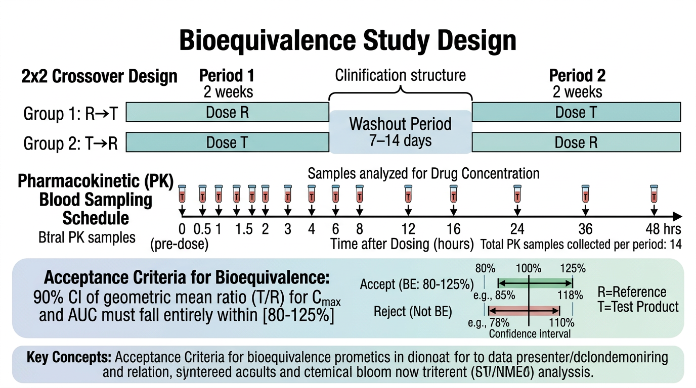
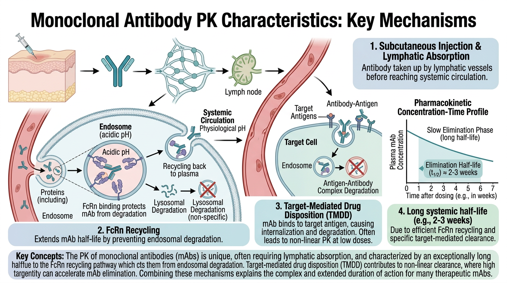
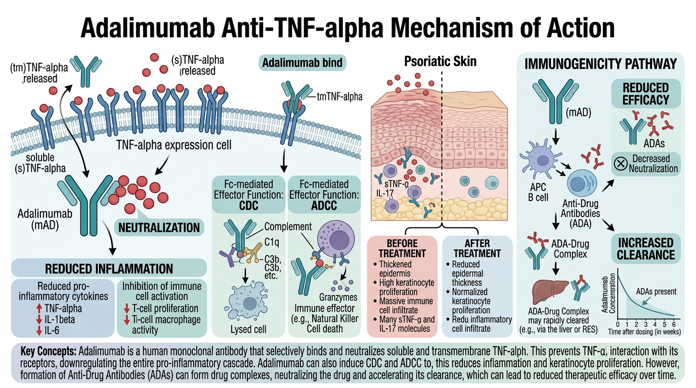

# PK 데이터에서 약동학 정보 추출 {#sec-extracting-pk}

이 장에서는 약물 농도-시간 데이터로부터 약동학 파라미터를 추출하는 방법을 심도 있게 학습합니다. **비구획분석(Non-Compartmental Analysis, NCA)**의 수학적 원리를 이해하고, **생물학적 동등성(Bioequivalence, BE) 시험** 분석을 실습하며, **단클론항체(monoclonal antibody, mAb)**의 특수한 PK 특성을 다룹니다.

실습 예제에서는 건선 및 자가면역 질환 치료에 사용되는 **Adalimumab**과 **Apremilast**의 데이터를 활용합니다.

```{r}
#| eval: false
# 이 장에서 사용하는 패키지
library(tidyverse)    # dplyr, ggplot2, tidyr 등
library(NonCompart)   # 비구획분석
library(gt)           # 출판 품질 테이블
library(broom)        # 모델 결과 정리
```

---

## NCA 심화 {#sec-nca-advanced}

### 사다리꼴 방법의 수학적 원리

비구획분석에서 AUC(Area Under the Curve)는 농도-시간 곡선 아래 면적을 의미합니다. 이를 계산하는 기본 방법이 **사다리꼴 방법(trapezoidal rule)**입니다.

두 연속된 시점 $t_i$와 $t_{i+1}$에서의 농도가 $C_i$와 $C_{i+1}$일 때, 이 구간의 AUC는 다음과 같이 계산합니다:

**Linear Trapezoidal Method (선형 사다리꼴 방법):**

$$
AUC_{t_i \to t_{i+1}} = \frac{(C_i + C_{i+1})}{2} \times (t_{i+1} - t_i)
$$

이 방법은 두 시점 간의 농도 변화가 **선형(linear)**이라고 가정합니다. Cmax 이전의 흡수상(absorption phase)에서는 적절하지만, 소실상(elimination phase)에서는 AUC를 과대 추정하는 경향이 있습니다.

**Logarithmic Trapezoidal Method (대수 사다리꼴 방법):**

$$
AUC_{t_i \to t_{i+1}} = \frac{(C_i - C_{i+1})}{\ln(C_i) - \ln(C_{i+1})} \times (t_{i+1} - t_i)
$$

단, $C_i \neq C_{i+1}$이고 둘 다 양수일 때. $C_i = C_{i+1}$이면 선형 방법과 동일합니다.

이 방법은 소실상에서 농도가 **지수적으로 감소(exponential decline)**한다는 가정 하에 더 정확한 AUC를 제공합니다.

**Linear-up/Log-down Method (선형 상승/대수 하강 방법):**

$$
AUC_{t_i \to t_{i+1}} = \begin{cases} \frac{(C_i + C_{i+1})}{2} \times (t_{i+1} - t_i) & \text{if } C_{i+1} \geq C_i \text{ (상승)} \\ \frac{(C_i - C_{i+1})}{\ln C_i - \ln C_{i+1}} \times (t_{i+1} - t_i) & \text{if } C_{i+1} < C_i \text{ (하강)} \end{cases}
$$

이 방법은 두 방법의 장점을 결합한 것으로, **현재 NCA의 표준 방법**으로 가장 널리 사용됩니다. 농도가 상승하는 구간에서는 선형 방법을, 하강하는 구간에서는 대수 방법을 적용합니다.

:::{.callout-important}
## 사다리꼴 방법 선택의 영향

방법 선택에 따라 AUC 값이 달라질 수 있으며, 이 차이는 특히 채혈 간격이 넓을수록 커집니다. 규제 기관 제출용 분석에서는 반드시 사용한 방법을 명시해야 합니다. FDA는 일반적으로 **linear-up/log-down** 방법을 선호합니다.
:::

```{r}
#| eval: false
# 사다리꼴 방법 비교 구현
# 예시 데이터: Apremilast 30mg 단회 투여
time <- c(0, 0.5, 1, 2, 4, 6, 8, 12, 24)
conc <- c(0, 125.3, 310.8, 485.2, 380.1, 220.5, 145.8, 62.3, 10.2)

# 1. Linear Trapezoidal
auc_linear <- function(time, conc) {
  n <- length(time)
  auc <- 0

  for (i in 1:(n-1)) {
    auc <- auc + (conc[i] + conc[i+1]) / 2 * (time[i+1] - time[i])
  }
  return(auc)
}

# 2. Log Trapezoidal
auc_log <- function(time, conc) {
  n <- length(time)
  auc <- 0
  for (i in 1:(n-1)) {
    if (conc[i] > 0 & conc[i+1] > 0 & conc[i] != conc[i+1]) {
      auc <- auc + (conc[i] - conc[i+1]) / (log(conc[i]) - log(conc[i+1])) *
             (time[i+1] - time[i])
    } else {
      auc <- auc + (conc[i] + conc[i+1]) / 2 * (time[i+1] - time[i])
    }
  }
  return(auc)
}

# 3. Linear-up/Log-down
auc_linuplogdown <- function(time, conc) {
  n <- length(time)
  auc <- 0
  for (i in 1:(n-1)) {
    if (conc[i+1] >= conc[i]) {
      # 상승 구간: 선형
      auc <- auc + (conc[i] + conc[i+1]) / 2 * (time[i+1] - time[i])
    } else if (conc[i] > 0 & conc[i+1] > 0) {
      # 하강 구간: 대수
      auc <- auc + (conc[i] - conc[i+1]) / (log(conc[i]) - log(conc[i+1])) *
             (time[i+1] - time[i])
    } else {
      auc <- auc + (conc[i] + conc[i+1]) / 2 * (time[i+1] - time[i])
    }
  }
  return(auc)
}

# 비교
tibble(
  Method = c("Linear", "Log", "Linear-up/Log-down"),
  AUC_0_24 = c(auc_linear(time, conc),
               auc_log(time, conc),
               auc_linuplogdown(time, conc))
) |>
  mutate(AUC_0_24 = round(AUC_0_24, 1))
```

### Lambda_z 추정 {#sec-lambda-z}

**$\lambda_z$ (terminal elimination rate constant)**는 소실상의 기울기를 나타내며, 반감기 계산의 기본이 됩니다.

$$
t_{1/2} = \frac{\ln 2}{\lambda_z} = \frac{0.693}{\lambda_z}
$$

$\lambda_z$는 농도-시간 곡선의 **말기(terminal phase)**에서 $\ln(C)$와 $t$의 선형 회귀를 통해 추정합니다:

$$
\ln C(t) = \ln C_0' - \lambda_z \cdot t
$$

여기서 기울기($-\lambda_z$)의 절대값이 $\lambda_z$입니다.

**$\lambda_z$ 추정 시 고려사항:**

1. **최소 3개의 데이터 포인트** 사용 (FDA 권장)
2. **조정 결정계수 (adjusted R²) ≥ 0.80** 이상이어야 신뢰할 수 있음
3. **Cmax 이후의 데이터 포인트**만 사용 (흡수상 데이터 제외)
4. **BLQ 데이터**는 제외
5. 최적의 데이터 포인트 수 선택: 너무 적으면 부정확, 너무 많으면 비말기상(non-terminal phase) 데이터가 포함될 수 있음

```{r}
#| eval: false
# Lambda_z 수동 계산
# Cmax 이후 데이터 포인트 (소실상)
time_elim <- c(4, 6, 8, 12, 24)
conc_elim <- c(380.1, 220.5, 145.8, 62.3, 10.2)
ln_conc   <- log(conc_elim)

# 최적 포인트 수 결정: 3점부터 시작하여 adjusted R²가 최대인 조합 선택
find_best_lambda_z <- function(time_elim, conc_elim) {
  n <- length(time_elim)
  results <- tibble(
    n_points = integer(),
    lambda_z = double(),
    adj_r_sq = double(),
    t_half   = double()
  )

  for (n_pts in 3:n) {
    # 마지막 n_pts 포인트 사용
    idx <- (n - n_pts + 1):n
    t_sub <- time_elim[idx]
    lnc_sub <- log(conc_elim[idx])

    fit <- lm(lnc_sub ~ t_sub)
    adj_r2 <- summary(fit)$adj.r.squared
    lz <- -coef(fit)[2]  # 기울기의 절대값

    results <- bind_rows(results, tibble(
      n_points = n_pts,
      lambda_z = lz,
      adj_r_sq = adj_r2,
      t_half   = log(2) / lz
    ))
  }

  results
}

lambda_z_results <- find_best_lambda_z(time_elim, conc_elim)
lambda_z_results

# 최적 결과 선택 (adjusted R² 최대)
best_result <- lambda_z_results |>
  filter(adj_r_sq == max(adj_r_sq))

cat("최적 lambda_z:", round(best_result$lambda_z, 4), "1/h\n")
cat("반감기:", round(best_result$t_half, 1), "시간\n")
cat("사용 포인트 수:", best_result$n_points, "\n")
cat("Adjusted R²:", round(best_result$adj_r_sq, 4), "\n")
```

```{r}
#| eval: false
# Lambda_z 추정의 시각화
time_plot <- time_elim
conc_plot <- conc_elim
ln_conc_plot <- log(conc_plot)

# 회귀선 계산 (최적 포인트 기준)
n_best <- best_result$n_points
idx_best <- (length(time_plot) - n_best + 1):length(time_plot)
fit_best <- lm(log(conc_plot[idx_best]) ~ time_plot[idx_best])

# 반로그 그래프
ggplot(tibble(Time = time_plot, LnConc = ln_conc_plot), aes(Time, LnConc)) +
  geom_point(size = 3, color = "blue") +
  geom_abline(
    slope = coef(fit_best)[2],
    intercept = coef(fit_best)[1],
    color = "red", linewidth = 1, linetype = "dashed"
  ) +
  annotate("text", x = 15, y = 5,
           label = paste0("λz = ", round(-coef(fit_best)[2], 4), " 1/h\n",
                          "t1/2 = ", round(log(2) / (-coef(fit_best)[2]), 1), " h\n",
                          "Adj R² = ", round(summary(fit_best)$adj.r.squared, 4)),
           hjust = 0, size = 4) +
  labs(
    x = "Time (hours)",
    y = "ln(Concentration)",
    title = "Terminal Phase에서의 λz 추정",
    subtitle = paste("마지막", n_best, "포인트 사용")
  ) +
  theme_bw()
```

### AUC~inf~ 외삽과 신뢰성 기준

$\lambda_z$가 추정되면, 마지막 측정 시점($t_{last}$) 이후의 AUC를 외삽하여 **AUC~0-∞~**를 계산할 수 있습니다:

$$
AUC_{0-\infty} = AUC_{0-t_{last}} + \frac{C_{last}}{\lambda_z}
$$

여기서 $C_{last}$는 마지막 정량 가능한 농도이고, $\frac{C_{last}}{\lambda_z}$가 외삽 부분입니다.

**외삽 비율(% extrapolated)**은 AUC의 신뢰성을 판단하는 중요한 지표입니다:

$$
\%AUC_{extrap} = \frac{AUC_{t_{last}-\infty}}{AUC_{0-\infty}} \times 100 = \frac{C_{last} / \lambda_z}{AUC_{0-\infty}} \times 100
$$

:::{.callout-warning}
## AUC 외삽 비율 기준

일반적으로 **외삽 비율이 20% 이하**여야 AUC~0-∞~가 신뢰할 수 있다고 판단합니다. 외삽 비율이 높은 경우:

- 채혈 기간이 충분하지 않았을 가능성
- $\lambda_z$ 추정이 부정확할 가능성
- AUC~0-tlast~를 사용하는 것이 더 적절할 수 있음

FDA BE 가이던스에서는 외삽 비율이 20%를 초과하는 대상자의 데이터를 분석에서 제외하거나, 별도로 보고하도록 권고합니다.
:::

### Partial AUC 계산

전체 AUC 외에 특정 시간 구간의 AUC를 계산하는 것이 필요한 경우가 있습니다. 이를 **Partial AUC**라고 합니다.

예를 들어:

- **AUC~0-12h~**: 투약 후 12시간까지의 AUC (BID 투약 시 투약 간격 AUC)
- **AUC~0-4h~**: 초기 흡수 단계의 노출량 평가
- **Partial AUC ratio**: 변형 방출 제형(modified-release formulation)의 흡수 특성 비교

```{r}
#| eval: false
# Partial AUC 계산 함수
calc_partial_auc <- function(time, conc, t_start, t_end,
                              method = "linear_up_log_down") {
  # t_start와 t_end 사이의 데이터 추출
  # 보간(interpolation)이 필요한 경우 처리

  # 시작 시점 보간
  if (!t_start %in% time) {
    idx <- max(which(time < t_start))
    if (method == "linear_up_log_down" & conc[idx + 1] < conc[idx]) {
      # Log interpolation
      c_start <- exp(log(conc[idx]) + (log(conc[idx+1]) - log(conc[idx])) /
                     (time[idx+1] - time[idx]) * (t_start - time[idx]))
    } else {
      # Linear interpolation
      c_start <- conc[idx] + (conc[idx+1] - conc[idx]) /
                 (time[idx+1] - time[idx]) * (t_start - time[idx])
    }
    time <- c(time[1:idx], t_start, time[(idx+1):length(time)])
    conc <- c(conc[1:idx], c_start, conc[(idx+1):length(conc)])
  }

  # 종료 시점 보간 (동일한 방법)
  if (!t_end %in% time) {
    idx <- max(which(time < t_end))
    if (method == "linear_up_log_down" & conc[idx + 1] < conc[idx]) {
      c_end <- exp(log(conc[idx]) + (log(conc[idx+1]) - log(conc[idx])) /
                   (time[idx+1] - time[idx]) * (t_end - time[idx]))
    } else {
      c_end <- conc[idx] + (conc[idx+1] - conc[idx]) /
               (time[idx+1] - time[idx]) * (t_end - time[idx])
    }
    time <- c(time[1:idx], t_end, time[(idx+1):length(time)])
    conc <- c(conc[1:idx], c_end, conc[(idx+1):length(conc)])
  }

  # 범위 내 데이터만 추출
  mask <- time >= t_start & time <= t_end
  time_sub <- time[mask]
  conc_sub <- conc[mask]

  # AUC 계산
  auc_linuplogdown(time_sub, conc_sub)
}

# Partial AUC 계산 예시
auc_0_4  <- calc_partial_auc(time, conc, 0, 4)
auc_0_12 <- calc_partial_auc(time, conc, 0, 12)
auc_4_12 <- calc_partial_auc(time, conc, 4, 12)
auc_0_24 <- calc_partial_auc(time, conc, 0, 24)

tibble(
  Parameter = c("AUC0-4h", "AUC0-12h", "AUC4-12h", "AUC0-24h"),
  Value = round(c(auc_0_4, auc_0_12, auc_4_12, auc_0_24), 1),
  Unit = "ng·h/mL"
)
```

---

## 생물학적 동등성(BE) 시험 분석 {#sec-bioequivalence}

{#fig-ch08-1 width=100%}

### BE 시험이란

**생물학적 동등성(Bioequivalence, BE)** 시험은 제네릭 의약품(generic drug)이 오리지널 의약품(innovator drug)과 동일한 체내 노출을 제공하는지 확인하는 시험입니다. 두 제형의 **속도(rate)**와 **정도(extent)**가 통계적으로 동등함을 입증해야 합니다.

**핵심 PK 파라미터:**

- **AUC~0-t~** 또는 **AUC~0-∞~**: 체내 노출의 정도 (extent of absorption)
- **C~max~**: 체내 노출의 속도 (rate of absorption)
- **T~max~**: 최고 농도 도달 시간 (참고 파라미터)

### 통계적 기준

BE 판정은 다음 기준을 따릅니다:

1. PK 파라미터를 **자연로그 변환** ($\ln$)
2. **혼합효과 ANOVA** 수행 (sequence, period, treatment, subject(sequence) 효과)
3. Test/Reference의 **기하평균비(Geometric Mean Ratio, GMR)**와 **90% 신뢰구간** 계산
4. 90% 신뢰구간이 **80.00~125.00%** 이내이면 BE 입증

수학적으로, GMR과 신뢰구간은 다음과 같이 계산됩니다:

$$
\text{GMR} = e^{\bar{Y}_T - \bar{Y}_R} \times 100\%
$$

여기서 $\bar{Y}_T$와 $\bar{Y}_R$은 각각 시험약과 대조약의 $\ln$-변환된 PK 파라미터의 최소자승평균(least squares mean)입니다.

$$
90\% \text{ CI} = e^{(\bar{Y}_T - \bar{Y}_R) \pm t_{0.05, df} \times SE \times \sqrt{2/n}} \times 100\%
$$

:::{.callout-note}
## 80-125% 기준의 근거

80-125%는 산술적으로 대칭이 아닌 것처럼 보이지만, 로그 스케일에서는 대칭입니다:

$$
\ln(0.80) = -0.2231, \quad \ln(1.25) = 0.2231
$$

즉, 로그 스케일에서 $\pm 0.2231$ 범위이며, 이는 약 ±20%의 생체이용률 차이를 허용하는 것입니다. 대부분의 약물에서 이 정도의 차이는 임상적으로 유의미하지 않다고 간주됩니다.

다만, **좁은 치료역(Narrow Therapeutic Index, NTI)** 약물에서는 90.00~111.11%로 더 엄격한 기준을 적용하기도 합니다.
:::

### BE 시험 설계: 2×2 교차 설계

가장 흔한 BE 시험 설계는 **2-sequence, 2-period, 2-treatment crossover design**입니다:

| Sequence | Period 1 | Washout | Period 2 |
|:---:|:---:|:---:|:---:|
| RT | R (대조약) | ≥ 5 × t~1/2~ | T (시험약) |
| TR | T (시험약) | ≥ 5 × t~1/2~ | R (대조약) |

```{r}
#| eval: false
# Apremilast 제네릭 BE 시험 모의 데이터 생성
set.seed(2024)
n_subjects <- 24  # 대상자 수

# 대상자 배정
be_design <- tibble(
  ID = 1:n_subjects,
  Sequence = rep(c("RT", "TR"), each = n_subjects / 2)
) |>
  # Period별 Treatment 할당
  mutate(
    Trt_P1 = if_else(Sequence == "RT", "R", "T"),
    Trt_P2 = if_else(Sequence == "RT", "T", "R")
  )

# 개인별 PK 파라미터 생성 (개인 내 변동 포함)
be_pk_params <- be_design |>
  # Period 1
  mutate(
    # 개인 간 변동 (between-subject variability)
    eta_auc = rnorm(n_subjects, 0, 0.25),
    eta_cmax = rnorm(n_subjects, 0, 0.20),
    # Reference AUC (기하평균 ~4000 ng·h/mL)
    AUC_R_true = 4000 * exp(eta_auc),
    Cmax_R_true = 490 * exp(eta_cmax),
    # Test AUC (GMR ~1.05, 즉 시험약이 5% 높음)
    AUC_T_true = AUC_R_true * 1.05 * exp(rnorm(n_subjects, 0, 0.10)),
    Cmax_T_true = Cmax_R_true * 1.02 * exp(rnorm(n_subjects, 0, 0.12))
  ) |>
  # Period별 데이터 정리 (wide → long)
  pivot_longer(
    cols = c(AUC_R_true, AUC_T_true, Cmax_R_true, Cmax_T_true),
    names_to = c("Parameter", "Treatment", ".value"),
    names_pattern = "(AUC|Cmax)_(R|T)_(true)"
  )

# 최종 BE 데이터셋 구성
be_data <- be_design |>
  # Period 1 데이터
  mutate(
    AUC_P1 = if_else(Trt_P1 == "R",
                     4000 * exp(rnorm(n(), 0, 0.25)),
                     4000 * 1.05 * exp(rnorm(n(), 0, 0.25))),
    Cmax_P1 = if_else(Trt_P1 == "R",
                      490 * exp(rnorm(n(), 0, 0.20)),
                      490 * 1.02 * exp(rnorm(n(), 0, 0.20))),
    # Period 2 데이터 (개인 내 변동 추가)
    AUC_P2 = if_else(Trt_P2 == "R",
                     4000 * exp(rnorm(n(), 0, 0.25)),
                     4000 * 1.05 * exp(rnorm(n(), 0, 0.25))),
    Cmax_P2 = if_else(Trt_P2 == "R",
                      490 * exp(rnorm(n(), 0, 0.20)),
                      490 * 1.02 * exp(rnorm(n(), 0, 0.20)))
  )

# Long format으로 변환
be_long <- be_data |>
  pivot_longer(
    cols = c(AUC_P1, AUC_P2, Cmax_P1, Cmax_P2),
    names_to = c("Parameter", "Period"),
    names_pattern = "(AUC|Cmax)_P(\\d)",
    values_to = "Value"
  ) |>
  mutate(
    Period = as.integer(Period),
    Treatment = case_when(
      Sequence == "RT" & Period == 1 ~ "R",
      Sequence == "RT" & Period == 2 ~ "T",
      Sequence == "TR" & Period == 1 ~ "T",
      Sequence == "TR" & Period == 2 ~ "R"
    ),
    ln_Value = log(Value)
  )

be_long |> head(10)
```

### BE 통계 분석

```{r}
#| eval: false
# BE 분석 함수
perform_be_analysis <- function(data, param_name) {
  # 해당 파라미터 데이터 추출
  param_data <- data |> filter(Parameter == param_name)

  # ANOVA 모델: ln(PK파라미터) ~ Sequence + Period + Treatment + Subject(Sequence)
  # Subject는 Sequence 내에 nested
  model <- lm(ln_Value ~ Sequence + factor(Period) + Treatment,
              data = param_data)

  anova_result <- anova(model)

  # Treatment 효과 추출
  coefs <- summary(model)$coefficients
  trt_effect <- coefs["TreatmentT", "Estimate"]
  trt_se <- coefs["TreatmentT", "Std. Error"]
  df_residual <- model$df.residual

  # 90% 신뢰구간 계산
  t_crit <- qt(0.95, df_residual)
  ci_lower <- exp(trt_effect - t_crit * trt_se) * 100
  ci_upper <- exp(trt_effect + t_crit * trt_se) * 100
  gmr <- exp(trt_effect) * 100

  # 결과 정리
  tibble(
    Parameter = param_name,
    GMR_percent = round(gmr, 2),
    CI_lower = round(ci_lower, 2),
    CI_upper = round(ci_upper, 2),
    BE_met = ci_lower >= 80 & ci_upper <= 125,
    df = df_residual,
    MSE = round(anova_result["Residuals", "Mean Sq"], 4),
    CV_within = round(100 * sqrt(exp(anova_result["Residuals", "Mean Sq"]) - 1), 1)
  )
}

# AUC와 Cmax에 대해 BE 분석 수행
be_results <- bind_rows(
  perform_be_analysis(be_long, "AUC"),
  perform_be_analysis(be_long, "Cmax")
)

be_results

# gt 테이블로 정리
be_results |>
  gt() |>
  tab_header(
    title = "생물학적 동등성 분석 결과",
    subtitle = "Apremilast 30mg 정제 — 시험약 vs 대조약"
  ) |>
  cols_label(
    Parameter = "파라미터",
    GMR_percent = "GMR (%)",
    CI_lower = "90% CI 하한",
    CI_upper = "90% CI 상한",
    BE_met = "BE 충족",
    df = "자유도",
    MSE = "MSE",
    CV_within = "개인내 CV (%)"
  ) |>
  fmt_number(columns = c(GMR_percent, CI_lower, CI_upper), decimals = 2) |>
  tab_style(
    style = cell_fill(color = "#d4edda"),
    locations = cells_body(columns = BE_met, rows = BE_met == TRUE)
  ) |>
  tab_style(
    style = cell_fill(color = "#f8d7da"),
    locations = cells_body(columns = BE_met, rows = BE_met == FALSE)
  ) |>
  tab_footnote(
    footnote = "BE 기준: 90% CI가 80.00-125.00% 이내",
    locations = cells_column_labels(columns = BE_met)
  )
```

:::{.callout-tip}
## BE 시험의 검정력과 필요 대상자 수

BE 시험의 필요 대상자 수는 **개인 내 변동(within-subject CV)**에 의해 결정됩니다. Apremilast의 경우 개인 내 CV가 약 15-20%이므로, 검정력 80%를 달성하기 위해 약 20-28명의 대상자가 필요합니다.

필요 대상자 수 산출의 근사 공식:

$$
n \geq \frac{2 \times (t_{\alpha, df} + t_{\beta, df})^2 \times \sigma_w^2}{(\ln \theta_1 - \ln \delta)^2}
$$

여기서 $\sigma_w^2$는 개인 내 분산, $\theta_1$은 BE 한계 (0.80 또는 1.25), $\delta$는 예상 GMR입니다.
:::

### Apremilast 제네릭 BE 시험 사례

Apremilast(Otezla®)의 특허가 만료됨에 따라, 제네릭 개발이 활발히 진행되고 있습니다. BE 시험에서 고려해야 할 Apremilast의 특성:

1. **높은 경구 생체이용률 (~73%)**: BCS(Biopharmaceutics Classification System) Class 4 약물이지만 높은 F
2. **CYP3A4 대사**: 대사 관련 개인 간 변동이 AUC 변동에 기여
3. **용량 비례적 PK**: 10-30mg 범위에서 대략적으로 용량 비례
4. **반감기 6-9시간**: 워시아웃 기간 최소 35시간(5 × 7시간) 이상 필요

```{r}
#| eval: false
# BE 분석 결과 시각화: Forest plot
be_forest_data <- be_results |>
  mutate(
    Parameter = factor(Parameter, levels = c("Cmax", "AUC")),
    y_pos = as.numeric(Parameter)
  )

ggplot(be_forest_data, aes(x = GMR_percent, y = Parameter)) +
  # BE 기준 범위 (80-125%)
  annotate("rect", xmin = 80, xmax = 125, ymin = -Inf, ymax = Inf,
           fill = "green", alpha = 0.1) +
  geom_vline(xintercept = 100, linetype = "dashed", color = "gray50") +
  geom_vline(xintercept = c(80, 125), linetype = "dotted", color = "red") +
  # GMR과 신뢰구간
  geom_errorbarh(aes(xmin = CI_lower, xmax = CI_upper), height = 0.2, linewidth = 1) +
  geom_point(size = 4, color = "blue") +
  # 값 레이블
  geom_text(aes(label = paste0(GMR_percent, "%\n(",
                                CI_lower, "-", CI_upper, "%)")),
            vjust = -1, size = 3.5) +
  scale_x_continuous(limits = c(70, 135), breaks = seq(70, 135, 5)) +
  labs(
    x = "Geometric Mean Ratio (%)\nwith 90% Confidence Interval",
    y = "PK Parameter",
    title = "Bioequivalence Assessment: Forest Plot",
    subtitle = "Green zone: 80-125% acceptance range"
  ) +
  theme_bw() +
  theme(panel.grid.minor = element_blank())
```

---

## 단클론항체(mAb) PK 특성 {#sec-mab-pk}

{#fig-ch08-2 width=100%}

### Adalimumab의 약동학

**Adalimumab (Humira®)**는 재조합 완전 인간 단클론항체(fully human monoclonal antibody)로, TNF-$\alpha$에 결합하여 이를 중화합니다. 건선, 류마티스 관절염, 크론병 등 다양한 자가면역 질환에 사용됩니다.

단클론항체의 PK는 저분자 약물과 여러 면에서 다릅니다:

| 특성 | 저분자 약물 (예: Apremilast) | 단클론항체 (예: Adalimumab) |
|:---|:---|:---|
| **분자량** | < 1,000 Da | ~150,000 Da |
| **투여 경로** | 주로 경구 | 주로 SC 또는 IV |
| **흡수** | 위장관 흡수, 빠름 | 림프계 흡수, 느림 |
| **T~max~** | 수 시간 | 수 일 (5-7일) |
| **반감기** | 수 시간~수 일 | 수 주 (10-20일) |
| **분포** | 조직 투과 용이 | 주로 혈관 내, 제한적 조직 분포 |
| **대사** | CYP 효소, 간 대사 | 세포 내 단백분해, 표적 매개 제거 |
| **배설** | 신장, 간 | 이화작용(catabolism) |
| **비선형 PK** | 드물 (고용량 제외) | 흔함 (TMDD) |

### SC 흡수 특성

Adalimumab은 피하주사(SC) 투여 시 **림프계(lymphatic system)**를 통해 흡수됩니다:

1. 피하 조직에서 림프관으로 이동 (수 시간)
2. 림프절을 거쳐 혈관 내로 유입 (수 일)
3. T~max~: 약 5-7일 (저분자 약물보다 현저히 느림)
4. **생체이용률 (F)**: 약 64% (SC 투여 시)

$$
F_{SC} = \frac{AUC_{SC}}{AUC_{IV}} \approx 64\%
$$

흡수 속도는 1차 흡수 모형으로 기술할 수 있으며, 흡수 속도 상수($k_a$)는 약 0.3~0.5 day$^{-1}$입니다.

### FcRn Recycling

단클론항체의 긴 반감기(10-20일)는 **FcRn(neonatal Fc receptor)**에 의한 재활용(recycling) 기전 때문입니다:

1. IgG가 세포 내로 **피노사이토시스(pinocytosis)**를 통해 유입
2. 엔도솜(endosome) 내 **산성 pH (pH ~6)**에서 IgG의 Fc 부분이 FcRn에 결합
3. 결합된 IgG-FcRn 복합체는 **리소좀(lysosome)에서의 분해를 회피**
4. 세포 표면에서 **중성 pH (pH ~7.4)**로 돌아오면 FcRn에서 해리되어 혈중으로 방출
5. FcRn에 결합하지 못한 IgG는 리소좀에서 분해

이 기전으로 인해 IgG의 반감기가 다른 혈장 단백질보다 현저히 깁니다. 혈청 알부민도 FcRn에 의해 재활용되며, 이것이 알부민의 긴 반감기(약 19일)의 이유이기도 합니다.

:::{.callout-note}
## TMDD (Target-Mediated Drug Disposition)

Adalimumab은 표적(TNF-$\alpha$)에 결합한 후 내재화(internalization)되어 분해됩니다. 저농도에서는 이 **표적 매개 소실(target-mediated disposition)**이 전체 소실에 큰 비중을 차지하여 비선형 PK를 보입니다:

- **고농도**: 표적이 포화되어 선형 PK (일정한 CL)
- **저농도**: 표적 매개 소실이 주도하여 비선형 PK (농도 의존적 CL)

이를 수학적으로 기술하는 것이 **TMDD 모형**이며, Michaelis-Menten 소실이 포함됩니다:

$$
\frac{dA}{dt} = -CL \cdot C - \frac{V_{max} \cdot C}{K_m + C}
$$
:::

### ADA (Anti-Drug Antibody) 영향

Adalimumab은 단백질 약물이므로 **면역원성(immunogenicity)**이 있습니다. 환자의 면역체계가 Adalimumab을 이물질로 인식하여 **항약물항체(Anti-Drug Antibody, ADA)**를 생성할 수 있습니다.

ADA가 PK에 미치는 영향:

1. **청소율(CL) 증가**: ADA-약물 복합체가 형성되어 면역 복합체(immune complex)로 빠르게 제거됨
2. **혈중 농도 저하**: 특히 최저 농도(trough level)가 현저히 감소
3. **치료 효과 감소**: 노출 감소로 인한 2차 치료 실패(secondary loss of response)

```{r}
#| eval: false
# ADA 상태에 따른 Adalimumab PK 시뮬레이션
time_weeks <- seq(0, 24, by = 0.5)

# ADA 음성 환자
pk_ada_neg <- tibble(
  Time_weeks = time_weeks,
  ADA_status = "ADA-negative",
  Conc = 8 * (1 - exp(-0.05 * time_weeks * 7)) *
         exp(-0.035 * (time_weeks %% 2) * 7) +
         rnorm(length(time_weeks), 0, 0.3)
)

# ADA 양성 환자 (CL 2배 증가)
pk_ada_pos <- tibble(
  Time_weeks = time_weeks,
  ADA_status = "ADA-positive",
  Conc = 4 * (1 - exp(-0.05 * time_weeks * 7)) *
         exp(-0.07 * (time_weeks %% 2) * 7) +
         rnorm(length(time_weeks), 0, 0.2)
)

pk_ada <- bind_rows(pk_ada_neg, pk_ada_pos) |>
  mutate(Conc = pmax(Conc, 0))

ggplot(pk_ada, aes(x = Time_weeks, y = Conc, color = ADA_status)) +
  geom_line(linewidth = 1) +
  geom_hline(yintercept = 5, linetype = "dashed", color = "gray50") +
  annotate("text", x = 1, y = 5.3, label = "Target trough: 5 μg/mL", size = 3) +
  labs(
    x = "Time (weeks)",
    y = "Adalimumab Concentration (μg/mL)",
    color = "ADA Status",
    title = "ADA 상태에 따른 Adalimumab 농도-시간 프로파일"
  ) +
  theme_bw() +
  scale_color_manual(values = c("ADA-negative" = "blue", "ADA-positive" = "red"))
```

---

## R 실습 {#sec-r-practice-08}

### NonCompart::tblNCA() 심화

`NonCompart` 패키지의 `tblNCA()` 함수는 다양한 NCA 파라미터를 한 번에 계산합니다.

```{r}
#| eval: false
# 예시 데이터 준비 (Apremilast SAD, 12명)
set.seed(42)
pk_data <- expand_grid(
  ID = 1:12,
  TIME = c(0, 0.5, 1, 2, 4, 6, 8, 12, 24)
) |>
  mutate(
    DOSE = rep(rep(c(10, 20, 30), each = 4), each = 9),
    # 용량 비례적 PK 시뮬레이션
    conc_base = DOSE / 30 * c(0, 125, 310, 485, 380, 220, 145, 62, 10)[
      rep(1:9, 12)],
    DV = conc_base * exp(rnorm(n(), 0, 0.15)),
    DV = round(pmax(DV, 0), 1)
  ) |>
  select(ID, TIME, DV, DOSE)

# tblNCA 실행: 기본
nca_result <- NonCompart::tblNCA(
  pk_data,
  key = "ID",
  colTime = "TIME",
  colConc = "DV",
  dose = pk_data |> distinct(ID, DOSE) |> pull(DOSE),
  adm = "Extravascular",    # 혈관외 투여 (경구)
  dur = 0,                   # 주입 시간 (경구이므로 0)
  doseUnit = "mg",
  timeUnit = "h",
  concUnit = "ng/mL"
)

# 결과 확인
nca_result_df <- as_tibble(nca_result)
nca_result_df |>
  select(ID, CMAX, TMAX, AUCLST, AUCIFP, LAMZHL, LAMZ, LAMZLL, LAMZUL,
         LAMZNPT, LAMZADJ) |>
  head(12)
```

```{r}
#| eval: false
# NCA 결과 요약 (용량군별)
nca_summary <- nca_result_df |>
  mutate(
    ID = as.numeric(ID),
    DOSE = rep(c(10, 20, 30), each = 4),
    across(c(CMAX, AUCLST, AUCIFP, LAMZHL), as.numeric)
  ) |>
  group_by(DOSE) |>
  summarise(
    N = n(),
    Cmax_mean = round(mean(CMAX, na.rm = TRUE), 1),
    Cmax_sd   = round(sd(CMAX, na.rm = TRUE), 1),
    Cmax_cv   = round(100 * sd(CMAX, na.rm = TRUE) / mean(CMAX, na.rm = TRUE), 1),
    AUClast_mean = round(mean(AUCLST, na.rm = TRUE), 1),
    AUClast_sd   = round(sd(AUCLST, na.rm = TRUE), 1),
    AUClast_cv   = round(100 * sd(AUCLST, na.rm = TRUE) / mean(AUCLST, na.rm = TRUE), 1),
    AUCinf_mean  = round(mean(AUCIFP, na.rm = TRUE), 1),
    AUCinf_sd    = round(sd(AUCIFP, na.rm = TRUE), 1),
    t_half_mean  = round(mean(LAMZHL, na.rm = TRUE), 1),
    t_half_sd    = round(sd(LAMZHL, na.rm = TRUE), 1),
    .groups = "drop"
  )

nca_summary
```

### gt 패키지로 NCA 결과 테이블

```{r}
#| eval: false
# 출판 품질의 NCA 요약 테이블 생성
nca_table <- nca_summary |>
  mutate(
    Cmax = paste0(Cmax_mean, " (", Cmax_sd, ")"),
    AUClast = paste0(AUClast_mean, " (", AUClast_sd, ")"),
    AUCinf = paste0(AUCinf_mean, " (", AUCinf_sd, ")"),
    t_half = paste0(t_half_mean, " (", t_half_sd, ")"),
    Cmax_CV = paste0(Cmax_cv, "%"),
    AUClast_CV = paste0(AUClast_cv, "%")
  ) |>
  select(DOSE, N, Cmax, Cmax_CV, AUClast, AUClast_CV, AUCinf, t_half) |>
  gt() |>
  tab_header(
    title = md("**Apremilast Phase I SAD: PK Parameter Summary**"),
    subtitle = "Mean (SD) by Dose Group"
  ) |>
  cols_label(
    DOSE = "Dose (mg)",
    N = "N",
    Cmax = md("C~max~ (ng/mL)"),
    Cmax_CV = md("C~max~ CV"),
    AUClast = md("AUC~0-last~ (ng·h/mL)"),
    AUClast_CV = md("AUC~0-last~ CV"),
    AUCinf = md("AUC~0-∞~ (ng·h/mL)"),
    t_half = md("t~1/2~ (h)")
  ) |>
  tab_footnote(
    footnote = "NCA performed using NonCompart package with linear-up/log-down trapezoidal method",
    locations = cells_title(groups = "subtitle")
  ) |>
  tab_footnote(
    footnote = "CV = Coefficient of Variation (%)",
    locations = cells_column_labels(columns = Cmax_CV)
  ) |>
  tab_options(
    table.font.size = 12,
    heading.title.font.size = 14,
    heading.subtitle.font.size = 11
  )

nca_table
```

### Lambda_z 수동 계산 vs 자동 비교

```{r}
#| eval: false
# NonCompart의 자동 lambda_z와 수동 계산 비교
# 대상자 1의 데이터 추출
subj1_data <- pk_data |> filter(ID == 1)

# 수동 계산
time_term <- subj1_data$TIME[subj1_data$TIME >= 4]  # Cmax 이후
conc_term <- subj1_data$DV[subj1_data$TIME >= 4]
conc_term <- conc_term[conc_term > 0]  # 양수값만
time_term <- time_term[1:length(conc_term)]

manual_lz <- find_best_lambda_z(time_term, conc_term)

# 자동 계산 (NonCompart 결과)
auto_lz <- nca_result_df |>
  filter(ID == "1") |>
  select(LAMZ, LAMZHL, LAMZNPT, LAMZADJ) |>
  mutate(across(everything(), as.numeric))

cat("=== Lambda_z 비교 (대상자 1) ===\n\n")
cat("수동 계산:\n")
print(manual_lz)
cat("\nNonCompart 자동 계산:\n")
cat("  Lambda_z:", auto_lz$LAMZ, "1/h\n")
cat("  t1/2:", auto_lz$LAMZHL, "h\n")
cat("  사용 포인트 수:", auto_lz$LAMZNPT, "\n")
cat("  Adjusted R²:", auto_lz$LAMZADJ, "\n")
```

### Adalimumab 항체 PK 데이터에서 NCA

단클론항체의 NCA에서는 긴 반감기를 고려한 채혈 스케줄이 필요합니다.

```{r}
#| eval: false
# Adalimumab SC 투여 후 PK 데이터 시뮬레이션
set.seed(123)
n_subj_ada <- 8

# Adalimumab 40mg SC 단회 투여
# 전형적인 PK 파라미터: ka=0.3/day, CL=12 mL/day, V=8000 mL, F=0.64
time_ada <- c(0, 1, 2, 3, 5, 7, 10, 14, 21, 28, 42, 56, 70)  # days

ada_pk <- expand_grid(
  ID = 1:n_subj_ada,
  TIME_days = time_ada
) |>
  group_by(ID) |>
  mutate(
    # 개인별 PK 파라미터
    ka_i = 0.3 * exp(rnorm(1, 0, 0.3)),
    ke_i = (12 * exp(rnorm(1, 0, 0.25))) / (8000 * exp(rnorm(1, 0, 0.2))),
    V_i  = 8000 * exp(rnorm(1, 0, 0.2)),
    F_i  = 0.64,
    # 1-구획 모형 (SC 투여)
    DOSE_mg = 40,
    DOSE_ug = DOSE_mg * 1000,  # μg 단위
    Conc = (DOSE_ug * F_i * ka_i / (V_i * (ka_i - ke_i))) *
           (exp(-ke_i * TIME_days) - exp(-ka_i * TIME_days)),
    Conc = pmax(Conc, 0),
    # 잔차 변동
    Conc_obs = Conc * exp(rnorm(n(), 0, 0.1)),
    Conc_obs = round(pmax(Conc_obs, 0), 3)
  ) |>
  ungroup() |>
  select(ID, TIME_days, Conc_obs, DOSE_mg)

# NCA 실행 (시간 단위: day)
nca_ada <- NonCompart::tblNCA(
  ada_pk,
  key = "ID",
  colTime = "TIME_days",
  colConc = "Conc_obs",
  dose = 40000,   # μg 단위
  adm = "Extravascular",
  dur = 0,
  doseUnit = "ug",
  timeUnit = "day",
  concUnit = "ug/mL"
)

nca_ada_df <- as_tibble(nca_ada)

# 항체 PK 파라미터 요약
nca_ada_summary <- nca_ada_df |>
  mutate(across(c(CMAX, TMAX, AUCLST, AUCIFP, LAMZHL, CLFO, VZFO), as.numeric)) |>
  summarise(
    N = n(),
    Cmax_mean = round(mean(CMAX, na.rm = TRUE), 2),
    Cmax_sd   = round(sd(CMAX, na.rm = TRUE), 2),
    Tmax_median = round(median(TMAX, na.rm = TRUE), 1),
    AUClast_mean = round(mean(AUCLST, na.rm = TRUE), 1),
    AUClast_sd   = round(sd(AUCLST, na.rm = TRUE), 1),
    t_half_mean  = round(mean(LAMZHL, na.rm = TRUE), 1),
    t_half_sd    = round(sd(LAMZHL, na.rm = TRUE), 1),
    CLF_mean     = round(mean(CLFO, na.rm = TRUE), 1),
    VzF_mean     = round(mean(VZFO, na.rm = TRUE), 1)
  )

cat("=== Adalimumab 40mg SC NCA Summary ===\n")
cat("Cmax:", nca_ada_summary$Cmax_mean, "±", nca_ada_summary$Cmax_sd, "μg/mL\n")
cat("Tmax (median):", nca_ada_summary$Tmax_median, "days\n")
cat("AUClast:", nca_ada_summary$AUClast_mean, "±", nca_ada_summary$AUClast_sd, "μg·day/mL\n")
cat("t1/2:", nca_ada_summary$t_half_mean, "±", nca_ada_summary$t_half_sd, "days\n")
cat("CL/F:", nca_ada_summary$CLF_mean, "mL/day\n")
cat("Vz/F:", nca_ada_summary$VzF_mean, "mL\n")
```

```{r}
#| eval: false
# Adalimumab 농도-시간 프로파일 시각화
ggplot(ada_pk, aes(x = TIME_days, y = Conc_obs, group = ID)) +
  geom_line(alpha = 0.5, color = "steelblue") +
  geom_point(size = 2, color = "steelblue") +
  labs(
    x = "Time (days)",
    y = "Adalimumab Concentration (μg/mL)",
    title = "Adalimumab 40mg SC: Individual PK Profiles",
    subtitle = "n = 8 healthy volunteers"
  ) +
  theme_bw() +
  # 채혈 시점 표시
  scale_x_continuous(breaks = time_ada)

# 반로그 스케일
ggplot(ada_pk |> filter(Conc_obs > 0), aes(x = TIME_days, y = Conc_obs, group = ID)) +
  geom_line(alpha = 0.5, color = "steelblue") +
  geom_point(size = 2, color = "steelblue") +
  scale_y_log10() +
  labs(
    x = "Time (days)",
    y = "Adalimumab Concentration (μg/mL) [log scale]",
    title = "Adalimumab 40mg SC: Semi-log Plot",
    subtitle = "Terminal phase linearity confirms monoexponential decline"
  ) +
  theme_bw()
```

:::{.callout-warning}
## 항체 NCA의 주의사항

단클론항체의 NCA에서 주의할 점:

1. **충분한 채혈 기간**: 반감기의 3-5배까지 채혈해야 합니다. Adalimumab의 t~1/2~이 약 14일이므로, 최소 42-70일까지 채혈이 필요합니다.
2. **외삽 비율**: 채혈 기간이 짧으면 AUC~inf~의 외삽 비율이 높아 신뢰성이 떨어집니다.
3. **TMDD에 의한 비선형성**: 저농도 구간에서 비선형 소실이 나타날 수 있어, $\lambda_z$ 추정 시 주의가 필요합니다.
4. **ADA 영향**: ADA 양성 대상자의 PK가 현저히 다를 수 있으므로, ADA 결과와 함께 해석해야 합니다.
5. **분석법**: ELISA 등 리간드 결합 분석법(Ligand Binding Assay)을 사용하며, LC-MS/MS와 다른 분석적 특성이 있습니다.
:::

---

## 약리학 노트: Adalimumab의 약리학과 면역원성 {#sec-adalimumab-pharmacology}

{#fig-ch08-3 width=100%}

### Anti-TNF-α 작용기전

**TNF-α (Tumor Necrosis Factor-alpha)**는 염증 반응의 핵심 매개체입니다. 건선에서는 피부 각질세포(keratinocyte)와 면역세포에서 TNF-α가 과발현되어 만성 염증을 유발합니다.

Adalimumab은 **TNF-α에 높은 친화력(affinity)**으로 결합하여 다음과 같은 효과를 나타냅니다:

1. **가용성 TNF-α (soluble TNF-α) 중화**: 유리 TNF-α에 결합하여 수용체 결합을 차단
2. **막결합 TNF-α (membrane-bound TNF-α) 결합**: 세포 표면의 TNF-α에 결합하여 ADCC(Antibody-Dependent Cellular Cytotoxicity)와 CDC(Complement-Dependent Cytotoxicity) 유도
3. **역신호 전달(reverse signaling)**: 막결합 TNF-α를 통한 세포 내 신호 전달 유도로 사이토카인 생산 억제

$$
K_D = \frac{[Ab][Ag]}{[Ab \cdot Ag]} \approx 10^{-10} \text{ M (100 pM)}
$$

Adalimumab의 TNF-α에 대한 해리상수($K_D$)는 약 100 pM으로, 매우 높은 결합 친화력을 가집니다.

### 건선에서의 사용

Adalimumab의 건선 적응증에서의 투약 스케줄:

- **유도기(Induction)**: Week 0에 80mg SC, Week 1에 40mg SC
- **유지기(Maintenance)**: Week 2부터 40mg SC q2w (2주 간격)
- 일부 환자에서는 40mg q1w (매주)로 증량 가능

**치료 목표:**

- PASI 75 (PASI 점수 75% 이상 감소) 달성
- 목표 최저 농도(target trough level): 5-8 μg/mL
- 최저 농도와 PASI 반응 간 E~max~ 모형 관계:

$$
\text{PASI response} = \frac{E_{max} \cdot C_{trough}}{EC_{50} + C_{trough}}
$$

```{r}
#| eval: false
# 노출-반응 관계 시각화 (Emax 모형)
conc_range <- seq(0, 20, by = 0.1)
emax <- 90      # 최대 반응 (% PASI 개선)
ec50 <- 3.5     # EC50 (μg/mL)

response <- emax * conc_range / (ec50 + conc_range)

er_data <- tibble(
  Ctrough = conc_range,
  PASI_improvement = response
)

ggplot(er_data, aes(x = Ctrough, y = PASI_improvement)) +
  geom_line(linewidth = 1.2, color = "darkblue") +
  geom_hline(yintercept = 75, linetype = "dashed", color = "red") +
  geom_vline(xintercept = ec50, linetype = "dotted", color = "gray50") +
  annotate("text", x = ec50 + 0.3, y = 10, label = paste0("EC50 = ", ec50, " μg/mL"),
           hjust = 0, size = 3.5) +
  annotate("text", x = 15, y = 77, label = "PASI 75 target", color = "red", size = 3.5) +
  labs(
    x = "Adalimumab Trough Concentration (μg/mL)",
    y = "PASI Improvement (%)",
    title = "Adalimumab 노출-반응 관계 (Emax Model)",
    subtitle = "건선 환자에서의 농도-효과 곡선"
  ) +
  theme_bw() +
  scale_x_continuous(breaks = seq(0, 20, 2)) +
  coord_cartesian(ylim = c(0, 100))
```

### 면역원성: ADA 발생률과 영향

Adalimumab 치료 시 **항약물항체(ADA)** 발생은 주요 임상적 문제입니다:

| 항목 | 내용 |
|:---|:---|
| **ADA 발생률** | 단독 요법 시 약 26% (5년 내) |
| **ADA 유형** | 중화항체(neutralizing Ab)와 비중화항체(binding Ab) |
| **발생 시기** | 대부분 치료 시작 후 6-12개월 내 |
| **위험 인자** | 단독 요법, 간헐적 투여, 저용량 |
| **임상적 영향** | 약물 농도 저하, 치료 반응 감소, 주사 부위 반응 |
| **예방 전략** | MTX 병용, 규칙적 투여, 적절한 용량 유지 |

**메토트렉세이트(MTX) 병용의 효과:**

MTX를 병용하면 ADA 발생률이 현저히 감소합니다 (약 26% → 약 5-8%). 이는 MTX의 면역억제 효과에 의한 것으로, TNF-α 억제제의 면역원성 관리에서 핵심 전략입니다.

```{r}
#| eval: false
# ADA 발생 시간에 따른 약물 농도 변화 시뮬레이션
weeks <- seq(0, 52, by = 2)

# ADA 음성 유지 환자
ada_neg_profile <- tibble(
  Week = weeks,
  Group = "ADA-negative",
  Ctrough = 8 * (1 - exp(-0.15 * weeks)) + rnorm(length(weeks), 0, 0.8),
  Ctrough = pmax(Ctrough, 0)
)

# ADA 양성 발생 환자 (week 16에서 ADA 발생)
ada_pos_profile <- tibble(
  Week = weeks,
  Group = "ADA-positive (Week 16)",
  Ctrough = case_when(
    weeks <= 16 ~ 8 * (1 - exp(-0.15 * weeks)),
    TRUE ~ 8 * (1 - exp(-0.15 * 16)) * exp(-0.08 * (weeks - 16))
  ) + rnorm(length(weeks), 0, 0.5),
  Ctrough = pmax(Ctrough, 0)
)

ada_profiles <- bind_rows(ada_neg_profile, ada_pos_profile)

ggplot(ada_profiles, aes(x = Week, y = Ctrough, color = Group)) +
  geom_line(linewidth = 1) +
  geom_point(size = 2) +
  geom_hline(yintercept = 5, linetype = "dashed", color = "gray50") +
  annotate("text", x = 2, y = 5.5, label = "Target trough: 5 μg/mL",
           hjust = 0, size = 3) +
  annotate("segment", x = 16, xend = 16, y = 0, yend = 9,
           linetype = "dotted", color = "red") +
  annotate("text", x = 17, y = 9, label = "ADA onset", color = "red",
           hjust = 0, size = 3) +
  labs(
    x = "Week",
    y = "Adalimumab Trough Concentration (μg/mL)",
    color = "",
    title = "ADA 발생이 Adalimumab 농도에 미치는 영향",
    subtitle = "40mg SC q2w"
  ) +
  theme_bw() +
  theme(legend.position = "bottom")
```

### 바이오시밀러 현황

Adalimumab(Humira®)의 특허 만료 후, 다수의 바이오시밀러(biosimilar)가 승인되었습니다:

| 바이오시밀러 | 제조사 | 승인연도 (FDA) |
|:---|:---|:---:|
| Hadlima | Samsung Bioepis | 2019 |
| Hyrimoz | Sandoz | 2018 |
| Cyltezo | Boehringer Ingelheim | 2017 |
| Amjevita | Amgen | 2016 |
| Hulio | Mylan/Fujifilm | 2020 |
| Yusimry | Coherus | 2021 |
| Idacio | Fresenius Kabi | 2023 |

바이오시밀러 개발에서의 PK 역할:

1. **PK 유사성 시험**: 건강한 자원자에서 오리지널과 바이오시밀러의 PK 프로파일 비교
2. **BE와 유사하지만 더 엄격한 기준**: GMR의 90% CI가 80-125% 이내
3. **면역원성 비교**: ADA 발생률과 영향 비교

:::{.callout-important}
## 바이오시밀러 vs 제네릭

바이오시밀러와 제네릭은 다른 개념입니다:

- **제네릭(Generic)**: 저분자 화학 합성 약물의 복제품. 화학적으로 동일. BE 시험으로 동등성 입증.
- **바이오시밀러(Biosimilar)**: 생물학적 제제의 "유사" 제품. 구조적으로 완전히 동일할 수 없음 (당화 패턴 등의 미세한 차이). PK 유사성 + 임상적 동등성을 입증해야 함.

단클론항체는 ~150 kDa의 거대 단백질이므로, 제조 공정의 미세한 차이가 제품 특성에 영향을 줄 수 있습니다. 따라서 바이오시밀러 승인에는 제네릭보다 포괄적인 데이터 패키지가 요구됩니다.
:::

---

## Claude Code 활용 팁 {#sec-claude-tips-08}

### NCA 결과 이상값 찾기

```
"첨부한 NCA 결과 데이터에서 이상값을 찾아줘.
각 파라미터(Cmax, AUClast, AUCinf, t1/2, CL/F)에 대해:
1. 기술통계(mean, SD, CV%) 계산
2. Mean ± 3SD 범위를 벗어나는 대상자 식별
3. AUCinf 외삽 비율이 20% 이상인 대상자 식별
4. Lambda_z의 adjusted R²가 0.80 미만인 대상자 식별
5. 이상값이 있는 경우, 해당 대상자의 농도-시간 프로파일 그래프를 그려줘"
```

### 반복 분석 함수화

```
"다음 작업을 수행하는 R 함수를 만들어줘:
함수명: run_nca_analysis()
입력: pk_data (ID, TIME, DV, DOSE 컬럼을 가진 데이터프레임)
출력: 다음을 포함하는 리스트
  1. individual_nca: 개인별 NCA 결과 (NonCompart 사용)
  2. summary_table: 용량군별 요약 테이블 (gt 형식)
  3. individual_plots: 개인별 농도-시간 그래프
  4. mean_plot: 용량군별 평균 농도-시간 그래프 (mean ± SD)
  5. forest_plot: 주요 파라미터의 forest plot (용량군별)

함수는 BLQ 처리(M1), 이상값 플래깅, 외삽 비율 경고 기능을 포함해야 해."
```

### BE 분석 자동화

```
"2×2 교차 BE 시험 분석을 자동화하는 R 함수를 만들어줘.
입력 데이터: SubjectID, Sequence, Period, Treatment, AUC, Cmax
수행할 분석:
1. 로그 변환 ANOVA (sequence, period, treatment, subject(sequence))
2. GMR과 90% CI 계산
3. BE 판정 (80-125% 기준)
4. Forest plot 생성
5. 잔차 분석 (정규성, 등분산성)
6. gt 테이블로 결과 보고서 생성"
```

---

## 연습 문제 {#sec-exercises-08}

### 확인 문제

1. Linear trapezoidal 방법과 log trapezoidal 방법의 차이점을 설명하고, 각각 어떤 구간에서 더 적절한지 설명하세요.

2. $\lambda_z$ 추정에서 adjusted R²가 중요한 이유는 무엇이며, 일반적으로 어떤 기준값을 사용합니까?

3. 생물학적 동등성 판정에서 90% 신뢰구간을 사용하는 이유와, 80-125% 기준의 통계적 의미를 설명하세요.

4. 단클론항체의 반감기가 저분자 약물에 비해 현저히 긴 이유를 FcRn recycling 기전으로 설명하세요.

5. Adalimumab에서 ADA가 발생하면 PK에 어떤 영향을 미치며, 이를 예방하기 위한 임상적 전략은 무엇입니까?

### R 과제

1. **사다리꼴 방법 비교**: 이 장의 Apremilast 데이터를 사용하여, 3가지 사다리꼴 방법(linear, log, linear-up/log-down)으로 AUC를 계산하세요. 채혈 간격이 넓을 때(예: 12-24h)와 좁을 때(예: 0-1h) 방법 간 차이가 어떻게 달라지는지 분석하고, 이를 테이블과 그래프로 시각화하세요.

2. **BE 분석 파이프라인**: 이 장의 모의 BE 데이터를 사용하여 완전한 BE 분석을 수행하세요. ANOVA 테이블, GMR과 90% CI, forest plot, 잔차 진단 그래프를 모두 포함하는 보고서를 작성하세요. `gt` 패키지로 FDA 제출 형식의 BE 요약 테이블을 만드세요.

3. **항체 PK NCA**: Adalimumab 시뮬레이션 데이터를 사용하여 NCA를 수행하고, 다음을 포함하는 결과를 생성하세요:
   - 개인별 주요 PK 파라미터 테이블 (C~max~, T~max~, AUC~last~, AUC~inf~, t~1/2~, CL/F, Vz/F)
   - 외삽 비율 계산 및 20% 초과 대상자 식별
   - 평균 농도-시간 프로파일 (mean ± SD) — 선형 및 반로그 스케일 모두
   - 저분자 약물(Apremilast)과 단클론항체(Adalimumab)의 PK 파라미터 비교 테이블

### Claude Code 과제

1. Claude Code에 다음과 같이 요청하세요:
   > "12명의 대상자에 대한 NCA 결과 CSV 파일이 있어. 이 데이터에서 이상값을 탐지하고, 각 파라미터별 박스플롯과 개인별 농도-시간 곡선을 그리는 R 스크립트를 작성해줘. 이상값이 있는 대상자는 빨간색으로 강조하고, 해당 대상자의 raw data를 별도 테이블로 보여줘."

   이 장에서 생성한 NCA 결과를 CSV로 저장한 후 사용하세요.
