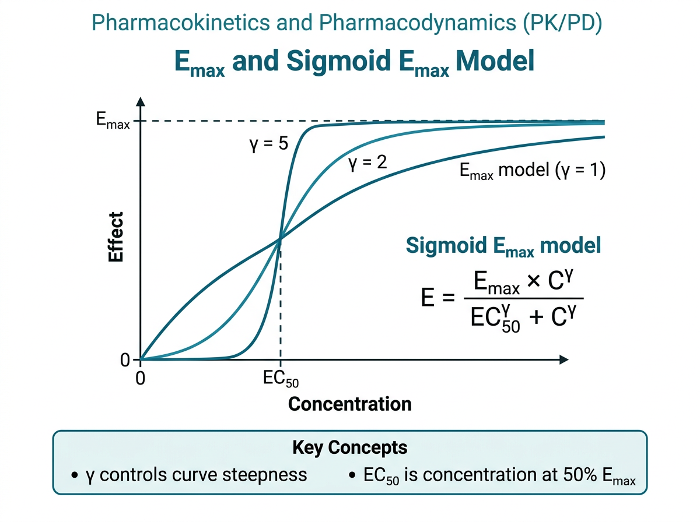
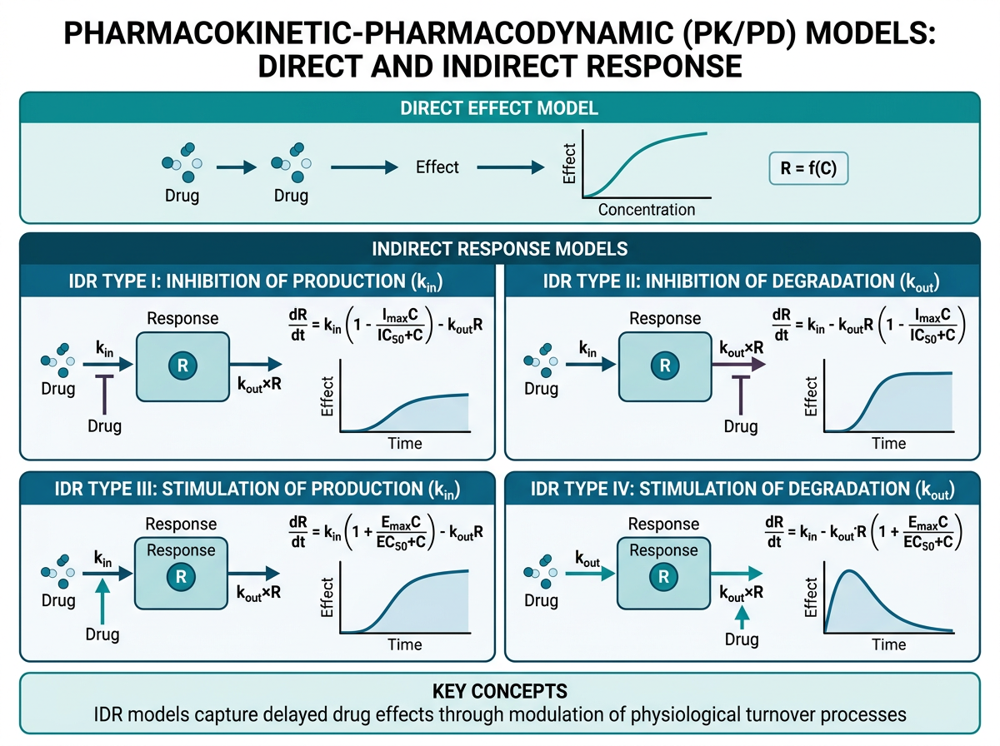
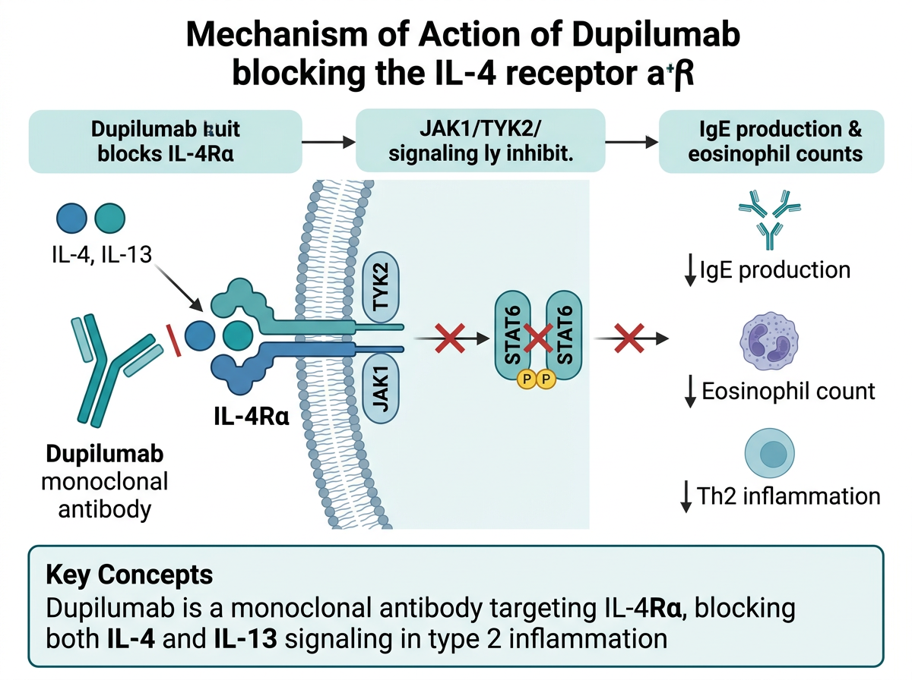

# PK-PD 분석의 핵심 개념과 관심사 {#sec-pkpd-concerns}

지금까지 약동학(PK) 데이터의 수집, 전처리, 탐색적 분석, 비구획분석까지의 과정을 학습했습니다. 이 장에서는 PK 분석을 넘어 **약력학(PD)과의 연결**, 즉 **PK-PD 관계(pharmacokinetic-pharmacodynamic relationship)**의 핵심 개념을 다룹니다. 약물의 혈중 농도가 임상 효과로 이어지는 과정을 수학적으로 기술하고, 이를 R 코드로 구현하는 방법을 학습합니다.

피부과 영역에서 PK-PD 관계는 특히 중요합니다. 아토피 피부염에서 Dupilumab의 혈중 농도가 EASI score 개선과 어떤 관계를 가지는지, 건선에서 생물학적 제제의 농도가 PASI 반응률에 어떻게 영향을 미치는지를 이해하는 것은 **개인 맞춤 치료(precision medicine)**의 기반이 됩니다.

```{r}
#| eval: false
# 이 장에서 사용하는 패키지
library(tidyverse)    # 데이터 처리 및 시각화
library(mrgsolve)     # PK-PD 모델 시뮬레이션
library(gt)           # 출판 품질 테이블
library(patchwork)    # 그래프 조합
library(scales)       # 축 스케일링
```

---

## PK-PD 관계의 기본 개념 {#sec-pkpd-basics}

### 약물 효과의 두 가지 경로

약물이 체내에 투여된 후 효과가 나타나기까지의 과정은 크게 두 단계로 나눌 수 있습니다:

1. **약동학(PK)**: 약물의 흡수, 분포, 대사, 배설 — "몸이 약물에게 하는 일"
2. **약력학(PD)**: 약물 농도와 약리학적 효과의 관계 — "약물이 몸에게 하는 일"

PK-PD 모델링은 이 두 과정을 연결하여 **투여량(dose) → 혈중 농도(concentration) → 효과(effect)**의 전체 경로를 정량적으로 기술합니다.

```
투여량 (Dose)
    │
    ▼
  PK 과정 (흡수 → 분포 → 대사 → 배설)
    │
    ▼
혈중 농도 (Concentration)
    │
    ▼
  PD 과정 (수용체 결합 → 신호전달 → 생리 변화)
    │
    ▼
임상 효과 (Clinical Effect)
```

### 직접 효과 vs 간접 효과 {#sec-direct-indirect}

PK-PD 관계는 약물 농도와 효과 사이의 시간적 관계에 따라 크게 두 가지로 분류됩니다.

**직접 효과(Direct Effect) 모델**은 약물 농도와 효과가 **즉각적으로 평형**을 이루는 경우에 적용됩니다. 즉, 혈장 농도가 변하면 효과도 즉시 변합니다. 수학적으로 효과 $E$가 현재 농도 $C$의 함수로 직접 표현됩니다:

$$E = f(C)$$

예를 들어, 항히스타민제의 소양증 억제 효과는 비교적 빠르게 나타나며, 혈중 농도와 효과 사이에 큰 시간 지연이 없습니다.

**간접 효과(Indirect Effect) 모델**은 약물 농도와 효과 사이에 **시간 지연(temporal delay)**이 있는 경우에 적용됩니다. 대부분의 생물학적 제제와 면역조절 약물이 이에 해당합니다. 간접 효과 모델에서 약물은 효과 자체를 직접 변화시키는 것이 아니라, 효과의 **생성(production)** 또는 **소실(dissipation)** 속도를 변화시킵니다.

$$\frac{dR}{dt} = k_{in} - k_{out} \cdot R$$

여기서:

- $R$: 반응(response) 변수
- $k_{in}$: 반응의 생성 속도 (zero-order)
- $k_{out}$: 반응의 소실 속도 상수 (first-order)

간접 반응 모델은 약물이 어떤 과정에 작용하느냐에 따라 4가지 유형으로 분류됩니다:

| 모델 | 약물의 작용 | 수식 | 예시 |
|------|------------|------|------|
| IDR-I (Inhibition of $k_{in}$) | 생성 억제 | $\frac{dR}{dt} = k_{in} \cdot (1 - I(C)) - k_{out} \cdot R$ | 코르티솔 분비 억제 |
| IDR-II (Inhibition of $k_{out}$) | 소실 억제 | $\frac{dR}{dt} = k_{in} - k_{out} \cdot (1 - I(C)) \cdot R$ | 백혈구 수치 증가 (G-CSF) |
| IDR-III (Stimulation of $k_{in}$) | 생성 촉진 | $\frac{dR}{dt} = k_{in} \cdot (1 + S(C)) - k_{out} \cdot R$ | 적혈구 생성 촉진 (EPO) |
| IDR-IV (Stimulation of $k_{out}$) | 소실 촉진 | $\frac{dR}{dt} = k_{in} - k_{out} \cdot (1 + S(C)) \cdot R$ | 요산 배설 촉진 |

여기서 $I(C)$는 억제 함수, $S(C)$는 자극 함수로, 일반적으로 아래에서 설명할 Emax 형태를 사용합니다.

:::{.callout-note}
## 피부과 약물과 간접 효과

피부과에서 사용되는 생물학적 제제의 효과는 대부분 간접 효과 모델로 설명됩니다. Dupilumab은 IL-4/IL-13 신호전달을 차단하여 Th2 면역반응의 **생성을 억제**하며(IDR-I 유형), 이 면역학적 변화가 피부 염증 감소 → EASI score 개선으로 이어지는 데 수 주가 소요됩니다. 따라서 혈중 농도 최고치와 최대 임상 효과 사이에 상당한 시간 지연이 존재합니다.
:::

### Emax 모델: 농도-효과 관계의 기본 {#sec-emax-model}

{#fig-ch10-1 width=100%}

약물 농도와 효과의 관계를 기술하는 가장 기본적이고 널리 사용되는 모델은 **Emax 모델**입니다. 이 모델은 수용체 이론(receptor theory)에서 유래했으며, 약물-수용체 결합의 포화성(saturable binding)을 반영합니다.

$$E = E_0 + \frac{E_{max} \cdot C}{EC_{50} + C}$$

각 파라미터의 의미:

| 파라미터 | 정의 | 단위 |
|----------|------|------|
| $E_0$ | 기저 효과 (baseline effect) — 약물이 없을 때의 효과 수준 | 효과의 단위 |
| $E_{max}$ | 최대 효과 (maximum effect) — 약물이 달성할 수 있는 최대 효과 변화량 | 효과의 단위 |
| $C$ | 약물 농도 (drug concentration) | 농도 단위 (예: ng/mL, μg/mL) |
| $EC_{50}$ | 최대 효과의 50%를 달성하는 농도 (potency 지표) | 농도 단위 |

$EC_{50}$는 약물의 **potency(효력)**를 나타내는 핵심 지표입니다. $EC_{50}$가 낮을수록 낮은 농도에서 효과를 나타내므로 potency가 높은 약물입니다.

:::{.callout-important}
## EC50의 임상적 해석

$EC_{50}$는 단순히 "최대 효과의 절반이 나타나는 농도"를 넘어서 중요한 임상적 의미를 가집니다:

1. **용량 설정의 기준**: 목표 농도를 $EC_{50}$ 근처로 설정하면, 이론적으로 최대 효과의 약 50%를 기대할 수 있습니다.
2. **약물 비교**: 두 약물의 $E_{max}$가 동일하다면, $EC_{50}$가 낮은 약물이 더 potent합니다.
3. **치료역 설정**: 일반적으로 $EC_{50}$의 1-3배 범위가 임상적으로 유효한 농도 범위로 고려됩니다.
4. **농도-효과 곡선의 위치**: $EC_{50}$는 곡선을 좌우로 이동시키는 파라미터입니다.
:::

### Sigmoid Emax 모델 (Hill Equation) {#sec-sigmoid-emax}

기본 Emax 모델의 확장형인 **Sigmoid Emax 모델**은 **Hill equation**으로도 불리며, 농도-효과 곡선의 **기울기(steepness)**를 추가로 조절할 수 있습니다:

$$E = E_0 + \frac{E_{max} \cdot C^{\gamma}}{EC_{50}^{\gamma} + C^{\gamma}}$$

여기서 $\gamma$ (gamma)는 **Hill 계수(Hill coefficient)**로, 곡선의 기울기를 결정합니다.

| $\gamma$ 값 | 의미 | 농도-효과 곡선 특성 |
|-------------|------|-------------------|
| $\gamma = 1$ | 기본 Emax 모델과 동일 | 점진적 변화 (hyperbolic) |
| $\gamma < 1$ | 완만한 기울기 | 넓은 농도 범위에서 점진적 효과 변화 |
| $\gamma > 1$ | 가파른 기울기 | 좁은 농도 범위에서 급격한 효과 변화 (switch-like) |
| $\gamma \gg 1$ | 매우 가파른 기울기 | on/off에 가까운 반응 — 임계 농도(threshold)가 존재 |

Hill 계수의 **약리학적 의미**는 다음과 같습니다:

- $\gamma = 1$: 단일 수용체에 대한 단순 결합 (Michaelis-Menten kinetics)
- $\gamma > 1$: 양성 협동성(positive cooperativity) — 하나의 약물 분자가 결합하면 다른 분자의 결합이 촉진됨
- $\gamma < 1$: 음성 협동성(negative cooperativity) — 결합이 다른 결합을 방해함

:::{.callout-tip}
## 실용적 관점에서의 Hill 계수

임상 PK-PD 분석에서 Hill 계수는 반드시 생물학적 협동성을 반영하지 않으며, **경험적 파라미터(empirical parameter)**로 해석하는 것이 적절합니다. $\gamma > 1$은 좁은 치료역(narrow therapeutic window)을 시사하며, 용량 조절에 더 주의가 필요함을 의미합니다. 반대로 $\gamma < 1$은 넓은 용량 범위에서 비교적 안정적인 효과를 기대할 수 있음을 시사합니다.
:::

### 농도-효과 곡선의 특성

Emax 모델에서 약물 농도에 따른 효과를 정리하면 다음과 같습니다:

| 농도 범위 | 효과 | 특성 |
|-----------|------|------|
| $C \ll EC_{50}$ | $E \approx \frac{E_{max}}{EC_{50}} \cdot C$ (선형) | 농도에 비례하여 효과 증가 |
| $C = EC_{50}$ | $E = \frac{E_{max}}{2}$ | 최대 효과의 50% |
| $C = 3 \times EC_{50}$ | $E = \frac{3}{4} E_{max}$ ($\gamma = 1$일 때) | 최대 효과의 75% |
| $C \gg EC_{50}$ | $E \approx E_{max}$ | 효과 포화 — 농도를 더 올려도 효과 증가 미미 |

이 특성은 임상적으로 중요한 시사점을 가집니다. 농도가 $EC_{50}$보다 충분히 높으면 효과는 거의 포화 상태에 도달하며, 이 영역에서 용량을 증가시키면 **효과 증가는 미미하지만 부작용 위험은 증가**합니다. 이것이 바로 최적 용량(optimal dose)을 결정하는 핵심 원리입니다.

---

## 효과 지연과 Effect Compartment {#sec-hysteresis}

{#fig-ch10-2 width=100%}

### Hysteresis의 개념 {#sec-hysteresis-concept}

임상 현장에서 약물의 혈중 농도와 효과를 동시에 측정하면, 두 변수 사이에 **시간 지연(temporal delay)**이 존재하는 경우가 대부분입니다. 이러한 시간 지연은 농도-효과 관계를 xy 평면에 그렸을 때 **히스테리시스 루프(hysteresis loop)**로 나타납니다.

**Clockwise Hysteresis (시계 방향 히스테리시스)**:

- 같은 농도에서 **농도 상승 시 효과가 더 크고**, 하강 시 더 작음
- 원인: 급성 내성(acute tolerance, tachyphylaxis)
- 예: Morphine의 진통 효과 — 반복 투여 시 같은 농도에서 효과 감소

**Counter-clockwise Hysteresis (반시계 방향 히스테리시스)**:

- 같은 농도에서 **농도 상승 시 효과가 더 작고**, 하강 시 더 큼
- 원인:
  - 효과 부위(effect site)로의 약물 분포 지연
  - 간접 효과 메커니즘 (생리적 반응의 시간 소요)
  - 활성 대사체(active metabolite)의 생성
- 예: 대부분의 생물학적 제제, 면역조절 약물

```{r}
#| eval: false
# Hysteresis loop 시각화를 위한 시뮬레이션 데이터 생성
# Counter-clockwise hysteresis 예시

time <- seq(0, 48, by = 0.5)

# PK: 1-compartment, oral absorption
ka <- 1.5    # 흡수 속도상수 (1/h)
ke <- 0.1    # 소실 속도상수 (1/h)
dose <- 100  # mg
Vd <- 50     # L

conc <- (dose / Vd) * (ka / (ka - ke)) * (exp(-ke * time) - exp(-ka * time))

# PD: Effect compartment with delay
ke0 <- 0.05  # effect compartment 속도상수 (1/h)
ce <- numeric(length(time))
dt <- 0.5

for (i in 2:length(time)) {
  ce[i] <- ce[i-1] + dt * ke0 * (conc[i-1] - ce[i-1])
}

# Emax model with effect site concentration
Emax <- 100
EC50 <- 1.0
effect <- Emax * ce / (EC50 + ce)

hysteresis_data <- tibble(
  time = time,
  concentration = conc,
  ce = ce,
  effect = effect
)

# Counter-clockwise hysteresis loop 그래프
p_hysteresis <- ggplot(hysteresis_data, aes(x = concentration, y = effect)) +
  geom_path(
    arrow = arrow(length = unit(0.3, "cm"), type = "closed"),
    linewidth = 1,
    color = "steelblue"
  ) +
  geom_point(
    data = hysteresis_data %>% filter(time %in% seq(0, 48, by = 4)),
    size = 2, color = "darkblue"
  ) +
  labs(
    x = "혈장 농도 (Plasma Concentration, ng/mL)",
    y = "효과 (Effect, %)",
    title = "Counter-clockwise Hysteresis Loop"
  ) +
  theme_minimal(base_family = "NanumGothic") +
  theme(
    plot.title = element_text(face = "bold", size = 14),
    axis.title = element_text(size = 12)
  )

print(p_hysteresis)
```

### Effect Compartment 모델 {#sec-effect-compartment}

반시계 방향 히스테리시스를 모델링하는 가장 일반적인 방법은 **Effect Compartment (효과 구획) 모델**입니다. 이 모델에서는 실제 효과 부위에서의 약물 농도($C_e$)가 혈장 농도($C_p$)와 즉시 평형을 이루지 않고, 일정한 시간 지연을 두고 평형에 도달한다고 가정합니다.

Effect compartment의 미분방정식:

$$\frac{dC_e}{dt} = k_{e0} \cdot (C_p - C_e)$$

여기서 $k_{e0}$는 **effect compartment equilibration rate constant**로, $C_e$가 $C_p$를 따라잡는 속도를 결정합니다.

| 파라미터 | 의미 | 큰 $k_{e0}$일 때 | 작은 $k_{e0}$일 때 |
|----------|------|-------------------|-------------------|
| $k_{e0}$ | 평형 속도상수 | 빠른 평형 도달 → 지연 적음 | 느린 평형 도달 → 큰 지연 |
| $t_{1/2, k_{e0}} = \frac{0.693}{k_{e0}}$ | 평형 반감기 | 짧은 반감기 | 긴 반감기 |

Effect compartment 모델의 핵심 개념:

1. Effect compartment는 약물의 질량 균형(mass balance)에 영향을 주지 않는 **가상 구획**입니다.
2. $C_e$는 실제 측정할 수 없으며, 모델에서 추정됩니다.
3. PD 효과는 $C_p$가 아닌 $C_e$의 함수로 표현됩니다: $E = f(C_e)$
4. 항정상태(steady state)에서 $C_e = C_p$이므로 히스테리시스가 사라집니다.

:::{.callout-warning}
## Effect Compartment vs 간접 반응 모델

Effect compartment 모델은 효과 부위로의 **약물 분포 지연**을 설명합니다. 반면, 간접 반응 모델(IDR)은 **생리적 반응 자체의 지연**을 설명합니다. 피부과 생물학적 제제의 경우, 약물이 표적(IL-4Rα 등)에 결합하는 것은 비교적 빠르지만, 면역 반응의 변화와 피부 조직의 재생은 느리므로 IDR 모델이 더 적절할 수 있습니다. 두 접근법의 선택은 약물의 작용 기전과 데이터의 특성에 따라 결정됩니다.
:::

### 피부과 약물에서의 효과 지연 {#sec-dermatology-delay}

피부과 약물에서 효과 지연은 매우 흔한 현상이며, 그 원인과 정도는 약물마다 다릅니다:

**Dupilumab (아토피 피부염)**:

- 투여 후 EASI score의 유의한 개선은 **2-4주**에 시작
- 최대 효과 도달까지 **16주 이상** 소요
- 원인: IL-4/IL-13 차단 → Th2 면역반응 감소 → 피부 장벽 회복 → 임상 개선이라는 다단계 과정
- Trough 농도(C~trough~)와 EASI 변화의 관계에서 반시계 방향 히스테리시스 관찰

**Secukinumab (건선)**:

- PASI75 달성까지 **12주** 기준으로 평가
- Loading dose 기간(0, 1, 2, 3, 4주)에 빠른 효과 발현 유도
- IL-17A 차단 → 각질형성세포(keratinocyte) 과증식 억제 → 피부 턴오버 정상화

**Topical Corticosteroids (국소 스테로이드)**:

- 비교적 빠른 효과 발현 (수일 이내)
- 그러나 장기 사용 시 **tachyphylaxis(급성 내성)** 발생 — clockwise hysteresis
- 간헐적 사용(weekend therapy)으로 내성 방지 전략

---

## 약력학 엔드포인트의 종류 {#sec-pd-endpoints}

PK-PD 분석에서 사용하는 약력학 엔드포인트는 데이터 유형에 따라 분류되며, 각 유형에 적합한 PK-PD 모델과 통계 방법이 다릅니다.

### 연속형 엔드포인트 (Continuous Endpoints) {#sec-continuous-endpoints}

연속형 PD 엔드포인트는 수치적으로 연속적인 값을 가지며, 직접 Emax 모델이나 간접 반응 모델로 연결할 수 있습니다.

| 엔드포인트 | 질환 | 범위 | 임상적 의미 |
|-----------|------|------|------------|
| EASI (Eczema Area and Severity Index) | 아토피 피부염 | 0-72 | 높을수록 중증, EASI-75는 75% 이상 감소 |
| PASI (Psoriasis Area and Severity Index) | 건선 | 0-72 | 높을수록 중증, PASI75/90/100 |
| SCORAD (SCORing Atopic Dermatitis) | 아토피 피부염 | 0-103 | 객관적 + 주관적 증상 포함 |
| BSA (Body Surface Area) | 피부 질환 전반 | 0-100% | 병변 면적 비율 |
| DLQI (Dermatology Life Quality Index) | 피부 질환 전반 | 0-30 | 환자 보고 결과(PRO), 삶의 질 |
| Pruritus NRS (Numerical Rating Scale) | 소양증 | 0-10 | 환자가 직접 보고하는 가려움 정도 |
| DAS28 (Disease Activity Score 28) | 류마티스 관절염 | 0-9.4 | ESR/CRP + 압통/종창 관절수 |
| ACR20/50/70 response | 류마티스 관절염 | 비율(%) | 복합 반응 기준 달성률 |

:::{.callout-note}
## PK-PD 모델링에서 연속형 엔드포인트의 장점

연속형 엔드포인트는 이분형이나 순서형에 비해 **더 많은 정보**를 담고 있으며, PK-PD 모델의 파라미터 추정 **정밀도(precision)**가 높습니다. 예를 들어, EASI score의 연속적 변화를 모델링하면 EASI-75 달성 여부만으로 분석하는 것보다 농도-효과 관계를 더 정밀하게 기술할 수 있습니다. 따라서 가능하면 원래의 연속형 데이터를 활용하고, 이분형 엔드포인트는 보조적으로 사용하는 것이 바람직합니다.
:::

### 이분형 엔드포인트 (Binary Endpoints) {#sec-binary-endpoints}

이분형 PD 엔드포인트는 "달성" 또는 "미달성"으로 분류되며, 규제 기관(FDA, EMA)에서 **주요 유효성 평가변수(primary efficacy endpoint)**로 흔히 사용됩니다.

| 엔드포인트 | 정의 | 질환 |
|-----------|------|------|
| PASI75 | Baseline에서 PASI 75% 이상 감소 | 건선 |
| PASI90 | Baseline에서 PASI 90% 이상 감소 | 건선 |
| PASI100 | PASI = 0 (완전 관해) | 건선 |
| EASI-75 | Baseline에서 EASI 75% 이상 감소 | 아토피 피부염 |
| IGA 0/1 | IGA 0 (clear) 또는 1 (almost clear) 달성 | 피부 질환 전반 |
| ACR20 | ACR 기준 20% 이상 개선 | 류마티스 관절염 |

PK-PD 모델에서 이분형 엔드포인트는 **logistic regression**을 통해 연결됩니다:

$$P(\text{response}) = \frac{1}{1 + e^{-(\beta_0 + \beta_1 \cdot \text{Exposure})}}$$

또는 Emax 형태로:

$$P(\text{response}) = \frac{P_{max} \cdot C^{\gamma}}{EC_{50}^{\gamma} + C^{\gamma}}$$

### 순서형 엔드포인트 (Ordinal Endpoints) {#sec-ordinal-endpoints}

순서형 PD 엔드포인트는 자연스러운 순서를 가진 범주형 변수입니다.

**IGA (Investigator's Global Assessment) Scale:**

| IGA Score | 설명 | 임상적 해석 |
|-----------|------|------------|
| 0 | Clear | 완전 관해, 염증 소견 없음 |
| 1 | Almost Clear | 거의 관해, 미미한 잔존 병변 |
| 2 | Mild | 경증, 약간의 홍반/부종 |
| 3 | Moderate | 중등증, 명확한 홍반/구진/부종 |
| 4 | Severe | 중증, 광범위 병변 |

순서형 데이터의 PK-PD 모델링에는 **proportional odds model (비례 오즈 모델)** 또는 **ordered categorical model**이 사용됩니다:

$$P(Y \leq j) = \frac{1}{1 + e^{-(\alpha_j + \beta \cdot C)}}$$

여기서 $\alpha_j$는 각 범주 경계의 절편(intercept)이며, $\beta$는 농도의 효과를 나타냅니다.

### 시간-사건 엔드포인트 (Time-to-Event Endpoints) {#sec-tte-endpoints}

시간-사건 데이터는 특정 사건이 발생하기까지의 시간을 측정하며, 피부과 임상시험에서 다음과 같이 활용됩니다:

| 엔드포인트 | 정의 | 임상적 의미 |
|-----------|------|------------|
| Time to PASI75 | PASI75 달성까지의 시간 | 효과 발현 속도 |
| Time to relapse | 약물 중단 후 재발까지의 시간 | 효과 지속성 |
| Time to loss of response | 반응 소실까지의 시간 | 장기 치료 효과 |
| Time to first AE | 첫 이상반응 발생까지의 시간 | 안전성 평가 |

PK-PD 연결에서는 **Cox proportional hazards model**의 hazard function에 약물 농도를 공변량으로 포함합니다:

$$h(t) = h_0(t) \cdot \exp(\beta \cdot C(t))$$

또는 parametric hazard model:

$$h(t) = h_0(t) \cdot \left(1 + \frac{E_{max} \cdot C(t)^{\gamma}}{EC_{50}^{\gamma} + C(t)^{\gamma}}\right)$$

### 복합 엔드포인트 (Composite Endpoints) {#sec-composite-endpoints}

실제 임상시험에서는 여러 PD 엔드포인트를 조합한 복합 엔드포인트가 자주 사용됩니다.

**예시: 아토피 피부염 Phase III 시험의 Co-primary Endpoints**

1. IGA 0/1 달성 **AND** baseline에서 ≥2점 개선 (16주차)
2. EASI-75 달성 (16주차)

두 가지 모두를 충족해야 유효성이 입증된 것으로 판정합니다 (multiplicity 조정 포함).

**예시: 건선 Phase III 시험의 Primary + Key Secondary**

1. Primary: PASI90 달성 (12주차)
2. Key Secondary: IGA 0/1 달성 (12주차)
3. Key Secondary: PASI100 달성 (12주차)

:::{.callout-tip}
## 피부과 PD 마커 선택 시 고려사항

적절한 PD 엔드포인트 선택 시 다음을 고려해야 합니다:

1. **규제 요건**: FDA/EMA가 요구하는 primary endpoint가 있는지 확인
2. **민감도(sensitivity)**: 약물 효과를 감지할 수 있는 충분한 민감도
3. **신뢰도(reliability)**: 평가자 간 일치도(inter-rater reliability)
4. **환자 관련성**: 환자에게 의미 있는 임상적 변화를 반영하는지
5. **PK-PD 모델링 적합성**: 연속형이 이분형보다 모델링에 유리
:::

---

## R 실습: PK-PD 모델 시뮬레이션 {#sec-pkpd-simulation}

### Emax 모델 함수 구현 및 시각화 {#sec-emax-simulation}

먼저 Emax 모델과 Sigmoid Emax 모델을 R 함수로 구현하고, 다양한 파라미터 조합에 따른 농도-효과 곡선을 시각화합니다.

```{r}
#| eval: false
# Emax 모델 함수 정의
emax_model <- function(C, E0 = 0, Emax = 100, EC50 = 10, gamma = 1) {
  E0 + Emax * C^gamma / (EC50^gamma + C^gamma)
}

# 농도 범위 설정 (로그 스케일에서 균등 분포)
conc_range <- seq(0.01, 100, length.out = 500)

# 1. EC50 변화에 따른 Emax 곡선 비교
ec50_values <- c(1, 5, 10, 30)

ec50_data <- map_dfr(ec50_values, function(ec50) {
  tibble(
    concentration = conc_range,
    effect = emax_model(conc_range, Emax = 100, EC50 = ec50, gamma = 1),
    EC50 = paste0("EC50 = ", ec50, " ng/mL")
  )
})

p_ec50 <- ggplot(ec50_data, aes(x = concentration, y = effect, color = EC50)) +
  geom_line(linewidth = 1.2) +
  scale_x_log10(
    labels = scales::label_number(),
    breaks = c(0.01, 0.1, 1, 10, 100)
  ) +
  geom_hline(yintercept = 50, linetype = "dashed", color = "grey50", alpha = 0.7) +
  annotate("text", x = 0.015, y = 53, label = "50% Emax", hjust = 0, size = 3.5) +
  labs(
    x = "약물 농도 (ng/mL, log scale)",
    y = "효과 (%)",
    title = "EC50 변화에 따른 Emax 곡선",
    subtitle = "EC50가 낮을수록 potency가 높음 (왼쪽으로 이동)",
    color = "파라미터"
  ) +
  theme_minimal(base_family = "NanumGothic") +
  theme(
    plot.title = element_text(face = "bold", size = 14),
    legend.position = "bottom"
  ) +
  scale_color_brewer(palette = "Set2")

print(p_ec50)
```

```{r}
#| eval: false
# 2. Hill coefficient (gamma) 변화에 따른 곡선 비교
gamma_values <- c(0.5, 1, 2, 5)

gamma_data <- map_dfr(gamma_values, function(g) {
  tibble(
    concentration = conc_range,
    effect = emax_model(conc_range, Emax = 100, EC50 = 10, gamma = g),
    Gamma = paste0("γ = ", g)
  )
})

p_gamma <- ggplot(gamma_data, aes(x = concentration, y = effect, color = Gamma)) +
  geom_line(linewidth = 1.2) +
  scale_x_log10(
    labels = scales::label_number(),
    breaks = c(0.01, 0.1, 1, 10, 100)
  ) +
  geom_vline(xintercept = 10, linetype = "dashed", color = "grey50", alpha = 0.7) +
  annotate("text", x = 12, y = 10, label = "EC50 = 10", hjust = 0, size = 3.5) +
  labs(
    x = "약물 농도 (ng/mL, log scale)",
    y = "효과 (%)",
    title = "Hill 계수(γ) 변화에 따른 Sigmoid Emax 곡선",
    subtitle = "γ가 클수록 곡선이 가파르게 변화 (switch-like)",
    color = "파라미터"
  ) +
  theme_minimal(base_family = "NanumGothic") +
  theme(
    plot.title = element_text(face = "bold", size = 14),
    legend.position = "bottom"
  ) +
  scale_color_brewer(palette = "Dark2")

print(p_gamma)
```

```{r}
#| eval: false
# 3. EC50와 gamma를 모두 조합한 비교 (2×2 facet)
param_grid <- expand_grid(
  EC50 = c(5, 20),
  gamma = c(1, 3)
)

combined_data <- pmap_dfr(param_grid, function(EC50, gamma) {
  tibble(
    concentration = conc_range,
    effect = emax_model(conc_range, Emax = 100, EC50 = EC50, gamma = gamma),
    EC50_label = paste0("EC50 = ", EC50),
    gamma_label = paste0("γ = ", gamma)
  )
})

p_combined <- ggplot(combined_data, aes(x = concentration, y = effect)) +
  geom_line(linewidth = 1.2, color = "steelblue") +
  scale_x_log10(labels = scales::label_number()) +
  facet_grid(gamma_label ~ EC50_label) +
  geom_hline(yintercept = 50, linetype = "dashed", alpha = 0.5) +
  labs(
    x = "약물 농도 (ng/mL, log scale)",
    y = "효과 (%)",
    title = "EC50와 Hill 계수 조합에 따른 농도-효과 곡선"
  ) +
  theme_minimal(base_family = "NanumGothic") +
  theme(
    plot.title = element_text(face = "bold", size = 14),
    strip.text = element_text(face = "bold", size = 11)
  )

print(p_combined)
```

### mrgsolve를 활용한 PK-PD 시뮬레이션 {#sec-mrgsolve-pkpd}

**mrgsolve**는 R 기반의 PK-PD 모델 시뮬레이션 패키지로, NONMEM과 유사한 문법으로 모델을 정의하고 빠르게 시뮬레이션할 수 있습니다. ODE(Ordinary Differential Equation) 기반의 PK-PD 모델을 손쉽게 구현할 수 있어 모델 탐색과 교육에 매우 유용합니다.

```{r}
#| eval: false
library(mrgsolve)

# 1-compartment PK + Direct Emax PD 모델
pkpd_direct <- '
$PARAM
// PK parameters
CL = 5       // Clearance (L/h)
V = 50       // Volume of distribution (L)
KA = 1.5     // Absorption rate constant (1/h)

// PD parameters
E0 = 0       // Baseline effect
EMAX = 100   // Maximum effect
EC50 = 2     // Concentration for 50% of Emax (ng/mL)
GAMMA = 1    // Hill coefficient

$CMT GUT CENT

$ODE
dxdt_GUT = -KA * GUT;
dxdt_CENT = KA * GUT - (CL/V) * CENT;

$TABLE
double CP = CENT / V;   // 혈장 농도
double EFFECT = E0 + EMAX * pow(CP, GAMMA) / (pow(EC50, GAMMA) + pow(CP, GAMMA));

$CAPTURE CP EFFECT
'

# 모델 컴파일
mod_direct <- mcode("pkpd_direct", pkpd_direct)

# 투여 스케줄: 50mg 경구 투여, 24시간 간격, 7일
ev_single <- ev(amt = 50, cmt = 1)
ev_multi  <- ev(amt = 50, cmt = 1, ii = 24, addl = 6)

# 단회 투여 시뮬레이션
sim_single <- mod_direct %>%
  ev(ev_single) %>%
  mrgsim(end = 48, delta = 0.1) %>%
  as_tibble()

# PK-PD time course 그래프
p_pk <- ggplot(sim_single, aes(x = time, y = CP)) +
  geom_line(linewidth = 1, color = "steelblue") +
  labs(x = "시간 (h)", y = "혈장 농도 (ng/mL)", title = "PK Profile") +
  theme_minimal(base_family = "NanumGothic")

p_pd <- ggplot(sim_single, aes(x = time, y = EFFECT)) +
  geom_line(linewidth = 1, color = "coral") +
  labs(x = "시간 (h)", y = "효과 (%)", title = "PD Profile (Direct Emax)") +
  theme_minimal(base_family = "NanumGothic")

p_pk / p_pd + plot_annotation(
  title = "1-Compartment PK + Direct Emax PD: 단회 경구 투여",
  theme = theme(plot.title = element_text(face = "bold", size = 14))
)
```

```{r}
#| eval: false
# 반복 투여 시뮬레이션
sim_multi <- mod_direct %>%
  ev(ev_multi) %>%
  mrgsim(end = 168, delta = 0.5) %>%
  as_tibble()

# 반복 투여 PK-PD 그래프
p_pk_multi <- ggplot(sim_multi, aes(x = time, y = CP)) +
  geom_line(linewidth = 0.8, color = "steelblue") +
  geom_hline(yintercept = 2, linetype = "dashed", color = "red", alpha = 0.7) +
  annotate("text", x = 5, y = 2.3, label = "EC50", color = "red", size = 3.5) +
  labs(x = "시간 (h)", y = "혈장 농도 (ng/mL)", title = "PK: 반복 투여") +
  theme_minimal(base_family = "NanumGothic")

p_pd_multi <- ggplot(sim_multi, aes(x = time, y = EFFECT)) +
  geom_line(linewidth = 0.8, color = "coral") +
  geom_hline(yintercept = 50, linetype = "dashed", color = "grey50", alpha = 0.5) +
  annotate("text", x = 5, y = 53, label = "50% Emax", size = 3.5) +
  labs(x = "시간 (h)", y = "효과 (%)", title = "PD: 반복 투여") +
  theme_minimal(base_family = "NanumGothic")

p_pk_multi / p_pd_multi + plot_annotation(
  title = "1-Compartment PK + Direct Emax PD: 50mg QD × 7일",
  theme = theme(plot.title = element_text(face = "bold", size = 14))
)
```

### Dupilumab PK-PD 시뮬레이션 (SC 투여 + EASI Score) {#sec-dupilumab-simulation}

이제 실제 피부과 약물인 **Dupilumab**의 PK-PD를 시뮬레이션합니다. Dupilumab은 피하(SC) 투여하는 단클론항체로, 2주 간격(Q2W) 또는 4주 간격(Q4W)으로 투여합니다. 간접 반응(IDR) 모델을 사용하여 EASI score의 시간 경과에 따른 변화를 모사합니다.

```{r}
#| eval: false
# Dupilumab PK-PD 모델 (simplified)
# PK: 1-compartment with first-order SC absorption
# PD: Indirect response model (inhibition of EASI production)

dupilumab_pkpd <- '
$PARAM
// PK parameters (Dupilumab-like)
CL = 0.36     // Clearance (L/day), ~15 mL/h
V = 4.8       // Volume of distribution (L)
KA = 0.3      // SC absorption rate constant (1/day)
F1 = 0.64     // Bioavailability (64%)

// PD parameters (EASI score)
EASI0 = 30    // Baseline EASI score (moderate-to-severe AD)
KIN = 3       // EASI production rate (score/day) = EASI0 * KOUT
KOUT = 0.1    // EASI turnover rate constant (1/day)
IC50 = 10     // Concentration for 50% inhibition (ug/mL)
IMAX = 0.9    // Maximum inhibition (90%)
GAMMA = 1.5   // Hill coefficient

$CMT SC CENT EASI

$MAIN
// Initial condition: EASI at baseline
EASI_0 = EASI0;
// Adjust F for SC compartment
F_SC = F1;

$ODE
// PK: 1-compartment with SC absorption
dxdt_SC = -KA * SC;
dxdt_CENT = KA * SC - (CL/V) * CENT;

// 혈장 농도 (ug/mL)
double CP = CENT / V;

// Inhibition function
double INH = IMAX * pow(CP, GAMMA) / (pow(IC50, GAMMA) + pow(CP, GAMMA));

// PD: Indirect response model (Type I - inhibition of production)
dxdt_EASI = KIN * (1.0 - INH) - KOUT * EASI;

$TABLE
double CPOBS = CENT / V;
double EASI_SCORE = EASI;
double EASI_CHANGE = ((EASI - EASI0) / EASI0) * 100;  // percent change from baseline

$CAPTURE CPOBS EASI_SCORE EASI_CHANGE
'

mod_dupilumab <- mcode("dupilumab_pkpd", dupilumab_pkpd)

# Dupilumab 투여 스케줄
# Loading: 600mg SC (Day 1), then 300mg Q2W
ev_dupilumab <- ev(
  amt = c(600, rep(300, 11)),
  cmt = 1,
  time = c(0, seq(14, 14*11, by = 14))
)

# 24주 시뮬레이션
sim_dupilumab <- mod_dupilumab %>%
  ev(ev_dupilumab) %>%
  mrgsim(end = 168, delta = 0.5) %>%  # 168 days = 24 weeks
  as_tibble()

# PK 프로파일
p_dup_pk <- ggplot(sim_dupilumab, aes(x = time / 7, y = CPOBS)) +
  geom_line(linewidth = 0.8, color = "steelblue") +
  labs(
    x = "시간 (주)",
    y = "혈장 농도 (μg/mL)",
    title = "Dupilumab PK Profile"
  ) +
  theme_minimal(base_family = "NanumGothic")

# EASI score 변화
p_dup_easi <- ggplot(sim_dupilumab, aes(x = time / 7, y = EASI_SCORE)) +
  geom_line(linewidth = 0.8, color = "darkgreen") +
  geom_hline(yintercept = 30 * 0.25, linetype = "dashed", color = "red") +
  annotate("text", x = 1, y = 30 * 0.25 + 1, label = "EASI-75 기준",
           color = "red", hjust = 0, size = 3.5) +
  labs(
    x = "시간 (주)",
    y = "EASI Score",
    title = "EASI Score 시간 경과"
  ) +
  theme_minimal(base_family = "NanumGothic")

# EASI % change from baseline
p_dup_change <- ggplot(sim_dupilumab, aes(x = time / 7, y = EASI_CHANGE)) +
  geom_line(linewidth = 0.8, color = "purple") +
  geom_hline(yintercept = -75, linetype = "dashed", color = "red") +
  annotate("text", x = 1, y = -72, label = "EASI-75 (-75%)",
           color = "red", hjust = 0, size = 3.5) +
  labs(
    x = "시간 (주)",
    y = "EASI 변화율 (%)",
    title = "EASI % Change from Baseline"
  ) +
  scale_y_continuous(limits = c(-100, 10)) +
  theme_minimal(base_family = "NanumGothic")

(p_dup_pk / p_dup_easi / p_dup_change) + plot_annotation(
  title = "Dupilumab PK-PD 시뮬레이션: 600mg Loading → 300mg Q2W",
  theme = theme(plot.title = element_text(face = "bold", size = 14))
)
```

```{r}
#| eval: false
# Q2W vs Q4W 투여 요법 비교
# Q2W: 600mg loading -> 300mg Q2W
ev_q2w <- ev(
  amt = c(600, rep(300, 11)),
  cmt = 1,
  time = c(0, seq(14, 14*11, by = 14))
)

# Q4W: 600mg loading -> 300mg Q4W
ev_q4w <- ev(
  amt = c(600, rep(300, 5)),
  cmt = 1,
  time = c(0, seq(28, 28*5, by = 28))
)

sim_q2w <- mod_dupilumab %>%
  ev(ev_q2w) %>%
  mrgsim(end = 168, delta = 0.5) %>%
  as_tibble() %>%
  mutate(regimen = "300mg Q2W")

sim_q4w <- mod_dupilumab %>%
  ev(ev_q4w) %>%
  mrgsim(end = 168, delta = 0.5) %>%
  as_tibble() %>%
  mutate(regimen = "300mg Q4W")

sim_compare <- bind_rows(sim_q2w, sim_q4w)

# PK 비교
p_compare_pk <- ggplot(sim_compare, aes(x = time / 7, y = CPOBS, color = regimen)) +
  geom_line(linewidth = 0.8) +
  labs(
    x = "시간 (주)", y = "혈장 농도 (μg/mL)",
    title = "PK: Q2W vs Q4W",
    color = "투여 요법"
  ) +
  theme_minimal(base_family = "NanumGothic") +
  theme(legend.position = "bottom") +
  scale_color_manual(values = c("steelblue", "coral"))

# EASI 변화 비교
p_compare_easi <- ggplot(sim_compare, aes(x = time / 7, y = EASI_CHANGE, color = regimen)) +
  geom_line(linewidth = 0.8) +
  geom_hline(yintercept = -75, linetype = "dashed", color = "grey50") +
  annotate("text", x = 22, y = -72, label = "EASI-75", size = 3.5) +
  labs(
    x = "시간 (주)", y = "EASI 변화율 (%)",
    title = "EASI % Change: Q2W vs Q4W",
    color = "투여 요법"
  ) +
  theme_minimal(base_family = "NanumGothic") +
  theme(legend.position = "bottom") +
  scale_color_manual(values = c("steelblue", "coral"))

p_compare_pk + p_compare_easi + plot_layout(ncol = 2)
```

### Hysteresis Loop 시각화 {#sec-hysteresis-visualization}

Effect compartment 모델을 사용하여 히스테리시스 루프를 시각화하고, $k_{e0}$ 값에 따른 변화를 관찰합니다.

```{r}
#| eval: false
# Effect compartment 모델
effect_cmt_model <- '
$PARAM
CL = 5, V = 50, KA = 1.5
EMAX = 100, EC50 = 1.5, GAMMA = 1
KE0 = 0.05   // Effect compartment rate constant

$CMT GUT CENT ECMT

$ODE
dxdt_GUT = -KA * GUT;
dxdt_CENT = KA * GUT - (CL/V) * CENT;
dxdt_ECMT = KE0 * (CENT/V - ECMT);

$TABLE
double CP = CENT / V;
double CE = ECMT;
double EFFECT = EMAX * pow(CE, GAMMA) / (pow(EC50, GAMMA) + pow(CE, GAMMA));

$CAPTURE CP CE EFFECT
'

mod_ecmt <- mcode("effect_cmt", effect_cmt_model)

# ke0 = 0.05 (큰 지연)
sim_slow <- mod_ecmt %>%
  param(KE0 = 0.05) %>%
  ev(ev(amt = 50, cmt = 1)) %>%
  mrgsim(end = 72, delta = 0.2) %>%
  as_tibble() %>%
  mutate(ke0_label = "ke0 = 0.05 (t1/2,eq = 13.9h)")

# ke0 = 0.2 (중간 지연)
sim_mid <- mod_ecmt %>%
  param(KE0 = 0.2) %>%
  ev(ev(amt = 50, cmt = 1)) %>%
  mrgsim(end = 72, delta = 0.2) %>%
  as_tibble() %>%
  mutate(ke0_label = "ke0 = 0.20 (t1/2,eq = 3.5h)")

# ke0 = 1.0 (거의 지연 없음)
sim_fast <- mod_ecmt %>%
  param(KE0 = 1.0) %>%
  ev(ev(amt = 50, cmt = 1)) %>%
  mrgsim(end = 72, delta = 0.2) %>%
  as_tibble() %>%
  mutate(ke0_label = "ke0 = 1.00 (t1/2,eq = 0.7h)")

sim_hysteresis <- bind_rows(sim_slow, sim_mid, sim_fast)

# Hysteresis loop 비교
ggplot(sim_hysteresis, aes(x = CP, y = EFFECT)) +
  geom_path(
    aes(color = ke0_label),
    linewidth = 1,
    arrow = arrow(length = unit(0.2, "cm"), type = "closed")
  ) +
  facet_wrap(~ke0_label, ncol = 3) +
  labs(
    x = "혈장 농도 (ng/mL)",
    y = "효과 (%)",
    title = "ke0에 따른 Hysteresis Loop 변화",
    subtitle = "ke0가 작을수록 루프가 크고 (지연이 큼), 클수록 루프가 작아짐 (평형이 빠름)"
  ) +
  theme_minimal(base_family = "NanumGothic") +
  theme(
    plot.title = element_text(face = "bold", size = 14),
    strip.text = element_text(face = "bold"),
    legend.position = "none"
  )
```

```{r}
#| eval: false
# Cp vs Ce 시간 경과 비교 (ke0 = 0.05)
p_cp_ce <- ggplot(sim_slow, aes(x = time)) +
  geom_line(aes(y = CP, color = "혈장 농도 (Cp)"), linewidth = 1) +
  geom_line(aes(y = CE, color = "효과 부위 농도 (Ce)"), linewidth = 1) +
  labs(
    x = "시간 (h)",
    y = "농도 (ng/mL)",
    title = "혈장 농도 vs 효과 부위 농도 (ke0 = 0.05)",
    subtitle = "Ce가 Cp를 시간 지연을 두고 따라감",
    color = ""
  ) +
  theme_minimal(base_family = "NanumGothic") +
  theme(
    plot.title = element_text(face = "bold", size = 14),
    legend.position = "bottom"
  ) +
  scale_color_manual(values = c("steelblue", "coral"))

print(p_cp_ce)
```

:::{.callout-tip}
## mrgsolve 모델 작성 시 주의사항

mrgsolve 모델 코드를 작성할 때 다음 사항에 유의하세요:

1. **변수 선언**: `$TABLE` 블록에서 C++ 문법을 사용합니다 (`double`, `pow()` 등)
2. **초기 조건**: `$MAIN` 블록에서 `CMT_0 = value` 형식으로 설정합니다
3. **생체이용률**: `F_CMT = value`로 특정 구획의 생체이용률을 조절합니다
4. **시뮬레이션 출력**: `$CAPTURE`에 나열된 변수만 결과에 포함됩니다
5. **수치 안정성**: `pow(x, gamma)`에서 `x = 0`이고 `gamma < 1`이면 수치 오류가 발생할 수 있으므로, 적절한 하한값을 설정하세요
:::

---

## 약리학 노트: Dupilumab의 약리학 {#sec-dupilumab-pharmacology}

{#fig-ch10-3 width=100%}

### 작용기전: IL-4Rα 차단

**Dupilumab (dupixent)**은 **IL-4 수용체 alpha 서브유닛(IL-4Rα)**에 대한 완전 인간 단클론항체(fully human monoclonal antibody, IgG4)입니다. IL-4Rα는 두 가지 사이토카인 수용체 복합체의 공통 구성요소입니다:

1. **Type I IL-4 receptor**: IL-4Rα + γc (common gamma chain)
   - IL-4만 신호전달
   - 주로 림프구에서 발현
2. **Type II IL-4 receptor**: IL-4Rα + IL-13Rα1
   - IL-4와 IL-13 모두 신호전달
   - 비조혈 세포(keratinocyte, fibroblast 등)에서도 발현

Dupilumab은 IL-4Rα에 결합하여 **IL-4와 IL-13 모두의 신호전달을 동시에 차단**합니다. 이는 하류(downstream) 신호경로인 **JAK1-STAT6 pathway**의 활성화를 억제합니다.

### Th2 면역반응 조절

아토피 피부염의 핵심 병태생리는 **Th2 편향 면역반응(Th2-skewed immune response)**입니다. IL-4와 IL-13은 이 과정에서 핵심적인 역할을 합니다:

| 사이토카인 | 주요 작용 | Dupilumab에 의한 억제 효과 |
|-----------|----------|-------------------------|
| IL-4 | T 세포의 Th2 분화 유도 | Th2 면역 편향 감소 |
| IL-4 | B 세포의 IgE class switching | 혈청 IgE 감소 |
| IL-13 | 각질형성세포의 장벽 단백질(filaggrin) 발현 억제 | 피부 장벽 기능 회복 |
| IL-13 | 호산구 침윤 촉진 | 피부 염증 감소 |
| IL-4/IL-13 | 점액 분비 촉진 (기도) | 천식 증상 개선 |

:::{.callout-note}
## Dupilumab의 적응증 확대

Dupilumab은 아토피 피부염으로 최초 승인(FDA 2017)된 이후, Th2 면역반응이 관여하는 다양한 질환으로 적응증이 확대되었습니다:

- **아토피 피부염** (2017): 성인 및 소아(6개월 이상)
- **천식** (2018): 호산구성 또는 OCS-의존 중등증-중증 천식
- **비용종 동반 만성 비부비동염** (2019)
- **결절성 양진** (2022)
- **호산구성 식도염** (2022)
- **COPD** (2024): 호산구 증가가 동반된 COPD

이러한 적응증 확대는 IL-4/IL-13 경로가 다양한 Th2 관련 질환에 공통적으로 관여함을 반영합니다.
:::

### 아토피 피부염에서의 임상 효과

Dupilumab의 효과는 여러 대규모 Phase III 임상시험(SOLO 1&2, CHRONOS, CAFE 등)에서 확인되었습니다:

| 시험 | 대상 | 투여 요법 | EASI-75 (16주) | IGA 0/1 (16주) |
|------|------|----------|---------------|---------------|
| SOLO 1 | 중등증-중증 AD | 300mg Q2W | 51% vs 15% (placebo) | 38% vs 10% |
| SOLO 2 | 중등증-중증 AD | 300mg Q2W | 44% vs 12% (placebo) | 36% vs 8% |
| CHRONOS | AD + TCS 병용 | 300mg Q2W + TCS | 69% vs 23% (placebo + TCS) | 39% vs 12% |

**핵심 관찰:**

- EASI-75 달성률: 약 44-69% (monotherapy vs combination)
- Placebo response: 12-23% (피부과에서 placebo 효과가 상당함)
- 효과 발현 시작: 2주 시점부터 placebo 대비 유의한 차이
- 최대 효과: 16주 이후에도 지속적으로 개선

### Dupilumab의 약동학 {#sec-dupilumab-pk}

Dupilumab의 약동학적 특성은 단클론항체의 전형적인 특성과 표적 매개 약물 배치(Target-Mediated Drug Disposition, TMDD)의 특성을 모두 보여줍니다.

**기본 PK 파라미터:**

| 파라미터 | 값 | 비고 |
|----------|------|------|
| 생체이용률 (F) | ~64% | SC 투여 |
| T~max~ | 3-7일 | SC 투여 후 |
| 반감기 (t~1/2~) | ~26일 | 항정상태 |
| CL/F (linear) | ~0.36 L/day | 체중에 따라 변화 |
| V~d~/F | ~4.8 L | 혈관 내 분포가 주 |
| 항정상태 도달 | ~16주 (Q2W) | 600mg loading 시 단축 |

**Target-Mediated Drug Disposition (TMDD):**

Dupilumab의 약동학에서 가장 주목할 특징은 **비선형 소실(nonlinear elimination)**입니다. 이는 약물이 표적 수용체(IL-4Rα)에 결합하여 내재화(internalization)되면서 소실되는 **TMDD 기전** 때문입니다.

$$\frac{dC}{dt} = \text{Input} - CL_{linear} \cdot C - \frac{V_{max} \cdot C}{K_m + C}$$

- 저농도: $C \ll K_m$이면 TMDD가 지배적 → 빠른 소실
- 고농도: $C \gg K_m$이면 수용체가 포화 → 선형 소실이 지배적
- 임상적 의미: 600mg loading dose를 사용하는 이유 중 하나가 빠르게 수용체를 포화시켜 선형 PK 영역에 도달하기 위함

**PK에 영향을 미치는 공변량:**

| 공변량 | 영향 | 임상적 의미 |
|--------|------|------------|
| 체중 | 체중 증가 시 CL 증가, Ctrough 감소 | 비만 환자에서 효과 감소 가능성 |
| 나이 | 임상적으로 유의한 영향 없음 | 용량 조절 불필요 |
| 성별 | 체중 보정 후 유의한 차이 없음 | 용량 조절 불필요 |
| ADA (Anti-Drug Antibody) | 일부 환자에서 Ctrough 감소 | 약 5-8%에서 ADA 양성 |
| Baseline albumin | 알부민 낮을 때 CL 소폭 증가 | 중증 AD에서 고려 |
| Baseline IgE | IgE 높을 때 CL 소폭 증가 | TMDD 기전 반영 |

### PK-PD 관계: 혈중 농도와 EASI Score {#sec-dupilumab-pkpd}

Dupilumab의 노출-반응(exposure-response) 관계에서 가장 많이 사용되는 PK 지표는 **trough 농도(C~trough~)**이며, PD 지표로는 EASI score의 **% change from baseline**이 사용됩니다.

```{r}
#| eval: false
# Dupilumab 노출-반응 관계 시각화 (모의 데이터)
set.seed(42)

n_patients <- 200

# 모의 데이터 생성
dupilumab_er <- tibble(
  patient_id = 1:n_patients,
  # Ctrough at Week 16 (ug/mL) - 대략적인 분포
  ctrough = c(
    rlnorm(50, log(0.5), 0.8),   # Placebo-like (very low)
    rlnorm(75, log(50), 0.5),    # Q4W
    rlnorm(75, log(80), 0.4)     # Q2W
  ),
  regimen = c(
    rep("Placebo", 50),
    rep("300mg Q4W", 75),
    rep("300mg Q2W", 75)
  )
) %>%
  mutate(
    # EASI % change from baseline (Emax-like relationship + noise)
    easi_change = case_when(
      regimen == "Placebo" ~ rnorm(n(), -20, 15),
      TRUE ~ -90 * ctrough^1.2 / (40^1.2 + ctrough^1.2) + rnorm(n(), 0, 10)
    ),
    easi_change = pmax(pmin(easi_change, 10), -100),  # 범위 제한
    easi75 = ifelse(easi_change <= -75, "EASI-75 달성", "미달성")
  )

# Exposure-Response: Ctrough vs EASI % change
p_er <- ggplot(dupilumab_er %>% filter(regimen != "Placebo"),
               aes(x = ctrough, y = easi_change)) +
  geom_point(aes(color = easi75), alpha = 0.6, size = 2) +
  geom_smooth(method = "loess", se = TRUE, color = "black", linewidth = 1) +
  geom_hline(yintercept = -75, linetype = "dashed", color = "red") +
  annotate("text", x = 5, y = -72, label = "EASI-75 기준", color = "red",
           hjust = 0, size = 3.5) +
  labs(
    x = expression(C[trough]~"at Week 16 (μg/mL)"),
    y = "EASI % Change from Baseline",
    title = "Dupilumab 노출-반응 관계",
    subtitle = "Ctrough가 높을수록 EASI 개선이 큼 (모의 데이터)",
    color = ""
  ) +
  theme_minimal(base_family = "NanumGothic") +
  theme(
    plot.title = element_text(face = "bold", size = 14),
    legend.position = "bottom"
  ) +
  scale_color_manual(values = c("grey60", "steelblue"))

print(p_er)
```

```{r}
#| eval: false
# Ctrough quartile별 EASI-75 달성률
er_quartile <- dupilumab_er %>%
  filter(regimen != "Placebo") %>%
  mutate(
    ctrough_q = cut(
      ctrough,
      breaks = quantile(ctrough, probs = c(0, 0.25, 0.5, 0.75, 1)),
      labels = c("Q1 (lowest)", "Q2", "Q3", "Q4 (highest)"),
      include.lowest = TRUE
    )
  ) %>%
  group_by(ctrough_q) %>%
  summarise(
    n = n(),
    easi75_n = sum(easi75 == "EASI-75 달성"),
    easi75_rate = mean(easi75 == "EASI-75 달성") * 100,
    mean_change = mean(easi_change),
    .groups = "drop"
  )

# Quartile별 달성률 막대 그래프
p_quartile <- ggplot(er_quartile, aes(x = ctrough_q, y = easi75_rate)) +
  geom_col(fill = "steelblue", alpha = 0.8, width = 0.6) +
  geom_text(aes(label = paste0(round(easi75_rate), "%")),
            vjust = -0.5, size = 4, fontface = "bold") +
  labs(
    x = expression(C[trough]~"Quartile"),
    y = "EASI-75 달성률 (%)",
    title = "Ctrough Quartile별 EASI-75 달성률",
    subtitle = "노출이 높을수록 반응률이 높아지는 경향"
  ) +
  scale_y_continuous(limits = c(0, 100)) +
  theme_minimal(base_family = "NanumGothic") +
  theme(plot.title = element_text(face = "bold", size = 14))

print(p_quartile)

# gt 테이블로 요약
er_quartile %>%
  gt() %>%
  tab_header(
    title = "Dupilumab Ctrough Quartile별 EASI-75 반응률",
    subtitle = "모의 데이터 기반 노출-반응 분석"
  ) %>%
  cols_label(
    ctrough_q = "Ctrough Quartile",
    n = "N",
    easi75_n = "EASI-75 달성 (n)",
    easi75_rate = "달성률 (%)",
    mean_change = "평균 EASI 변화 (%)"
  ) %>%
  fmt_number(columns = c(easi75_rate, mean_change), decimals = 1) %>%
  tab_footnote("모의 데이터: 실제 임상 데이터와 다를 수 있음")
```

:::{.callout-important}
## 노출-반응 분석의 주의점

위 분석에서 Ctrough quartile별 반응률 차이가 관찰되더라도, 이를 **인과관계(causality)**로 해석할 때는 주의가 필요합니다:

1. **교란 변수(confounders)**: 체중이 큰 환자는 같은 용량에서 Ctrough가 낮고, 동시에 질환 중증도가 높을 수 있습니다.
2. **선택 편향(selection bias)**: 약물에 잘 반응하는 환자가 치료를 지속하여 Ctrough가 축적될 수 있습니다.
3. **TMDD 영향**: 질환이 활성화된 환자는 IL-4Rα 발현이 높아 Dupilumab의 CL이 증가하고 Ctrough가 감소합니다.

따라서 단순 quartile 분석 외에도 population PK-PD 모델링을 통한 공변량 보정이 필요합니다.
:::

---

## Claude Code 활용 팁 {#sec-claude-tips-10}

### PK-PD 모델 수식을 R 코드로 변환

PK-PD 모델의 수학적 수식을 R 코드로 변환할 때 Claude Code를 활용하면 효율적입니다:

```
"다음 PK-PD 모델을 R 함수로 구현해줘:
- PK: 2-compartment model (IV bolus)
  dA1/dt = -(CL/V1 + Q/V1)*A1 + (Q/V2)*A2
  dA2/dt = (Q/V1)*A1 - (Q/V2)*A2
  Cp = A1/V1
- PD: Sigmoid Emax with effect compartment
  dCe/dt = ke0*(Cp - Ce)
  E = E0 + Emax*Ce^gamma/(EC50^gamma + Ce^gamma)

파라미터: CL=10 L/h, V1=20 L, V2=30 L, Q=15 L/h,
          E0=0, Emax=100, EC50=5, ke0=0.1, gamma=2

1000mg IV bolus 투여 후 72시간 시뮬레이션하고,
PK (Cp vs time), PD (Effect vs time),
Hysteresis loop (Cp vs Effect)를 그려줘."
```

### mrgsolve 모델 생성 요청

복잡한 PK-PD 모델을 mrgsolve 문법으로 작성할 때:

```
"Dupilumab의 TMDD PK 모델을 mrgsolve로 구현해줘.
사용할 모델 구조:
- PK: 2-compartment + quasi-steady state (QSS) TMDD
- SC absorption with first-order kinetics
- Target: IL-4Rα (R)
- Drug-target complex: DR

파라미터는 FDA label과 published PopPK 논문의 값을 참고해서 설정하고,
600mg loading -> 300mg Q2W 16주 시뮬레이션해줘.
Free drug, total drug, target occupancy를 시간 경과로 시각화해줘."
```

### 시뮬레이션 기반 용량 최적화

```
"위 Dupilumab PK-PD 모델을 사용해서 체중별 최적 용량을 탐색해줘.
시나리오:
- 체중: 50, 70, 90, 120 kg
- 용량: 200, 300, 400, 600 mg Q2W
- 목표: Week 16에서 EASI-75 달성 확률 > 70%

각 체중-용량 조합에 대해 1000명 가상 환자를 시뮬레이션하고,
결과를 heatmap으로 시각화해줘."
```

---

## 연습 문제 {#sec-exercises-10}

### 확인 문제

1. Emax 모델에서 $EC_{50}$의 정의를 설명하고, $EC_{50}$가 **potency**를 나타내는 이유를 수용체 이론의 관점에서 설명하세요.

2. Hill 계수 $\gamma = 0.5$, $\gamma = 1$, $\gamma = 3$인 경우, $EC_{50}$의 2배 농도에서 각각 최대 효과의 몇 %가 달성되는지 계산하세요.

3. Counter-clockwise hysteresis가 나타나는 세 가지 원인을 제시하고, 각각에 해당하는 약물 예시를 들어 설명하세요.

4. 간접 반응 모델(IDR)의 4가지 유형을 나열하고, Dupilumab의 EASI score에 대한 효과가 어떤 유형에 해당하는지 근거와 함께 설명하세요.

5. Dupilumab의 약동학에서 Target-Mediated Drug Disposition (TMDD)이 나타나는 이유와, 이것이 용량 설정에 미치는 영향을 설명하세요.

### R 과제

1. **Emax 모델 파라미터 탐색**: 이 장의 `emax_model()` 함수를 활용하여, $E_0 = 10$, $E_{max} = 90$, $EC_{50} = 5$, $\gamma = 1, 1.5, 2, 3$인 4가지 모델의 농도-효과 곡선을 하나의 그래프에 그리세요. 로그 스케일 x축을 사용하고, 각 곡선의 $EC_{50}$과 $EC_{80}$ 위치를 점으로 표시하세요. $EC_{80}$ (최대 효과의 80%를 달성하는 농도)을 $\gamma$ 값에 따라 계산하고 테이블로 정리하세요.

2. **PK-PD 시뮬레이션 비교**: mrgsolve를 사용하여 다음 두 가지 PK-PD 모델을 비교하세요:
   - 모델 A: Direct Emax model (CE = CP)
   - 모델 B: Effect compartment model (ke0 = 0.1)

   동일한 PK 파라미터(CL=5, V=50, KA=1.5)와 PD 파라미터(Emax=100, EC50=2, gamma=1)를 사용하여 50mg 경구 투여 후 72시간 시뮬레이션하세요. 두 모델의 농도-시간, 효과-시간, 농도-효과(hysteresis) 그래프를 나란히 비교하세요.

3. **Dupilumab 투여 요법 최적화**: 이 장의 Dupilumab PK-PD 모델을 확장하여, 3가지 투여 요법(300mg Q2W, 300mg Q4W, 200mg Q2W)을 24주간 시뮬레이션하세요. 각 요법에 대해:
   - PK 프로파일(Cp vs time)
   - EASI score 시간 경과
   - EASI % change from baseline
   - EASI-75 달성 시점(주)

   을 비교하는 종합 그래프를 작성하고, 어느 요법이 가장 빠르게 EASI-75에 도달하는지 분석하세요.

### Claude Code 과제

1. Claude Code에 다음과 같이 요청하세요:
   > "1-compartment PK (경구 투여) + indirect response PD 모델을 mrgsolve로 구현해줘. IDR Type I (inhibition of kin) 모델을 사용하고, baseline response = 50, kin = 5, kout = 0.1, IC50 = 3, Imax = 0.85 파라미터를 사용해. 다음 3가지 투여 시나리오를 시뮬레이션하고 비교해줘: (1) 100mg QD, (2) 200mg BID, (3) 600mg loading + 100mg QD. 각 시나리오에서 반응이 baseline의 50%에 도달하는 시점을 계산하고, PK 프로파일과 PD 반응을 나란히 비교하는 그래프를 만들어줘."

   시뮬레이션 결과를 분석하여 loading dose의 임상적 의의를 설명하는 짧은 보고서도 함께 작성하세요.
