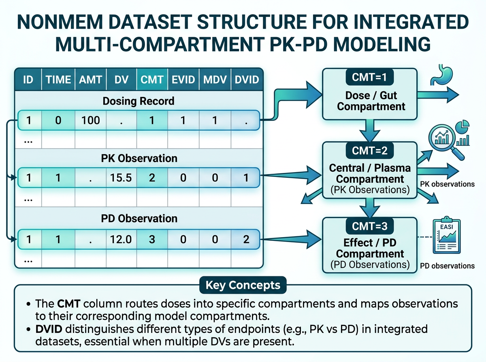
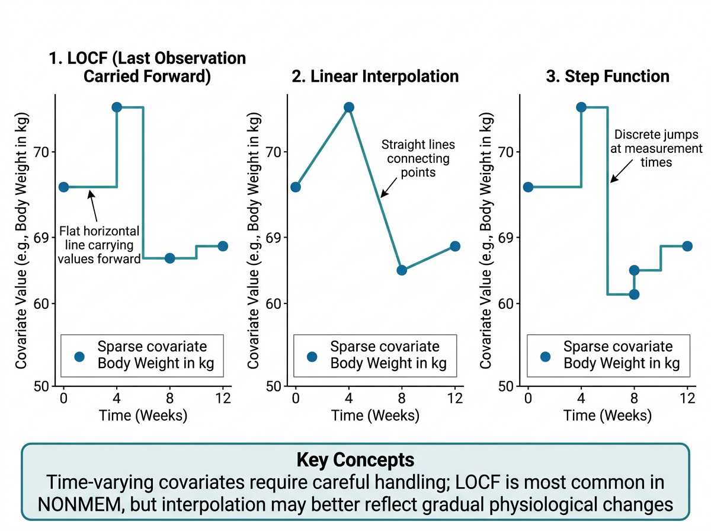
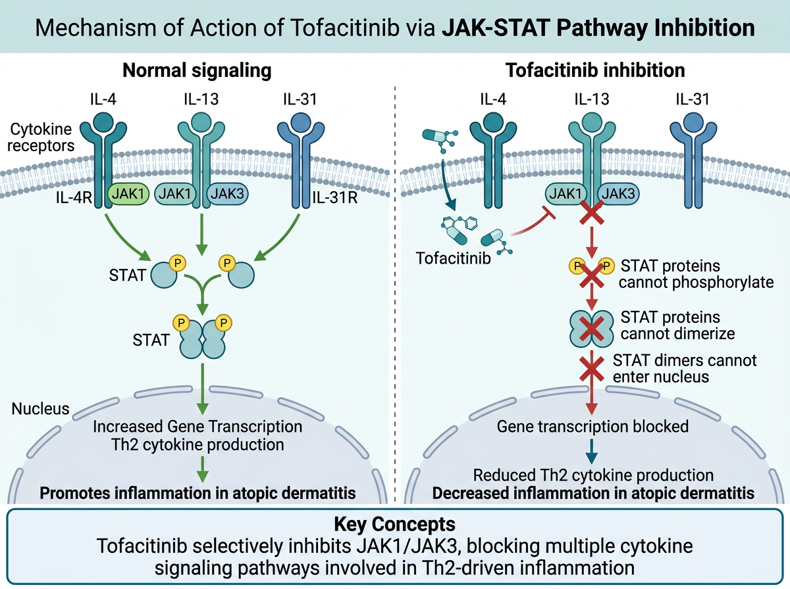

# PK-PD 통합 데이터셋 구축 {#sec-pkpd-dataset}

이 장에서는 약동학(PK) 데이터와 약력학(PD) 데이터를 하나의 **통합 데이터셋(integrated PK-PD dataset)**으로 구축하는 방법을 학습합니다. PK만 다루는 데이터셋과 달리, PK-PD 데이터셋은 약물 농도와 효과 지표를 동시에 포함해야 하므로 데이터 구조가 더 복잡합니다.

이 장의 실습 예제에서는 아토피 피부염(atopic dermatitis) 치료에 사용되는 JAK 억제제 **Tofacitinib**의 임상시험 데이터를 활용합니다. PK(혈중 농도)와 PD(SCORAD score)를 하나의 분석용 데이터셋으로 통합하는 전 과정을 다룹니다.

```{r}
#| eval: false
# 이 장에서 사용하는 패키지
library(tidyverse)    # dplyr, tidyr, ggplot2, stringr, readr 등
library(lubridate)    # 날짜/시간 처리
library(gt)           # 출판 품질 테이블
```

---

## PK-PD 데이터셋 구조 {#sec-pkpd-structure}

{#fig-ch12-1 width=100%}

### PK 전용 데이터셋과의 차이점

@fig-ch12-1 은 PK-PD 통합 데이터셋의 다중 구획 구조와 EVID/MDV/DVID 매핑 관계를 보여줍니다. 지금까지 학습한 NONMEM 데이터셋은 **PK 관측(약물 농도)**만을 다뤘습니다. PK-PD 통합 데이터셋에서는 여기에 **PD 관측(효과 지표)**이 추가됩니다. 이로 인해 다음과 같은 구조적 변화가 필요합니다:

1. **CMT(Compartment)의 확장**: PK 관측과 PD 관측이 서로 다른 구획에 속합니다
2. **DV(Dependent Variable)의 다중성**: DV에 ng/mL 단위의 농도와 점수 단위의 SCORAD가 혼재합니다
3. **시간 정렬(Time Alignment)**: PK와 PD 측정 시점이 대부분 다릅니다
4. **추가 공변량**: PD 분석에 필요한 시간 변동 공변량이 추가됩니다

### Multiple CMT 체계

PK-PD 통합 데이터셋에서 CMT(Compartment) 번호는 레코드의 종류를 구분하는 핵심 역할을 합니다:

| CMT | 레코드 유형 | 설명 | EVID | MDV |
|:---:|:---|:---|:---:|:---:|
| 1 | 투약 (Dosing) | 약물 투여 기록 | 1 | 1 |
| 2 | PK 관측 (PK Observation) | 약물 농도 측정 | 0 | 0 |
| 3 | PD 관측 (PD Observation) | 효과 지표 측정 | 0 | 0 |

예를 들어, Tofacitinib을 투약하고 혈중 농도와 SCORAD score를 측정한 경우:

```
ID  TIME   DV      AMT  CMT  EVID  MDV  DVID
1   0      .       5    1    1     1    .
1   0.5    125.3   0    2    0     0    1
1   1.0    310.8   0    2    0     0    1
1   0      62.5    0    3    0     0    2
1   336    45.2    0    3    0     0    2
```

여기서 CMT=1은 투약, CMT=2는 PK 관측(혈중 농도), CMT=3은 PD 관측(SCORAD score)입니다.

### DVID (Dependent Variable ID) 활용

**DVID**는 DV 컬럼에 저장된 값의 종류를 식별하는 변수입니다. PK-PD 데이터셋에서 DV에는 서로 다른 단위와 스케일의 값이 혼재하므로, DVID를 통해 이를 구분합니다:

| DVID | DV의 의미 | 단위 | 스케일 |
|:---:|:---|:---|:---|
| 1 | 약물 농도 (PK) | ng/mL | 연속, 양수 |
| 2 | SCORAD score (PD) | 점 (0-103) | 연속, 양수 |

:::{.callout-important}
## CMT와 DVID의 관계

CMT와 DVID는 밀접하게 연관되어 있지만 동일하지 않습니다:

- **CMT**는 NONMEM 모델에서 구획을 지정하며, 투약 레코드(EVID=1)에도 사용됩니다
- **DVID**는 관측 레코드(EVID=0)에서 DV의 종류를 식별합니다
- 투약 레코드에서 DVID는 보통 결측(`.`)이거나 0입니다
- PK 관측: CMT=2, DVID=1
- PD 관측: CMT=3, DVID=2

일부 모델링 소프트웨어(예: Monolix)에서는 DVID만으로 관측 유형을 구분하기도 합니다. NONMEM에서는 CMT와 DVID를 모두 사용하는 것이 일반적입니다.
:::

### 시간 정렬 (Time Alignment) 전략

PK와 PD 측정 시점이 다를 때, 데이터를 하나의 타임라인에 배치해야 합니다. 이 과정을 **시간 정렬(time alignment)**이라고 합니다.

**사례: Tofacitinib 아토피 피부염 시험**

- **PK 채혈**: 투약 후 0, 0.5, 1, 2, 4, 8시간 (sparse sampling, 특정 방문일)
- **PD 평가(SCORAD)**: Baseline(0주), 2주, 4주, 8주, 12주

이 경우 PK는 시간(hour) 단위로, PD는 주(week) 단위로 측정됩니다. 통합 데이터셋에서는 동일한 TIME 변수(보통 시간 단위)를 사용해야 합니다:

- PD 관측의 TIME은 방문일을 시간으로 변환합니다: 2주 = 336시간, 4주 = 672시간 등
- 같은 방문일에 PK와 PD가 모두 측정된 경우, 투약 → PK 관측 → PD 관측 순서로 정렬합니다

```{r}
#| eval: false
# 시간 변환 예시: 주 → 시간
visit_weeks <- c(0, 2, 4, 8, 12)
visit_hours <- visit_weeks * 7 * 24   # 주 × 7일 × 24시간
tibble(
  Visit_Week = visit_weeks,
  Visit_Hour = visit_hours,
  Visit_Label = paste0("Week ", visit_weeks)
)
```

:::{.callout-note}
## 시간 기준점(Reference Time)의 선택

TIME 변수의 기준점(시간 0)은 일반적으로 **첫 번째 투약 시점**으로 설정합니다. PD 데이터에서 baseline 측정이 투약 전에 이루어진 경우:

- Baseline PD 관측: TIME = 0 (또는 투약 직전의 음수 시간)
- 첫 투약: TIME = 0
- 이후 PD 관측: TIME = 해당 방문의 시간(시간 단위)

Baseline PD와 첫 투약의 TIME이 모두 0인 경우, **EVID와 CMT의 조합**으로 구분할 수 있지만, 데이터 정렬에 주의가 필요합니다. 실무에서는 baseline PD를 TIME = -0.01 등으로 약간 앞에 배치하는 경우도 있습니다.
:::

---

## NONMEM PK-PD 데이터셋 확장 {#sec-nonmem-pkpd-extension}

### CMT, EVID, MDV 확장 규칙

PK 전용 데이터셋에서 PK-PD 데이터셋으로 확장할 때, 각 필수 컬럼의 규칙을 명확히 이해해야 합니다.

**확장된 레코드 유형과 컬럼 값:**

| 레코드 유형 | CMT | EVID | MDV | AMT | DV | DVID |
|:---|:---:|:---:|:---:|:---:|:---:|:---:|
| 경구 투약 | 1 | 1 | 1 | 투여량(mg) | 0 또는 `.` | 0 또는 `.` |
| PK 관측 (정량 가능) | 2 | 0 | 0 | 0 | 농도(ng/mL) | 1 |
| PK 관측 (BLQ) | 2 | 0 | 1 | 0 | 0 | 1 |
| PD 관측 (SCORAD) | 3 | 0 | 0 | 0 | SCORAD | 2 |
| PD 관측 (결측) | 3 | 0 | 1 | 0 | `.` | 2 |

:::{.callout-warning}
## PD 관측에서의 MDV 설정 주의

PD 관측에서 MDV를 잘못 설정하는 것은 PK-PD 데이터셋에서 가장 흔한 오류 중 하나입니다:

- PD 값이 존재하면 **MDV = 0** (NONMEM이 이 값을 fitting에 사용)
- PD 값이 결측이면 **MDV = 1** (NONMEM이 이 행의 DV를 무시)
- PD 값이 0인 경우(예: SCORAD = 0): **MDV = 0** (0은 유효한 관측값)
- PD baseline 관측: **MDV = 0** (baseline도 유효한 관측값)

MDV=1로 설정하면 해당 레코드는 모델 추정에 기여하지 않으므로, 의도치 않게 데이터를 잃을 수 있습니다.
:::

### DV 스케일링: PK와 PD 단위 차이 처리

PK-PD 데이터셋에서 가장 중요한 고려사항 중 하나는 **DV의 스케일 차이**입니다:

- PK (약물 농도): 1~1,000 ng/mL 범위
- PD (SCORAD score): 0~103 범위

이 스케일 차이를 처리하는 방법은 크게 세 가지입니다:

**방법 1: DVID 기반 분리**

NONMEM 모델 코드에서 DVID를 사용하여 PK와 PD의 잔차 오차를 별도로 정의합니다. 이 경우 DV를 별도로 스케일링할 필요가 없습니다.

```{r}
#| eval: false
# DV는 원래 단위 그대로 유지
pk_pd_data <- tibble(
  ID   = 1,
  TIME = c(0, 0.5, 1, 336),
  DV   = c(NA, 125.3, 310.8, 45.2),  # ng/mL과 SCORAD 혼재
  CMT  = c(1, 2, 2, 3),
  EVID = c(1, 0, 0, 0),
  MDV  = c(1, 0, 0, 0),
  DVID = c(NA, 1, 1, 2)
)
```

**방법 2: 로그 변환**

PK 데이터를 로그 변환하여 사용하는 경우, PD 데이터도 로그 변환할 수 있습니다. 단, PD 데이터의 특성에 따라 로그 변환이 적절하지 않을 수 있습니다.

```{r}
#| eval: false
# 로그 변환 적용 예시
pk_pd_data <- pk_pd_data |>
  mutate(
    # LDV: 로그 변환된 DV
    LDV = case_when(
      EVID == 1 ~ NA_real_,                      # 투약 레코드
      DVID == 1 & DV > 0 ~ log(DV),              # PK: 자연로그
      DVID == 2 & DV > 0 ~ log(DV),              # PD: 자연로그 (적절한 경우)
      TRUE ~ NA_real_
    )
  )
```

**방법 3: 표준화/정규화**

PD 데이터를 baseline 대비 변화율로 변환하여 스케일을 조정합니다.

```{r}
#| eval: false
# PD 데이터를 baseline 대비 변화로 변환
pd_data <- pd_data |>
  group_by(ID) |>
  mutate(
    SCORAD_BL = first(SCORAD),                         # baseline SCORAD
    SCORAD_CFB = SCORAD - SCORAD_BL,                   # change from baseline (절대)
    SCORAD_PCFB = (SCORAD - SCORAD_BL) / SCORAD_BL * 100  # percent change from baseline
  ) |>
  ungroup()
```

### 여러 PD 엔드포인트 동시 포함

실제 임상시험에서는 여러 PD 엔드포인트를 동시에 분석하는 경우가 있습니다. 예를 들어 아토피 피부염 시험에서:

| DVID | 엔드포인트 | CMT | 단위 |
|:---:|:---|:---:|:---|
| 1 | Tofacitinib 농도 | 2 | ng/mL |
| 2 | SCORAD score | 3 | 점 (0-103) |
| 3 | 림프구 수 (ALC) | 4 | cells/μL |
| 4 | 가려움증 NRS | 5 | 점 (0-10) |

```{r}
#| eval: false
# 다중 PD 엔드포인트 데이터셋 구조 예시
multi_pd <- tribble(
  ~ID, ~TIME, ~DV,    ~CMT, ~EVID, ~MDV, ~DVID, ~ENDPOINT,
  1,   0,     NA,     1,    1,     1,    NA,    "DOSE",
  1,   0.5,   125.3,  2,    0,     0,    1,     "PK",
  1,   0,     62.5,   3,    0,     0,    2,     "SCORAD",
  1,   0,     1850,   4,    0,     0,    3,     "ALC",
  1,   0,     7.2,    5,    0,     0,    4,     "NRS",
  1,   336,   45.2,   3,    0,     0,    2,     "SCORAD",
  1,   336,   1420,   4,    0,     0,    3,     "ALC",
  1,   336,   4.1,    5,    0,     0,    4,     "NRS"
)
```

:::{.callout-tip}
## 다중 PD 엔드포인트 관리 팁

1. **DVID와 CMT의 매핑 테이블**을 반드시 문서화하세요
2. 각 엔드포인트의 **단위, 정상 범위, 임상적 의미**를 기록하세요
3. 모델링 소프트웨어에 따라 지원하는 DVID 수에 제한이 있을 수 있습니다
4. **DV 스케일이 극단적으로 다른 경우** (예: ng/mL vs cells/μL), 모델 수렴에 문제가 생길 수 있으므로 적절한 스케일링이 필요합니다
:::

---

## 공변량 데이터 통합 {#sec-covariate-integration}

### 시간 변동 공변량 (Time-Varying Covariates)

{#fig-ch12-2 width=100%}

@fig-ch12-2 는 세 가지 시간변동 공변량 처리 방법(LOCF, 선형 보간, 계단 함수)을 비교한 것입니다. PK-PD 분석에서는 시간에 따라 변하는 공변량이 중요한 역할을 합니다. 아토피 피부염 치료에서의 대표적인 시간 변동 공변량:

| 공변량 | 측정 빈도 | 임상적 의미 |
|:---|:---|:---|
| 체중 (WT) | 매 방문 | 약물 청소율에 영향 |
| 림프구 수 (ALC) | 2-4주마다 | JAK 억제제의 면역 억제 효과 모니터링 |
| 알부민 (ALB) | 4주마다 | 약물 결합/분포에 영향 |
| 크레아티닌 청소율 (CrCL) | 4-8주마다 | 신장 배설에 영향 |
| 간 효소 (ALT, AST) | 2-4주마다 | 간독성 모니터링 |

시간 변동 공변량은 NONMEM 데이터셋에서 **측정 시점에 해당하는 행에 값을 기록**합니다. 측정되지 않은 시점에서는 이전 값을 이월하거나(LOCF) 보간합니다.

```{r}
#| eval: false
# 시간 변동 공변량 데이터 예시
tv_covariates <- tribble(
  ~ID, ~VISIT_WEEK, ~WT,  ~ALC,  ~ALB,
  1,   0,           68.5, 1850,  4.2,
  1,   2,           68.2, 1620,  4.1,
  1,   4,           67.8, 1420,  4.0,
  1,   8,           67.5, 1380,  3.9,
  1,   12,          67.2, 1350,  4.0,
  2,   0,           55.0, 2100,  4.5,
  2,   2,           54.8, 1780,  4.4,
  2,   4,           54.5, 1550,  4.3,
  2,   8,           54.2, 1520,  4.2,
  2,   12,          54.0, 1510,  4.3
)
```

### 기저치 공변량 (Baseline Covariates)

기저치 공변량은 연구 시작 시점에 한 번 측정되며 시간에 따라 변하지 않는 것으로 가정합니다:

| 공변량 | 데이터셋에서의 표현 |
|:---|:---|
| 나이 (AGE) | 모든 레코드에 동일한 값 |
| 성별 (SEX) | 0=남, 1=여 (또는 반대) |
| 인종 (RACE) | 숫자 코딩 (1=아시아인, 2=백인 등) |
| Baseline SCORAD (BSCRD) | Screening 또는 Day 1의 SCORAD |
| Baseline 체중 (BWT) | Day 1의 체중 |
| CYP3A4/2C19 유전자형 | 약물 대사 관련 |

```{r}
#| eval: false
# 기저치 공변량 데이터
baseline_cov <- tribble(
  ~ID, ~AGE, ~SEX, ~RACE,  ~BWT,  ~BSCRD, ~CYP3A4,
  1,   34,   0,    1,      68.5,  62.5,   "EM",
  2,   28,   1,    1,      55.0,  71.0,   "EM",
  3,   45,   0,    2,      82.0,  58.3,   "PM",
  4,   39,   1,    1,      61.0,  65.8,   "IM",
  5,   52,   0,    1,      75.5,  74.2,   "EM",
  6,   31,   1,    2,      58.0,  60.1,   "EM"
)
```

### LOCF vs 보간 (Interpolation)

시간 변동 공변량이 측정되지 않은 시점에서 값을 할당하는 두 가지 방법:

**LOCF (Last Observation Carried Forward)**

가장 최근에 측정된 값을 다음 측정 시점까지 이월합니다. 가장 일반적으로 사용되는 방법입니다.

```{r}
#| eval: false
# LOCF 구현
pk_pd_with_cov <- pk_pd_data |>
  left_join(tv_covariates, by = c("ID", "VISIT_WEEK")) |>
  group_by(ID) |>
  arrange(ID, TIME) |>
  fill(WT, ALC, ALB, .direction = "down") |>   # LOCF: 아래로 채우기
  ungroup()
```

**선형 보간 (Linear Interpolation)**

두 측정 시점 사이의 값을 선형으로 추정합니다. 체중과 같이 연속적으로 변하는 공변량에 적합합니다.

```{r}
#| eval: false
# 선형 보간 구현
library(zoo)  # na.approx 함수 사용

pk_pd_interpolated <- pk_pd_data |>
  group_by(ID) |>
  arrange(ID, TIME) |>
  mutate(
    WT_interp  = zoo::na.approx(WT, TIME, na.rm = FALSE),
    ALC_interp = zoo::na.approx(ALC, TIME, na.rm = FALSE),
    ALB_interp = zoo::na.approx(ALB, TIME, na.rm = FALSE)
  ) |>
  ungroup()
```

:::{.callout-note}
## LOCF vs 보간: 실무적 선택 기준

| 상황 | 권장 방법 | 이유 |
|:---|:---|:---|
| 체중 | LOCF 또는 보간 | 서서히 변하므로 큰 차이 없음 |
| 림프구 수 | LOCF | 약물 효과로 급격히 변할 수 있어 보간이 부정확할 수 있음 |
| 알부민 | LOCF | 측정 빈도가 낮고 변화폭이 작음 |
| 크레아티닌 | LOCF | 급격한 변화 시 보간이 적절하지 않음 |

대부분의 집단약동학 분석에서는 **LOCF가 표준**입니다. FDA 가이던스에서도 LOCF를 기본 방법으로 권장합니다.
:::

### 데이터 매핑 문서 (Data Specification) 작성

PK-PD 데이터셋의 모든 변수를 문서화하는 **데이터 사양서(Data Specification)**는 필수입니다. 이 문서는 규제기관 제출 시 분석 계획과 함께 제출됩니다.

```{r}
#| eval: false
# 데이터 사양서 자동 생성 함수
create_data_spec <- function(data, dataset_name = "PK-PD Dataset") {
  spec <- tibble(
    Variable     = names(data),
    Type         = map_chr(data, ~ class(.x)[1]),
    N_Unique     = map_int(data, n_distinct),
    N_Missing    = map_int(data, ~ sum(is.na(.x))),
    Pct_Missing  = round(N_Missing / nrow(data) * 100, 1),
    Min          = map_chr(data, ~ if (is.numeric(.x)) as.character(round(min(.x, na.rm = TRUE), 3)) else NA_character_),
    Max          = map_chr(data, ~ if (is.numeric(.x)) as.character(round(max(.x, na.rm = TRUE), 3)) else NA_character_),
    Example      = map_chr(data, ~ as.character(.x[!is.na(.x)][1]))
  )

  spec |>
    gt() |>
    tab_header(
      title = paste("Data Specification:", dataset_name),
      subtitle = paste("N rows:", nrow(data), "| N columns:", ncol(data))
    ) |>
    fmt_number(columns = Pct_Missing, decimals = 1) |>
    cols_label(
      Variable    = "변수명",
      Type        = "데이터 유형",
      N_Unique    = "고유값 수",
      N_Missing   = "결측 수",
      Pct_Missing = "결측률(%)",
      Min         = "최소값",
      Max         = "최대값",
      Example     = "예시 값"
    )
}

# 사용 예시
# create_data_spec(pk_pd_final, "Tofacitinib PK-PD Integrated Dataset")
```

---

## R 실습: Tofacitinib PK + SCORAD 통합 {#sec-tofacitinib-practice}

### 시험 설계 개요

이 실습에서는 다음과 같은 가상의 임상시험 시나리오를 사용합니다:

- **시험명**: Tofacitinib Phase II Dose-Finding Study in Atopic Dermatitis
- **대상**: 중등도-중증 아토피 피부염 성인 환자 60명
- **용량군**: Tofacitinib 5mg BID (30명) vs 10mg BID (30명)
- **치료 기간**: 12주
- **PK 채혈**: Day 1, Week 4, Week 12에 sparse sampling (투약 후 1, 2, 4시간)
- **PD 평가**: SCORAD score (baseline, Week 2, 4, 8, 12)
- **안전성**: 림프구 수(ALC) 모니터링 (baseline, Week 2, 4, 8, 12)
- **분석법 LLOQ**: 0.5 ng/mL

### Step 1: 인구통계 데이터 생성

```{r}
#| eval: false
set.seed(12345)
n_subjects <- 60

# 인구통계 데이터
demo <- tibble(
  ID       = 1:n_subjects,
  AGE      = round(rnorm(n_subjects, mean = 38, sd = 12)),
  SEX      = sample(c(0, 1), n_subjects, replace = TRUE, prob = c(0.45, 0.55)),
  RACE     = sample(c(1, 2, 3), n_subjects, replace = TRUE, prob = c(0.6, 0.3, 0.1)),
  BWT      = round(rnorm(n_subjects, mean = 67, sd = 12), 1),
  HT       = round(rnorm(n_subjects, mean = 168, sd = 9), 1),
  DOSE_GRP = rep(c(5, 10), each = 30),
  BSCRD    = round(rnorm(n_subjects, mean = 65, sd = 10), 1)   # baseline SCORAD
) |>
  mutate(
    AGE  = pmax(AGE, 18) |> pmin(75),    # 18-75세 범위
    BWT  = pmax(BWT, 40) |> pmin(120),
    BSCRD = pmax(BSCRD, 40) |> pmin(90), # 중등도-중증 범위
    BMI  = round(BWT / (HT / 100)^2, 1),
    BSA  = round(0.007184 * BWT^0.425 * HT^0.725, 2),  # DuBois 공식
    # CYP2C19 유전자형 (대사 표현형)
    CYP2C19 = sample(c(1, 2, 3), n_subjects, replace = TRUE, prob = c(0.6, 0.3, 0.1))
    # 1 = EM, 2 = IM, 3 = PM
  )

demo |> head(10)
```

### Step 2: 투약 데이터 생성

```{r}
#| eval: false
# 12주 BID 투약 스케줄 생성
# BID: 1일 2회 (아침 8시, 저녁 8시) → 12시간 간격
create_dosing_records <- function(id, dose, duration_weeks = 12) {
  n_days <- duration_weeks * 7
  n_doses <- n_days * 2   # BID

  tibble(
    ID   = id,
    TIME = seq(0, by = 12, length.out = n_doses),   # 12시간 간격
    DV   = NA_real_,
    AMT  = dose,
    CMT  = 1,
    EVID = 1,
    MDV  = 1,
    DVID = NA_real_
  )
}

# 모든 대상자의 투약 데이터
dosing_data <- map2_dfr(
  demo$ID,
  demo$DOSE_GRP,
  ~ create_dosing_records(.x, .y)
)

# 투약 레코드 수 확인
dosing_data |>
  group_by(ID) |>
  summarise(n_doses = n(), total_amt = sum(AMT)) |>
  head()
```

### Step 3: PK 데이터 생성

```{r}
#| eval: false
# Tofacitinib PK: 1-구획 모델 기반 시뮬레이션 (단순화)
# CL/F = 30 L/hr, V/F = 100 L, ka = 2 hr^-1, F = 0.74
simulate_pk <- function(id, dose, demo_data, pk_times, pk_days) {
  subj <- demo_data |> filter(ID == id)

  # 개인 간 변동 (IIV)
  eta_cl <- rnorm(1, 0, 0.3)   # 30% CV
  eta_v  <- rnorm(1, 0, 0.2)   # 20% CV

  # 공변량 효과 (체중)
  CL <- 30 * (subj$BWT / 70)^0.75 * exp(eta_cl)   # L/hr
  V  <- 100 * (subj$BWT / 70) * exp(eta_v)          # L
  ka <- 2     # hr^-1
  ke <- CL / V

  # CYP2C19 효과
  if (subj$CYP2C19 == 2) CL <- CL * 0.75    # IM: CL 25% 감소
  if (subj$CYP2C19 == 3) CL <- CL * 0.50    # PM: CL 50% 감소

  records <- list()
  for (day in pk_days) {
    day_hours <- (day - 1) * 24
    # 정상상태 근사: 투약 후 각 시점의 농도 계산
    for (t_post_dose in pk_times) {
      t_actual <- day_hours + t_post_dose
      # 단순 1구획 경구 모델 (정상상태 근사)
      conc <- (dose * 1000 / V) * (ka / (ka - ke)) *
              (exp(-ke * t_post_dose) - exp(-ka * t_post_dose)) /
              (1 - exp(-ke * 12))   # 12시간 간격 정상상태 보정

      # 잔차 오차
      conc <- conc * exp(rnorm(1, 0, 0.15))   # 비례 오차 15%

      records[[length(records) + 1]] <- tibble(
        ID   = id,
        TIME = t_actual,
        DV   = round(max(conc, 0), 2),
        AMT  = 0,
        CMT  = 2,
        EVID = 0,
        MDV  = 0,
        DVID = 1
      )
    }
  }

  bind_rows(records)
}

# PK 채혈 시점과 날짜
pk_sample_times <- c(1, 2, 4)          # 투약 후 시간
pk_sample_days  <- c(1, 28, 84)        # Day 1, Week 4, Week 12

# 모든 대상자의 PK 데이터 시뮬레이션
pk_data <- map2_dfr(
  demo$ID,
  demo$DOSE_GRP,
  ~ simulate_pk(.x, .y, demo, pk_sample_times, pk_sample_days)
)

# BLQ 처리: LLOQ = 0.5 ng/mL
pk_data <- pk_data |>
  mutate(
    BLQ = if_else(DV < 0.5, 1, 0),
    DV  = if_else(BLQ == 1, 0, DV),
    MDV = if_else(BLQ == 1, 1, 0)
  )

pk_data |>
  group_by(DVID) |>
  summarise(
    n_obs    = n(),
    n_blq    = sum(BLQ),
    pct_blq  = round(mean(BLQ) * 100, 1),
    mean_dv  = round(mean(DV[DV > 0], na.rm = TRUE), 2),
    .groups = "drop"
  )
```

### Step 4: PD 데이터 생성

```{r}
#| eval: false
# SCORAD score 시뮬레이션
# 약물 효과: Emax 모델, SCORAD = baseline * (1 - Emax * Cavg / (EC50 + Cavg))
simulate_pd <- function(id, dose, demo_data, visit_weeks) {
  subj <- demo_data |> filter(ID == id)
  baseline_scorad <- subj$BSCRD

  # 개인별 Emax, EC50의 변동
  eta_emax <- rnorm(1, 0, 0.2)
  eta_ec50 <- rnorm(1, 0, 0.3)

  Emax <- 0.70 * exp(eta_emax)   # 최대 70% 개선
  EC50 <- 80 * exp(eta_ec50)     # ng/mL (Cavg 기준)

  # 대략적인 정상상태 Cavg 추정 (dose * F / (CL * tau))
  CL_approx <- 30 * (subj$BWT / 70)^0.75
  Cavg <- (dose * 1000 * 0.74) / (CL_approx * 12)   # ng/mL

  records <- list()
  for (week in visit_weeks) {
    time_hours <- week * 7 * 24

    if (week == 0) {
      scorad <- baseline_scorad
    } else {
      # 시간 의존 효과 (점진적 효과 발현)
      time_effect <- 1 - exp(-week / 4)   # ~4주에 63% 효과 발현
      effect <- Emax * Cavg / (EC50 + Cavg) * time_effect
      scorad <- baseline_scorad * (1 - effect) + rnorm(1, 0, 3)  # 잔차
      scorad <- max(scorad, 0) |> min(103)   # SCORAD 범위: 0-103
    }

    records[[length(records) + 1]] <- tibble(
      ID   = id,
      TIME = time_hours,
      DV   = round(scorad, 1),
      AMT  = 0,
      CMT  = 3,
      EVID = 0,
      MDV  = 0,
      DVID = 2
    )
  }

  bind_rows(records)
}

# PD 방문 시점
pd_visit_weeks <- c(0, 2, 4, 8, 12)

# 모든 대상자의 PD 데이터 시뮬레이션
pd_data <- map2_dfr(
  demo$ID,
  demo$DOSE_GRP,
  ~ simulate_pd(.x, .y, demo, pd_visit_weeks)
)

pd_data |>
  group_by(DVID, TIME) |>
  summarise(
    n    = n(),
    mean = round(mean(DV), 1),
    sd   = round(sd(DV), 1),
    .groups = "drop"
  )
```

### Step 5: 시간 변동 공변량 (림프구 수) 데이터

```{r}
#| eval: false
# 림프구 수 (ALC) 시뮬레이션
# Tofacitinib은 용량 의존적으로 림프구를 감소시킴
simulate_alc <- function(id, dose, demo_data, visit_weeks) {
  subj <- demo_data |> filter(ID == id)

  # Baseline ALC: 정상 범위 1000-4800 cells/μL
  baseline_alc <- rnorm(1, mean = 2200, sd = 500) |> max(1000)

  eta_drug <- rnorm(1, 0, 0.2)
  # 용량 의존적 감소: 5mg → ~15% 감소, 10mg → ~25% 감소
  max_decrease <- (0.15 + 0.10 * (dose / 10)) * exp(eta_drug)

  records <- list()
  for (week in visit_weeks) {
    time_hours <- week * 7 * 24

    if (week == 0) {
      alc <- baseline_alc
    } else {
      time_effect <- 1 - exp(-week / 3)
      alc <- baseline_alc * (1 - max_decrease * time_effect) + rnorm(1, 0, 100)
      alc <- max(alc, 200)  # 최소값 제한
    }

    records[[length(records) + 1]] <- tibble(
      ID         = id,
      VISIT_WEEK = week,
      TIME       = time_hours,
      ALC        = round(alc)
    )
  }

  bind_rows(records)
}

# ALC 데이터 시뮬레이션
alc_data <- map2_dfr(
  demo$ID,
  demo$DOSE_GRP,
  ~ simulate_alc(.x, .y, demo, pd_visit_weeks)
)

alc_data |>
  group_by(VISIT_WEEK) |>
  summarise(
    n        = n(),
    mean_alc = round(mean(ALC)),
    sd_alc   = round(sd(ALC)),
    .groups  = "drop"
  )
```

### Step 6: PK + PD + 공변량 데이터 병합

```{r}
#| eval: false
# Step 6-1: 투약 + PK + PD 데이터 병합
pk_pd_combined <- bind_rows(
  dosing_data,
  pk_data |> select(ID, TIME, DV, AMT, CMT, EVID, MDV, DVID),
  pd_data
) |>
  arrange(ID, TIME, desc(EVID), CMT) |>    # ID → TIME → 투약 먼저 → CMT 순서
  mutate(
    # 레코드 순서 번호
    ROW = row_number()
  )

# Step 6-2: 기저치 공변량 병합
pk_pd_with_baseline <- pk_pd_combined |>
  left_join(
    demo |> select(ID, AGE, SEX, RACE, BWT, HT, BMI, BSA, BSCRD, CYP2C19, DOSE_GRP),
    by = "ID"
  )

# Step 6-3: 시간 변동 공변량 (ALC) 병합 — LOCF 방법
# 먼저 ALC 데이터를 TIME 기반으로 병합
alc_for_merge <- alc_data |>
  select(ID, TIME, ALC)

pk_pd_with_cov <- pk_pd_with_baseline |>
  left_join(alc_for_merge, by = c("ID", "TIME")) |>
  group_by(ID) |>
  arrange(ID, TIME) |>
  fill(ALC, .direction = "down") |>   # LOCF
  ungroup()

# Step 6-4: Baseline ALC 추가
baseline_alc <- alc_data |>
  filter(VISIT_WEEK == 0) |>
  select(ID, BALC = ALC)

pk_pd_final <- pk_pd_with_cov |>
  left_join(baseline_alc, by = "ID")

pk_pd_final |>
  head(20) |>
  select(ID, TIME, DV, AMT, CMT, EVID, MDV, DVID, AGE, SEX, DOSE_GRP, ALC, BALC)
```

### Step 7: 데이터 검증

```{r}
#| eval: false
# PK-PD 데이터셋 검증 함수
validate_pkpd_dataset <- function(data) {
  checks <- list()

  # 1. 필수 컬럼 존재 확인
  required_cols <- c("ID", "TIME", "DV", "AMT", "CMT", "EVID", "MDV", "DVID")
  missing_cols <- setdiff(required_cols, names(data))
  checks$required_columns <- tibble(
    Check = "필수 컬럼 존재",
    Status = if (length(missing_cols) == 0) "PASS" else "FAIL",
    Detail = if (length(missing_cols) == 0) "모든 필수 컬럼 존재" else paste("누락:", paste(missing_cols, collapse = ", "))
  )

  # 2. EVID=1일 때 AMT > 0 확인
  dose_check <- data |> filter(EVID == 1)
  checks$dose_amt <- tibble(
    Check = "투약 레코드 AMT > 0",
    Status = if (all(dose_check$AMT > 0, na.rm = TRUE)) "PASS" else "FAIL",
    Detail = paste("투약 레코드", nrow(dose_check), "개 중 AMT ≤ 0:", sum(dose_check$AMT <= 0, na.rm = TRUE), "개")
  )

  # 3. EVID=1일 때 MDV=1 확인
  checks$dose_mdv <- tibble(
    Check = "투약 레코드 MDV=1",
    Status = if (all(dose_check$MDV == 1)) "PASS" else "FAIL",
    Detail = paste("MDV ≠ 1인 투약 레코드:", sum(dose_check$MDV != 1), "개")
  )

  # 4. 관측 레코드에서 MDV=0이면 DV 유효 확인
  obs_check <- data |> filter(EVID == 0, MDV == 0)
  checks$obs_dv <- tibble(
    Check = "관측 레코드 DV 유효성",
    Status = if (all(!is.na(obs_check$DV))) "PASS" else "WARNING",
    Detail = paste("MDV=0인 관측 레코드 중 DV 결측:", sum(is.na(obs_check$DV)), "개")
  )

  # 5. 각 ID별 TIME 단조 증가 확인 (동일 TIME 허용)
  time_check <- data |>
    group_by(ID) |>
    summarise(monotonic = all(diff(TIME) >= 0), .groups = "drop")
  checks$time_order <- tibble(
    Check = "TIME 단조 증가",
    Status = if (all(time_check$monotonic)) "PASS" else "FAIL",
    Detail = paste("TIME 역전 대상자:", sum(!time_check$monotonic), "명")
  )

  # 6. CMT-DVID 일관성 확인
  obs_data <- data |> filter(EVID == 0)
  cmt_dvid_check <- obs_data |>
    filter(
      (CMT == 2 & DVID != 1) |
      (CMT == 3 & DVID != 2)
    )
  checks$cmt_dvid <- tibble(
    Check = "CMT-DVID 일관성",
    Status = if (nrow(cmt_dvid_check) == 0) "PASS" else "FAIL",
    Detail = paste("불일치 레코드:", nrow(cmt_dvid_check), "개")
  )

  # 7. 각 ID에 투약 레코드 존재 확인
  ids_with_dose <- data |> filter(EVID == 1) |> pull(ID) |> unique()
  ids_without_dose <- setdiff(unique(data$ID), ids_with_dose)
  checks$dose_exists <- tibble(
    Check = "모든 ID에 투약 레코드 존재",
    Status = if (length(ids_without_dose) == 0) "PASS" else "FAIL",
    Detail = paste("투약 레코드 없는 ID:", length(ids_without_dose), "개")
  )

  # 8. 각 ID에 PK와 PD 관측 레코드 존재 확인
  pk_ids <- data |> filter(DVID == 1) |> pull(ID) |> unique()
  pd_ids <- data |> filter(DVID == 2) |> pull(ID) |> unique()
  checks$obs_exists <- tibble(
    Check = "PK/PD 관측 레코드 존재",
    Status = if (length(setdiff(unique(data$ID), pk_ids)) == 0 &
                 length(setdiff(unique(data$ID), pd_ids)) == 0) "PASS" else "WARNING",
    Detail = paste("PK 관측 없는 ID:", length(setdiff(unique(data$ID), pk_ids)),
                   "| PD 관측 없는 ID:", length(setdiff(unique(data$ID), pd_ids)))
  )

  # 결과 요약
  result <- bind_rows(checks)
  return(result)
}

# 검증 실행
validation_result <- validate_pkpd_dataset(pk_pd_final)
validation_result |>
  gt() |>
  tab_header(title = "PK-PD 데이터셋 검증 결과") |>
  tab_style(
    style = cell_fill(color = "#d4edda"),
    locations = cells_body(rows = Status == "PASS")
  ) |>
  tab_style(
    style = cell_fill(color = "#f8d7da"),
    locations = cells_body(rows = Status == "FAIL")
  ) |>
  tab_style(
    style = cell_fill(color = "#fff3cd"),
    locations = cells_body(rows = Status == "WARNING")
  )
```

### Step 8: 중복 및 결측 확인

```{r}
#| eval: false
# 중복 레코드 확인
duplicates <- pk_pd_final |>
  group_by(ID, TIME, CMT, EVID) |>
  filter(n() > 1) |>
  ungroup()

cat("중복 레코드 수:", nrow(duplicates), "\n")

# 결측 패턴 요약
missing_summary <- pk_pd_final |>
  summarise(
    across(everything(), ~ sum(is.na(.x)))
  ) |>
  pivot_longer(everything(), names_to = "Variable", values_to = "N_Missing") |>
  filter(N_Missing > 0) |>
  arrange(desc(N_Missing))

missing_summary
```

### Step 9: 최종 데이터셋 내보내기 및 요약

```{r}
#| eval: false
# 최종 데이터셋 요약
cat("=== PK-PD 통합 데이터셋 요약 ===\n\n")
cat("총 레코드 수:", nrow(pk_pd_final), "\n")
cat("대상자 수:", n_distinct(pk_pd_final$ID), "\n\n")

pk_pd_final |>
  group_by(Record_Type = case_when(
    EVID == 1 ~ "투약 (EVID=1)",
    DVID == 1 ~ "PK 관측 (DVID=1)",
    DVID == 2 ~ "PD 관측 (DVID=2)",
    TRUE ~ "기타"
  )) |>
  summarise(
    N_Records = n(),
    N_Subjects = n_distinct(ID),
    .groups = "drop"
  ) |>
  gt() |>
  tab_header(title = "레코드 유형별 요약")

# CSV 내보내기
# 결측값을 '.'으로 변환 (NONMEM 형식)
pk_pd_export <- pk_pd_final |>
  select(ID, TIME, DV, AMT, CMT, EVID, MDV, DVID,
         AGE, SEX, RACE, BWT, HT, BMI, BSA,
         DOSE_GRP, BSCRD, CYP2C19, ALC, BALC) |>
  mutate(across(everything(), ~ if_else(is.na(.x), ".", as.character(.x))))

# write_csv(pk_pd_export, "tofacitinib_pkpd_dataset.csv", na = ".")
```

### Step 10: 데이터 사양서 생성

```{r}
#| eval: false
# 데이터 사양서 (Data Specification)
data_spec <- tribble(
  ~Variable, ~Label,                          ~Type,     ~Unit,       ~Values,                   ~Source,
  "ID",      "대상자 식별 번호",                "Integer", "-",         "1-60",                    "DM",
  "TIME",    "상대 시간 (첫 투약 기준)",         "Numeric", "hour",      "0-2016",                  "Derived",
  "DV",      "종속 변수",                      "Numeric", "ng/mL or score", "PK: 0.5-500, PD: 0-103", "PC/PD",
  "AMT",     "투약량",                         "Numeric", "mg",        "5, 10",                   "EX",
  "CMT",     "구획 번호",                      "Integer", "-",         "1=투약, 2=PK, 3=PD",       "Derived",
  "EVID",    "이벤트 ID",                      "Integer", "-",         "0=관측, 1=투약",           "Derived",
  "MDV",     "Missing Dependent Variable",    "Integer", "-",         "0=있음, 1=없음",           "Derived",
  "DVID",    "종속변수 ID",                    "Integer", "-",         "1=PK, 2=PD",              "Derived",
  "AGE",     "나이",                           "Numeric", "year",      "18-75",                   "DM",
  "SEX",     "성별",                           "Integer", "-",         "0=남, 1=여",               "DM",
  "RACE",    "인종",                           "Integer", "-",         "1=아시아인, 2=백인, 3=기타", "DM",
  "BWT",     "Baseline 체중",                 "Numeric", "kg",        "40-120",                  "DM",
  "DOSE_GRP","용량군",                         "Numeric", "mg",        "5, 10",                   "EX",
  "BSCRD",   "Baseline SCORAD",              "Numeric", "score",     "40-90",                   "PD",
  "CYP2C19", "CYP2C19 대사 표현형",            "Integer", "-",         "1=EM, 2=IM, 3=PM",        "Genomic",
  "ALC",     "림프구 절대 수 (시간변동)",        "Numeric", "cells/μL",  "200-4800",                "LB",
  "BALC",    "Baseline 림프구 절대 수",         "Numeric", "cells/μL",  "1000-4000",               "LB"
)

data_spec |>
  gt() |>
  tab_header(
    title = "Tofacitinib PK-PD 통합 데이터셋 사양서",
    subtitle = "Data Specification Document"
  ) |>
  cols_label(
    Variable = "변수명",
    Label    = "설명",
    Type     = "유형",
    Unit     = "단위",
    Values   = "값 범위",
    Source   = "출처"
  ) |>
  tab_style(
    style = cell_text(weight = "bold"),
    locations = cells_body(columns = Variable)
  )
```

---

## 약리학 노트: Tofacitinib 약리학 {#sec-tofacitinib-pharmacology}

{#fig-ch12-3 width=100%}

### JAK-STAT 경로와 Tofacitinib의 작용 기전

@fig-ch12-3 은 Tofacitinib이 JAK1/3을 억제하여 사이토카인 신호전달을 차단하는 기전을 도식화한 것입니다. **JAK-STAT 경로**는 다양한 사이토카인과 성장인자의 세포 내 신호전달을 매개하는 핵심 경로입니다. 이 경로의 주요 구성요소는 다음과 같습니다:

1. **사이토카인 수용체**: 세포 표면에서 사이토카인을 인식
2. **JAK (Janus Kinase)**: JAK1, JAK2, JAK3, TYK2 — 수용체에 결합하여 신호를 전달
3. **STAT (Signal Transducer and Activator of Transcription)**: 핵으로 이동하여 유전자 발현 조절

**Tofacitinib**은 **JAK1**과 **JAK3**을 선택적으로 억제하는 소분자 약물입니다. JAK1/3 경로를 통해 신호를 전달하는 사이토카인에는 다음이 포함됩니다:

| 사이토카인 | JAK 조합 | 아토피 피부염에서의 역할 |
|:---|:---|:---|
| IL-4 | JAK1/JAK3 | Th2 분화, IgE 생산 증가 |
| IL-13 | JAK1/TYK2 또는 JAK1/JAK2 | 피부 장벽 파괴, 섬유화 |
| IL-31 | JAK1/JAK2 | 가려움증의 주요 매개체 |
| IL-2 | JAK1/JAK3 | T세포 활성화 및 증식 |
| IL-6 | JAK1/JAK2 | 급성기 염증 반응 |
| IL-15 | JAK1/JAK3 | NK세포 및 T세포 항상성 유지 |
| IFN-γ | JAK1/JAK2 | Th1 면역반응, 케라티노사이트 활성화 |

### 아토피 피부염에서의 치료 효과

Tofacitinib이 아토피 피부염에서 효과를 나타내는 기전:

1. **가려움증 억제**: IL-31 신호 차단으로 가려움증의 신경 신호 감소. 환자들이 가장 먼저 경험하는 개선 증상
2. **피부 염증 억제**: IL-4/IL-13 경로 차단으로 Th2 면역반응 감소, 표피 장벽 복구 촉진
3. **IgE 감소**: IL-4 의존적 B세포 class switching 억제로 혈청 IgE 감소
4. **피부 장벽 회복**: 케라티노사이트의 분화 및 filaggrin 발현 정상화

### PK 특성

Tofacitinib의 약동학 파라미터:

| 파라미터 | 값 | 임상적 의미 |
|:---|:---|:---|
| 경구 생체이용률 (F) | ~74% | 높은 흡수율, 음식 영향 없음 |
| T~max~ | 0.5-1시간 | 빠른 흡수 |
| t~1/2~ | ~3시간 | 짧은 반감기 → BID 투약 필요 |
| 단백결합률 | ~40% | 중간 수준 |
| 대사 | CYP3A4 (주), CYP2C19 (부) | 약물 상호작용 주의 |
| 배설 | 간대사 70%, 신배설 30% | 간/신장 장애 시 용량 조절 |
| V~d~/F | ~87 L | 넓은 분포 용적 |
| CL/F | ~30 L/hr | 체중 의존적 |

### 안전성 고려사항

Tofacitinib을 포함한 JAK 억제제의 주요 안전성 우려:

:::{.callout-warning}
## JAK 억제제의 안전성 경고 (Black Box Warning)

FDA는 2021년 tofacitinib의 안전성 경고를 강화했습니다. ORAL Surveillance 연구 결과를 바탕으로 다음 위험이 확인되었습니다:

1. **심각한 감염**: 결핵, 기회감염, 대상포진(herpes zoster) — 특히 고령자와 면역 저하 환자에서 위험 증가
2. **혈전증**: 심부정맥혈전증(DVT)과 폐색전증(PE) 위험 증가
3. **악성 종양**: 림프종을 포함한 악성 종양 위험 증가
4. **주요 심혈관 이벤트(MACE)**: 심근경색, 뇌졸중 위험 증가
5. **림프구감소증**: 용량 의존적 림프구 감소 → ALC < 500 cells/μL 시 투약 중단

이러한 안전성 프로파일은 PK-PD 분석에서 **노출-안전성(exposure-safety) 관계** 분석의 필요성을 강조합니다. 특히 림프구 수 감소는 약물 노출과 직접적으로 연관되므로, PK-PD 모델링의 주요 대상입니다.
:::

### SCORAD (SCORing Atopic Dermatitis)

SCORAD는 아토피 피부염의 중증도를 평가하는 복합 점수 시스템입니다:

$$
\text{SCORAD} = \frac{A}{5} + \frac{7B}{2} + C
$$

여기서:

- **A**: 병변 범위 (Extent, 0-100%) — Rule of Nines 방법
- **B**: 강도 (Intensity, 0-18) — 6개 항목 × 0-3점 (홍반, 부종, 삼출, 태선화, 건조, 찰상)
- **C**: 자각 증상 (Subjective symptoms, 0-20) — 가려움증 + 수면장애 (각 0-10 VAS)

**중증도 분류:**

| SCORAD | 중증도 |
|:---:|:---|
| < 25 | 경증 (Mild) |
| 25-50 | 중등도 (Moderate) |
| > 50 | 중증 (Severe) |

---

## Claude Code 활용 팁 {#sec-claude-tips-12}

### 복잡한 데이터 병합 요청

PK-PD 데이터셋 구축에서 가장 시간이 많이 소요되는 단계는 여러 소스의 데이터를 병합하는 과정입니다. Claude Code에 다음과 같이 요청할 수 있습니다:

```
"다음 세 가지 데이터 소스를 NONMEM PK-PD 형식으로 병합해주세요:

1. dosing.csv: USUBJID, EXSTDTC, EXDOSE, EXROUTE 컬럼
2. pk_concentrations.csv: USUBJID, PCDTC, PCSTRESN 컬럼
3. scorad_scores.csv: USUBJID, VISITNUM, SCORAD_TOTAL 컬럼

요구사항:
- CMT: 1(투약), 2(PK), 3(PD)
- TIME: 첫 투약 기준 시간(hour) 단위
- DVID: 1(PK), 2(PD)
- LOCF로 공변량 처리
- 데이터 검증 함수도 작성
- 데이터 사양서 테이블 생성"
```

### 검증 체크리스트 자동 생성

```
"이 PK-PD 데이터셋의 포괄적인 검증 체크리스트를 R 코드로 구현해주세요:

1. 필수 컬럼 존재 확인
2. EVID/MDV/CMT/DVID 일관성
3. TIME 순서 확인
4. 공변량 결측 패턴
5. PK/PD 레코드 수 대상자별 요약
6. 이상값 탐지 (PK: 3 SD 초과, PD: 범위 이탈)
7. 결과를 gt 테이블과 플래그 리스트로 출력"
```

:::{.callout-tip}
## Claude Code 활용 시 데이터 구조 설명

데이터 병합을 요청할 때는 다음 정보를 반드시 포함하세요:

1. **각 데이터 소스의 컬럼명과 유형** — 정확한 컬럼명을 제공
2. **병합 키(key)** — 어떤 변수로 데이터를 연결하는지
3. **시간 형식** — ISO 8601, POSIX, 상대시간 등
4. **단위** — 농도, 용량, 시간의 단위
5. **결측 처리 방법** — LOCF, 보간, 제외 등
:::

---

## 연습 문제 {#sec-exercises-12}

### 확인 문제

1. PK-PD 통합 데이터셋에서 CMT=1, CMT=2, CMT=3이 각각 의미하는 바를 설명하고, 각 CMT에 대응하는 EVID와 MDV 값의 일반적인 조합을 기술하세요.

2. DVID와 CMT의 차이점을 설명하세요. 왜 두 변수가 모두 필요합니까?

3. PK 데이터의 DV(ng/mL)와 PD 데이터의 DV(SCORAD score)가 하나의 DV 컬럼에 혼재할 때, 이 스케일 차이를 처리하는 세 가지 방법을 설명하세요.

4. LOCF(Last Observation Carried Forward)와 선형 보간의 장단점을 비교하고, 림프구 수(ALC) 공변량에 대해 어떤 방법이 더 적절한지 근거를 들어 설명하세요.

5. Tofacitinib의 반감기가 약 3시간인데 BID(12시간 간격)로 투약하는 이유를 약력학적 관점에서 설명하세요. (힌트: PK-PD disconnect 개념)

### R 과제

1. **다중 PD 엔드포인트 데이터셋 구축**: 이 장의 Tofacitinib 데이터에 **가려움증 NRS(0-10)** 엔드포인트를 추가하여, CMT=5/DVID=4인 레코드를 포함하는 확장된 PK-PD 데이터셋을 구축하세요. NRS는 baseline 6-9, 12주 후 2-5 범위로 시뮬레이션하세요.

2. **시간 변동 공변량 비교 분석**: ALC 데이터에 대해 LOCF와 선형 보간을 각각 적용하고, 두 방법의 결과를 비교하는 그래프를 만드세요. 대상자 3명을 선택하여 time-course plot을 생성하세요.

3. **데이터 검증 보고서**: `validate_pkpd_dataset()` 함수를 확장하여, 다음 검증 항목을 추가하고 gt 테이블로 결과를 출력하세요:
   - PK 관측값의 이상값 탐지 (평균 ± 3SD 기준)
   - PD 관측값의 범위 확인 (SCORAD: 0-103)
   - 대상자별 PK/PD 관측 수 불균형 확인
   - 공변량의 생리학적 범위 확인 (예: 체중 30-150kg, ALC 200-10000)

### Claude Code 과제

1. Claude Code에 다음과 같이 요청하세요:
   > "Tofacitinib PK-PD 데이터셋을 검증하는 종합 보고서를 Quarto 문서로 만들어줘. 데이터 구조 요약, 대상자별 레코드 수 히트맵, 공변량 분포 플롯, 시간 변동 공변량의 time-course, PK-PD 레코드의 시간 정렬 확인 그래프를 포함해줘. 모든 코드는 함수화하고, 재사용 가능하게 구조화해줘."

   Claude Code의 출력을 검토하고, 데이터 검증에서 발견된 문제가 있다면 수정하세요.
