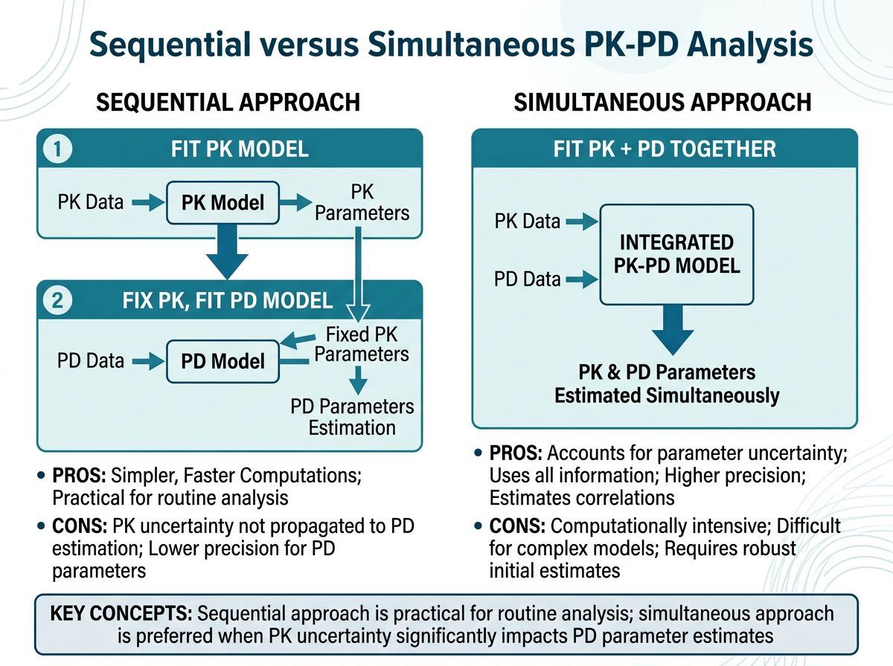
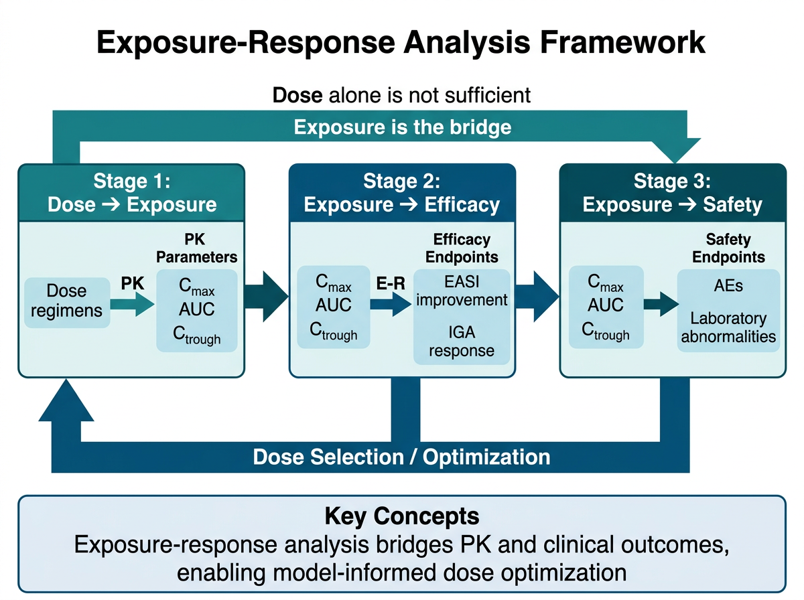
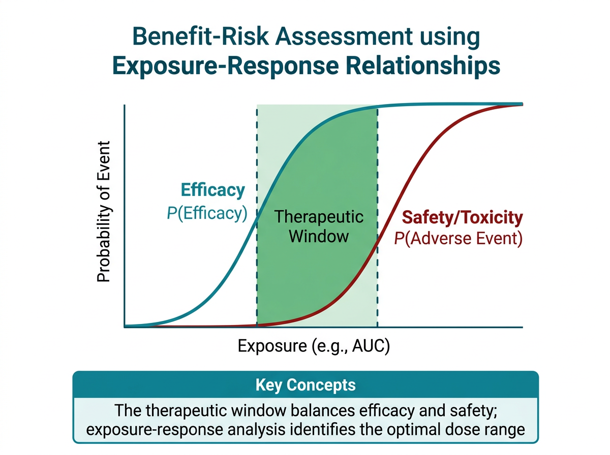

# PK-PD 통합 정보 도출 {#sec-pkpd-derivation}

이 장에서는 PK-PD 통합 데이터셋에서 **노출-반응(Exposure-Response)** 관계를 정량화하는 방법을 학습합니다. 약물 노출 지표(AUC, C~min~, C~avg~ 등)와 효과 지표(EASI, SCORAD 등)의 관계를 분석하여, **용량 선택의 과학적 근거**를 도출하는 과정을 다룹니다.

실습에서는 아토피 피부염 치료제 **Dupilumab**(항-IL-4Rα 단클론항체)과 **Tofacitinib**(JAK1/3 억제제)의 노출-반응 분석을 수행합니다.

```{r}
#| eval: false
# 이 장에서 사용하는 패키지
library(tidyverse)    # 데이터 처리 및 시각화
library(broom)        # 모델 결과 정리
library(gt)           # 출판 품질 테이블
library(patchwork)    # 그래프 조합
library(mrgsolve)     # PK-PD 시뮬레이션
```

---

## PK-PD 관계 정량화 방법 {#sec-pkpd-methods}

### Sequential Approach vs Simultaneous Approach

{#fig-ch13-2 width=100%}

PK-PD 관계를 분석하는 두 가지 근본적 접근 방식이 있습니다:

**Sequential Approach (순차적 접근)**

1단계에서 PK 모델을 먼저 구축하고, 2단계에서 PK 모델로부터 도출된 노출 지표를 PD 모델의 입력으로 사용합니다.

```
[PK 데이터] → [PK 모델] → [노출 지표 (AUC, Cmin 등)] → [PD 모델] → [PK-PD 관계]
```

- **장점**: 구현이 간단하고, PK와 PD를 독립적으로 검증할 수 있음
- **단점**: PK 추정의 불확실성이 PD 모델에 전파되지 않음 (uncertainty underestimation)
- **사용 상황**: 탐색적 분석, PK 데이터가 풍부한 경우

**Simultaneous Approach (동시적 접근)**

PK와 PD 데이터를 하나의 통합 모델에서 동시에 추정합니다.

```
[PK + PD 데이터] → [통합 PK-PD 모델] → [PK-PD 관계]
```

- **장점**: PK 불확실성이 PD 추정에 적절히 반영됨, 정보 손실 없음
- **단점**: 모델이 복잡하고, 수렴이 어려울 수 있음
- **사용 상황**: 확증적 분석, 규제기관 제출용 분석

:::{.callout-important}
## 실무에서의 접근법 선택

임상 개발 단계에 따라 적절한 접근법이 다릅니다:

- **Phase I/II (탐색적)**: Sequential approach가 주로 사용됨. 빠른 탐색적 분석에 적합
- **Phase II/III (확증적)**: Simultaneous approach가 권장됨. 규제기관 제출 시 선호
- **Post-marketing**: 연구 목적에 따라 선택

이 장에서는 **Sequential approach**를 중심으로 실습합니다. 이 방법은 개념 이해에 직관적이며, R로 구현하기 용이합니다.
:::

### Naive Pooling vs Individual Estimation

**Naive Pooling (단순 통합)**

모든 대상자의 데이터를 하나로 합쳐서 분석합니다. 개인 간 변동을 무시합니다.

```{r}
#| eval: false
# Naive pooling 예시: 전체 대상자를 하나의 산점도로
ggplot(er_data, aes(x = Ctrough, y = EASI_change)) +
  geom_point(alpha = 0.6) +
  geom_smooth(method = "loess", se = TRUE) +
  labs(x = "Ctrough (μg/mL)", y = "EASI Change from Baseline (%)")
```

- **장점**: 단순하고 직관적
- **단점**: Simpson's paradox 가능성, 개인 간/개인 내 변동을 구분할 수 없음

**Individual Estimation (개인별 추정)**

각 대상자에 대해 개별 PK 파라미터를 추정하고(예: Bayesian estimation), 이를 바탕으로 노출 지표를 계산합니다.

```{r}
#| eval: false
# 개인별 노출 지표 계산 후 PD 관측과 매칭
individual_er <- pk_parameters |>
  group_by(ID) |>
  summarise(
    Ctrough = min(IPRED),     # 최소 예측 농도 (trough)
    Cavg    = AUCtau / tau,    # 평균 농도
    Cmax    = max(IPRED),      # 최대 농도
    .groups = "drop"
  ) |>
  left_join(pd_endpoints, by = "ID")
```

- **장점**: 개인별 변동을 반영, 보다 정확한 노출-반응 관계 파악
- **단점**: PK 모델이 필요, 계산 복잡

### 모델 기반(Model-Based) vs 비모델 접근(Model-Free)

| 접근법 | 방법 | 예시 |
|:---|:---|:---|
| 비모델 (Model-free) | 산점도, 상관분석, LOESS, 분위수 기반 분석 | Ctrough vs EASI 산점도 |
| 반모델 (Semi-parametric) | LOESS regression, GAM | LOESS smoothing |
| 모델 기반 (Model-based) | Emax, Sigmoid Emax, Linear, Logistic | $E = E_0 + \frac{E_{max} \cdot C}{EC_{50} + C}$ |

```{r}
#| eval: false
# 비모델 접근: LOESS smoothing
p_loess <- ggplot(er_data, aes(x = Ctrough, y = EASI_pct_change)) +
  geom_point(alpha = 0.5) +
  geom_smooth(method = "loess", span = 0.75, se = TRUE, color = "steelblue") +
  labs(
    x = "Ctrough (μg/mL)",
    y = "EASI % Change from Baseline",
    title = "비모델 접근: LOESS Smoothing"
  ) +
  theme_bw()

# 모델 기반 접근: Emax 모델
p_emax <- ggplot(er_data, aes(x = Ctrough, y = EASI_pct_change)) +
  geom_point(alpha = 0.5) +
  geom_smooth(method = "nls",
              formula = y ~ E0 + Emax * x / (EC50 + x),
              method.args = list(start = list(E0 = 0, Emax = -80, EC50 = 30)),
              se = FALSE, color = "firebrick") +
  labs(
    x = "Ctrough (μg/mL)",
    y = "EASI % Change from Baseline",
    title = "모델 기반 접근: Emax Model"
  ) +
  theme_bw()

p_loess + p_emax
```

---

## 노출-반응 (Exposure-Response) 분석 {#sec-exposure-response}

{#fig-ch13-1 width=100%}

### 용량-노출 관계 (Dose-Exposure Relationship)

노출-반응 분석의 첫 단계는 **용량과 노출 지표의 관계**를 확인하는 것입니다. 이는 이전 장에서 학습한 용량 비례성(dose proportionality) 분석의 연장선입니다.

```{r}
#| eval: false
# 용량-노출 관계 시각화 예시
dose_exposure <- tibble(
  ID       = 1:120,
  Dose     = rep(c(100, 200, 300, 600), each = 30),
  Dose_Label = factor(paste0(Dose, "mg q2w"),
                       levels = c("100mg q2w", "200mg q2w", "300mg q2w", "600mg q2w")),
  # Dupilumab의 대략적인 PK 기반 시뮬레이션
  Ctrough  = map2_dbl(Dose, rnorm(120, 0, 0.3),
                       ~ .x * 0.15 * exp(.y)),   # 선형 근사 + IIV
  AUCtau   = Ctrough * 14 * 24 * 1.5             # 대략적 AUC 추정
)

ggplot(dose_exposure, aes(x = Dose_Label, y = Ctrough)) +
  geom_boxplot(fill = "lightblue", alpha = 0.7) +
  geom_jitter(width = 0.1, alpha = 0.5) +
  labs(
    x = "Dose Regimen",
    y = "Ctrough at Steady State (μg/mL)",
    title = "Dupilumab: 용량-노출 관계"
  ) +
  theme_bw()
```

:::{.callout-note}
## 단클론항체의 비선형 PK

Dupilumab과 같은 단클론항체는 **Target-Mediated Drug Disposition (TMDD)** 때문에 저용량에서 비선형 PK를 보일 수 있습니다:

- **저용량**: 표적(IL-4Rα) 매개 제거가 전체 제거에 기여 → 비선형
- **고용량**: 표적이 포화되어 선형 제거가 우세 → 선형에 가까움

따라서 용량-노출 관계가 저용량 범위에서 비례 이상(supra-proportional)으로 나타날 수 있습니다.
:::

### 노출-효과 관계 (Exposure-Efficacy)

#### Dupilumab: C~trough~ vs EASI Score 변화

**EASI (Eczema Area and Severity Index)**는 아토피 피부염의 중증도를 평가하는 표준 도구입니다:

$$
\text{EASI} = \sum_{r=1}^{4} w_r \times A_r \times \sum_{s=1}^{4} I_{r,s}
$$

여기서 $w_r$은 체표면적 가중치(머리 0.1, 상지 0.2, 몸통 0.3, 하지 0.4), $A_r$은 병변 면적 등급, $I_{r,s}$는 각 증상(홍반, 부종, 찰상, 태선화)의 강도입니다. EASI 범위는 0-72입니다.

**EASI-75**: Baseline 대비 EASI가 75% 이상 감소한 비율. 주요 효능 엔드포인트로 사용됩니다.

```{r}
#| eval: false
# Dupilumab 노출-EASI 반응 데이터 시뮬레이션
set.seed(54321)
n_dupi <- 200

dupi_er <- tibble(
  ID = 1:n_dupi,
  DOSE = sample(c(100, 200, 300), n_dupi, replace = TRUE, prob = c(0.33, 0.34, 0.33)),
  # 기저치
  EASI_BL = rnorm(n_dupi, mean = 32, sd = 8) |> pmax(16) |> pmin(60),
  # 정상상태 Ctrough
  Ctrough = map_dbl(DOSE, ~ .x * 0.15 * exp(rnorm(1, 0, 0.35))) |> pmax(0.5),
) |>
  mutate(
    # Emax 모델: EASI % change from baseline
    Emax  = -85,       # 최대 85% 감소
    EC50  = 25,        # μg/mL
    gamma = 1.2,       # Hill 계수
    # Sigmoid Emax 모델
    EASI_pct_change = Emax * Ctrough^gamma / (EC50^gamma + Ctrough^gamma) +
                      rnorm(n_dupi, 0, 12),   # 잔차
    EASI_pct_change = pmax(EASI_pct_change, -100) |> pmin(20),
    # EASI-75 달성 여부
    EASI75 = if_else(EASI_pct_change <= -75, 1, 0),
    # 절대 EASI 변화
    EASI_change = EASI_BL * EASI_pct_change / 100,
    EASI_W16 = EASI_BL + EASI_change
  )

# 기술통계
dupi_er |>
  group_by(DOSE) |>
  summarise(
    N        = n(),
    Ctrough_median = round(median(Ctrough), 1),
    EASI_pct_median = round(median(EASI_pct_change), 1),
    EASI75_rate = round(mean(EASI75) * 100, 1),
    .groups = "drop"
  ) |>
  gt() |>
  tab_header(title = "Dupilumab: 용량군별 노출 및 반응 요약")
```

#### Tofacitinib: C~avg~ vs SCORAD 개선

소분자 약물의 노출-반응 분석에서는 **C~avg~ (평균 정상상태 농도)**가 자주 사용됩니다:

$$
C_{avg} = \frac{AUC_{\tau}}{\tau}
$$

여기서 $\tau$는 투약 간격(tofacitinib BID의 경우 12시간)입니다.

```{r}
#| eval: false
# Tofacitinib Cavg vs SCORAD 데이터 시뮬레이션
set.seed(67890)
n_tofa <- 120

tofa_er <- tibble(
  ID = 1:n_tofa,
  DOSE_GRP = rep(c(5, 10), each = 60),
  SCORAD_BL = rnorm(n_tofa, mean = 65, sd = 10) |> pmax(40) |> pmin(90),
  # Cavg 시뮬레이션: dose * F / (CL * tau)
  CL_individual = rnorm(n_tofa, mean = 30, sd = 8) |> pmax(10),
  Cavg = (DOSE_GRP * 1000 * 0.74) / (CL_individual * 12)  # ng/mL
) |>
  mutate(
    # SCORAD 변화: Emax 모델
    Emax_scorad = -0.65,
    EC50_scorad = 80,     # ng/mL
    SCORAD_pct_change = Emax_scorad * Cavg / (EC50_scorad + Cavg) * 100 +
                        rnorm(n_tofa, 0, 10),
    SCORAD_pct_change = pmax(SCORAD_pct_change, -100) |> pmin(20),
    SCORAD_change = SCORAD_BL * SCORAD_pct_change / 100,
    SCORAD_W12 = pmax(SCORAD_BL + SCORAD_change, 0)
  )

# 용량군별 요약
tofa_er |>
  group_by(DOSE_GRP) |>
  summarise(
    N = n(),
    Cavg_mean = round(mean(Cavg), 1),
    Cavg_sd = round(sd(Cavg), 1),
    SCORAD_change_mean = round(mean(SCORAD_pct_change), 1),
    SCORAD_change_sd = round(sd(SCORAD_pct_change), 1),
    .groups = "drop"
  )
```

### 노출-안전성 관계 (Exposure-Safety)

노출-안전성 분석은 약물 용량 선택에서 **상한(upper bound)**을 결정하는 핵심입니다. Tofacitinib의 경우, AUC 또는 C~avg~와 림프구 감소의 관계가 주요 안전성 분석 대상입니다.

```{r}
#| eval: false
# 노출-안전성: Tofacitinib Cavg vs 림프구 감소
tofa_safety <- tofa_er |>
  mutate(
    ALC_BL = rnorm(n_tofa, mean = 2200, sd = 500) |> pmax(1000),
    # 림프구 감소: 선형 + 노출 의존적
    ALC_decrease_pct = -0.15 * Cavg / 100 + rnorm(n_tofa, 0, 0.05),
    ALC_decrease_pct = pmax(ALC_decrease_pct, -0.60) |> pmin(0.05),
    ALC_W12 = ALC_BL * (1 + ALC_decrease_pct),
    ALC_W12 = pmax(ALC_W12, 200),
    # 림프구감소증 등급
    ALC_grade = case_when(
      ALC_W12 >= 1000 ~ "Grade 0 (정상)",
      ALC_W12 >= 750  ~ "Grade 1 (경증)",
      ALC_W12 >= 500  ~ "Grade 2 (중등도)",
      ALC_W12 >= 200  ~ "Grade 3 (중증)",
      TRUE            ~ "Grade 4 (생명 위협)"
    )
  )

# 안전성 요약
tofa_safety |>
  group_by(DOSE_GRP, ALC_grade) |>
  summarise(N = n(), .groups = "drop") |>
  group_by(DOSE_GRP) |>
  mutate(Pct = round(N / sum(N) * 100, 1)) |>
  ungroup() |>
  gt() |>
  tab_header(title = "Tofacitinib: 용량군별 림프구감소증 발생률")
```

### 그래프 및 통계적 평가

노출-반응 관계를 시각화하고 통계적으로 평가하는 표준 방법:

```{r}
#| eval: false
# 1. 산점도 + LOESS (탐색적 시각화)
p1 <- ggplot(dupi_er, aes(x = Ctrough, y = EASI_pct_change)) +
  geom_point(aes(color = factor(DOSE)), alpha = 0.6, size = 2) +
  geom_smooth(method = "loess", se = TRUE, color = "black", linewidth = 1) +
  geom_hline(yintercept = -75, linetype = "dashed", color = "red") +
  annotate("text", x = max(dupi_er$Ctrough) * 0.8, y = -73,
           label = "EASI-75 threshold", color = "red", size = 3) +
  scale_color_manual(values = c("100" = "#1b9e77", "200" = "#d95f02", "300" = "#7570b3"),
                     labels = c("100mg", "200mg", "300mg")) +
  labs(
    x = expression(C[trough]~"("*mu*"g/mL)"),
    y = "EASI % Change from Baseline",
    color = "Dose",
    title = "Dupilumab: 노출-반응 (EASI)"
  ) +
  theme_bw() +
  theme(legend.position = "bottom")

# 2. 노출 사분위수(Quartile)별 반응
dupi_er_quartile <- dupi_er |>
  mutate(
    Ctrough_Q = cut(Ctrough,
                    breaks = quantile(Ctrough, probs = c(0, 0.25, 0.5, 0.75, 1)),
                    labels = c("Q1\n(Low)", "Q2", "Q3", "Q4\n(High)"),
                    include.lowest = TRUE)
  )

p2 <- ggplot(dupi_er_quartile, aes(x = Ctrough_Q, y = EASI_pct_change)) +
  geom_boxplot(fill = "lightblue", alpha = 0.7) +
  geom_hline(yintercept = -75, linetype = "dashed", color = "red") +
  labs(
    x = expression(C[trough]~"Quartile"),
    y = "EASI % Change from Baseline",
    title = "노출 사분위수별 반응"
  ) +
  theme_bw()

# 3. EASI-75 달성률 by Quartile (Bar plot)
easi75_by_q <- dupi_er_quartile |>
  group_by(Ctrough_Q) |>
  summarise(
    N = n(),
    EASI75_N = sum(EASI75),
    EASI75_rate = mean(EASI75) * 100,
    .groups = "drop"
  )

p3 <- ggplot(easi75_by_q, aes(x = Ctrough_Q, y = EASI75_rate)) +
  geom_col(fill = "steelblue", alpha = 0.8) +
  geom_text(aes(label = paste0(round(EASI75_rate, 0), "%\n(", EASI75_N, "/", N, ")")),
            vjust = -0.3, size = 3) +
  ylim(0, 100) +
  labs(
    x = expression(C[trough]~"Quartile"),
    y = "EASI-75 Achievement Rate (%)",
    title = "노출 사분위수별 EASI-75 달성률"
  ) +
  theme_bw()

p1 / (p2 | p3)
```

:::{.callout-tip}
## 노출-반응 그래프 작성 시 체크리스트

1. **산점도**에서 용량군을 색으로 구분하여 용량-노출-반응의 연속적 관계 확인
2. **LOESS** 또는 비모수 smoothing으로 전체적인 경향 파악
3. **분위수 기반 boxplot**으로 노출 구간별 반응 분포 시각화
4. **이진 엔드포인트**(EASI-75 등)는 bar plot으로 달성률 표시
5. **임상적으로 의미 있는 threshold**를 참조선으로 표시 (예: EASI-75 = -75%)
6. 모든 그래프에 **개별 데이터 포인트**를 함께 표시 (transparency 조정)
:::

---

## 피부과 특화 PK-PD 지표 {#sec-derm-pkpd-metrics}

### 생물학적 제제: C~trough~와 효과 유지의 관계

단클론항체 기반 생물학적 제제에서 **C~trough~ (trough concentration, 투약 직전 최저 농도)**는 가장 중요한 노출 지표입니다. 그 이유는 다음과 같습니다:

1. **지속적인 표적 억제**: 투약 간격 동안 약물 농도가 유효 농도 이상을 유지해야 함
2. **임상적 편의성**: 투약 직전에 채혈하므로 측정이 용이함
3. **효능과의 상관성**: C~trough~이 효능과 가장 강한 상관관계를 보이는 경우가 많음

피부과 생물학적 제제에서의 C~trough~ 기준:

| 약물 | 적응증 | 권장 C~trough~ | 근거 |
|:---|:---|:---|:---|
| Dupilumab | 아토피 피부염 | >30 μg/mL | 300mg q2w에서의 정상상태 Ctrough |
| Adalimumab | 건선 | >5 μg/mL | 효능 유지에 필요한 최소 농도 |
| Secukinumab | 건선 | >20 μg/mL | PASI-90 달성과 연관 |
| Ustekinumab | 건선 | >0.5 μg/mL | 정상상태 Ctrough 중앙값 |

### Target Coverage: EC~90~ 이상 유지 시간 비율

**Target coverage**는 투약 간격 중 약물 농도가 EC~90~ (90% 효과 농도) 이상을 유지하는 시간의 비율입니다. 이 지표는 약물의 효과가 농도 의존적일 때 특히 유용합니다.

$$
\text{Target Coverage} = \frac{t_{C > EC_{90}}}{\tau} \times 100\%
$$

여기서 $t_{C > EC_{90}}$는 농도가 EC~90~ 이상인 시간, $\tau$는 투약 간격입니다.

```{r}
#| eval: false
# Target coverage 계산 함수
calculate_target_coverage <- function(time, conc, ec90, tau) {
  # 선형 보간으로 세밀한 시간-농도 프로파일 생성
  time_fine <- seq(min(time), max(time), by = 0.1)
  conc_fine <- approx(time, conc, xout = time_fine)$y

  # EC90 이상인 시간 비율
  time_above <- sum(conc_fine >= ec90) / length(conc_fine) * 100

  return(time_above)
}

# Tofacitinib 예시: 5mg BID vs 10mg BID
# 1구획 모델 기반 정상상태 농도 시뮬레이션
simulate_ss_profile <- function(dose, CL = 30, V = 100, ka = 2, tau = 12) {
  ke <- CL / V
  F_oral <- 0.74
  dose_mg <- dose * 1000  # μg로 변환

  time <- seq(0, tau, by = 0.1)
  conc <- (F_oral * dose_mg / V) * (ka / (ka - ke)) *
          (exp(-ke * time) / (1 - exp(-ke * tau)) -
           exp(-ka * time) / (1 - exp(-ka * tau)))
  conc <- pmax(conc, 0)

  tibble(TIME = time, CONC = conc)
}

# 두 용량 비교
profile_5mg  <- simulate_ss_profile(5) |> mutate(Dose = "5mg BID")
profile_10mg <- simulate_ss_profile(10) |> mutate(Dose = "10mg BID")
profiles <- bind_rows(profile_5mg, profile_10mg)

ec90_scorad <- 150  # ng/mL (가상)

ggplot(profiles, aes(x = TIME, y = CONC, color = Dose)) +
  geom_line(linewidth = 1) +
  geom_hline(yintercept = ec90_scorad, linetype = "dashed", color = "red") +
  annotate("text", x = 10, y = ec90_scorad + 10,
           label = expression(EC[90]~"= 150 ng/mL"), color = "red") +
  labs(
    x = "Time after Dose (hours)",
    y = "Concentration (ng/mL)",
    title = "Tofacitinib: 정상상태 농도 프로파일과 EC90"
  ) +
  theme_bw() +
  theme(legend.position = "bottom")
```

### 면역원성 영향: ADA 양성 vs 음성에서의 PK-PD 비교

단클론항체 치료에서 **항약물항체(Anti-Drug Antibodies, ADA)**의 발생은 PK-PD 관계에 중대한 영향을 미칩니다:

1. **ADA 양성 환자**: 약물 청소율 증가 → 노출 감소 → 효과 감소
2. **중화항체(Neutralizing Antibodies, NAb)**: 약물의 표적 결합을 직접 차단

```{r}
#| eval: false
# ADA 상태별 PK-PD 비교 시뮬레이션
set.seed(11111)
n_ada <- 200

ada_comparison <- tibble(
  ID = 1:n_ada,
  ADA_status = sample(c("ADA-", "ADA+"), n_ada, replace = TRUE, prob = c(0.85, 0.15)),
  DOSE = 300
) |>
  mutate(
    # ADA+ 환자는 Ctrough이 낮음
    Ctrough = case_when(
      ADA_status == "ADA-" ~ rnorm(n_ada, 45, 15) |> pmax(5),
      ADA_status == "ADA+" ~ rnorm(n_ada, 15, 10) |> pmax(1)
    ),
    # Emax 모델 기반 EASI 반응 (동일한 PK-PD 관계)
    EASI_pct_change = -85 * Ctrough^1.2 / (25^1.2 + Ctrough^1.2) + rnorm(n_ada, 0, 10),
    EASI_pct_change = pmax(EASI_pct_change, -100) |> pmin(20),
    EASI75 = if_else(EASI_pct_change <= -75, 1, 0)
  )

# ADA 상태별 비교
ada_comparison |>
  group_by(ADA_status) |>
  summarise(
    N = n(),
    Ctrough_median = round(median(Ctrough), 1),
    EASI_change_median = round(median(EASI_pct_change), 1),
    EASI75_rate = round(mean(EASI75) * 100, 1),
    .groups = "drop"
  ) |>
  gt() |>
  tab_header(title = "Dupilumab: ADA 상태별 노출-반응 비교")
```

:::{.callout-warning}
## ADA 분석 시 주의사항

1. **약물 간섭(Drug Interference)**: 높은 약물 농도는 ADA 검출을 방해할 수 있음 → trough sampling 시점에서 검체 채취
2. **Incidence vs Prevalence**: 시점에 따라 ADA 양성률이 달라짐 → time-course 분석 필요
3. **Titer**: ADA 양성뿐 아니라 역가(titer)도 PK-PD에 영향 → 고역가 ADA일수록 영향 큼
4. **NAb 분류**: ADA 양성 중 중화항체 비율을 별도로 분석해야 함
:::

---

## R 실습: 노출-반응 분석 {#sec-er-practice}

### 실습 1: Dupilumab 노출-반응 분석

#### Step 1: 개인별 C~trough~ 계산

```{r}
#| eval: false
# Dupilumab PK 데이터에서 개인별 Ctrough 추출
# 실제 분석에서는 popPK 모델의 개인별 예측값(IPRED)을 사용하지만,
# 여기서는 관측 데이터의 trough 농도를 직접 사용합니다

set.seed(22222)
n_dupi_full <- 300

# 데이터 시뮬레이션: Phase III 규모
dupi_pkpd <- tibble(
  ID = 1:n_dupi_full,
  DOSE = sample(c(200, 300), n_dupi_full, replace = TRUE),
  REGIMEN = if_else(DOSE == 300, "300mg q2w", "200mg q2w"),
  # Baseline 특성
  AGE = round(rnorm(n_dupi_full, 38, 12)) |> pmax(18) |> pmin(70),
  BWT = round(rnorm(n_dupi_full, 72, 15), 1) |> pmax(40) |> pmin(130),
  EASI_BL = rnorm(n_dupi_full, 30, 8) |> pmax(16) |> pmin(55),
  ADA = sample(c(0, 1), n_dupi_full, replace = TRUE, prob = c(0.90, 0.10))
) |>
  mutate(
    # PK: Ctrough at steady state (Week 16)
    CL_individual = 0.35 * (BWT / 70)^0.75 * (1 + 0.8 * ADA) * exp(rnorm(n_dupi_full, 0, 0.25)),
    Vss = 4.8 * (BWT / 70) * exp(rnorm(n_dupi_full, 0, 0.15)),
    ke = CL_individual / Vss,
    tau = 14 * 24,   # q2w = 336시간
    Ctrough = (DOSE / Vss) * exp(-ke * tau) / (1 - exp(-ke * tau)),
    Ctrough = pmax(Ctrough, 0.1),

    # PD: EASI at Week 16 (Emax model)
    Emax = -85,
    EC50_easi = 25,
    EASI_pct_change = Emax * Ctrough^1.2 / (EC50_easi^1.2 + Ctrough^1.2) +
                      rnorm(n_dupi_full, 0, 12),
    EASI_pct_change = pmax(EASI_pct_change, -100) |> pmin(30),
    EASI_W16 = EASI_BL * (1 + EASI_pct_change / 100) |> pmax(0),

    # Binary endpoints
    EASI75 = if_else(EASI_pct_change <= -75, 1, 0),
    EASI50 = if_else(EASI_pct_change <= -50, 1, 0),
    EASI90 = if_else(EASI_pct_change <= -90, 1, 0)
  )

# Ctrough 분포 확인
dupi_pkpd |>
  group_by(REGIMEN) |>
  summarise(
    N = n(),
    Ctrough_mean = round(mean(Ctrough), 1),
    Ctrough_sd = round(sd(Ctrough), 1),
    Ctrough_median = round(median(Ctrough), 1),
    Ctrough_range = paste0(round(min(Ctrough), 1), "-", round(max(Ctrough), 1)),
    .groups = "drop"
  ) |>
  gt() |>
  tab_header(title = "Dupilumab: 투약군별 Ctrough 분포 (Week 16)")
```

#### Step 2: C~trough~ vs EASI Change from Baseline 산점도

```{r}
#| eval: false
# 산점도 + LOESS
p_scatter <- ggplot(dupi_pkpd, aes(x = Ctrough, y = EASI_pct_change)) +
  geom_point(aes(color = REGIMEN), alpha = 0.4, size = 1.5) +
  geom_smooth(method = "loess", se = TRUE, color = "black", linewidth = 1) +
  geom_hline(yintercept = c(-50, -75, -90), linetype = "dashed",
             color = c("orange", "red", "darkred"), linewidth = 0.5) +
  annotate("text", x = 5, y = c(-48, -73, -88),
           label = c("EASI-50", "EASI-75", "EASI-90"),
           color = c("orange", "red", "darkred"), hjust = 0, size = 3) +
  scale_color_manual(values = c("200mg q2w" = "#e66101", "300mg q2w" = "#5e3c99")) +
  labs(
    x = expression(C[trough]~"at Steady State ("*mu*"g/mL)"),
    y = "EASI % Change from Baseline (Week 16)",
    color = "Regimen",
    title = "Dupilumab: 노출-반응 관계 (EASI)"
  ) +
  theme_bw() +
  theme(legend.position = "bottom")

p_scatter
```

#### Step 3: E~max~ 모델 fitting (nls)

```{r}
#| eval: false
# Emax 모델 fitting
emax_fit <- nls(
  EASI_pct_change ~ E0 + Emax * Ctrough^gamma / (EC50^gamma + Ctrough^gamma),
  data = dupi_pkpd,
  start = list(E0 = 0, Emax = -80, EC50 = 20, gamma = 1),
  control = nls.control(maxiter = 200)
)

# 모델 결과 요약
summary(emax_fit)

# 추정 파라미터
emax_params <- tidy(emax_fit)
emax_params |>
  mutate(across(where(is.numeric), ~ round(.x, 3))) |>
  gt() |>
  tab_header(title = "Sigmoid Emax Model Parameter Estimates")

# 모델 예측 곡선
pred_data <- tibble(
  Ctrough = seq(0.1, max(dupi_pkpd$Ctrough), length.out = 200)
) |>
  mutate(
    EASI_pred = predict(emax_fit, newdata = .)
  )

# 산점도 + 모델 예측
ggplot(dupi_pkpd, aes(x = Ctrough, y = EASI_pct_change)) +
  geom_point(alpha = 0.3, size = 1) +
  geom_line(data = pred_data, aes(y = EASI_pred),
            color = "firebrick", linewidth = 1.2) +
  geom_hline(yintercept = -75, linetype = "dashed", color = "red") +
  labs(
    x = expression(C[trough]~"("*mu*"g/mL)"),
    y = "EASI % Change from Baseline",
    title = "Sigmoid Emax Model Fit"
  ) +
  theme_bw()
```

#### Step 4: Logistic Regression — P(EASI-75) ~ log(C~trough~)

```{r}
#| eval: false
# EASI-75 달성 확률의 로지스틱 회귀
logit_easi75 <- glm(
  EASI75 ~ log(Ctrough),
  data = dupi_pkpd,
  family = binomial(link = "logit")
)

summary(logit_easi75)

# 예측 확률 곡선
pred_logit <- tibble(
  Ctrough = seq(0.5, max(dupi_pkpd$Ctrough), length.out = 200)
) |>
  mutate(
    prob_EASI75 = predict(logit_easi75, newdata = ., type = "response")
  )

# 용량군별 관측 비율과 함께 시각화
observed_rates <- dupi_pkpd |>
  mutate(
    Ctrough_bin = cut(Ctrough, breaks = quantile(Ctrough, probs = seq(0, 1, 0.1)),
                       include.lowest = TRUE)
  ) |>
  group_by(Ctrough_bin) |>
  summarise(
    Ctrough_mid = mean(Ctrough),
    EASI75_rate = mean(EASI75),
    N = n(),
    .groups = "drop"
  )

ggplot() +
  geom_point(data = observed_rates,
             aes(x = Ctrough_mid, y = EASI75_rate, size = N),
             alpha = 0.7, color = "steelblue") +
  geom_line(data = pred_logit,
            aes(x = Ctrough, y = prob_EASI75),
            color = "firebrick", linewidth = 1.2) +
  scale_y_continuous(labels = scales::percent, limits = c(0, 1)) +
  labs(
    x = expression(C[trough]~"("*mu*"g/mL)"),
    y = "Probability of EASI-75",
    size = "N per bin",
    title = "Logistic Regression: P(EASI-75) vs Ctrough"
  ) +
  theme_bw() +
  theme(legend.position = "right")

# EC50 (50% 확률 달성 농도) 계산
coefs <- coef(logit_easi75)
ec50_easi75 <- exp(-coefs[1] / coefs[2])
cat("Ctrough for 50% probability of EASI-75:", round(ec50_easi75, 1), "μg/mL\n")
```

### 실습 2: Tofacitinib 노출-반응-안전성

#### C~avg~ 계산 및 SCORAD/림프구 분석

```{r}
#| eval: false
# Tofacitinib 노출-반응-안전성 통합 분석

# 데이터 시뮬레이션 (이전 장 데이터 확장)
set.seed(33333)
n_tofa_full <- 200

tofa_full <- tibble(
  ID = 1:n_tofa_full,
  DOSE_GRP = rep(c(5, 10), each = 100),
  AGE = round(rnorm(n_tofa_full, 40, 12)) |> pmax(18) |> pmin(70),
  SEX = sample(c(0, 1), n_tofa_full, replace = TRUE),
  BWT = round(rnorm(n_tofa_full, 68, 14), 1) |> pmax(40) |> pmin(120),
  SCORAD_BL = rnorm(n_tofa_full, 65, 10) |> pmax(40) |> pmin(90),
  ALC_BL = round(rnorm(n_tofa_full, 2200, 500)) |> pmax(1000),
  CYP2C19 = sample(1:3, n_tofa_full, replace = TRUE, prob = c(0.6, 0.3, 0.1))
) |>
  mutate(
    # PK: Cavg at steady state
    CL_base = 30 * (BWT / 70)^0.75,
    CL_adj = CL_base * case_when(CYP2C19 == 1 ~ 1, CYP2C19 == 2 ~ 0.75, CYP2C19 == 3 ~ 0.5),
    CL_individual = CL_adj * exp(rnorm(n_tofa_full, 0, 0.25)),
    AUCtau = (DOSE_GRP * 1000 * 0.74) / CL_individual,   # ng*hr/mL
    Cavg = AUCtau / 12,   # ng/mL (tau = 12hr for BID)

    # PD: SCORAD at Week 12
    Emax_scorad = -0.65 * exp(rnorm(n_tofa_full, 0, 0.2)),
    EC50_scorad = 80 * exp(rnorm(n_tofa_full, 0, 0.3)),
    SCORAD_effect = Emax_scorad * Cavg / (EC50_scorad + Cavg),
    SCORAD_W12 = SCORAD_BL * (1 + SCORAD_effect) + rnorm(n_tofa_full, 0, 5),
    SCORAD_W12 = pmax(SCORAD_W12, 0) |> pmin(103),
    SCORAD_change = SCORAD_W12 - SCORAD_BL,
    SCORAD_pct_change = (SCORAD_change / SCORAD_BL) * 100,

    # Safety: ALC at Week 12
    ALC_effect = -0.0015 * Cavg + rnorm(n_tofa_full, 0, 0.05),
    ALC_effect = pmax(ALC_effect, -0.55) |> pmin(0.05),
    ALC_W12 = round(ALC_BL * (1 + ALC_effect)) |> pmax(200),
    ALC_change = ALC_W12 - ALC_BL,
    ALC_pct_change = (ALC_change / ALC_BL) * 100,

    # 림프구감소증 등급
    Lymphopenia = case_when(
      ALC_W12 >= 1000 ~ 0,
      ALC_W12 >= 500  ~ 1,
      TRUE            ~ 2
    )
  )

# Cavg 분포 확인
tofa_full |>
  group_by(DOSE_GRP) |>
  summarise(
    N = n(),
    Cavg_mean = round(mean(Cavg), 1),
    Cavg_sd = round(sd(Cavg), 1),
    Cavg_median = round(median(Cavg), 1),
    .groups = "drop"
  ) |>
  gt() |>
  tab_header(title = "Tofacitinib: 용량군별 Cavg 분포")
```

```{r}
#| eval: false
# Cavg vs SCORAD 변화 산점도
p_scorad <- ggplot(tofa_full, aes(x = Cavg, y = SCORAD_pct_change)) +
  geom_point(aes(color = factor(DOSE_GRP)), alpha = 0.4, size = 1.5) +
  geom_smooth(method = "loess", se = TRUE, color = "black") +
  scale_color_manual(values = c("5" = "#2166ac", "10" = "#b2182b"),
                     labels = c("5mg BID", "10mg BID")) +
  labs(
    x = expression(C[avg]~"(ng/mL)"),
    y = "SCORAD % Change from Baseline (Week 12)",
    color = "Dose Group",
    title = "Tofacitinib: 노출-효능 (SCORAD)"
  ) +
  theme_bw() +
  theme(legend.position = "bottom")

# Cavg vs ALC 변화 산점도
p_alc <- ggplot(tofa_full, aes(x = Cavg, y = ALC_pct_change)) +
  geom_point(aes(color = factor(DOSE_GRP)), alpha = 0.4, size = 1.5) +
  geom_smooth(method = "loess", se = TRUE, color = "black") +
  geom_hline(yintercept = 0, linetype = "solid", color = "grey50") +
  scale_color_manual(values = c("5" = "#2166ac", "10" = "#b2182b"),
                     labels = c("5mg BID", "10mg BID")) +
  labs(
    x = expression(C[avg]~"(ng/mL)"),
    y = "ALC % Change from Baseline (Week 12)",
    color = "Dose Group",
    title = "Tofacitinib: 노출-안전성 (림프구)"
  ) +
  theme_bw() +
  theme(legend.position = "bottom")

p_scorad | p_alc
```

### 실습 3: mrgsolve 시뮬레이션

```{r}
#| eval: false
# mrgsolve를 이용한 PK-PD 시뮬레이션

# Tofacitinib PK-PD 모델 정의
tofa_pkpd_model <- mcode("tofa_pkpd", '
$PARAM
CL = 30, V = 100, KA = 2,    // PK parameters
EMAX = 0.65, EC50 = 80,      // PD parameters (SCORAD)
KOUT = 0.01,                   // Turnover rate
SCORAD0 = 65                   // Baseline SCORAD

$CMT GUT CENT SCORAD

$ODE
double CP = CENT / V;
double INH = EMAX * CP / (EC50 + CP);

dxdt_GUT = -KA * GUT;
dxdt_CENT = KA * GUT - (CL/V) * CENT;
dxdt_SCORAD = KOUT * SCORAD0 * (1 - INH) - KOUT * SCORAD;

$MAIN
SCORAD_0 = SCORAD0;   // Initial SCORAD = baseline

$TABLE
double CP = CENT / V;

$CAPTURE CP SCORAD
')

# 시뮬레이션: 3가지 용량 비교
doses <- c(2, 5, 10)  # mg BID
sim_results <- list()

for (d in doses) {
  # 12주 BID 투약
  dose_ev <- ev(amt = d * 1000, cmt = 1, ii = 12, addl = 12 * 7 * 2 - 1)

  sim <- tofa_pkpd_model |>
    ev(dose_ev) |>
    mrgsim(end = 12 * 7 * 24, delta = 1) |>
    as_tibble() |>
    mutate(
      Dose = paste0(d, "mg BID"),
      Week = time / (7 * 24)
    )

  sim_results[[as.character(d)]] <- sim
}

sim_all <- bind_rows(sim_results)

# PK 프로파일 (처음 2일)
p_pk_sim <- sim_all |>
  filter(time <= 48) |>
  ggplot(aes(x = time, y = CP, color = Dose)) +
  geom_line(linewidth = 0.8) +
  labs(
    x = "Time (hours)",
    y = "Tofacitinib Concentration (ng/mL)",
    title = "PK 시뮬레이션 (처음 48시간)"
  ) +
  theme_bw()

# PD 프로파일 (12주)
p_pd_sim <- sim_all |>
  ggplot(aes(x = Week, y = SCORAD, color = Dose)) +
  geom_line(linewidth = 0.8) +
  labs(
    x = "Week",
    y = "SCORAD Score",
    title = "PD 시뮬레이션 (SCORAD 변화, 12주)"
  ) +
  theme_bw()

p_pk_sim / p_pd_sim
```

```{r}
#| eval: false
# 용량별 Week 12 SCORAD 변화 시뮬레이션 (IIV 포함)
simulate_population <- function(n_subj = 100, dose_mg, model) {
  # IIV 추가
  idata <- tibble(
    ID = 1:n_subj,
    CL = 30 * exp(rnorm(n_subj, 0, 0.3)),
    V  = 100 * exp(rnorm(n_subj, 0, 0.2)),
    EMAX = 0.65 * exp(rnorm(n_subj, 0, 0.2)),
    EC50 = 80 * exp(rnorm(n_subj, 0, 0.3)),
    SCORAD0 = rnorm(n_subj, 65, 10) |> pmax(40) |> pmin(90)
  )

  dose_ev <- ev(amt = dose_mg * 1000, cmt = 1, ii = 12, addl = 12 * 7 * 2 - 1)

  model |>
    idata_set(idata) |>
    ev(dose_ev) |>
    mrgsim(end = 12 * 7 * 24, delta = 24) |>
    as_tibble() |>
    mutate(Dose = paste0(dose_mg, "mg BID"))
}

pop_sim <- map_dfr(
  c(2, 5, 10),
  ~ simulate_population(n_subj = 100, dose_mg = .x, model = tofa_pkpd_model)
)

# Week 12 시점의 SCORAD 분포
week12_scorad <- pop_sim |>
  filter(abs(time - 12 * 7 * 24) < 24) |>
  group_by(ID, Dose) |>
  slice_tail(n = 1) |>
  ungroup()

ggplot(week12_scorad, aes(x = Dose, y = SCORAD)) +
  geom_boxplot(fill = "lightblue", alpha = 0.7) +
  geom_jitter(width = 0.15, alpha = 0.3, size = 1) +
  labs(
    x = "Dose Regimen",
    y = "SCORAD Score at Week 12",
    title = "용량별 Week 12 SCORAD 분포 (집단 시뮬레이션)"
  ) +
  theme_bw()
```

### 결과 테이블

```{r}
#| eval: false
# 종합 노출-반응 결과 테이블
# Dupilumab
dupi_summary <- dupi_pkpd |>
  mutate(Ctrough_Q = ntile(Ctrough, 4)) |>
  group_by(Ctrough_Q) |>
  summarise(
    N = n(),
    Ctrough_range = paste0(round(min(Ctrough), 1), "-", round(max(Ctrough), 1)),
    Ctrough_median = round(median(Ctrough), 1),
    EASI_change_median = round(median(EASI_pct_change), 1),
    EASI50_rate = paste0(round(mean(EASI50) * 100, 1), "%"),
    EASI75_rate = paste0(round(mean(EASI75) * 100, 1), "%"),
    EASI90_rate = paste0(round(mean(EASI90) * 100, 1), "%"),
    .groups = "drop"
  )

dupi_summary |>
  gt() |>
  tab_header(
    title = "Dupilumab: 노출 사분위수별 효능 요약",
    subtitle = "Ctrough Quartile Analysis at Week 16"
  ) |>
  cols_label(
    Ctrough_Q = "Quartile",
    N = "N",
    Ctrough_range = "Ctrough Range\n(μg/mL)",
    Ctrough_median = "Ctrough Median\n(μg/mL)",
    EASI_change_median = "EASI % Change\n(Median)",
    EASI50_rate = "EASI-50\nRate",
    EASI75_rate = "EASI-75\nRate",
    EASI90_rate = "EASI-90\nRate"
  )

# Tofacitinib benefit-risk 요약
tofa_summary <- tofa_full |>
  mutate(Cavg_Q = ntile(Cavg, 4)) |>
  group_by(Cavg_Q) |>
  summarise(
    N = n(),
    Cavg_range = paste0(round(min(Cavg), 0), "-", round(max(Cavg), 0)),
    SCORAD_change = round(median(SCORAD_pct_change), 1),
    ALC_change = round(median(ALC_pct_change), 1),
    Lymphopenia_pct = paste0(round(mean(Lymphopenia > 0) * 100, 1), "%"),
    .groups = "drop"
  )

tofa_summary |>
  gt() |>
  tab_header(
    title = "Tofacitinib: 노출 사분위수별 효능-안전성 요약",
    subtitle = "Cavg Quartile Analysis at Week 12"
  ) |>
  cols_label(
    Cavg_Q = "Quartile",
    N = "N",
    Cavg_range = "Cavg Range\n(ng/mL)",
    SCORAD_change = "SCORAD % Change\n(Median)",
    ALC_change = "ALC % Change\n(Median)",
    Lymphopenia_pct = "Lymphopenia\nRate"
  )
```

---

## 약리학 노트: 노출-반응 기반 용량 선택 {#sec-dose-selection}

{#fig-ch13-3 width=100%}

### Dupilumab 용량 결정 과정

Dupilumab은 아토피 피부염에 대해 **300mg q2w (2주 간격 피하주사)**가 승인 용량입니다. 이 용량이 선택된 과학적 근거:

1. **Phase II 용량-반응 시험** (LIBERTY AD DOSE): 100mg q4w, 200mg q2w, 300mg q2w, 300mg qw를 비교
2. **노출-반응 분석 결과**:
   - 200mg q2w와 300mg q2w 사이에서 EASI-75 달성률의 유의미한 차이
   - 300mg q2w → 정상상태 C~trough~ 약 70 μg/mL → Emax 모델에서 EC~80~ 이상
   - 300mg qw는 300mg q2w 대비 추가 효능 개선이 미미
3. **Benefit-Risk 판단**:
   - 300mg q2w: 충분한 효능 + 주사 부위 반응 최소화
   - 300mg qw: 약간의 추가 효능 + 비용 증가 + 편의성 감소

### Tofacitinib 용량 선택: 5mg vs 10mg BID

Tofacitinib의 아토피 피부염 적응증에서 용량 선택 고려사항:

| 항목 | 5mg BID | 10mg BID |
|:---|:---|:---|
| C~avg~ (정상상태) | ~40-60 ng/mL | ~80-120 ng/mL |
| SCORAD 개선 | 중등도 | 현저 |
| EASI-75 달성률 | ~30-40% | ~45-55% |
| 림프구 감소 (Grade 2+) | ~3-5% | ~8-12% |
| 감염 위험 | 중등도 증가 | 현저한 증가 |
| 대상포진 | ~2% | ~4% |

:::{.callout-important}
## Benefit-Risk 분석의 핵심 개념

용량 선택에서 **노출-반응 분석**은 다음 질문에 답합니다:

1. **효능의 plateau**: 노출 증가에 따라 효능이 더 이상 개선되지 않는 지점은?
2. **안전성의 threshold**: 안전성 이벤트가 급격히 증가하는 노출 수준은?
3. **치료 지수(Therapeutic Index)**: 효능과 안전성의 노출 범위가 충분히 분리되어 있는가?

$$
\text{Therapeutic Index} = \frac{EC_{50,\text{safety}}}{EC_{50,\text{efficacy}}}
$$

이상적으로 치료 지수가 높을수록 (> 3-5) 넓은 치료 범위를 가지며, 용량 선택의 유연성이 높습니다.
:::

```{r}
#| eval: false
# Benefit-Risk 시각화: 효능과 안전성의 동시 표현
benefit_risk_plot <- function(er_data) {
  # 노출 구간별 효능/안전성 계산
  er_binned <- er_data |>
    mutate(Cavg_bin = cut(Cavg, breaks = 8)) |>
    group_by(Cavg_bin) |>
    summarise(
      Cavg_mid = mean(Cavg),
      Efficacy = -median(SCORAD_pct_change),     # 효능 (양수 = 개선)
      Safety_risk = mean(Lymphopenia > 0) * 100, # 안전성 위험 (%)
      .groups = "drop"
    )

  # 이중 Y축 그래프
  coeff <- max(er_binned$Safety_risk) / max(er_binned$Efficacy)

  ggplot(er_binned, aes(x = Cavg_mid)) +
    geom_line(aes(y = Efficacy), color = "steelblue", linewidth = 1.2) +
    geom_point(aes(y = Efficacy), color = "steelblue", size = 3) +
    geom_line(aes(y = Safety_risk / coeff), color = "firebrick", linewidth = 1.2) +
    geom_point(aes(y = Safety_risk / coeff), color = "firebrick", size = 3) +
    scale_y_continuous(
      name = "SCORAD % Improvement (Efficacy)",
      sec.axis = sec_axis(~ . * coeff, name = "Lymphopenia Rate (%) (Safety)")
    ) +
    labs(
      x = expression(C[avg]~"(ng/mL)"),
      title = "Tofacitinib: Benefit-Risk Profile",
      subtitle = "Blue = Efficacy, Red = Safety"
    ) +
    theme_bw() +
    theme(
      axis.title.y.left = element_text(color = "steelblue"),
      axis.title.y.right = element_text(color = "firebrick")
    )
}

benefit_risk_plot(tofa_full)
```

---

## Claude Code 활용 팁 {#sec-claude-tips-13}

### mrgsolve 모델 코드 생성

mrgsolve 모델을 처음 작성하는 것은 복잡할 수 있습니다. Claude Code에 다음과 같이 요청할 수 있습니다:

```
"mrgsolve로 Tofacitinib PK-PD 모델을 작성해주세요:

PK 모델:
- 1구획 모델, 1차 흡수, 경구 투여
- CL = 30 L/hr, V = 100 L, KA = 2 hr^-1, F = 0.74
- IIV on CL (30% CV), V (20% CV)
- 비례+가산 잔차 오차

PD 모델 (SCORAD):
- 간접 반응 모델 (Indirect Response, inhibition of Kin)
- SCORAD baseline = 65, Kout = 0.01 hr^-1
- Emax = 0.65, EC50 = 80 ng/mL

시뮬레이션:
- 5mg BID vs 10mg BID, 12주
- 100명씩, 개인 간 변동 포함
- SCORAD time-course plot과 Week 12 분포 boxplot"
```

### 시뮬레이션 결과 분석 요청

```
"mrgsolve 시뮬레이션 결과를 분석해주세요:

1. 용량군별 SCORAD 50% 개선 달성률 (Week 12)
2. 용량군별 Cavg 분포와 SCORAD 변화의 상관관계
3. CYP2C19 EM vs PM에서의 노출 차이와 효능 차이
4. 체중 75th percentile vs 25th percentile에서의 효능 비교
5. 결과를 gt 테이블과 ggplot 그래프로 요약"
```

:::{.callout-tip}
## mrgsolve 모델 디버깅 팁

Claude Code에 모델 디버깅을 요청할 때는 다음 정보를 포함하세요:

1. **오류 메시지 전체** — `mrgsolve::mcode()` 실행 시 나타나는 오류
2. **예상 결과와 실제 결과** — "농도가 음수로 나옵니다" 등
3. **모델 코드 전체** — 부분이 아닌 전체 코드 제공
4. **시뮬레이션 설정** — 용량, 시간, 대상자 수 등

mrgsolve에서 흔한 실수:
- `$ODE` 블록에서 변수 선언 누락 (`double` 키워드)
- `$MAIN` 블록에서 초기값 설정 오류
- 단위 불일치 (mg vs μg vs ng)
:::

---

## 연습 문제 {#sec-exercises-13}

### 확인 문제

1. Sequential approach와 Simultaneous approach의 장단점을 비교하고, 각각 어떤 상황에서 적절한지 설명하세요.

2. $E_{max}$ 모델의 수식 $E = E_0 + \frac{E_{max} \cdot C^{\gamma}}{EC_{50}^{\gamma} + C^{\gamma}}$ 에서 $\gamma$ (Hill coefficient)가 1보다 클 때와 1일 때의 곡선 모양 차이를 설명하세요. $\gamma > 1$이면 이 모델을 무엇이라고 부릅니까?

3. C~trough~, C~avg~, AUC 중 어떤 노출 지표를 선택할지 결정하는 기준을 설명하세요. 단클론항체와 소분자 약물에서 각각 어떤 지표가 선호됩니까?

4. Benefit-Risk 분석에서 치료 지수(Therapeutic Index)가 중요한 이유를 설명하고, 치료 지수가 좁은 약물의 예를 피부과 영역에서 들어보세요.

5. ADA(항약물항체)가 양성인 환자에서 C~trough~이 감소하는 메커니즘을 설명하고, 이것이 노출-반응 분석에 미치는 영향을 기술하세요.

### R 과제

1. **Emax 모델 파라미터 비교**: 이 장의 Dupilumab 데이터에서 다음 세 가지 모델을 fitting하고 비교하세요:
   - 선형 모델: $E = E_0 + \beta \cdot C_{trough}$
   - Emax 모델: $E = E_0 + \frac{E_{max} \cdot C}{EC_{50} + C}$
   - Sigmoid Emax 모델: $E = E_0 + \frac{E_{max} \cdot C^{\gamma}}{EC_{50}^{\gamma} + C^{\gamma}}$
   - AIC를 사용하여 모델을 비교하고, 최적 모델을 선택하세요

2. **Tofacitinib 공변량 분석**: `tofa_full` 데이터를 사용하여, 다음 공변량이 노출-반응 관계에 미치는 영향을 분석하세요:
   - CYP2C19 유전자형 (EM vs IM vs PM)에 따른 Cavg 분포 비교
   - 체중 사분위수별 SCORAD 개선 비교
   - 성별에 따른 림프구 감소 비교
   - Forest plot으로 결과 시각화

3. **mrgsolve 시뮬레이션**: 이 장의 Tofacitinib PK-PD 모델을 확장하여, 다음 시나리오를 시뮬레이션하세요:
   - 용량 중단(Week 8에서 중단) 후 SCORAD 반등(rebound) 패턴
   - CYP3A4 강력 억제제 병용 시 (CL 50% 감소) 효능 및 안전성 변화
   - 결과를 시간-경과 그래프와 요약 테이블로 제시

### Claude Code 과제

1. Claude Code에 다음과 같이 요청하세요:
   > "Dupilumab과 Tofacitinib의 노출-반응 분석 결과를 비교하는 Quarto 보고서를 작성해줘. 두 약물의 PK-PD 특성 차이(생물학적 제제 vs 소분자), 노출 지표 선택 근거, Emax 모델 파라미터 비교, 그리고 각 약물의 benefit-risk profile을 포함해줘. 모든 분석 결과는 gt 테이블과 ggplot 그래프로 시각화하고, 임상적 해석을 함께 기술해줘."

   Claude Code의 출력을 검토하고, 약리학적으로 부정확한 부분이 있다면 수정 요청을 보내세요.
