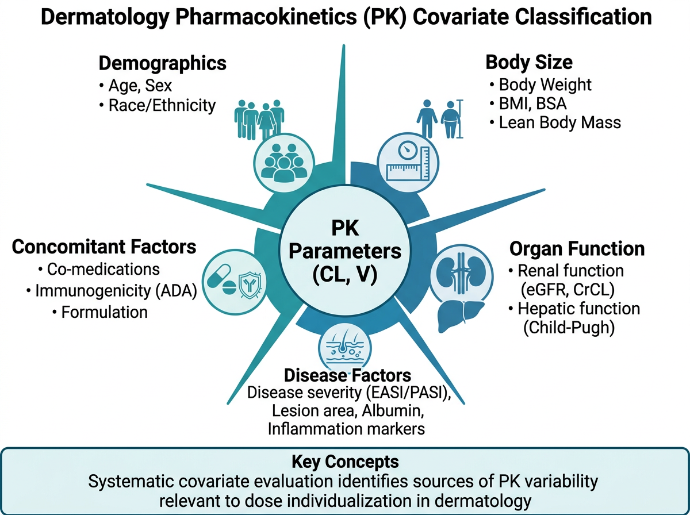
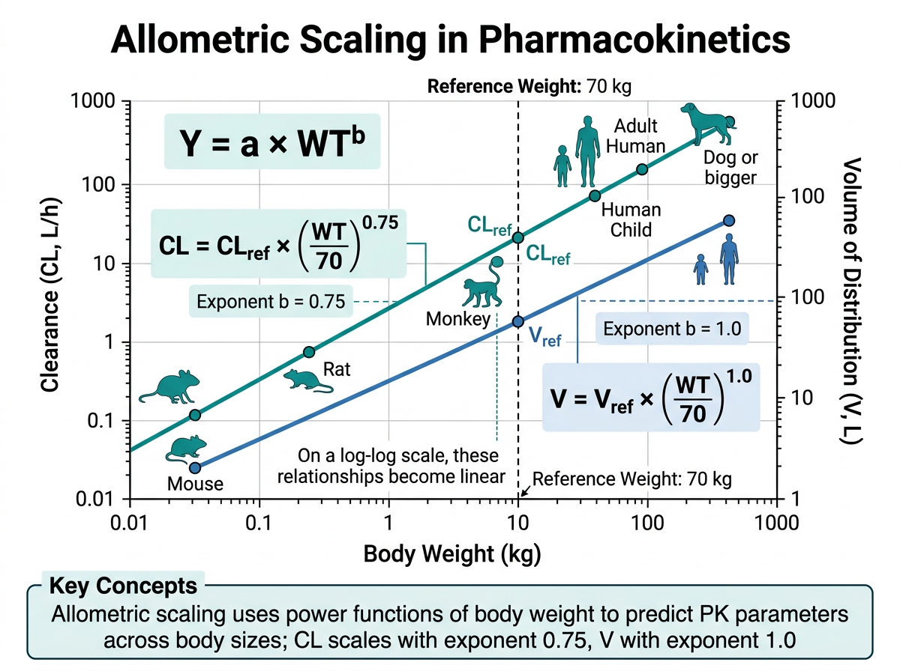
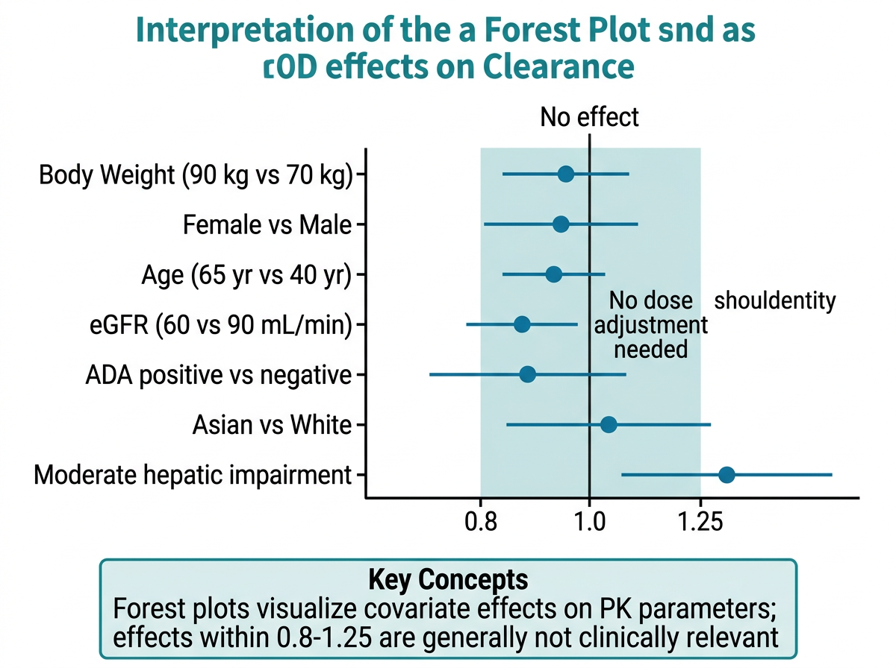

# 공변량 탐색과 모델 반영 {#sec-covariate-exploration}

약동학(PK) 모델링에서 **공변량(covariate)**은 개체간 변이(Inter-Individual Variability, IIV)를 설명할 수 있는 환자 특성입니다. 같은 약물을 같은 용량으로 투여하더라도 환자마다 혈중 농도가 크게 다른 이유는 무엇일까요? 체중, 나이, 신기능, 유전적 다형성 등 다양한 요인이 약물의 체내 동태에 영향을 미칩니다. 이러한 공변량을 식별하고 모델에 반영하면, 개인 맞춤형 용량 조절(individualized dosing)의 과학적 근거를 제공할 수 있습니다.

이 장에서는 피부과 및 자가면역 질환에서 사용되는 약물을 중심으로, PK 공변량의 개념, 탐색 방법, 모델 반영 전략을 학습합니다. 특히 Adalimumab, Dupilumab, Tofacitinib, Methotrexate, Cyclosporine 등 피부과에서 핵심적인 약물의 공변량 효과를 실제 임상 데이터 분석 관점에서 다룹니다.

```{r}
#| eval: false
# 이 장에서 사용하는 패키지
library(tidyverse)    # 데이터 처리 및 시각화
library(corrplot)     # 상관행렬 시각화
library(glmnet)       # LASSO 변수 선택
library(ggrepel)      # 라벨 겹침 방지
library(patchwork)    # 그래프 합성
library(gt)           # 출판 품질 테이블
library(gtsummary)    # 인구통계학적 요약
library(broom)        # 모델 결과 정리
```

---

## 공변량(Covariate)의 개념과 중요성 {#sec-covariate-concept}

{#fig-ch14-1 width=100%}

### 공변량이란 무엇인가

집단 약동학(Population PK) 분석에서 공변량은 PK 파라미터(CL, V, ka 등)의 **개체간 변이를 설명하는 환자 수준의 특성**입니다. 수학적으로 표현하면, 개인 $i$의 청소율 $CL_i$는 다음과 같이 분해됩니다:

$$CL_i = \theta_{CL} \cdot f(\text{Covariates}_i) \cdot e^{\eta_i}$$

여기서 $\theta_{CL}$은 전형적인(typical) 청소율, $f(\text{Covariates}_i)$는 공변량 함수, $\eta_i \sim N(0, \omega^2)$는 잔여 개체간 변이입니다. 좋은 공변량을 찾아 모델에 반영하면 **$\omega^2$이 감소**하여, 설명되지 않는 변이가 줄어듭니다.

### 공변량의 유형

PK 분석에서 고려하는 공변량은 크게 다섯 가지 범주로 나뉩니다.

**첫째, 인구통계학적(Demographic) 공변량**입니다. 나이(AGE), 성별(SEX), 체중(WT), 키(HT), 체질량지수(BMI), 체표면적(BSA), 인종(RACE) 등이 해당됩니다. 이 중 체중은 거의 모든 PK 모델에서 고려되는 가장 기본적인 공변량입니다. 체중이 증가하면 분포용적(V)이 증가하고, 대사 기관의 크기도 커지므로 청소율(CL)도 증가하는 경향이 있습니다.

**둘째, 병태생리학적(Pathophysiological) 공변량**입니다. 장기 기능 지표가 대표적입니다:

- **신기능**: 사구체여과율(eGFR, CKD-EPI 공식), 혈청 크레아티닌(SCR), 크레아티닌 청소율(CLCR, Cockcroft-Gault 공식)
- **간기능**: AST, ALT, 총 빌리루빈, 알부민, Child-Pugh score
- **영양 상태**: 혈청 알부민, 체중 변화
- **질환 중증도**: baseline PASI score, EASI score, IGA score

$$eGFR_{CKD-EPI} = 141 \times \min(SCR/\kappa, 1)^\alpha \times \max(SCR/\kappa, 1)^{-1.209} \times 0.993^{Age} \times [1.018 \text{ if female}]$$

여기서 $\kappa$는 여성 0.7, 남성 0.9이고, $\alpha$는 여성 -0.329, 남성 -0.411입니다.

**셋째, 유전약리학적(Pharmacogenomic) 공변량**입니다. 약물대사효소의 유전적 다형성은 약물의 체내 동태에 극적인 차이를 가져올 수 있습니다:

- **CYP2C19**: Tofacitinib 대사에 관여. Poor metabolizer(PM)는 extensive metabolizer(EM) 대비 AUC가 약 1.5배 증가
- **CYP3A4/5**: Cyclosporine, Tacrolimus 대사의 주요 경로
- **TPMT**: Azathioprine 대사. TPMT 활성 저하 시 골수억제 위험 현저히 증가
- **MTHFR**: Methotrexate 반응성과 관련

**넷째, 면역학적(Immunological) 공변량**입니다. 생물학적 제제(biologics)에서 특히 중요합니다:

- **항약물항체(Anti-Drug Antibody, ADA)**: ADA 양성 시 청소율 증가, 유효 농도 감소
- **Baseline 사이토카인 수치**: TNF-α, IL-17, IL-4/IL-13 등
- **Baseline IgE**: Dupilumab 반응 예측 인자

**다섯째, 피부과 질환 특이적 공변량**입니다:

- **Baseline 질환 중증도**: PASI (건선), EASI (아토피 피부염), DLQI (삶의 질)
- **이전 치료 이력**: 생물학적 제제 사전 노출(bio-experienced vs bio-naive)
- **질환 이환 기간**: 장기 이환 시 치료 반응 저하 가능성
- **동반 질환**: 건선 관절염 동반, 대사증후군

:::{.callout-note}
## 시간 의존적 공변량 vs 시간 불변 공변량

공변량은 시간에 따른 변화 여부에 따라 분류됩니다. **시간 불변(time-invariant) 공변량**은 성별, 인종, 유전형 등 연구 기간 동안 변하지 않는 특성입니다. **시간 의존적(time-varying) 공변량**은 체중, 알부민, eGFR, ADA 상태, 질환 중증도(PASI/EASI) 등 시간에 따라 변할 수 있는 특성입니다. 시간 의존적 공변량은 모델링 시 각 관측 시점의 값을 반영해야 하므로 데이터 준비와 모델 구현이 더 복잡합니다.
:::

### 공변량 분석의 목적

공변량 분석은 단순한 통계적 유의성 검증이 아닙니다. 궁극적인 목적은 다음과 같습니다:

1. **개인 맞춤형 용량 조절**: 환자 특성에 따라 초기 용량을 최적화
2. **특수 집단 권고사항**: 신장애, 간장애, 고령, 소아 등에서의 용량 조절 근거 제공
3. **약물 라벨링(Labeling)**: 허가사항에 공변량 기반 용량 권고 반영
4. **임상시험 설계**: 하위 집단 분석, 층화(stratification) 기준 수립
5. **약물 상호작용 예측**: CYP 유전형에 따른 병용약 효과 예측

:::{.callout-important}
## 통계적 유의성 vs 임상적 관련성

공변량 분석에서 가장 빠지기 쉬운 함정은 **통계적 유의성(statistical significance)**과 **임상적 관련성(clinical relevance)**을 혼동하는 것입니다. 대규모 데이터셋에서는 매우 작은 효과도 통계적으로 유의할 수 있습니다. 예를 들어, 나이가 CL에 통계적으로 유의한 영향을 미치더라도, 그 효과 크기가 파라미터의 5% 미만이라면 임상적으로 용량 조절을 정당화하기 어렵습니다. FDA 가이드라인에서는 일반적으로 **파라미터 변화가 20% 이상**일 때 임상적으로 의미 있는 공변량 효과로 간주합니다.
:::

---

## Allometric Scaling {#sec-allometric-scaling}

{#fig-ch14-2 width=100%}

### 체중 기반 파라미터 조정의 원리

Allometric scaling은 체중(WT)과 PK 파라미터 사이의 생물학적 관계를 모델에 반영하는 방법입니다. 이는 포유류 종 간의 대사율이 체중의 $3/4$ 승에 비례한다는 **Kleiber's law**에 기반합니다.

$$CL = CL_{ref} \times \left(\frac{WT}{WT_{ref}}\right)^{0.75}$$

$$V = V_{ref} \times \left(\frac{WT}{WT_{ref}}\right)^{1.0}$$

여기서 $CL_{ref}$와 $V_{ref}$는 참조 체중($WT_{ref}$, 보통 70 kg)에서의 전형적인(typical) 파라미터 값입니다. 청소율(CL)에는 **0.75** 지수(exponent)를, 분포용적(V)에는 **1.0** 지수를 적용합니다.

이 지수의 생물학적 근거는 다음과 같습니다:

- **CL ~ WT^0.75^**: 대사 기관(간, 신장)의 기능적 용량은 체중에 정비례하지 않고, 체표면적에 더 가깝게 비례합니다. 체표면적은 대략 체중의 $2/3$ 승에 비례하며, 실증적으로 $3/4$ 승이 가장 잘 맞는 것으로 알려져 있습니다.
- **V ~ WT^1.0^**: 분포용적은 체액량에 비례하며, 체액량은 체중에 대략 정비례합니다.

```{r}
#| eval: false
# Allometric scaling 구현
# 참조 체중 70 kg 기준

pk_data <- pk_data |>
  mutate(
    # 청소율에 대한 allometric scaling
    CL_scaled = CL_ref * (WT / 70)^0.75,

    # 분포용적에 대한 allometric scaling
    V_scaled = V_ref * (WT / 70)^1.0,

    # 또는 체표면적(BSA) 기반 (DuBois 공식)
    BSA = 0.007184 * HT^0.725 * WT^0.425
  )

# 체중과 CL의 관계 시각화
ggplot(pk_data, aes(x = WT, y = CL)) +
  geom_point(alpha = 0.6) +
  # Allometric 곡선 추가
  stat_function(
    fun = function(x) CL_ref * (x / 70)^0.75,
    color = "red", linewidth = 1.2
  ) +
  labs(
    x = "체중 (kg)",
    y = "청소율 (L/h)",
    title = "Allometric Scaling: CL vs 체중"
  ) +
  theme_bw()
```

### 체표면적(BSA) 기반 용량 조절

일부 약물은 체중보다 체표면적(BSA)이 더 적절한 용량 기준입니다. 대표적으로 **Methotrexate 고용량 요법**에서 BSA 기반 용량(mg/m²)이 사용됩니다.

$$BSA_{DuBois} = 0.007184 \times HT^{0.725} \times WT^{0.425}$$

$$BSA_{Mosteller} = \sqrt{\frac{HT \times WT}{3600}}$$

여기서 HT는 키(cm), WT는 체중(kg)입니다.

```{r}
#| eval: false
# BSA 계산 함수
calc_bsa_dubois <- function(ht_cm, wt_kg) {
  0.007184 * ht_cm^0.725 * wt_kg^0.425
}

calc_bsa_mosteller <- function(ht_cm, wt_kg) {
  sqrt(ht_cm * wt_kg / 3600)
}

# 예시: Methotrexate 15 mg/m² 용량 계산
patient <- tibble(
  ID = 1:5,
  HT = c(165, 172, 158, 180, 155),
  WT = c(65, 78, 52, 90, 48)
) |>
  mutate(
    BSA = calc_bsa_dubois(HT, WT),
    MTX_dose_mg = round(15 * BSA, 1)  # 15 mg/m² 기준
  )
```

### 소아와 성인의 PK 차이

소아에서는 allometric scaling이 더욱 중요합니다. 소아는 성인과 비교하여 다음과 같은 PK 특성을 보입니다:

- **신생아/영아**: CYP 효소 미성숙으로 대사 능력 저하 → 체중 보정 CL이 성인보다 낮음
- **소아(2-12세)**: 체중 보정 CL이 오히려 성인보다 높을 수 있음 (간 무게/체중 비율이 큼)
- **청소년**: 성인과 유사한 PK 특성

:::{.callout-tip}
## Allometric scaling을 먼저 적용하는 전략

최근 FDA와 EMA에서는 집단 PK 모델링 시 **allometric scaling을 사전에(a priori) 고정**하고, 추가적인 공변량 효과를 탐색하는 접근을 권장합니다. 체중의 allometric 효과는 거의 보편적으로 인정되므로, 이를 먼저 모델에 반영한 후 잔여 변이를 설명하는 다른 공변량을 탐색하는 것이 더 효율적입니다.
:::

---

## 공변량 탐색 방법 {#sec-covariate-exploration-methods}

### 그래프 기반 탐색 (Graphical Approach)

공변량 탐색의 첫 번째 단계는 **시각적 탐색**입니다. 개체별 PK 파라미터 추정값(또는 사후 추정치, empirical Bayes estimate)의 랜덤 효과($\eta$, ETA)를 공변량에 대해 산점도로 나타냅니다.

```{r}
#| eval: false
# 시뮬레이션: 공변량 탐색용 데이터 생성
set.seed(42)
n_patients <- 200

cov_data <- tibble(
  ID = 1:n_patients,
  WT = rlnorm(n_patients, log(70), 0.25),
  AGE = round(rnorm(n_patients, 45, 15)),
  SEX = sample(c("M", "F"), n_patients, replace = TRUE),
  EGFR = rnorm(n_patients, 90, 25),
  ALB = rnorm(n_patients, 4.0, 0.5),
  ADA = sample(c("Negative", "Positive"), n_patients,
               replace = TRUE, prob = c(0.7, 0.3)),
  BPASI = rlnorm(n_patients, log(15), 0.5),
  CYP2C19 = sample(c("EM", "IM", "PM"), n_patients,
                    replace = TRUE, prob = c(0.6, 0.3, 0.1))
) |>
  mutate(
    # 청소율의 "참값" 생성 (공변량 효과 포함)
    CL_true = 0.5 * (WT / 70)^0.75 *
              (EGFR / 90)^0.3 *
              ifelse(ADA == "Positive", 1.4, 1.0) *
              exp(rnorm(n_patients, 0, 0.2)),
    # ETA (잔여 랜덤 효과)
    ETA_CL = log(CL_true) - log(0.5 * (WT / 70)^0.75)
  )
```

```{r}
#| eval: false
# ETA vs 연속형 공변량 산점도 (LOESS 추가)
continuous_covs <- c("WT", "AGE", "EGFR", "ALB", "BPASI")

eta_plots <- map(continuous_covs, function(cov_name) {
  ggplot(cov_data, aes(x = .data[[cov_name]], y = ETA_CL)) +
    geom_point(alpha = 0.4, color = "steelblue") +
    geom_smooth(method = "loess", se = TRUE, color = "red",
                linewidth = 1) +
    geom_hline(yintercept = 0, linetype = "dashed", color = "gray40") +
    labs(
      x = cov_name,
      y = expression(eta[CL]),
      title = paste("ETA_CL vs", cov_name)
    ) +
    theme_bw(base_size = 11)
})

# patchwork으로 합성
(eta_plots[[1]] + eta_plots[[2]] + eta_plots[[3]]) /
(eta_plots[[4]] + eta_plots[[5]] + plot_spacer())
```

ETA vs 공변량 산점도에서 **LOESS 곡선이 수평(0에 가까운)이면** 해당 공변량의 효과가 없음을 시사합니다. 반대로 **뚜렷한 기울기나 비선형 패턴**이 관찰되면 공변량 효과가 있을 가능성이 높습니다.

```{r}
#| eval: false
# ETA vs 범주형 공변량 boxplot
categorical_covs <- c("SEX", "ADA", "CYP2C19")

cat_plots <- map(categorical_covs, function(cov_name) {
  ggplot(cov_data, aes(x = .data[[cov_name]], y = ETA_CL,
                        fill = .data[[cov_name]])) +
    geom_boxplot(alpha = 0.7, outlier.alpha = 0.3) +
    geom_jitter(width = 0.15, alpha = 0.2, size = 1) +
    geom_hline(yintercept = 0, linetype = "dashed", color = "gray40") +
    labs(
      x = cov_name,
      y = expression(eta[CL]),
      title = paste("ETA_CL by", cov_name)
    ) +
    theme_bw(base_size = 11) +
    theme(legend.position = "none")
})

cat_plots[[1]] + cat_plots[[2]] + cat_plots[[3]]
```

### 상관관계 분석 (Correlation Analysis)

연속형 공변량 간의 상관관계를 파악하는 것은 **다중공선성(multicollinearity)** 문제를 예방하는 데 중요합니다. 예를 들어, 체중과 BMI, 체중과 BSA는 높은 상관관계를 가지므로 동시에 모델에 포함하면 안 됩니다.

```{r}
#| eval: false
# 연속형 공변량 상관행렬
cor_matrix <- cov_data |>
  select(WT, AGE, EGFR, ALB, BPASI) |>
  cor(use = "pairwise.complete.obs")

# corrplot으로 시각화
corrplot(
  cor_matrix,
  method = "color",       # 색상으로 표현
  type = "upper",         # 상삼각 행렬만
  addCoef.col = "black",  # 상관계수 텍스트 색상
  tl.col = "black",       # 변수명 색상
  tl.srt = 45,            # 변수명 회전 각도
  number.cex = 0.8,       # 상관계수 크기
  diag = FALSE,           # 대각선 제외
  col = colorRampPalette(c("#2166AC", "white", "#B2182B"))(200),
  title = "공변량 상관행렬",
  mar = c(0, 0, 2, 0)
)
```

:::{.callout-warning}
## 다중공선성 주의

상관계수가 0.7 이상인 공변량 쌍은 다중공선성 가능성이 높습니다. 예를 들어:

- **체중과 BMI** (r > 0.8): 둘 다 포함하면 모수 추정이 불안정해짐
- **SCR과 eGFR** (r ≈ -0.9): eGFR이 SCR로부터 계산되므로 완전한 중복
- **AST와 ALT** (r > 0.7): 간기능 지표로서 유사한 정보를 제공

이 경우 임상적으로 더 의미 있거나 측정이 더 표준화된 공변량을 선택합니다.
:::

### 통계적 방법: Stepwise Selection

전통적인 공변량 선택 방법은 **전진 선택(forward selection)**과 **후진 제거(backward elimination)**를 결합한 단계적 접근(stepwise approach)입니다.

1. **전진 선택(Forward Selection)**:
   - 공변량이 없는 기본 모델(base model)에서 시작
   - 각 공변량을 하나씩 추가하며 목적함수값(OFV) 변화를 확인
   - $\Delta OFV > 3.84$ ($p < 0.05$, $\chi^2$, df=1)인 공변량을 포함
   - 가장 큰 OFV 감소를 보이는 공변량을 먼저 포함

2. **후진 제거(Backward Elimination)**:
   - 전진 선택에서 포함된 모든 공변량이 있는 모델에서 시작
   - 공변량을 하나씩 제거하며 OFV 변화를 확인
   - $\Delta OFV < 6.63$ ($p < 0.01$, $\chi^2$, df=1)인 공변량을 제거
   - 더 엄격한 기준으로 최종 모델의 과적합(overfitting)을 방지

:::{.callout-note}
## OFV 변화량과 p-value의 관계

NONMEM 등에서 사용하는 목적함수값(Objective Function Value, OFV)은 $-2 \times \log(\text{likelihood})$입니다. 중첩 모델(nested model) 비교에서 $\Delta OFV$는 자유도가 추가된 파라미터 수인 $\chi^2$ 분포를 따릅니다:

| $\Delta OFV$ | 자유도 | p-value | 사용 단계 |
|:---:|:---:|:---:|:---|
| 3.84 | 1 | 0.05 | 전진 선택 |
| 6.63 | 1 | 0.01 | 후진 제거 |
| 7.88 | 1 | 0.005 | 보수적 기준 |
| 10.83 | 1 | 0.001 | 매우 보수적 |

후진 제거에서 더 엄격한 기준을 사용하는 이유는, 전진 선택에서 **우연히** 유의하게 나온 공변량을 걸러내기 위함입니다.
:::

### LASSO를 활용한 변수 선택

최근에는 **LASSO (Least Absolute Shrinkage and Selection Operator)** 기반 변수 선택이 점점 더 많이 사용됩니다. LASSO는 회귀 계수에 L1 벌칙(penalty)을 부과하여, 중요하지 않은 공변량의 계수를 정확히 0으로 축소합니다.

$$\hat{\beta}_{LASSO} = \arg\min_\beta \left\{ \sum_{i=1}^{n} (y_i - X_i \beta)^2 + \lambda \sum_{j=1}^{p} |\beta_j| \right\}$$

여기서 $\lambda$는 벌칙 강도를 조절하는 튜닝 파라미터입니다. $\lambda$가 커질수록 더 많은 계수가 0이 되어 더 간결한 모델이 선택됩니다.

```{r}
#| eval: false
# LASSO를 활용한 공변량 선택
# 종속변수: log(CL), 독립변수: 공변량들

# 디자인 행렬 준비 (범주형 변수를 더미 코딩)
x_matrix <- model.matrix(
  ~ WT + AGE + EGFR + ALB + BPASI + SEX + ADA + CYP2C19 - 1,
  data = cov_data
)

y_vector <- log(cov_data$CL_true)

# LASSO 적합 (교차검증으로 최적 lambda 선택)
cv_fit <- cv.glmnet(
  x = x_matrix,
  y = y_vector,
  alpha = 1,        # 1 = LASSO, 0 = Ridge, 0-1 = Elastic Net
  nfolds = 10,      # 10-fold 교차검증
  type.measure = "mse"
)

# 교차검증 결과 시각화
plot(cv_fit)

# 최적 lambda에서의 계수
coef_min <- coef(cv_fit, s = "lambda.min")    # MSE 최소화
coef_1se <- coef(cv_fit, s = "lambda.1se")    # 1 SE rule (더 간결)

# 0이 아닌 계수만 추출
selected_covs <- rownames(coef_1se)[which(coef_1se[, 1] != 0)]
cat("선택된 공변량:", selected_covs, "\n")
```

```{r}
#| eval: false
# LASSO 경로 시각화
fit_lasso <- glmnet(x_matrix, y_vector, alpha = 1)

# 계수 경로 플롯
plot(fit_lasso, xvar = "lambda", label = TRUE)
abline(v = log(cv_fit$lambda.min), lty = 2, col = "red")
abline(v = log(cv_fit$lambda.1se), lty = 2, col = "blue")
legend("topright",
       legend = c("lambda.min", "lambda.1se"),
       col = c("red", "blue"), lty = 2)
```

### 임상적 관련성 기반 선택

통계적 방법에만 의존하면 임상적으로 의미 없는 공변량이 선택되거나, 중요한 공변량이 누락될 수 있습니다. 따라서 **임상적 지식에 기반한 공변량 선택**이 함께 고려되어야 합니다.

예를 들어, Methotrexate의 PK 모델에서 **eGFR은 반드시 고려해야 하는 공변량**입니다. 이는 Methotrexate의 약 80-90%가 신장으로 배설되기 때문이며, 통계적 유의성과 무관하게 약리학적 근거만으로 모델에 포함시킬 수 있습니다.

FDA에서는 공변량 선택 시 다음 원칙을 권장합니다:

1. **생물학적 타당성(Biological plausibility)**: 약물의 ADME 경로에 근거한 공변량
2. **임상적 중요성(Clinical significance)**: 용량 조절 결정에 영향을 미치는 수준의 효과
3. **측정 가능성(Measurability)**: 임상 현장에서 실제로 측정 가능한 지표
4. **데이터 가용성(Data availability)**: 충분한 표본 크기와 결측이 적은 공변량

---

## 특수 집단에서의 용량 조절 {#sec-special-populations}

### 신장애 환자

신장 배설이 중요한 약물에서 eGFR(또는 CLCR)은 핵심 공변량입니다. Methotrexate와 Tofacitinib이 대표적입니다.

**Methotrexate**: 투여량의 80-90%가 신장을 통해 미변화체로 배설됩니다. eGFR이 감소하면 Methotrexate의 청소율이 직접적으로 감소하고, 혈중 농도가 상승하여 골수억제, 점막염, 간독성 등의 위험이 증가합니다.

$$CL_{MTX} \approx CL_{renal} + CL_{nonrenal} \approx f_{renal} \cdot GFR + CL_{nonrenal}$$

| eGFR (mL/min/1.73m²) | 신기능 분류 | Methotrexate 용량 조절 |
|:---:|:---|:---|
| ≥ 90 | 정상 | 용량 조절 불필요 |
| 60-89 | 경도 신장애 | 용량 조절 불필요 (모니터링 권장) |
| 30-59 | 중등도 신장애 | 50% 감량 또는 사용 금기 |
| 15-29 | 중증 신장애 | 사용 금기 |
| < 15 | 신부전 | 절대 금기 |

**Tofacitinib**: 약 30%가 신장으로 배설됩니다. 중등도~중증 신장애(eGFR < 60) 환자에서는 1일 2회 5mg에서 1일 2회 5mg → 1일 1회 5mg으로 감량이 권장됩니다. eGFR이 40 mL/min/1.73m²인 환자에서 AUC가 정상 신기능 대비 약 1.4배 증가한다는 PK 데이터가 근거입니다.

### 간장애 환자

간대사가 주된 소실 경로인 약물에서는 간기능이 핵심 공변량입니다. 간기능 평가에는 주로 **Child-Pugh score**가 사용됩니다.

| 항목 | 1점 | 2점 | 3점 |
|:---|:---|:---|:---|
| 뇌증(Encephalopathy) | 없음 | 경도(1-2기) | 중증(3-4기) |
| 복수(Ascites) | 없음 | 경도 | 중등도-중증 |
| 빌리루빈(mg/dL) | < 2 | 2-3 | > 3 |
| 알부민(g/dL) | > 3.5 | 2.8-3.5 | < 2.8 |
| PT 연장(초) | < 4 | 4-6 | > 6 |

- **Child-Pugh A** (5-6점): 경도 간장애
- **Child-Pugh B** (7-9점): 중등도 간장애
- **Child-Pugh C** (10-15점): 중증 간장애

**Apremilast**: CYP3A4 대사가 주된 소실 경로입니다. Child-Pugh C 환자에서 AUC가 정상 간기능 대비 약 2배 증가합니다. 중증 간장애에서는 1일 1회 30mg으로 감량이 권장됩니다.

### 고령자

나이는 CL과 V 모두에 영향을 미칠 수 있습니다. 고령자에서는:

- **신기능 저하**: 나이에 따른 GFR 감소 (약 10년당 10 mL/min 감소)
- **간 혈류량 감소**: 고령에서 간 혈류량이 20-40% 감소
- **체성분 변화**: 지방 조직 증가, 수분량 감소 → 분포용적 변화
- **혈장 단백질 변화**: 알부민 감소 → 유리형 약물 농도 증가

```{r}
#| eval: false
# 나이에 따른 CL 변화 시각화
age_effect <- tibble(
  AGE = 20:90,
  CL_relative = 1.0 * (AGE / 45)^(-0.3)  # 나이 효과 가정
)

ggplot(age_effect, aes(x = AGE, y = CL_relative)) +
  geom_line(color = "steelblue", linewidth = 1.2) +
  geom_hline(yintercept = 1.0, linetype = "dashed") +
  geom_vline(xintercept = 65, linetype = "dotted", color = "red") +
  annotate("text", x = 67, y = 1.05, label = "고령자 기준 (65세)",
           hjust = 0, color = "red") +
  labs(
    x = "나이 (세)",
    y = "상대적 청소율 (CL/CL_ref)",
    title = "나이에 따른 청소율 변화"
  ) +
  scale_y_continuous(limits = c(0.5, 1.5)) +
  theme_bw()
```

### 비만/저체중: 생물학적 제제에서의 체중 영향

생물학적 제제(monoclonal antibodies)에서 체중은 가장 중요한 공변량 중 하나입니다. 항체 약물은 분자량이 크고(~150 kDa), 분포가 주로 혈관과 간질액에 국한되므로, 체중(특히 제지방 체중)에 따라 분포용적이 변합니다.

**Dupilumab**: 체중이 주요 공변량으로, 고체중(≥100 kg) 환자에서 Ctrough가 약 30% 낮아집니다. 이는 고체중 환자에서 투여 간격 단축(Q2W → QW) 또는 용량 증량을 고려해야 하는 근거가 됩니다.

**Adalimumab**: 체중과 ADA 상태가 CL의 주요 공변량입니다. 체중 80 kg인 환자는 60 kg 환자 대비 CL이 약 20% 높고, 이에 따라 Ctrough가 낮아져 치료 반응률이 저하될 수 있습니다.

```{r}
#| eval: false
# 생물학적 제제에서 체중에 따른 Ctrough 시뮬레이션
set.seed(123)
n_sim <- 500

biologic_sim <- tibble(
  ID = 1:n_sim,
  WT = rlnorm(n_sim, log(75), 0.3)
) |>
  mutate(
    WT_group = case_when(
      WT < 60 ~ "< 60 kg",
      WT < 80 ~ "60-80 kg",
      WT < 100 ~ "80-100 kg",
      TRUE ~ "≥ 100 kg"
    ),
    WT_group = factor(WT_group, levels = c("< 60 kg", "60-80 kg",
                                            "80-100 kg", "≥ 100 kg")),
    # Dupilumab Ctrough 시뮬레이션 (체중 효과 포함)
    CL = 0.35 * (WT / 70)^0.75 * exp(rnorm(n_sim, 0, 0.3)),
    Ctrough = 300 * (0.35 / CL) * exp(rnorm(n_sim, 0, 0.15))
  )

# 체중군별 Ctrough 분포
ggplot(biologic_sim, aes(x = WT_group, y = Ctrough, fill = WT_group)) +
  geom_boxplot(alpha = 0.7) +
  geom_jitter(width = 0.15, alpha = 0.15, size = 0.8) +
  geom_hline(yintercept = 100, linetype = "dashed", color = "red") +
  annotate("text", x = 4.3, y = 105, label = "목표 Ctrough",
           color = "red", hjust = 0) +
  labs(
    x = "체중군",
    y = "Ctrough (mg/L)",
    title = "체중군별 Dupilumab Ctrough 분포"
  ) +
  theme_bw() +
  theme(legend.position = "none")
```

### 면역원성: ADA 양성 환자에서의 청소율 증가

생물학적 제제에서 **면역원성(immunogenicity)**은 청소율에 큰 영향을 미치는 시간 의존적 공변량입니다. ADA가 형성되면 약물-항체 복합체가 만들어져 FcRn 재활용(recycling) 경로가 차단되고, 청소율이 증가합니다.

$$CL_{ADA+} = CL_{ADA-} \times \theta_{ADA}$$

여기서 $\theta_{ADA}$는 일반적으로 1.3-2.0 범위의 값을 가집니다. Adalimumab에서 ADA 양성 환자의 CL은 ADA 음성 대비 약 1.5-2배 증가하는 것으로 보고되었습니다.

:::{.callout-important}
## ADA와 치료 실패의 악순환

ADA 형성은 다음과 같은 악순환을 유발할 수 있습니다:

1. ADA 형성 → 청소율 증가 → 약물 농도 감소
2. 낮은 약물 농도 → 불완전한 표적 억제 → 치료 반응 저하
3. 저농도 지속 → 추가 ADA 형성 촉진 (면역 관용 유지 실패)
4. 높은 ADA 역가 → 더 심한 청소율 증가 → 치료 실패

따라서 생물학적 제제의 TDM에서는 약물 농도와 ADA를 동시에 측정하는 것이 중요합니다.
:::

---

## R 실습: 공변량 탐색과 분석 {#sec-covariate-r-practice}

### 공변량 요약 통계 및 분포 그래프

먼저 공변량의 분포를 파악하고 요약 통계를 생성합니다.

```{r}
#| eval: false
# 시뮬레이션 데이터 생성 (피부과 PK 연구)
set.seed(2024)
n <- 250

pk_cov_data <- tibble(
  ID = 1:n,
  WT = round(rlnorm(n, log(68), 0.25), 1),
  AGE = round(pmin(pmax(rnorm(n, 42, 14), 18), 80)),
  HT = round(rnorm(n, 167, 9), 1),
  SEX = sample(c("M", "F"), n, replace = TRUE, prob = c(0.45, 0.55)),
  RACE = sample(c("Asian", "White", "Black", "Other"), n,
                replace = TRUE, prob = c(0.5, 0.3, 0.1, 0.1)),
  EGFR = round(pmax(rnorm(n, 92, 22), 15)),
  ALB = round(rnorm(n, 4.1, 0.45), 1),
  AST = round(rlnorm(n, log(22), 0.35)),
  ALT = round(rlnorm(n, log(20), 0.4)),
  BPASI = round(rlnorm(n, log(14), 0.5), 1),
  ADA = sample(c("Negative", "Positive"), n,
               replace = TRUE, prob = c(0.72, 0.28)),
  BIO_NAIVE = sample(c("Yes", "No"), n,
                     replace = TRUE, prob = c(0.6, 0.4)),
  DIS_DUR = round(pmax(rlnorm(n, log(8), 0.7), 0.5), 1),
  CYP2C19 = sample(c("EM", "IM", "PM"), n,
                    replace = TRUE, prob = c(0.55, 0.35, 0.10))
) |>
  mutate(
    BMI = round(WT / (HT / 100)^2, 1),
    BSA = round(0.007184 * HT^0.725 * WT^0.425, 2)
  )
```

```{r}
#| eval: false
# gtsummary를 활용한 인구통계학적 요약표
pk_cov_data |>
  select(AGE, SEX, WT, HT, BMI, BSA, RACE, EGFR, ALB,
         AST, ALT, BPASI, ADA, BIO_NAIVE, DIS_DUR, CYP2C19) |>
  tbl_summary(
    type = list(
      all_continuous() ~ "continuous2"
    ),
    statistic = list(
      all_continuous() ~ c("{mean} ({sd})",
                           "{median} ({p25}, {p75})",
                           "{min} - {max}")
    ),
    label = list(
      AGE ~ "나이 (세)",
      SEX ~ "성별",
      WT ~ "체중 (kg)",
      HT ~ "키 (cm)",
      BMI ~ "BMI (kg/m²)",
      BSA ~ "BSA (m²)",
      RACE ~ "인종",
      EGFR ~ "eGFR (mL/min/1.73m²)",
      ALB ~ "알부민 (g/dL)",
      AST ~ "AST (U/L)",
      ALT ~ "ALT (U/L)",
      BPASI ~ "Baseline PASI",
      ADA ~ "ADA 상태",
      BIO_NAIVE ~ "생물학적제제 미경험",
      DIS_DUR ~ "질환 이환 기간 (년)",
      CYP2C19 ~ "CYP2C19 표현형"
    )
  ) |>
  bold_labels()
```

```{r}
#| eval: false
# 연속형 공변량 분포 히스토그램
hist_vars <- c("WT", "AGE", "EGFR", "ALB", "BPASI", "BMI")
hist_labels <- c("체중 (kg)", "나이 (세)", "eGFR (mL/min/1.73m²)",
                 "알부민 (g/dL)", "Baseline PASI", "BMI (kg/m²)")

hist_plots <- map2(hist_vars, hist_labels, function(var, lab) {
  ggplot(pk_cov_data, aes(x = .data[[var]])) +
    geom_histogram(aes(y = after_stat(density)),
                   bins = 25, fill = "steelblue", alpha = 0.7,
                   color = "white") +
    geom_density(color = "darkred", linewidth = 0.8) +
    labs(x = lab, y = "밀도") +
    theme_bw(base_size = 10)
})

# patchwork 합성
(hist_plots[[1]] + hist_plots[[2]] + hist_plots[[3]]) /
(hist_plots[[4]] + hist_plots[[5]] + hist_plots[[6]]) +
  plot_annotation(title = "공변량 분포")
```

### corrplot: 연속형 공변량 상관행렬

```{r}
#| eval: false
# 연속형 공변량 상관행렬 시각화
cont_vars <- pk_cov_data |>
  select(WT, AGE, HT, BMI, BSA, EGFR, ALB, AST, ALT, BPASI, DIS_DUR)

# Spearman 상관계수 (비정규 분포 데이터에 적합)
cor_spearman <- cor(cont_vars, method = "spearman",
                    use = "pairwise.complete.obs")

# 시각화
corrplot(
  cor_spearman,
  method = "ellipse",
  type = "lower",
  addCoef.col = "black",
  number.cex = 0.6,
  tl.col = "black",
  tl.cex = 0.8,
  tl.srt = 45,
  diag = FALSE,
  col = colorRampPalette(c("#2166AC", "#67A9CF", "white",
                           "#EF8A62", "#B2182B"))(200),
  title = "공변량 간 Spearman 상관계수",
  mar = c(0, 0, 2, 0)
)
```

### ETA vs covariate 산점도 생성

실제 PopPK 분석에서는 NONMEM 출력 파일에서 ETA 값을 추출합니다. 여기서는 시뮬레이션으로 ETA를 생성하여 탐색 과정을 연습합니다.

```{r}
#| eval: false
# ETA 시뮬레이션 (공변량 효과가 포함된 잔여 변이)
pk_cov_data <- pk_cov_data |>
  mutate(
    # CL에 대한 ETA (체중, eGFR, ADA의 영향이 남아있다고 가정)
    ETA_CL = 0.3 * scale(log(WT))[,1] +
             0.25 * scale(EGFR)[,1] +
             ifelse(ADA == "Positive", 0.3, 0) +
             rnorm(n, 0, 0.2),
    # V에 대한 ETA (체중의 영향이 남아있다고 가정)
    ETA_V = 0.4 * scale(log(WT))[,1] +
            rnorm(n, 0, 0.15)
  )

# ETA vs 연속형 공변량 산점도 (LOESS 곡선 포함)
create_eta_scatter <- function(data, eta_var, cov_var,
                                eta_label, cov_label) {
  ggplot(data, aes(x = .data[[cov_var]], y = .data[[eta_var]])) +
    geom_point(alpha = 0.3, color = "gray30", size = 1.5) +
    geom_smooth(method = "loess", se = TRUE,
                color = "#E41A1C", fill = "#E41A1C",
                alpha = 0.15, linewidth = 1) +
    geom_hline(yintercept = 0, linetype = "dashed",
               color = "gray50", linewidth = 0.5) +
    labs(x = cov_label, y = eta_label) +
    theme_bw(base_size = 10) +
    theme(plot.margin = margin(5, 5, 5, 5))
}

# CL에 대한 ETA 산점도
p1 <- create_eta_scatter(pk_cov_data, "ETA_CL", "WT",
                          expression(eta[CL]), "체중 (kg)")
p2 <- create_eta_scatter(pk_cov_data, "ETA_CL", "AGE",
                          expression(eta[CL]), "나이 (세)")
p3 <- create_eta_scatter(pk_cov_data, "ETA_CL", "EGFR",
                          expression(eta[CL]), "eGFR")
p4 <- create_eta_scatter(pk_cov_data, "ETA_CL", "ALB",
                          expression(eta[CL]), "알부민 (g/dL)")
p5 <- create_eta_scatter(pk_cov_data, "ETA_CL", "BPASI",
                          expression(eta[CL]), "Baseline PASI")
p6 <- create_eta_scatter(pk_cov_data, "ETA_CL", "BMI",
                          expression(eta[CL]), "BMI (kg/m²)")

(p1 + p2 + p3) / (p4 + p5 + p6) +
  plot_annotation(title = "ETA_CL vs 연속형 공변량")
```

### 범주형 공변량별 PK 파라미터 비교

```{r}
#| eval: false
# 범주형 공변량별 ETA 비교 (boxplot + 통계 검정)
create_eta_boxplot <- function(data, eta_var, cat_var,
                                eta_label, cat_label) {
  # Kruskal-Wallis 또는 Wilcoxon 검정
  groups <- unique(data[[cat_var]])
  if (length(groups) == 2) {
    test_result <- wilcox.test(
      data[[eta_var]] ~ data[[cat_var]]
    )
    p_val <- test_result$p.value
    test_name <- "Wilcoxon"
  } else {
    test_result <- kruskal.test(
      data[[eta_var]] ~ data[[cat_var]]
    )
    p_val <- test_result$p.value
    test_name <- "Kruskal-Wallis"
  }

  p_label <- ifelse(p_val < 0.001, "p < 0.001",
                    paste0("p = ", format(round(p_val, 3), nsmall = 3)))

  ggplot(data, aes(x = .data[[cat_var]], y = .data[[eta_var]],
                    fill = .data[[cat_var]])) +
    geom_boxplot(alpha = 0.7, outlier.shape = NA) +
    geom_jitter(width = 0.15, alpha = 0.2, size = 1) +
    geom_hline(yintercept = 0, linetype = "dashed", color = "gray50") +
    labs(
      x = cat_label, y = eta_label,
      subtitle = paste0(test_name, ": ", p_label)
    ) +
    theme_bw(base_size = 10) +
    theme(legend.position = "none")
}

bp1 <- create_eta_boxplot(pk_cov_data, "ETA_CL", "SEX",
                           expression(eta[CL]), "성별")
bp2 <- create_eta_boxplot(pk_cov_data, "ETA_CL", "ADA",
                           expression(eta[CL]), "ADA 상태")
bp3 <- create_eta_boxplot(pk_cov_data, "ETA_CL", "CYP2C19",
                           expression(eta[CL]), "CYP2C19")
bp4 <- create_eta_boxplot(pk_cov_data, "ETA_CL", "BIO_NAIVE",
                           expression(eta[CL]), "Bio-naive")
bp5 <- create_eta_boxplot(pk_cov_data, "ETA_CL", "RACE",
                           expression(eta[CL]), "인종")

(bp1 + bp2 + bp3) / (bp4 + bp5 + plot_spacer()) +
  plot_annotation(title = "ETA_CL vs 범주형 공변량")
```

### 다변량 회귀 분석

```{r}
#| eval: false
# 다변량 선형 회귀: log(CL) ~ 공변량
# 실제 분석에서는 NONMEM/nlmixr에서 이를 수행하지만,
# 탐색 단계에서 방향성을 파악하는 데 유용합니다.

# 시뮬레이션: CL 생성 (공변량 효과 포함)
pk_cov_data <- pk_cov_data |>
  mutate(
    CL = 0.5 * (WT / 70)^0.75 * (EGFR / 90)^0.3 *
         ifelse(ADA == "Positive", 1.4, 1.0) *
         ifelse(CYP2C19 == "PM", 0.7,
                ifelse(CYP2C19 == "IM", 0.85, 1.0)) *
         exp(rnorm(n, 0, 0.2))
  )

# 전체 모델 적합
full_model <- lm(
  log(CL) ~ log(WT) + AGE + EGFR + ALB + log(BPASI) +
            SEX + ADA + CYP2C19 + RACE + BIO_NAIVE,
  data = pk_cov_data
)

# 모델 요약
summary(full_model)

# 정리된 결과 테이블
tidy_results <- tidy(full_model, conf.int = TRUE) |>
  mutate(
    across(c(estimate, conf.low, conf.high), ~round(., 4)),
    p.value = format.pval(p.value, digits = 3)
  )

print(tidy_results)
```

```{r}
#| eval: false
# 단계적 모델 선택 (AIC 기반)
null_model <- lm(log(CL) ~ 1, data = pk_cov_data)

step_model <- step(
  null_model,
  scope = list(
    lower = null_model,
    upper = full_model
  ),
  direction = "both",
  trace = 1  # 과정 출력
)

# 최종 선택 모델
summary(step_model)
```

### Forest Plot: 공변량 효과 시각화

{#fig-ch14-3 width=100%}

Forest plot은 공변량이 PK 파라미터에 미치는 효과를 직관적으로 보여주는 핵심적인 그래프입니다. 각 공변량의 효과 크기와 신뢰구간을 함께 표시합니다.

```{r}
#| eval: false
# Forest plot 데이터 준비
# 공변량 효과를 상대적 변화(%)로 표현

forest_data <- tibble(
  covariate = c(
    "체중 90 kg vs 70 kg",
    "체중 50 kg vs 70 kg",
    "나이 65세 vs 45세",
    "나이 25세 vs 45세",
    "eGFR 45 vs 90 mL/min",
    "eGFR 120 vs 90 mL/min",
    "ADA 양성 vs 음성",
    "CYP2C19 PM vs EM",
    "CYP2C19 IM vs EM",
    "여성 vs 남성",
    "알부민 3.0 vs 4.0 g/dL",
    "PASI 30 vs 15"
  ),
  group = c(
    "체중", "체중", "나이", "나이",
    "신기능", "신기능", "면역원성",
    "유전형", "유전형", "성별", "알부민", "질환중증도"
  ),
  # CL의 상대적 변화 (%)
  effect = c(
    19.5, -22.0, -8.5, 6.2,
    -18.3, 8.5, 40.0,
    -30.0, -15.0, 3.2,
    12.0, 5.5
  ),
  lower = c(
    12.0, -28.5, -15.2, 0.5,
    -25.1, 3.2, 28.0,
    -42.0, -23.5, -4.5,
    4.0, -2.0
  ),
  upper = c(
    27.5, -15.0, -1.5, 12.0,
    -11.0, 14.0, 54.0,
    -17.0, -6.0, 11.0,
    20.5, 13.5
  )
) |>
  mutate(
    covariate = fct_rev(fct_inorder(covariate)),
    significant = (lower > 0 | upper < 0)
  )

# Forest plot 생성
ggplot(forest_data, aes(x = effect, y = covariate)) +
  # 무효과 구간 (±20% 기준)
  annotate("rect", xmin = -20, xmax = 20,
           ymin = -Inf, ymax = Inf,
           fill = "gray90", alpha = 0.5) +
  # 참조선
  geom_vline(xintercept = 0, linetype = "solid", color = "gray40") +
  geom_vline(xintercept = c(-20, 20), linetype = "dashed",
             color = "gray60") +
  # 신뢰구간
  geom_errorbarh(aes(xmin = lower, xmax = upper,
                      color = significant),
                 height = 0.25, linewidth = 0.8) +
  # 점 추정치
  geom_point(aes(color = significant, shape = significant),
             size = 3) +
  # 색상 및 형태 설정
  scale_color_manual(values = c("FALSE" = "gray50",
                                 "TRUE" = "#D62728"),
                     guide = "none") +
  scale_shape_manual(values = c("FALSE" = 16, "TRUE" = 18),
                     guide = "none") +
  # 축 설정
  scale_x_continuous(
    breaks = seq(-60, 80, 20),
    labels = function(x) paste0(ifelse(x > 0, "+", ""), x, "%")
  ) +
  labs(
    x = "청소율(CL)의 상대적 변화 (%)",
    y = NULL,
    title = "공변량이 청소율에 미치는 효과",
    subtitle = "음영 영역: ±20% (임상적 비관련 범위)",
    caption = "점 추정치와 90% 신뢰구간"
  ) +
  theme_bw(base_size = 11) +
  theme(
    panel.grid.major.y = element_blank(),
    plot.title = element_text(face = "bold"),
    axis.text.y = element_text(size = 10)
  )
```

:::{.callout-tip}
## Forest plot 해석

Forest plot에서 **음영 영역(±20%)**은 임상적으로 의미 없는 범위를 나타냅니다. 신뢰구간이 이 영역 안에 완전히 포함되면, 해당 공변량의 효과는 임상적으로 관련이 없습니다. 반대로 신뢰구간이 음영 영역을 벗어나면, 용량 조절을 고려해야 합니다.

위 예시에서 **ADA 양성(+40%)**, **CYP2C19 PM(-30%)**, **체중 변화**는 임상적으로 의미 있는 효과를 보여줍니다.
:::

### LASSO를 활용한 변수 선택 실습

```{r}
#| eval: false
# 전체 LASSO 분석 파이프라인

# 1. 디자인 행렬 준비
x_mat <- model.matrix(
  ~ log(WT) + AGE + EGFR + ALB + log(BPASI) + DIS_DUR +
    SEX + ADA + CYP2C19 + RACE + BIO_NAIVE - 1,
  data = pk_cov_data
)

y_vec <- log(pk_cov_data$CL)

# 2. 교차검증 LASSO
set.seed(42)
cv_lasso <- cv.glmnet(
  x = x_mat, y = y_vec,
  alpha = 1, nfolds = 10,
  type.measure = "mse"
)

# 3. 결과 시각화
par(mfrow = c(1, 2))

# (a) 교차검증 오차
plot(cv_lasso, main = "교차검증 MSE")

# (b) 계수 경로
plot(cv_lasso$glmnet.fit, xvar = "lambda", label = TRUE)
abline(v = log(cv_lasso$lambda.min), col = "red", lty = 2)
abline(v = log(cv_lasso$lambda.1se), col = "blue", lty = 2)

par(mfrow = c(1, 1))

# 4. 선택된 공변량 출력
cat("=== lambda.min에서의 계수 ===\n")
coef_min <- coef(cv_lasso, s = "lambda.min")
print(coef_min[coef_min[,1] != 0, , drop = FALSE])

cat("\n=== lambda.1se에서의 계수 (더 간결한 모델) ===\n")
coef_1se <- coef(cv_lasso, s = "lambda.1se")
print(coef_1se[coef_1se[,1] != 0, , drop = FALSE])
```

```{r}
#| eval: false
# LASSO 결과를 보기 좋게 정리
lasso_summary <- tibble(
  Variable = rownames(coef_min),
  Coef_min = round(as.vector(coef_min), 4),
  Coef_1se = round(as.vector(coef_1se), 4)
) |>
  filter(Variable != "(Intercept)") |>
  mutate(
    Selected_min = Coef_min != 0,
    Selected_1se = Coef_1se != 0,
    # 효과 크기 (exp 변환하여 상대적 변화로 해석)
    Effect_pct = round((exp(Coef_min) - 1) * 100, 1)
  ) |>
  arrange(desc(abs(Coef_min)))

# gt 테이블로 출력
lasso_summary |>
  gt() |>
  tab_header(
    title = "LASSO 공변량 선택 결과",
    subtitle = "log(CL) 모델"
  ) |>
  cols_label(
    Variable = "공변량",
    Coef_min = "계수 (λ.min)",
    Coef_1se = "계수 (λ.1se)",
    Selected_min = "선택 (λ.min)",
    Selected_1se = "선택 (λ.1se)",
    Effect_pct = "효과 (%)"
  ) |>
  fmt_number(columns = c(Coef_min, Coef_1se), decimals = 4) |>
  data_color(
    columns = Selected_1se,
    fn = function(x) ifelse(x, "#E8F5E9", "#FFEBEE")
  )
```

---

## 약리학 노트: 피부과 약물의 공변량 효과 {#sec-derm-covariate-effects}

### Adalimumab (TNF-α 억제제)

Adalimumab은 건선 및 다양한 자가면역 질환에 사용되는 대표적인 항TNF-α 단클론 항체입니다. 집단 PK 분석에서 확인된 주요 공변량은 다음과 같습니다:

- **체중**: CL에 대한 가장 중요한 공변량. 체중 10 kg 증가 시 CL 약 7-10% 증가
- **ADA 상태**: ADA 양성 시 CL이 50-100% 증가 (가장 큰 영향)
- **알부민**: 알부민 감소 시 CL 증가 (FcRn 매개 재활용 감소)
- **성별**: 여성에서 체중 보정 후에도 CL이 약 5-10% 낮음
- **병용 Methotrexate**: MTX 병용 시 ADA 형성률 감소 → CL 안정화

### Dupilumab (IL-4/IL-13 억제제)

Dupilumab은 중등도-중증 아토피 피부염의 핵심 치료제입니다:

- **체중**: 가장 중요한 공변량. 100 kg 이상에서 Ctrough 약 30% 감소
- **Baseline IgE**: 높은 IgE 수치 시 표적 매개 소실(TMDD)이 증가하여 CL 증가
- **알부민**: FcRn 재활용 경쟁으로 알부민 저하 시 CL 증가
- **나이**: 고령에서 CL이 약간 감소하나 임상적으로 의미 있는 수준은 아님
- **Baseline EASI**: 높은 baseline EASI에서 TMDD 기여 증가

:::{.callout-note}
## 표적 매개 약물 배치(TMDD)와 공변량

생물학적 제제의 소실은 크게 두 경로로 나뉩니다: (1) **비특이적 소실(non-specific clearance)**: FcRn 매개 분해, IgG와 동일한 경로. 체중, 알부민에 의해 주로 결정. (2) **표적 매개 소실(target-mediated drug disposition, TMDD)**: 약물이 표적(수용체)에 결합한 후 내재화(internalization)되어 분해. 표적 발현량(baseline PASI, IgE 등)에 의해 결정.

이 두 경로의 상대적 기여가 농도에 따라 달라지므로, 공변량의 효과도 농도 범위에 따라 달라질 수 있습니다.
:::

### Tofacitinib (JAK 억제제)

Tofacitinib은 건선, 건선 관절염, 류마티스 관절염에 사용되는 경구 JAK 억제제입니다:

- **eGFR**: 중등도 신장애(eGFR 30-59)에서 AUC 약 37% 증가 → 용량 감량 필요
- **CYP2C19 표현형**: PM에서 AUC 약 50% 증가. CYP2C19이 대사의 약 30% 기여
- **CYP3A4 억제제 병용**: 강력한 CYP3A4 억제제(ketoconazole) 병용 시 AUC 약 103% 증가
- **체중**: 경구 소분자이므로 생물학적 제제보다 체중 영향이 적음
- **인종**: 아시아인에서 CYP2C19 PM 빈도가 높아 간접적 영향

### Methotrexate (엽산 대사 길항제)

Methotrexate는 건선과 류마티스 관절염의 기본 치료제입니다:

- **eGFR**: 가장 핵심적인 공변량. 투여량의 80-90%가 신장 배설
- **체표면적(BSA)**: 고용량 요법에서 BSA 기반 용량 산출
- **나이**: 고령에서 신기능 저하에 따른 간접적 효과
- **알부민**: MTX의 약 50%가 알부민에 결합. 저알부민혈증 시 유리형 증가
- **MTHFR 유전형**: C677T 변이 시 MTX 반응성 및 독성 위험 증가

### Cyclosporine (칼시뉴린 억제제)

Cyclosporine은 아토피 피부염 등에 사용되며 좁은 치료역을 가집니다:

- **CYP3A4 약물상호작용**: 가장 중요한 공변량. Azole 항진균제 병용 시 농도 2-3배 증가
- **P-gp 활성**: ABCB1 유전다형성에 따른 흡수율 차이
- **나이**: 소아에서 체중 보정 CL이 성인보다 높음. 고령에서는 감소
- **간기능**: CYP3A4 기질로 간기능 저하 시 CL 감소
- **음식 효과**: 고지방 식이 시 흡수 증가 (Cmax 및 AUC 증가)

```{r}
#| eval: false
# 피부과 약물별 주요 공변량 요약 테이블
derm_cov_summary <- tibble(
  약물 = c("Adalimumab", "Dupilumab", "Tofacitinib",
           "Methotrexate", "Cyclosporine"),
  분류 = c("항TNF-α mAb", "항IL-4/13 mAb", "JAK 억제제",
           "엽산 길항제", "칼시뉴린 억제제"),
  `핵심 공변량` = c(
    "체중, ADA 상태, 알부민",
    "체중, baseline IgE",
    "eGFR, CYP2C19, CYP3A4 상호작용",
    "eGFR (신기능), BSA",
    "CYP3A4 약물상호작용, 나이"
  ),
  `체중 효과` = c("+++", "+++", "+", "+", "+"),
  `신기능 효과` = c("-", "-", "++", "+++", "+"),
  `간기능 효과` = c("-", "-", "+", "+", "++"),
  `유전형 효과` = c("-", "-", "++ (CYP2C19)", "+ (MTHFR)", "+ (CYP3A5)"),
  `면역원성` = c("+++", "+", "-", "-", "-")
)

derm_cov_summary |>
  gt() |>
  tab_header(
    title = "피부과 약물의 주요 공변량 효과 요약",
    subtitle = "+++ 매우 중요, ++ 중요, + 약간 관련, - 관련 없음"
  ) |>
  tab_style(
    style = cell_text(weight = "bold"),
    locations = cells_column_labels()
  )
```

---

## Claude Code 활용 팁 {#sec-claude-covariate-tips}

### 공변량 분석 자동화

Claude Code를 활용하면 공변량 탐색의 반복적인 작업을 효율적으로 자동화할 수 있습니다. 다음과 같이 요청해 보세요:

```
NONMEM 출력 파일(sdtab, patab, cotab)에서 ETA와 공변량을 추출하여
공변량 탐색 그래프를 자동 생성하는 R 함수를 만들어줘.

요구사항:
1. 연속형 공변량: ETA vs covariate scatter + LOESS
2. 범주형 공변량: ETA vs covariate boxplot + 통계 검정
3. 상관행렬: 연속형 공변량 간 corrplot
4. 결과를 하나의 PDF로 저장
5. 각 그래프에 p-value와 상관계수를 자동 표시
```

### Forest Plot 생성 자동화

```
공변량 효과 forest plot을 생성하는 함수를 만들어줘.

입력: 공변량 이름, 효과 크기(%), 90% CI 하한/상한이 있는 데이터프레임
출력: FDA 스타일 forest plot (±20% 비관련 영역 표시)

추가 기능:
- 공변량 그룹별 색상 구분
- 유의한 효과는 빨간색으로 강조
- ggsave()로 300 DPI PNG 및 PDF 동시 저장
```

---

## 연습 문제 {#sec-exercises-covariate}

### 확인 문제

**문제 1.** Allometric scaling에서 청소율(CL)에 적용하는 체중 지수는 얼마이며, 그 생물학적 근거는 무엇인가?

**문제 2.** 전진 선택(forward selection)에서 $\Delta OFV > 3.84$를 기준으로 사용하는 통계적 근거를 설명하시오. 후진 제거에서 더 엄격한 기준($\Delta OFV > 6.63$)을 사용하는 이유는 무엇인가?

**문제 3.** Adalimumab에서 ADA 양성이 PK에 미치는 영향을 설명하고, ADA-청소율 증가-치료 실패의 악순환 메커니즘을 서술하시오.

**문제 4.** LASSO에서 $\lambda$의 역할을 설명하고, `lambda.min`과 `lambda.1se` 중 어느 것이 더 보수적인 모델을 제공하는지 이유와 함께 답하시오.

**문제 5.** Tofacitinib의 PK에 영향을 미치는 세 가지 주요 공변량을 나열하고, 각각이 어떤 메커니즘으로 PK에 영향을 미치는지 설명하시오.

### R 과제

:::{.callout-note collapse="true"}
## R 과제 1: 공변량 요약 및 탐색 그래프

다음 코드로 시뮬레이션 데이터를 생성한 후, 아래 과제를 수행하시오:

```{r}
#| eval: false
set.seed(2024)
n <- 300
exam_data <- tibble(
  ID = 1:n,
  WT = round(rlnorm(n, log(70), 0.25), 1),
  AGE = round(pmin(pmax(rnorm(n, 45, 15), 18), 85)),
  SEX = sample(c("M", "F"), n, replace = TRUE),
  EGFR = round(pmax(rnorm(n, 88, 25), 10)),
  ADA = sample(c("Neg", "Pos"), n, replace = TRUE, prob = c(0.7, 0.3)),
  CL = 0.5 * (WT/70)^0.75 * (EGFR/90)^0.3 *
       ifelse(ADA == "Pos", 1.4, 1.0) * exp(rnorm(n, 0, 0.2))
)
```

1. 모든 공변량의 요약 통계표를 gtsummary로 생성하시오.
2. 연속형 공변량의 히스토그램을 patchwork으로 합성하시오.
3. log(CL)을 종속변수로 한 다변량 회귀 모델을 적합하고, 유의한 공변량을 식별하시오.
:::

:::{.callout-note collapse="true"}
## R 과제 2: Forest Plot 작성

다음 공변량 효과 데이터를 사용하여 FDA 스타일 forest plot을 작성하시오:

```{r}
#| eval: false
# 공변량 효과 데이터
forest_exam <- tibble(
  covariate = c("체중 90kg vs 70kg", "체중 50kg vs 70kg",
                "eGFR 45 vs 90", "ADA+ vs ADA-",
                "CYP2C19 PM vs EM", "나이 70세 vs 40세"),
  effect = c(18, -20, -22, 42, -28, -7),
  lower = c(10, -28, -30, 30, -40, -15),
  upper = c(26, -12, -14, 55, -16, 1)
)
```

요구사항:
1. ±20% 비관련 영역을 음영으로 표시
2. 유의한 효과(CI가 0을 포함하지 않는)를 다른 색으로 강조
3. x축 레이블에 % 표시
:::

:::{.callout-note collapse="true"}
## R 과제 3: LASSO 변수 선택

R 과제 1의 데이터에 다음 공변량을 추가하여 LASSO 분석을 수행하시오:

```{r}
#| eval: false
exam_data <- exam_data |>
  mutate(
    ALB = round(rnorm(n, 4.0, 0.5), 1),
    BMI = round(WT / (rnorm(n, 1.67, 0.09))^2, 1),
    BPASI = round(rlnorm(n, log(15), 0.5), 1),
    RACE = sample(c("Asian", "White", "Black"), n,
                  replace = TRUE, prob = c(0.5, 0.35, 0.15))
  )
```

1. glmnet을 사용하여 10-fold 교차검증 LASSO를 수행하시오.
2. `lambda.min`과 `lambda.1se`에서 선택된 공변량을 비교하시오.
3. LASSO가 "실제로 효과가 있는" 공변량(WT, EGFR, ADA)을 올바르게 선택했는지 평가하시오.
:::

### Claude Code 도전 과제

**도전 과제:** Claude Code를 사용하여 공변량 탐색 자동화 보고서를 생성하세요.

터미널에서 Claude Code를 실행하고 다음과 같이 요청합니다:

```
피부과 PK 연구의 공변량 탐색을 자동화하는 R 함수 패키지를 만들어줘.

필요한 함수:
1. summarize_covariates(): 연속형/범주형 공변량 요약표 생성
2. plot_eta_covariates(): ETA vs 공변량 산점도/boxplot 자동 생성
3. run_lasso_selection(): LASSO 기반 변수 선택 + 결과 시각화
4. create_forest_plot(): 공변량 효과 forest plot 생성

입력: NONMEM 형식 데이터프레임 (ID, ETA1, ETA2, 공변량 열)
출력: 모든 그래프를 PDF로 저장, 요약 결과를 tibble로 반환

피부과 약물(Adalimumab) 시뮬레이션 데이터로 테스트 코드도 포함해줘.
```

:::{.callout-tip}
## 도전 과제 수행 팁

1. 먼저 개별 함수를 하나씩 생성하고 테스트한 후, 전체를 통합하세요.
2. 함수의 인자(argument)를 유연하게 설계하여 다른 약물/데이터에도 재사용할 수 있게 하세요.
3. 결과물을 `quarto render`로 HTML 보고서로 출력해 보세요.
:::

---

## 이 장의 핵심 요약 {#sec-summary-covariate}

이 장에서는 PK 모델링의 핵심 과정인 공변량 탐색과 반영을 다루었습니다:

1. **공변량의 유형**: 인구통계학적, 병태생리학적, 유전약리학적, 면역학적, 질환 특이적 공변량의 다섯 가지 범주를 이해하고, 각 유형의 PK 영향 메커니즘을 학습했습니다.

2. **Allometric Scaling**: 체중과 PK 파라미터의 생물학적 관계(CL ~ WT^0.75^, V ~ WT^1.0^)를 이해하고, BSA 기반 용량 조절과 소아-성인 PK 차이를 학습했습니다.

3. **공변량 탐색 방법**: 그래프 기반(ETA vs covariate plots), 상관관계 분석(corrplot), 통계적 방법(stepwise selection, LASSO), 임상적 관련성 기반 선택의 네 가지 접근법을 실습했습니다.

4. **특수 집단**: 신장애(eGFR), 간장애(Child-Pugh), 고령자, 비만/저체중, 면역원성(ADA) 등 특수 집단에서의 용량 조절 전략과 근거를 배웠습니다.

5. **피부과 약물 공변량**: Adalimumab(체중, ADA), Dupilumab(체중, IgE), Tofacitinib(eGFR, CYP2C19), Methotrexate(eGFR), Cyclosporine(CYP3A4 상호작용)의 핵심 공변량을 정리했습니다.

다음 장에서는 이러한 공변량 분석 결과를 포함한 PK-PD 데이터의 효과적인 시각화 방법을 학습합니다.

---

## 참고 문헌 {#sec-references-ch14}

이 장의 내용은 다음 자료를 참고하였습니다:

1. Mould DR, Upton RN. Basic concepts in population modeling, simulation, and model-based drug development -- Part 2: Introduction to pharmacokinetic modeling methods. *CPT Pharmacometrics Syst Pharmacol*. 2013;2(4):e38.
2. Anderson BJ, Holford NHG. Mechanism-based concepts of size and maturity in pharmacokinetics. *Annu Rev Pharmacol Toxicol*. 2008;48:303-332.
3. Gastonguay MR. A full model estimation approach for covariate effects: inference based on clinical importance and estimation precision. *AAPS J*. 2004;6(S1):W4354.
4. Tibshirani R. Regression shrinkage and selection via the lasso. *J R Stat Soc Series B*. 1996;58(1):267-288.
5. FDA Guidance for Industry. *Population Pharmacokinetics*. 2022.
6. Ternant D, et al. An enzyme-linked immunosorbent assay to study bevacizumab pharmacokinetics. *Ther Drug Monit*. 2010;32(1):36-42.
7. Maini RN, et al. Therapeutic efficacy of multiple intravenous infusions of anti-tumor necrosis factor alpha monoclonal antibody combined with low-dose weekly methotrexate in rheumatoid arthritis. *Arthritis Rheum*. 1998;41(9):1552-1563.
8. Xu Y, et al. Population pharmacokinetics of dupilumab in adult patients with atopic dermatitis. *Clin Pharmacokinet*. 2019;58(4):515-527.
