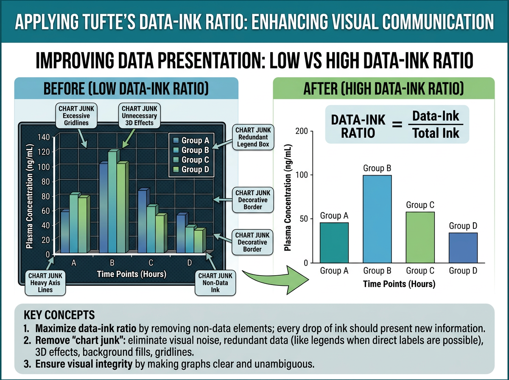
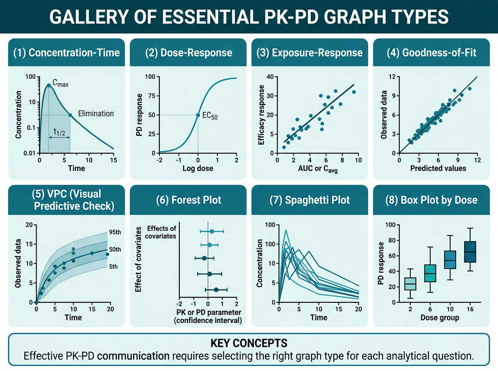
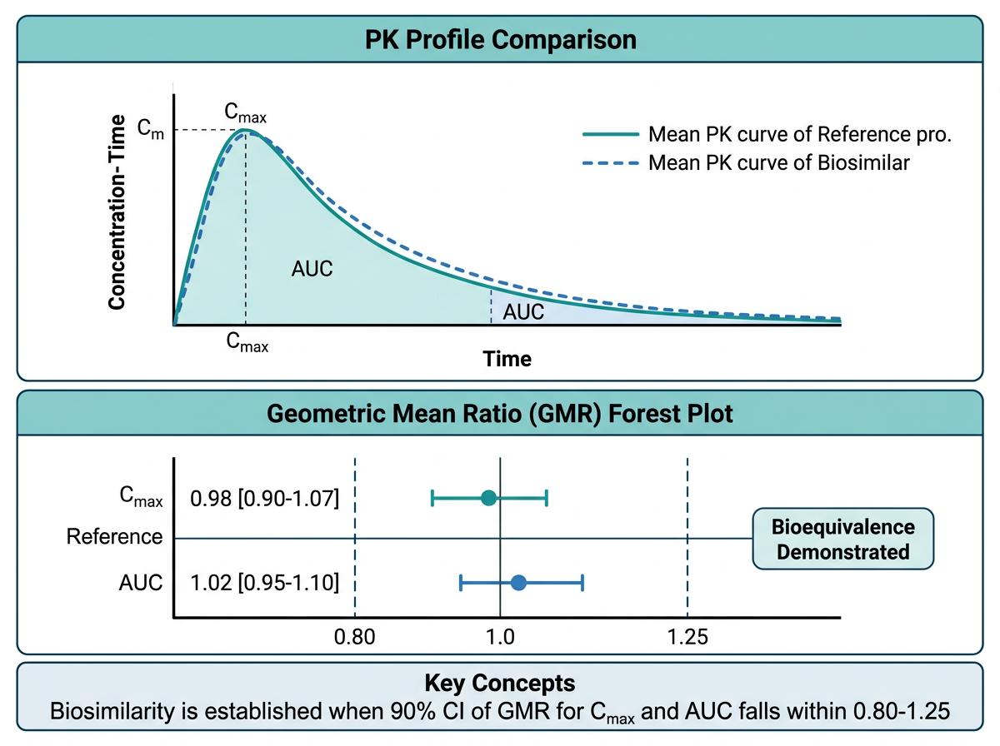

# PK-PD 데이터 시각화 {#sec-pkpd-plotting}

약동학-약력학(PK-PD) 분석에서 **시각화(visualization)**는 데이터의 패턴을 직관적으로 전달하는 핵심 수단입니다. 잘 만들어진 그래프 하나가 수십 줄의 통계 결과보다 효과적으로 메시지를 전달할 수 있습니다. 반대로, 부적절한 시각화는 데이터의 의미를 왜곡하거나 중요한 패턴을 은폐할 수 있습니다.

이 장에서는 PK-PD 분석의 핵심 그래프 유형을 체계적으로 학습하고, ggplot2의 심화 테크닉을 활용하여 출판 및 규제 제출 품질의 그래프를 생성하는 방법을 다룹니다. 특히 피부과 자가면역 질환(건선, 아토피 피부염) 약물의 PK-PD 보고서에 필요한 그래프 세트를 종합 실습으로 구현합니다.

```{r}
#| eval: false
# 이 장에서 사용하는 패키지
library(tidyverse)    # dplyr, ggplot2, tidyr, purrr 등
library(patchwork)    # 다중 패널 그래프 합성
library(scales)       # 축 레이블 서식
library(viridis)      # colorblind-friendly 색상
library(RColorBrewer) # 색상 팔레트
library(ggrepel)      # 라벨 겹침 방지
library(plotly)       # 인터랙티브 그래프
library(showtext)     # 한글 폰트
library(ragg)         # 고품질 그래픽 디바이스
library(gt)           # 테이블
```

---

## 약동학 시각화의 원칙 {#sec-viz-principles}

### 데이터-잉크 비율 (Data-ink Ratio)

{#fig-ch15-2 width=100%}

@fig-ch15-2 에서 보듯이, Edward Tufte는 저서 *The Visual Display of Quantitative Information* (1983)에서 그래프 디자인의 핵심 원칙으로 **데이터-잉크 비율(data-ink ratio)**을 제시했습니다:

$$\text{Data-ink ratio} = \frac{\text{데이터를 표현하는 잉크}}{\text{그래프에 사용된 총 잉크}}$$

이 비율은 가능한 한 **1에 가까워야** 합니다. 즉, 그래프의 모든 요소는 데이터를 전달하는 데 기여해야 하며, 장식적 요소(chartjunk)는 최소화해야 합니다.

PK-PD 그래프에서 이 원칙을 적용하면:

- **불필요한 격자선 제거**: 주요 격자선만 유지, 보조 격자선은 제거 또는 연하게
- **3D 효과 사용 금지**: 2D로 충분히 전달 가능한 정보에 3D를 사용하면 왜곡
- **과도한 색상 사용 자제**: 구분이 필요한 경우에만 색상 사용
- **축 범위 최적화**: 데이터 범위에 맞게 축을 조절하되, 0을 포함할 필요가 없는 경우 생략 가능

### 색상 접근성 (Color Accessibility)

전 세계 남성의 약 8%, 여성의 약 0.5%가 색각 이상을 가지고 있습니다. 따라서 과학적 그래프에서는 **colorblind-friendly** 색상 팔레트를 사용하는 것이 필수적입니다.

```{r}
#| eval: false
# 추천 색상 팔레트

# 1. viridis 팔레트 (연속형, colorblind-friendly)
p1 <- ggplot(mtcars, aes(x = wt, y = mpg, color = disp)) +
  geom_point(size = 3) +
  scale_color_viridis_c(option = "D") +
  labs(title = "viridis (연속형)") +
  theme_bw()

# 2. Okabe-Ito 팔레트 (범주형, 가장 권장되는 팔레트)
okabe_ito <- c("#E69F00", "#56B4E9", "#009E73", "#F0E442",
               "#0072B2", "#D55E00", "#CC79A7", "#999999")

# 3. RColorBrewer (다양한 유형)
# 순차적(sequential): Blues, Reds, YlOrRd
# 발산적(diverging): RdBu, RdYlGn
# 정성적(qualitative): Set1, Set2, Dark2

# 색상 팔레트 비교
display.brewer.all(colorblindFriendly = TRUE)
```

:::{.callout-warning}
## 빨강-초록 조합을 피하세요

가장 흔한 색각 이상은 **적록색맹(deuteranopia, protanopia)**입니다. 따라서 빨강과 초록을 구분 요소로 사용하는 것은 피해야 합니다. 대신 **파랑-주황**, **파랑-빨강**, **보라-노랑** 조합을 사용하세요. ggplot2에서 `scale_color_brewer(palette = "Set2")` 또는 `scale_color_viridis_d()`를 사용하면 안전합니다.
:::

### 규제 제출용 그래프 요구사항

FDA, EMA, PMDA 등 규제 기관에 제출하는 PK/PD 보고서의 그래프는 다음 요구사항을 충족해야 합니다:

**FDA (미국 식품의약국)**:

- 해상도: 최소 300 DPI
- 형식: PDF, TIFF, PNG 허용
- 축 레이블: 단위 포함 (예: "Concentration (ng/mL)")
- 범례(legend): 그래프 내 또는 아래에 명확하게 배치
- 폰트: Arial, Helvetica, Times New Roman (serif/sans-serif)
- 크기: 라벨과 숫자가 인쇄 시 읽을 수 있는 크기 (최소 8pt)

**EMA (유럽의약품청)**:

- 개인 데이터와 모델 예측을 함께 표시하는 것을 선호
- 잔차(residual) 그래프에서 기준선(reference line) 필수
- 색상이 아닌 심볼(shape)로도 구분 가능해야 함 (흑백 인쇄 고려)

**PMDA (일본 의약품의료기기종합기구)**:

- 일본어 라벨 허용 (영어 병기 권장)
- 개인 데이터의 산점도와 평균 프로파일 모두 제출 선호

```{r}
#| eval: false
# 규제 제출용 기본 테마 설정
theme_regulatory <- function(base_size = 11, base_family = "Arial") {
  theme_bw(base_size = base_size, base_family = base_family) %+replace%
    theme(
      # 패널
      panel.grid.minor = element_blank(),
      panel.border = element_rect(color = "black", linewidth = 0.5),
      # 축
      axis.title = element_text(size = base_size, face = "bold"),
      axis.text = element_text(size = base_size - 1, color = "black"),
      axis.ticks = element_line(color = "black", linewidth = 0.3),
      # 범례
      legend.position = "bottom",
      legend.title = element_text(size = base_size - 1, face = "bold"),
      legend.text = element_text(size = base_size - 2),
      legend.key.size = unit(0.8, "lines"),
      # 제목
      plot.title = element_text(size = base_size + 1, face = "bold",
                                 hjust = 0),
      plot.subtitle = element_text(size = base_size - 1, hjust = 0),
      # 여백
      plot.margin = margin(10, 10, 10, 10)
    )
}
```

### 출판용 그래프 품질 기준

학술지 투고용 그래프는 다음 기준을 따릅니다:

| 항목 | 권장 사항 |
|:---|:---|
| 해상도 | 300 DPI (래스터), 벡터 형식 선호 |
| 형식 | TIFF (무손실), PDF/EPS (벡터) |
| 색상 모드 | CMYK (인쇄), RGB (온라인) |
| 폰트 크기 | 본문 8-10pt, 제목 10-12pt |
| 선 굵기 | 0.5-1.0 pt |
| 그래프 크기 | 단일 컬럼 85mm, 이중 컬럼 170mm |
| 데이터 포인트 | 크기 1.5-3pt, 반투명(alpha) 사용 |

---

## PK/PD 핵심 그래프 유형 {#sec-graph-types}

{#fig-ch15-1 width=100%}

### 농도-시간 그래프 (Concentration-Time Plot)

@fig-ch15-1 은 PK-PD 분석에서 자주 사용되는 핵심 그래프 유형을 갤러리 형태로 정리한 것입니다. 농도-시간 그래프는 PK 분석의 가장 기본적이고 중요한 그래프입니다. **선형(linear) 스케일**과 **반로그(semi-logarithmic) 스케일** 두 가지를 반드시 함께 제시해야 합니다.

```{r}
#| eval: false
# 시뮬레이션: 농도-시간 데이터 생성
set.seed(2024)
n_subj <- 30
n_time <- 12
dose_groups <- c(100, 200, 400)  # mg

pk_sim <- expand_grid(
  ID = 1:n_subj,
  TIME = c(0, 0.5, 1, 2, 4, 6, 8, 12, 24, 48, 72, 96)
) |>
  mutate(
    DOSE = rep(rep(dose_groups, each = n_subj / 3), each = n_time),
    DOSE_label = paste0(DOSE, " mg"),
    # 1-구획 모형 시뮬레이션
    CL = rlnorm(n(), log(5), 0.3),
    V = rlnorm(n(), log(50), 0.2),
    ka = rlnorm(n(), log(1.5), 0.3),
    ke = CL / V,
    # 농도 계산 (경구 투여, 1-구획)
    CONC = (DOSE * ka / (V * (ka - ke))) *
           (exp(-ke * TIME) - exp(-ka * TIME)) +
           rnorm(n(), 0, 0.5),
    CONC = pmax(CONC, 0)  # 음수 방지
  )

# 개인 ID별 파라미터 고정 (같은 개인은 같은 PK 파라미터)
pk_sim <- pk_sim |>
  group_by(ID) |>
  mutate(
    CL = first(CL), V = first(V), ka = first(ka), ke = first(ke)
  ) |>
  ungroup() |>
  mutate(
    CONC = (DOSE * first(ka) / (first(V) * (first(ka) - first(ke)))) *
           (exp(-first(ke) * TIME) - exp(-first(ka) * TIME)),
    CONC = pmax(CONC + rnorm(n(), 0, 0.3), 0)
  )

# 더 현실적인 시뮬레이션
pk_sim <- expand_grid(
  ID = 1:n_subj,
  TIME = c(0, 0.5, 1, 2, 4, 6, 8, 12, 24, 48, 72, 96)
) |>
  mutate(DOSE = rep(rep(dose_groups, each = n_subj / 3), each = n_time))

# 개인별 PK 파라미터
pk_params <- tibble(
  ID = 1:n_subj,
  CL_i = rlnorm(n_subj, log(5), 0.3),
  V_i = rlnorm(n_subj, log(50), 0.25),
  ka_i = rlnorm(n_subj, log(1.2), 0.35)
) |>
  mutate(ke_i = CL_i / V_i)

pk_sim <- pk_sim |>
  left_join(pk_params, by = "ID") |>
  mutate(
    CONC = (DOSE * ka_i / (V_i * (ka_i - ke_i))) *
           (exp(-ke_i * TIME) - exp(-ka_i * TIME)),
    CONC = pmax(CONC + rnorm(n(), 0, 0.2), 0),
    DOSE_label = factor(paste0(DOSE, " mg"),
                        levels = c("100 mg", "200 mg", "400 mg"))
  )
```

```{r}
#| eval: false
# (A) Spaghetti plot (Linear scale) - 개인별 프로파일
p_linear <- ggplot(pk_sim, aes(x = TIME, y = CONC,
                                group = ID, color = DOSE_label)) +
  geom_line(alpha = 0.4, linewidth = 0.5) +
  geom_point(alpha = 0.3, size = 1) +
  scale_color_brewer(palette = "Set1", name = "용량군") +
  labs(
    x = "시간 (h)",
    y = "혈중 농도 (ng/mL)",
    title = "(A) 개인별 농도-시간 프로파일 (Linear)"
  ) +
  theme_bw(base_size = 11) +
  theme(legend.position = "bottom")

# (B) Semi-log scale
p_semilog <- ggplot(pk_sim |> filter(CONC > 0),
                     aes(x = TIME, y = CONC,
                         group = ID, color = DOSE_label)) +
  geom_line(alpha = 0.4, linewidth = 0.5) +
  geom_point(alpha = 0.3, size = 1) +
  scale_y_log10(
    labels = scales::label_number(),
    breaks = c(0.1, 1, 10, 100)
  ) +
  scale_color_brewer(palette = "Set1", name = "용량군") +
  labs(
    x = "시간 (h)",
    y = "혈중 농도 (ng/mL)",
    title = "(B) 개인별 농도-시간 프로파일 (Semi-log)"
  ) +
  theme_bw(base_size = 11) +
  theme(legend.position = "bottom")

# 합성
p_linear + p_semilog +
  plot_layout(guides = "collect") &
  theme(legend.position = "bottom")
```

```{r}
#| eval: false
# 평균 + SD 프로파일 (용량군별)
pk_summary <- pk_sim |>
  group_by(DOSE_label, TIME) |>
  summarise(
    Mean = mean(CONC, na.rm = TRUE),
    SD = sd(CONC, na.rm = TRUE),
    n = n(),
    SE = SD / sqrt(n),
    .groups = "drop"
  )

p_mean <- ggplot(pk_summary, aes(x = TIME, y = Mean,
                                  color = DOSE_label,
                                  fill = DOSE_label)) +
  geom_ribbon(aes(ymin = pmax(Mean - SD, 0), ymax = Mean + SD),
              alpha = 0.15, color = NA) +
  geom_line(linewidth = 1) +
  geom_point(size = 2.5) +
  scale_color_brewer(palette = "Set1", name = "용량군") +
  scale_fill_brewer(palette = "Set1", name = "용량군") +
  labs(
    x = "시간 (h)",
    y = "혈중 농도 (ng/mL)",
    title = "용량군별 평균 ± SD 농도-시간 프로파일"
  ) +
  theme_bw(base_size = 11) +
  theme(legend.position = "bottom")

p_mean
```

:::{.callout-tip}
## Linear vs Semi-log: 각각의 역할

**Linear scale**은 Cmax, Tmax를 직관적으로 보여주며, 농도의 절대적 크기를 비교하는 데 적합합니다. **Semi-log scale**은 소실상(elimination phase)의 기울기($-\lambda_z$)를 직선으로 보여주어 반감기 추정, 다구획 동태(bi-exponential decline) 확인, BLQ 근처의 낮은 농도 관찰에 유용합니다. PK 보고서에서는 반드시 두 가지를 모두 제시합니다.
:::

### 농도-효과 그래프 (Concentration-Effect Plot)

농도-효과 관계는 PD 분석의 핵심입니다. 가장 일반적인 모델은 **Emax 모델**입니다:

$$E = E_0 + \frac{E_{max} \times C^\gamma}{EC_{50}^\gamma + C^\gamma}$$

여기서 $E_0$는 기저 효과, $E_{max}$는 최대 효과, $EC_{50}$는 최대 효과의 50%를 나타내는 농도, $\gamma$는 Hill 계수입니다.

```{r}
#| eval: false
# 농도-효과 데이터 시뮬레이션
set.seed(42)
n_pd <- 200

pd_data <- tibble(
  ID = 1:n_pd,
  Cavg = rlnorm(n_pd, log(50), 0.6),  # 평균 노출
  # Emax 모델 + 잔차
  Emax = 80,
  EC50 = 40,
  gamma = 1.5,
  E0 = 20,
  Effect = E0 + (Emax * Cavg^gamma) / (EC50^gamma + Cavg^gamma) +
           rnorm(n_pd, 0, 8)
) |>
  mutate(
    Effect = pmin(pmax(Effect, 0), 100),  # 0-100% 범위
    EASI_change = -(Effect),  # EASI 개선율 (음수 = 개선)
    EASI75 = ifelse(Effect >= 75, "EASI-75 달성", "미달성")
  )

# 농도-효과 산점도 + Emax 곡선
emax_curve <- tibble(
  Cavg = seq(0.1, 300, length.out = 200),
  Effect_pred = 20 + (80 * Cavg^1.5) / (40^1.5 + Cavg^1.5)
)

p_conc_effect <- ggplot(pd_data, aes(x = Cavg, y = Effect)) +
  geom_point(alpha = 0.4, color = "steelblue", size = 2) +
  geom_line(data = emax_curve, aes(x = Cavg, y = Effect_pred),
            color = "red", linewidth = 1.2) +
  # EC50 표시
  geom_vline(xintercept = 40, linetype = "dashed", color = "gray50") +
  geom_hline(yintercept = 60, linetype = "dashed", color = "gray50") +
  annotate("text", x = 42, y = 55, label = expression(EC[50] == 40),
           hjust = 0, color = "gray30") +
  labs(
    x = "평균 노출 (Cavg, ng/mL)",
    y = "EASI 개선율 (%)",
    title = "노출-반응 관계: Emax 모델",
    subtitle = expression(E == E[0] + frac(E[max] %*% C^gamma,
                           EC[50]^gamma + C^gamma))
  ) +
  scale_x_log10() +
  theme_bw(base_size = 11)

p_conc_effect
```

### Goodness-of-Fit (GOF) Plots

GOF plots는 모델의 적합도를 평가하는 진단 그래프입니다. PopPK 분석의 필수 그래프 세트입니다.

```{r}
#| eval: false
# GOF 데이터 시뮬레이션
set.seed(123)
n_obs <- 500

gof_data <- tibble(
  OBS = rlnorm(n_obs, log(20), 0.5),
  # 모델 예측 (약간의 bias와 noise 추가)
  PRED = OBS * exp(rnorm(n_obs, 0.05, 0.15)),
  IPRED = OBS * exp(rnorm(n_obs, 0, 0.08)),
  TIME = runif(n_obs, 0, 168),
  # 조건부 가중 잔차
  CWRES = rnorm(n_obs, 0, 1.1),
  # IWRES
  IWRES = rnorm(n_obs, 0, 0.9)
)

# (A) OBS vs PRED (집단 예측)
gof1 <- ggplot(gof_data, aes(x = PRED, y = OBS)) +
  geom_point(alpha = 0.3, size = 1, color = "steelblue") +
  geom_abline(intercept = 0, slope = 1, color = "red",
              linewidth = 0.8) +
  geom_smooth(method = "loess", se = FALSE, color = "darkblue",
              linewidth = 0.7, linetype = "dashed") +
  scale_x_log10() + scale_y_log10() +
  labs(x = "Population Predicted (ng/mL)",
       y = "Observed (ng/mL)",
       title = "(A) OBS vs PRED") +
  coord_equal() +
  theme_bw(base_size = 10)

# (B) OBS vs IPRED (개인 예측)
gof2 <- ggplot(gof_data, aes(x = IPRED, y = OBS)) +
  geom_point(alpha = 0.3, size = 1, color = "steelblue") +
  geom_abline(intercept = 0, slope = 1, color = "red",
              linewidth = 0.8) +
  geom_smooth(method = "loess", se = FALSE, color = "darkblue",
              linewidth = 0.7, linetype = "dashed") +
  scale_x_log10() + scale_y_log10() +
  labs(x = "Individual Predicted (ng/mL)",
       y = "Observed (ng/mL)",
       title = "(B) OBS vs IPRED") +
  coord_equal() +
  theme_bw(base_size = 10)

# (C) CWRES vs TIME
gof3 <- ggplot(gof_data, aes(x = TIME, y = CWRES)) +
  geom_point(alpha = 0.3, size = 1, color = "steelblue") +
  geom_hline(yintercept = c(-2, 0, 2), linetype = c("dashed", "solid", "dashed"),
             color = c("gray50", "red", "gray50")) +
  geom_smooth(method = "loess", se = FALSE, color = "darkblue",
              linewidth = 0.7) +
  labs(x = "Time (h)", y = "CWRES",
       title = "(C) CWRES vs Time") +
  ylim(-4, 4) +
  theme_bw(base_size = 10)

# (D) CWRES vs PRED
gof4 <- ggplot(gof_data, aes(x = PRED, y = CWRES)) +
  geom_point(alpha = 0.3, size = 1, color = "steelblue") +
  geom_hline(yintercept = c(-2, 0, 2), linetype = c("dashed", "solid", "dashed"),
             color = c("gray50", "red", "gray50")) +
  geom_smooth(method = "loess", se = FALSE, color = "darkblue",
              linewidth = 0.7) +
  scale_x_log10() +
  labs(x = "Population Predicted (ng/mL)", y = "CWRES",
       title = "(D) CWRES vs PRED") +
  ylim(-4, 4) +
  theme_bw(base_size = 10)

# 4-panel GOF
(gof1 + gof2) / (gof3 + gof4) +
  plot_annotation(
    title = "Goodness-of-Fit Plots",
    theme = theme(plot.title = element_text(face = "bold", size = 13))
  )
```

:::{.callout-note}
## GOF Plots 해석 가이드

**OBS vs PRED/IPRED**: 데이터 점들이 **단위선(identity line, y=x)**에 가까울수록 좋은 적합도를 의미합니다. LOESS 곡선이 단위선에서 크게 벗어나면 구조적 모델의 부적합(misspecification)을 시사합니다. IPRED는 PRED보다 항상 더 좋은 적합도를 보여야 합니다(개인별 파라미터 사용).

**CWRES vs TIME/PRED**: 잔차가 0 주위에 **균일하게** 분포해야 합니다. 패턴(시간에 따른 경향, 예측값에 따른 분산 변화)이 관찰되면 모델 개선이 필요합니다. CWRES의 약 95%가 ±2 이내에 있어야 합니다.
:::

### Forest Plot

Forest plot은 공변량 효과, 약물 상호작용, 바이오시밀러 비교 등에서 핵심적으로 사용됩니다.

```{r}
#| eval: false
# 약물 상호작용 forest plot (DDI study)
ddi_data <- tibble(
  Interaction = c(
    "Ketoconazole (강력 CYP3A4 억제)",
    "Fluconazole (중등도 CYP3A4 억제)",
    "Rifampicin (강력 CYP3A4 유도)",
    "Methotrexate 병용",
    "Omeprazole (CYP2C19 억제)",
    "고지방식이"
  ),
  GMR = c(2.03, 1.42, 0.21, 1.05, 1.18, 1.12),
  Lower = c(1.78, 1.22, 0.16, 0.92, 1.05, 0.98),
  Upper = c(2.31, 1.65, 0.28, 1.20, 1.33, 1.28)
) |>
  mutate(
    Interaction = fct_rev(fct_inorder(Interaction)),
    Significant = (Lower > 1.25 | Upper < 0.80)
  )

ggplot(ddi_data, aes(x = GMR, y = Interaction)) +
  # 동등성 범위 (80-125%)
  annotate("rect", xmin = 0.80, xmax = 1.25,
           ymin = -Inf, ymax = Inf,
           fill = "#E8F5E9", alpha = 0.5) +
  geom_vline(xintercept = 1, color = "gray40") +
  geom_vline(xintercept = c(0.80, 1.25), linetype = "dashed",
             color = "gray60") +
  geom_errorbarh(aes(xmin = Lower, xmax = Upper,
                      color = Significant),
                 height = 0.25, linewidth = 0.8) +
  geom_point(aes(color = Significant), size = 3) +
  scale_color_manual(values = c("FALSE" = "gray50", "TRUE" = "#D62728"),
                     guide = "none") +
  scale_x_log10(breaks = c(0.125, 0.25, 0.5, 0.8, 1.0, 1.25, 2.0, 4.0),
                labels = c("0.125", "0.25", "0.5", "0.80",
                           "1.0", "1.25", "2.0", "4.0")) +
  labs(
    x = "AUC 기하평균 비 (GMR) [90% CI]",
    y = NULL,
    title = "약물 상호작용 Forest Plot",
    subtitle = "녹색 영역: 동등성 범위 (80-125%)"
  ) +
  theme_bw(base_size = 11) +
  theme(
    panel.grid.major.y = element_blank(),
    axis.text.y = element_text(size = 10)
  )
```

### Waterfall Plot

Waterfall plot은 개인별 치료 반응의 크기를 직관적으로 보여줍니다. 종양학에서 주로 사용되지만, 피부과에서도 PASI/EASI 개선율을 표시하는 데 유용합니다.

```{r}
#| eval: false
# Waterfall plot: 개인별 EASI 변화
set.seed(2024)
n_wf <- 80

waterfall_data <- tibble(
  ID = 1:n_wf,
  EASI_change = c(
    rnorm(n_wf * 0.7, -65, 20),  # 반응군
    rnorm(n_wf * 0.2, -20, 15),  # 부분 반응군
    rnorm(n_wf * 0.1, 10, 10)    # 비반응군
  )[1:n_wf]
) |>
  mutate(
    EASI_change = pmin(pmax(EASI_change, -100), 50),
    Response = case_when(
      EASI_change <= -75 ~ "EASI-75",
      EASI_change <= -50 ~ "EASI-50",
      EASI_change <= 0 ~ "개선",
      TRUE ~ "악화"
    ),
    Response = factor(Response,
                      levels = c("EASI-75", "EASI-50", "개선", "악화"))
  ) |>
  arrange(EASI_change) |>
  mutate(rank = row_number())

ggplot(waterfall_data, aes(x = rank, y = EASI_change, fill = Response)) +
  geom_col(width = 0.8) +
  # 기준선
  geom_hline(yintercept = 0, color = "black", linewidth = 0.5) +
  geom_hline(yintercept = -75, linetype = "dashed",
             color = "darkgreen", linewidth = 0.5) +
  geom_hline(yintercept = -50, linetype = "dashed",
             color = "orange", linewidth = 0.5) +
  # 주석
  annotate("text", x = n_wf * 0.95, y = -73,
           label = "EASI-75", color = "darkgreen",
           hjust = 1, fontface = "bold", size = 3.5) +
  annotate("text", x = n_wf * 0.95, y = -48,
           label = "EASI-50", color = "orange",
           hjust = 1, fontface = "bold", size = 3.5) +
  scale_fill_manual(
    values = c("EASI-75" = "#2CA02C", "EASI-50" = "#FF7F0E",
               "개선" = "#1F77B4", "악화" = "#D62728"),
    name = "반응 분류"
  ) +
  labs(
    x = "환자 (반응 크기순 정렬)",
    y = "EASI 변화율 (%)",
    title = "Waterfall Plot: 개인별 EASI 변화"
  ) +
  scale_y_continuous(breaks = seq(-100, 50, 25)) +
  theme_bw(base_size = 11) +
  theme(
    axis.text.x = element_blank(),
    axis.ticks.x = element_blank(),
    legend.position = "bottom"
  )
```

### Kaplan-Meier Plot

시간-사건(time-to-event) 분석에서 사용되는 생존 곡선입니다. PK-PD 맥락에서는 "PASI-75 도달까지의 시간" 등을 분석하는 데 활용됩니다.

```{r}
#| eval: false
# Kaplan-Meier 데이터 시뮬레이션
set.seed(42)
n_km <- 150

km_data <- tibble(
  ID = 1:n_km,
  Group = rep(c("위약", "저용량", "고용량"), each = n_km / 3),
  # PASI-75 도달 시간 (주)
  Time = case_when(
    Group == "위약" ~ rexp(n_km / 3, rate = 0.02),
    Group == "저용량" ~ rexp(n_km / 3, rate = 0.06),
    Group == "고용량" ~ rexp(n_km / 3, rate = 0.12)
  ),
  # 중도절단 (24주 연구)
  Event = ifelse(Time <= 24, 1, 0),
  Time = pmin(Time, 24)
) |>
  mutate(Group = factor(Group, levels = c("위약", "저용량", "고용량")))

# KM 곡선 (survfit 사용)
# library(survival)
# library(survminer)
# fit <- survfit(Surv(Time, Event) ~ Group, data = km_data)
# ggsurvplot(fit, data = km_data, ...)

# ggplot2로 직접 구현 (간단한 버전)
km_calc <- km_data |>
  group_by(Group) |>
  arrange(Time) |>
  mutate(
    n_risk = n() - row_number() + 1,
    cum_event = cumsum(Event),
    surv = 1 - cum_event / n()
  ) |>
  # PASI-75 미달성 확률 → "달성 확률"로 변환
  mutate(achieve_prob = 1 - surv)

ggplot(km_calc, aes(x = Time, y = achieve_prob,
                     color = Group)) +
  geom_step(linewidth = 1) +
  scale_color_brewer(palette = "Set1", name = "투여군") +
  labs(
    x = "시간 (주)",
    y = "PASI-75 달성 확률",
    title = "PASI-75 도달 시간 분석 (Kaplan-Meier)"
  ) +
  scale_y_continuous(labels = scales::percent,
                     limits = c(0, 1)) +
  theme_bw(base_size = 11) +
  theme(legend.position = "bottom")
```

### Tornado Plot (민감도 분석)

Tornado plot은 각 공변량 또는 파라미터가 결과에 미치는 상대적 영향을 비교하는 데 사용됩니다.

```{r}
#| eval: false
# Tornado plot: 파라미터 민감도 분석
tornado_data <- tibble(
  Parameter = c("CL", "V", "ka", "Emax", "EC50",
                "체중", "eGFR", "ADA 상태"),
  Low = c(-25, -8, -5, -30, 20, -15, -12, 0),
  High = c(30, 10, 7, 35, -18, 18, 15, 40)
) |>
  mutate(
    Range = abs(High - Low),
    Parameter = fct_reorder(Parameter, Range)
  )

ggplot(tornado_data) +
  geom_col(aes(x = Low, y = Parameter), fill = "#2166AC",
           alpha = 0.8, width = 0.6) +
  geom_col(aes(x = High, y = Parameter), fill = "#B2182B",
           alpha = 0.8, width = 0.6) +
  geom_vline(xintercept = 0, color = "black", linewidth = 0.5) +
  labs(
    x = "Ctrough 변화 (%)",
    y = NULL,
    title = "Tornado Plot: 파라미터 민감도 분석",
    subtitle = "파란색: 하한(-25%), 빨간색: 상한(+25%) 변동"
  ) +
  scale_x_continuous(labels = function(x) paste0(ifelse(x > 0, "+", ""), x, "%")) +
  theme_bw(base_size = 11) +
  theme(panel.grid.major.y = element_blank())
```

### Heatmap

Heatmap은 용량-반응 매트릭스, 공변량 상관관계, 시간-용량별 반응률 등을 시각화하는 데 효과적입니다.

```{r}
#| eval: false
# 용량-시간별 반응률 heatmap
dose_response_matrix <- expand_grid(
  Dose = c("위약", "100 mg", "200 mg", "400 mg"),
  Week = c(4, 8, 12, 16, 24)
) |>
  mutate(
    Dose = factor(Dose, levels = c("위약", "100 mg", "200 mg", "400 mg")),
    # PASI-75 달성률 (시뮬레이션)
    Response_rate = case_when(
      Dose == "위약" ~ pmin(5 + Week * 0.5, 15),
      Dose == "100 mg" ~ pmin(10 + Week * 2, 55),
      Dose == "200 mg" ~ pmin(15 + Week * 3, 75),
      Dose == "400 mg" ~ pmin(20 + Week * 3.5, 85)
    ) + rnorm(n(), 0, 3),
    Response_rate = pmin(pmax(Response_rate, 0), 100)
  )

ggplot(dose_response_matrix, aes(x = factor(Week), y = Dose,
                                   fill = Response_rate)) +
  geom_tile(color = "white", linewidth = 0.5) +
  geom_text(aes(label = paste0(round(Response_rate, 0), "%")),
            color = "white", fontface = "bold", size = 4) +
  scale_fill_viridis_c(option = "C", name = "PASI-75\n달성률 (%)",
                       limits = c(0, 100)) +
  labs(
    x = "치료 주차",
    y = "용량군",
    title = "용량-시간별 PASI-75 달성률"
  ) +
  theme_minimal(base_size = 11) +
  theme(
    panel.grid = element_blank(),
    axis.text = element_text(color = "black")
  )
```

---

## ggplot2 심화 테크닉 {#sec-ggplot-advanced}

### 커스텀 테마 작성: theme_pkpd()

반복적으로 사용하는 그래프 스타일을 함수로 정의하면 코드의 일관성과 효율성을 높일 수 있습니다.

```{r}
#| eval: false
# PK-PD 분석용 커스텀 테마
theme_pkpd <- function(base_size = 11,
                        base_family = "",
                        legend_position = "bottom",
                        grid = "major") {
  t <- theme_bw(base_size = base_size, base_family = base_family) %+replace%
    theme(
      # 패널
      panel.border = element_rect(color = "black", fill = NA,
                                   linewidth = 0.6),
      panel.grid.major = element_line(color = "gray90",
                                       linewidth = 0.3),
      panel.grid.minor = element_blank(),
      # 축
      axis.title = element_text(size = base_size, face = "bold",
                                 color = "black"),
      axis.text = element_text(size = base_size - 1, color = "black"),
      axis.ticks = element_line(color = "black", linewidth = 0.3),
      axis.ticks.length = unit(0.15, "cm"),
      # 범례
      legend.position = legend_position,
      legend.title = element_text(size = base_size - 1, face = "bold"),
      legend.text = element_text(size = base_size - 2),
      legend.background = element_rect(fill = "white", color = NA),
      legend.key = element_rect(fill = "white", color = NA),
      # 제목
      plot.title = element_text(size = base_size + 2, face = "bold",
                                 hjust = 0, margin = margin(b = 5)),
      plot.subtitle = element_text(size = base_size, hjust = 0,
                                    color = "gray30",
                                    margin = margin(b = 10)),
      plot.caption = element_text(size = base_size - 2,
                                   color = "gray50", hjust = 1),
      # Strip (facet 라벨)
      strip.background = element_rect(fill = "gray95", color = "black",
                                       linewidth = 0.4),
      strip.text = element_text(size = base_size - 1, face = "bold")
    )

  if (grid == "none") {
    t <- t + theme(panel.grid.major = element_blank())
  } else if (grid == "y") {
    t <- t + theme(panel.grid.major.x = element_blank())
  } else if (grid == "x") {
    t <- t + theme(panel.grid.major.y = element_blank())
  }

  return(t)
}

# 사용 예시
ggplot(pk_sim, aes(x = TIME, y = CONC, color = DOSE_label)) +
  geom_point(alpha = 0.3) +
  labs(x = "Time (h)", y = "Concentration (ng/mL)") +
  theme_pkpd(base_size = 12, legend_position = "right")
```

### 이중 축 (Secondary Axis): PK + PD 동시 표시

이중 축 그래프는 PK 농도와 PD 반응을 동시에 보여줄 때 유용하지만, **해석의 오류를 유발할 수 있으므로 신중하게 사용**해야 합니다.

```{r}
#| eval: false
# PK + PD 이중 축 그래프
pk_pd_time <- tibble(
  Week = 0:24,
  # PK: Ctrough (ng/mL)
  Ctrough = c(0, 80, 95, 100, 102, 103, 104, 104, 105, 105,
              105, 105, 105, 105, 105, 105, 105, 105, 105, 105,
              105, 105, 105, 105, 105),
  # PD: EASI score
  EASI = c(30, 25, 20, 16, 13, 11, 9, 8, 7.5, 7,
           6.5, 6.2, 6, 5.8, 5.6, 5.5, 5.4, 5.3, 5.2, 5.1,
           5.0, 5.0, 4.9, 4.9, 4.8)
)

# 스케일링 팩터 (PK와 PD의 축 범위를 맞추기 위해)
scale_factor <- max(pk_pd_time$Ctrough) / max(pk_pd_time$EASI)

ggplot(pk_pd_time, aes(x = Week)) +
  # PK (왼쪽 축)
  geom_line(aes(y = Ctrough, color = "Ctrough"),
            linewidth = 1.2) +
  geom_point(aes(y = Ctrough, color = "Ctrough"), size = 2) +
  # PD (오른쪽 축, 스케일링 적용)
  geom_line(aes(y = EASI * scale_factor, color = "EASI"),
            linewidth = 1.2) +
  geom_point(aes(y = EASI * scale_factor, color = "EASI"), size = 2) +
  # 이중 축 설정
  scale_y_continuous(
    name = "Ctrough (ng/mL)",
    sec.axis = sec_axis(~ . / scale_factor, name = "EASI Score")
  ) +
  scale_color_manual(
    values = c("Ctrough" = "#1F77B4", "EASI" = "#D62728"),
    name = NULL
  ) +
  labs(x = "치료 주차", title = "PK-PD 시간 경과") +
  theme_pkpd() +
  theme(
    axis.title.y.left = element_text(color = "#1F77B4"),
    axis.title.y.right = element_text(color = "#D62728")
  )
```

:::{.callout-warning}
## 이중 축 그래프의 주의사항

이중 축(dual-axis) 그래프는 두 변수의 시간적 관계를 한 눈에 보여주는 장점이 있지만, 다음과 같은 위험이 있습니다:

1. **스케일링 조작**: 축 범위를 조절하여 거짓 상관관계를 만들 수 있음
2. **인과관계 오해**: 두 추세가 함께 보인다고 인과관계가 있는 것은 아님
3. **해석 혼란**: 어느 축을 봐야 할지 혼란 유발

대안으로 **facet을 이용한 분리 표시**가 더 정직한 시각화입니다. FDA에서도 이중 축보다 분리된 패널을 선호하는 경향이 있습니다.
:::

### 다중 패널 (Facet)

```{r}
#| eval: false
# facet_wrap: 개인별 PK 프로파일
# 처음 12명만 표시
pk_individual <- pk_sim |>
  filter(ID %in% 1:12)

ggplot(pk_individual, aes(x = TIME, y = CONC)) +
  geom_line(color = "steelblue", linewidth = 0.7) +
  geom_point(color = "steelblue", size = 1.5) +
  facet_wrap(~ ID, ncol = 4, scales = "free_y",
             labeller = labeller(ID = function(x) paste("ID:", x))) +
  labs(
    x = "시간 (h)",
    y = "농도 (ng/mL)",
    title = "개인별 농도-시간 프로파일"
  ) +
  theme_pkpd(base_size = 9)

# facet_grid: 용량 × 성별
pk_sim_with_sex <- pk_sim |>
  mutate(SEX = rep(c("남성", "여성"), length.out = n()))

ggplot(pk_sim_with_sex, aes(x = TIME, y = CONC,
                              group = ID, color = DOSE_label)) +
  geom_line(alpha = 0.3) +
  facet_grid(SEX ~ DOSE_label) +
  labs(x = "시간 (h)", y = "농도 (ng/mL)") +
  theme_pkpd(base_size = 9) +
  theme(legend.position = "none")
```

### 주석 (Annotation): 치료역 표시, EC50 표시

```{r}
#| eval: false
# 치료역(therapeutic window) 표시
mean_profile <- pk_summary |> filter(DOSE_label == "200 mg")

ggplot(mean_profile, aes(x = TIME, y = Mean)) +
  # 치료역 표시
  annotate("rect", xmin = -Inf, xmax = Inf,
           ymin = 5, ymax = 50,
           fill = "#C8E6C9", alpha = 0.4) +
  annotate("text", x = 90, y = 48,
           label = "치료 범위 (Therapeutic Window)",
           color = "darkgreen", fontface = "bold", size = 3.5, hjust = 1) +
  # MEC 표시
  geom_hline(yintercept = 5, linetype = "dashed",
             color = "orange", linewidth = 0.6) +
  annotate("text", x = 90, y = 6,
           label = "MEC (5 ng/mL)",
           color = "orange", hjust = 1, size = 3) +
  # MTC 표시
  geom_hline(yintercept = 50, linetype = "dashed",
             color = "red", linewidth = 0.6) +
  annotate("text", x = 90, y = 52,
           label = "MTC (50 ng/mL)",
           color = "red", hjust = 1, size = 3) +
  # 데이터
  geom_ribbon(aes(ymin = pmax(Mean - SD, 0), ymax = Mean + SD),
              fill = "steelblue", alpha = 0.2) +
  geom_line(color = "steelblue", linewidth = 1.2) +
  geom_point(color = "steelblue", size = 2.5) +
  labs(
    x = "시간 (h)",
    y = "혈중 농도 (ng/mL)",
    title = "치료역과 평균 농도 프로파일 (200 mg)"
  ) +
  theme_pkpd()
```

### 그래프 합성: patchwork 패키지

```{r}
#| eval: false
# patchwork 기본 문법
# p1 + p2         : 가로 배치
# p1 / p2         : 세로 배치
# p1 + p2 + p3    : 3개 가로
# (p1 + p2) / p3  : 위 2개, 아래 1개
# p1 | (p2 / p3)  : 왼쪽 1개, 오른쪽 위아래 2개

# 예시: 다양한 레이아웃
layout1 <- (p_linear + p_semilog) /
           p_mean +
  plot_layout(heights = c(1, 1)) +
  plot_annotation(
    title = "PK 프로파일 종합",
    subtitle = "Dose-escalation Study",
    tag_levels = "A",  # (A), (B), (C) 자동 태그
    theme = theme(plot.title = element_text(face = "bold", size = 14))
  )

layout1
```

```{r}
#| eval: false
# patchwork 고급: 인셋(inset) 그래프
# 큰 그래프 안에 작은 그래프 삽입

main_plot <- ggplot(pk_sim, aes(x = TIME, y = CONC,
                                  group = ID, color = DOSE_label)) +
  geom_line(alpha = 0.3) +
  labs(x = "시간 (h)", y = "농도 (ng/mL)") +
  theme_pkpd()

# 0-4시간 확대 (흡수상)
inset_plot <- ggplot(pk_sim |> filter(TIME <= 4),
                      aes(x = TIME, y = CONC,
                          group = ID, color = DOSE_label)) +
  geom_line(alpha = 0.4) +
  labs(x = "시간 (h)", y = "농도") +
  theme_pkpd(base_size = 8) +
  theme(legend.position = "none",
        plot.background = element_rect(fill = "white", color = "gray50"))

# 인셋 삽입
main_plot + inset_element(inset_plot, left = 0.55, bottom = 0.5,
                           right = 0.98, top = 0.98)
```

### 인터랙티브 그래프: plotly 변환

```{r}
#| eval: false
# ggplot2 → plotly 변환
p_interactive <- ggplot(pk_sim, aes(x = TIME, y = CONC,
                                     group = ID, color = DOSE_label,
                                     text = paste0("ID: ", ID,
                                                   "\nTime: ", TIME, " h",
                                                   "\nConc: ",
                                                   round(CONC, 2),
                                                   " ng/mL"))) +
  geom_line(alpha = 0.4) +
  geom_point(alpha = 0.3, size = 1) +
  labs(x = "시간 (h)", y = "농도 (ng/mL)",
       color = "용량군") +
  theme_pkpd()

# plotly로 변환 (hover 정보 포함)
ggplotly(p_interactive, tooltip = "text")
```

---

## 출판 및 제출 품질 {#sec-publication-quality}

### 해상도(DPI) 설정

```{r}
#| eval: false
# 용도별 해상도 설정
# 1. 출판용: 300 DPI (래스터)
ggsave("figure_publication.tiff",
       plot = p_mean,
       width = 170, height = 120,   # mm
       units = "mm",
       dpi = 300,
       compression = "lzw")          # TIFF 압축

# 2. 웹/프레젠테이션용: 150 DPI
ggsave("figure_web.png",
       plot = p_mean,
       width = 8, height = 6,       # inches
       units = "in",
       dpi = 150)

# 3. 스크리닝/탐색용: 96 DPI
ggsave("figure_screen.png",
       plot = p_mean,
       width = 8, height = 6,
       dpi = 96)
```

### 벡터 형식 출력: SVG, PDF

```{r}
#| eval: false
# PDF 출력 (벡터 형식, 확대해도 깨지지 않음)
ggsave("figure_vector.pdf",
       plot = p_mean,
       width = 170, height = 120,
       units = "mm",
       device = cairo_pdf)  # cairo_pdf: 한글 지원

# SVG 출력 (웹용 벡터)
ggsave("figure_vector.svg",
       plot = p_mean,
       width = 170, height = 120,
       units = "mm")
```

### 폰트 설정: showtext/ragg 패키지

한글 폰트를 그래프에 적용하려면 showtext 또는 ragg 패키지가 필요합니다.

```{r}
#| eval: false
# showtext 패키지로 한글 폰트 설정
library(showtext)

# Google Fonts에서 Noto Sans KR 추가
font_add_google("Noto Sans KR", "notosanskr")
showtext_auto()

# 한글 폰트 적용 그래프
ggplot(pk_summary |> filter(DOSE_label == "200 mg"),
       aes(x = TIME, y = Mean)) +
  geom_line(linewidth = 1, color = "steelblue") +
  geom_point(size = 2.5, color = "steelblue") +
  labs(
    x = "시간 (시간)",
    y = "평균 혈중 농도 (ng/mL)",
    title = "200 mg 투여군 평균 농도-시간 프로파일",
    caption = "평균 ± 표준편차, N=10"
  ) +
  theme_pkpd(base_family = "notosanskr")
```

```{r}
#| eval: false
# ragg 패키지: 고품질 그래픽 디바이스
library(ragg)

# ragg으로 PNG 출력 (시스템 폰트 자동 인식)
agg_png("figure_ragg.png",
        width = 170, height = 120, units = "mm",
        res = 300)
print(p_mean)
dev.off()

# ggsave에서 ragg 사용
ggsave("figure_ragg2.png",
       plot = p_mean,
       width = 170, height = 120, units = "mm",
       dpi = 300,
       device = agg_png)
```

### ggsave() 옵션 상세

```{r}
#| eval: false
# ggsave() 전체 옵션 예시
ggsave(
  filename = "pk_profile_final.pdf",
  plot = p_mean,                      # 저장할 그래프 (생략 시 마지막 그래프)
  device = cairo_pdf,                 # 디바이스 (cairo_pdf: 한글 지원)
  path = "figures/",                  # 저장 경로
  width = 170,                        # 너비
  height = 120,                       # 높이
  units = "mm",                       # 단위 ("in", "cm", "mm", "px")
  dpi = 300,                          # 해상도 (래스터 전용)
  scale = 1,                          # 전체 크기 배율
  limitsize = TRUE,                   # 크기 제한 (TRUE: 50x50인치 이하)
  bg = "white"                        # 배경색
)

# 다중 형식 동시 저장 함수
save_plot <- function(plot, name, path = "figures/",
                       width = 170, height = 120) {
  # PDF (벡터)
  ggsave(paste0(path, name, ".pdf"), plot,
         width = width, height = height, units = "mm",
         device = cairo_pdf)
  # PNG (래스터, 300 DPI)
  ggsave(paste0(path, name, ".png"), plot,
         width = width, height = height, units = "mm",
         dpi = 300)
  # TIFF (출판용)
  ggsave(paste0(path, name, ".tiff"), plot,
         width = width, height = height, units = "mm",
         dpi = 300, compression = "lzw")

  message(paste0("저장 완료: ", name, " (.pdf, .png, .tiff)"))
}

# 사용 예시
save_plot(p_mean, "pk_mean_profile")
```

---

## 종합 실습: PK-PD 보고서 그래프 세트 {#sec-comprehensive-practice}

피부과 PK-PD 보고서에 필요한 전체 그래프 세트를 생성합니다. Adalimumab 건선 임상시험을 가정한 시뮬레이션 데이터를 사용합니다.

### 데이터 준비

```{r}
#| eval: false
# 종합 실습 데이터 생성
set.seed(2024)
n_patients <- 60
visits <- c(0, 2, 4, 8, 12, 16, 24)  # 주차
dose_groups_bio <- c("위약", "40 mg Q2W", "80 mg Q2W")

# 환자 기본 정보
patients <- tibble(
  ID = 1:n_patients,
  GROUP = rep(dose_groups_bio, each = n_patients / 3),
  WT = round(rlnorm(n_patients, log(75), 0.25), 1),
  AGE = round(pmin(pmax(rnorm(n_patients, 45, 13), 20), 75)),
  SEX = sample(c("M", "F"), n_patients, replace = TRUE),
  BPASI = round(rlnorm(n_patients, log(18), 0.4), 1),
  ADA = sample(c("Neg", "Pos"), n_patients,
               replace = TRUE, prob = c(0.75, 0.25))
)

# 시간별 PK-PD 데이터
full_data <- expand_grid(
  ID = 1:n_patients,
  WEEK = visits
) |>
  left_join(patients, by = "ID") |>
  mutate(
    DOSE_mg = case_when(
      GROUP == "위약" ~ 0,
      GROUP == "40 mg Q2W" ~ 40,
      GROUP == "80 mg Q2W" ~ 80
    ),
    # Ctrough 시뮬레이션 (항체 약물)
    CL_i = 0.35 * (WT / 70)^0.75 *
           ifelse(ADA == "Pos", 1.5, 1.0) *
           exp(rnorm(n(), 0, 0.15)),
    Ctrough = ifelse(DOSE_mg == 0, 0,
                     DOSE_mg * 10 / CL_i *
                     (1 - exp(-0.05 * WEEK)) +
                     rnorm(n(), 0, 2)),
    Ctrough = pmax(Ctrough, 0),
    # EASI score 시뮬레이션
    EASI = case_when(
      DOSE_mg == 0 ~ BPASI * (1 - 0.05 * sqrt(WEEK)) + rnorm(n(), 0, 2),
      DOSE_mg == 40 ~ BPASI * exp(-0.08 * WEEK) + rnorm(n(), 0, 1.5),
      DOSE_mg == 80 ~ BPASI * exp(-0.12 * WEEK) + rnorm(n(), 0, 1.2)
    ),
    EASI = pmax(EASI, 0),
    EASI_change_pct = (EASI - BPASI) / BPASI * 100,
    EASI75 = EASI_change_pct <= -75,
    GROUP = factor(GROUP, levels = dose_groups_bio)
  )
```

### 1. Individual PK Profiles (Spaghetti + Mean)

```{r}
#| eval: false
# 개인별 Ctrough + 평균
ctrough_summary <- full_data |>
  filter(DOSE_mg > 0) |>
  group_by(GROUP, WEEK) |>
  summarise(
    Mean = mean(Ctrough, na.rm = TRUE),
    SD = sd(Ctrough, na.rm = TRUE),
    .groups = "drop"
  )

fig1 <- ggplot() +
  # 개인 프로파일
  geom_line(data = full_data |> filter(DOSE_mg > 0),
            aes(x = WEEK, y = Ctrough, group = ID, color = GROUP),
            alpha = 0.25, linewidth = 0.4) +
  # 평균 프로파일
  geom_line(data = ctrough_summary,
            aes(x = WEEK, y = Mean, color = GROUP),
            linewidth = 1.5) +
  geom_point(data = ctrough_summary,
             aes(x = WEEK, y = Mean, color = GROUP),
             size = 3) +
  scale_color_manual(values = c("40 mg Q2W" = "#1F77B4",
                                 "80 mg Q2W" = "#D62728"),
                     name = "투여군") +
  labs(
    x = "치료 주차",
    y = "Ctrough (mg/L)",
    title = "Fig 1. 개인별 및 평균 Ctrough 프로파일"
  ) +
  theme_pkpd()

fig1
```

### 2. Dose-Normalized Concentration Plot

```{r}
#| eval: false
fig2 <- full_data |>
  filter(DOSE_mg > 0) |>
  mutate(
    CONC_DN = Ctrough / DOSE_mg,
    GROUP = GROUP
  ) |>
  ggplot(aes(x = WEEK, y = CONC_DN, color = GROUP)) +
  geom_jitter(alpha = 0.3, width = 0.3, size = 1) +
  stat_summary(fun = mean, geom = "line", linewidth = 1.2) +
  stat_summary(fun = mean, geom = "point", size = 3) +
  scale_color_manual(values = c("40 mg Q2W" = "#1F77B4",
                                 "80 mg Q2W" = "#D62728"),
                     name = "투여군") +
  labs(
    x = "치료 주차",
    y = "Dose-normalized Ctrough (mg/L per mg)",
    title = "Fig 2. 용량 보정 Ctrough"
  ) +
  theme_pkpd()

fig2
```

### 3. PK Parameter Summary (Boxplot + Jitter)

```{r}
#| eval: false
# Week 24 Ctrough 요약
pk_w24 <- full_data |>
  filter(WEEK == 24, DOSE_mg > 0)

fig3 <- ggplot(pk_w24, aes(x = GROUP, y = Ctrough, fill = GROUP)) +
  geom_boxplot(alpha = 0.6, outlier.shape = NA, width = 0.5) +
  geom_jitter(width = 0.15, alpha = 0.5, size = 2, shape = 21,
              color = "black", stroke = 0.3) +
  stat_summary(fun = mean, geom = "point", shape = 23,
               size = 4, fill = "yellow", color = "black") +
  scale_fill_manual(values = c("40 mg Q2W" = "#1F77B4",
                                "80 mg Q2W" = "#D62728"),
                    guide = "none") +
  labs(
    x = "투여군",
    y = "Ctrough at Week 24 (mg/L)",
    title = "Fig 3. Week 24 Ctrough 분포",
    caption = "◇ = 평균"
  ) +
  theme_pkpd()

fig3
```

### 4. Concentration-Effect Relationship (EASI Score)

```{r}
#| eval: false
fig4 <- full_data |>
  filter(WEEK == 24) |>
  ggplot(aes(x = Ctrough, y = EASI_change_pct)) +
  geom_point(aes(color = GROUP), alpha = 0.6, size = 2.5) +
  geom_smooth(method = "loess", se = TRUE,
              color = "black", linewidth = 1, fill = "gray80") +
  geom_hline(yintercept = -75, linetype = "dashed",
             color = "darkgreen") +
  annotate("text", x = max(full_data$Ctrough, na.rm = TRUE) * 0.9,
           y = -73, label = "EASI-75", color = "darkgreen",
           fontface = "bold", hjust = 1) +
  scale_color_manual(values = c("위약" = "gray50",
                                 "40 mg Q2W" = "#1F77B4",
                                 "80 mg Q2W" = "#D62728"),
                     name = "투여군") +
  labs(
    x = "Week 24 Ctrough (mg/L)",
    y = "EASI 변화율 (%)",
    title = "Fig 4. 노출-반응 관계 (Week 24)"
  ) +
  theme_pkpd()

fig4
```

### 5. Exposure-Response: P(EASI-75) vs Ctrough

```{r}
#| eval: false
# Ctrough 사분위수별 EASI-75 달성률
fig5_data <- full_data |>
  filter(WEEK == 24, DOSE_mg > 0) |>
  mutate(
    Ctrough_Q = cut(Ctrough,
                    breaks = quantile(Ctrough, probs = c(0, 0.25, 0.5, 0.75, 1),
                                      na.rm = TRUE),
                    labels = c("Q1\n(최저)", "Q2", "Q3", "Q4\n(최고)"),
                    include.lowest = TRUE)
  ) |>
  group_by(Ctrough_Q) |>
  summarise(
    n = n(),
    n_resp = sum(EASI75, na.rm = TRUE),
    rate = n_resp / n * 100,
    se = sqrt(rate * (100 - rate) / n),
    lower = pmax(rate - 1.96 * se, 0),
    upper = pmin(rate + 1.96 * se, 100),
    .groups = "drop"
  )

fig5 <- ggplot(fig5_data, aes(x = Ctrough_Q, y = rate)) +
  geom_col(fill = "#1F77B4", alpha = 0.7, width = 0.6) +
  geom_errorbar(aes(ymin = lower, ymax = upper),
                width = 0.2, linewidth = 0.6) +
  geom_text(aes(label = paste0(round(rate, 0), "%\n(", n_resp, "/", n, ")")),
            vjust = -0.5, size = 3.5) +
  labs(
    x = "Ctrough 사분위수",
    y = "EASI-75 달성률 (%)",
    title = "Fig 5. 노출-반응: Ctrough 사분위수별 EASI-75"
  ) +
  scale_y_continuous(limits = c(0, 110)) +
  theme_pkpd(grid = "y")

fig5
```

### 6. Covariate Effect Forest Plot

```{r}
#| eval: false
cov_effects <- tibble(
  Covariate = c(
    "체중 90kg vs 70kg", "체중 50kg vs 70kg",
    "ADA+ vs ADA-", "남성 vs 여성",
    "나이 65세 vs 45세", "BPASI 30 vs 15"
  ),
  Effect = c(22, -25, 48, 5, -8, 3),
  Lower = c(14, -33, 35, -3, -16, -5),
  Upper = c(30, -17, 62, 13, 0, 11)
) |>
  mutate(Covariate = fct_rev(fct_inorder(Covariate)))

fig6 <- ggplot(cov_effects, aes(x = Effect, y = Covariate)) +
  annotate("rect", xmin = -20, xmax = 20,
           ymin = -Inf, ymax = Inf,
           fill = "#E8F5E9", alpha = 0.5) +
  geom_vline(xintercept = 0, color = "gray40") +
  geom_vline(xintercept = c(-20, 20), linetype = "dashed",
             color = "gray60") +
  geom_errorbarh(aes(xmin = Lower, xmax = Upper),
                 height = 0.25, linewidth = 0.8, color = "#D62728") +
  geom_point(size = 3, color = "#D62728") +
  scale_x_continuous(
    labels = function(x) paste0(ifelse(x > 0, "+", ""), x, "%")
  ) +
  labs(
    x = "CL의 상대적 변화 (%)",
    y = NULL,
    title = "Fig 6. 공변량 효과 Forest Plot"
  ) +
  theme_pkpd(grid = "x")

fig6
```

### 7. Time-Course PD Response (EASI by Visit)

```{r}
#| eval: false
easi_summary <- full_data |>
  group_by(GROUP, WEEK) |>
  summarise(
    Mean_EASI = mean(EASI, na.rm = TRUE),
    SE = sd(EASI, na.rm = TRUE) / sqrt(n()),
    .groups = "drop"
  )

fig7 <- ggplot(easi_summary, aes(x = WEEK, y = Mean_EASI,
                                   color = GROUP, fill = GROUP)) +
  geom_ribbon(aes(ymin = Mean_EASI - SE, ymax = Mean_EASI + SE),
              alpha = 0.15, color = NA) +
  geom_line(linewidth = 1.2) +
  geom_point(size = 3) +
  scale_color_manual(values = c("위약" = "gray50",
                                 "40 mg Q2W" = "#1F77B4",
                                 "80 mg Q2W" = "#D62728"),
                     name = "투여군") +
  scale_fill_manual(values = c("위약" = "gray50",
                                "40 mg Q2W" = "#1F77B4",
                                "80 mg Q2W" = "#D62728"),
                    name = "투여군") +
  labs(
    x = "치료 주차",
    y = "평균 EASI Score",
    title = "Fig 7. 투여군별 EASI Score 시간 경과",
    caption = "평균 ± SE"
  ) +
  theme_pkpd()

fig7
```

### 8. Waterfall Plot (Individual EASI Change)

```{r}
#| eval: false
wf_data <- full_data |>
  filter(WEEK == 24) |>
  mutate(
    Response_cat = case_when(
      EASI_change_pct <= -75 ~ "EASI-75",
      EASI_change_pct <= -50 ~ "EASI-50",
      EASI_change_pct <= 0 ~ "개선",
      TRUE ~ "악화"
    ),
    Response_cat = factor(Response_cat,
                          levels = c("EASI-75", "EASI-50", "개선", "악화"))
  ) |>
  arrange(EASI_change_pct) |>
  mutate(rank = row_number())

fig8 <- ggplot(wf_data, aes(x = rank, y = EASI_change_pct,
                              fill = Response_cat)) +
  geom_col(width = 0.8) +
  geom_hline(yintercept = c(0, -50, -75), linetype = c("solid", "dashed", "dashed"),
             color = c("black", "orange", "darkgreen"),
             linewidth = c(0.5, 0.5, 0.5)) +
  scale_fill_manual(
    values = c("EASI-75" = "#2CA02C", "EASI-50" = "#FF7F0E",
               "개선" = "#1F77B4", "악화" = "#D62728"),
    name = "반응"
  ) +
  labs(
    x = "환자 (반응순 정렬)",
    y = "EASI 변화율 (%)",
    title = "Fig 8. 개인별 EASI 변화 (Week 24)"
  ) +
  theme_pkpd() +
  theme(axis.text.x = element_blank(), axis.ticks.x = element_blank())

fig8
```

### 다중 패널 레이아웃 (patchwork)

```{r}
#| eval: false
# 전체 보고서 레이아웃
# 페이지 1: PK 그래프
page1 <- (fig1 + fig2) / (fig3 + fig5) +
  plot_annotation(
    title = "Adalimumab 건선 PK-PD Study: PK Results",
    tag_levels = list(c("Fig 1", "Fig 2", "Fig 3", "Fig 5")),
    theme = theme(
      plot.title = element_text(face = "bold", size = 16),
      plot.tag = element_text(size = 10, face = "bold")
    )
  )

ggsave("report_page1_pk.pdf", page1,
       width = 350, height = 250, units = "mm",
       device = cairo_pdf)

# 페이지 2: PD 그래프
page2 <- (fig4 + fig6) / (fig7 + fig8) +
  plot_annotation(
    title = "Adalimumab 건선 PK-PD Study: PD Results",
    tag_levels = list(c("Fig 4", "Fig 6", "Fig 7", "Fig 8")),
    theme = theme(
      plot.title = element_text(face = "bold", size = 16),
      plot.tag = element_text(size = 10, face = "bold")
    )
  )

ggsave("report_page2_pd.pdf", page2,
       width = 350, height = 250, units = "mm",
       device = cairo_pdf)
```

---

## 약리학 노트: FDA/EMA 바이오시밀러 그래프 사례 {#sec-biosimilar-graphs}

{#fig-ch15-3 width=100%}

### Adalimumab 바이오시밀러 PK 비교

@fig-ch15-3 은 바이오시밀러 PK 동등성 평가의 핵심 시각화를 보여줍니다. Adalimumab(Humira)은 가장 많은 바이오시밀러가 개발된 생물학적 제제입니다. 바이오시밀러 허가 시 PK 동등성 입증을 위해 다음 그래프들이 핵심적으로 제출됩니다.

**PK 프로파일 비교 그래프**: 참조약(reference)과 바이오시밀러의 평균 농도-시간 프로파일을 겹쳐 표시합니다.

```{r}
#| eval: false
# 바이오시밀러 PK 비교 시뮬레이션
set.seed(42)
n_bio <- 100  # 각 군 50명

biosim_data <- expand_grid(
  ID = 1:n_bio,
  TIME = c(0, 6, 12, 24, 48, 72, 96, 120, 168, 240, 336, 504, 672)
) |>
  mutate(
    Group = rep(c("참조약 (Humira)", "바이오시밀러"),
                each = n_bio / 2 * 13),
    # SC 투여 후 1-구획 모형 (mAb 특성 반영)
    CL_i = rlnorm(n(), log(0.35), 0.25),
    V_i = rlnorm(n(), log(8), 0.2),
    ka_i = rlnorm(n(), log(0.01), 0.3),
    F_i = rlnorm(n(), log(0.64), 0.15),
    ke_i = CL_i / V_i,
    CONC = (40 * F_i * ka_i / (V_i * (ka_i - ke_i))) *
           (exp(-ke_i * TIME) - exp(-ka_i * TIME)),
    CONC = pmax(CONC + rnorm(n(), 0, 0.1), 0)
  )

# 평균 프로파일
biosim_summary <- biosim_data |>
  group_by(Group, TIME) |>
  summarise(
    GM = exp(mean(log(pmax(CONC, 0.001)))),
    GSD_low = exp(mean(log(pmax(CONC, 0.001))) - sd(log(pmax(CONC, 0.001)))),
    GSD_high = exp(mean(log(pmax(CONC, 0.001))) + sd(log(pmax(CONC, 0.001)))),
    .groups = "drop"
  )

ggplot(biosim_summary, aes(x = TIME / 24, y = GM,
                             color = Group, fill = Group)) +
  geom_ribbon(aes(ymin = GSD_low, ymax = GSD_high),
              alpha = 0.15, color = NA) +
  geom_line(linewidth = 1.2) +
  geom_point(size = 2.5) +
  scale_color_manual(values = c("참조약 (Humira)" = "#1F77B4",
                                 "바이오시밀러" = "#D62728"),
                     name = NULL) +
  scale_fill_manual(values = c("참조약 (Humira)" = "#1F77B4",
                                "바이오시밀러" = "#D62728"),
                    name = NULL) +
  labs(
    x = "시간 (일)",
    y = "혈중 농도 (μg/mL)",
    title = "Adalimumab 바이오시밀러 PK 동등성 시험",
    subtitle = "기하평균 ± GSD, 40 mg SC 단회 투여",
    caption = "Source: Simulated data for educational purposes"
  ) +
  theme_pkpd()
```

### PK 동등성 Forest Plot (90% CI, 80-125%)

바이오시밀러의 PK 동등성 판정에서 가장 핵심적인 그래프입니다. AUC와 Cmax의 기하평균 비(Geometric Mean Ratio, GMR)와 90% 신뢰구간이 **80-125% 범위** 안에 완전히 포함되어야 PK 동등성이 입증됩니다.

```{r}
#| eval: false
# 바이오시밀러 동등성 forest plot
be_data <- tibble(
  Parameter = c(
    expression(AUC[inf]),
    expression(AUC[last]),
    expression(C[max])
  ),
  Parameter_label = c("AUC_inf", "AUC_last", "Cmax"),
  GMR = c(1.02, 1.01, 0.98),
  Lower = c(0.94, 0.93, 0.88),
  Upper = c(1.11, 1.10, 1.09),
  Pass = c(TRUE, TRUE, TRUE)
)

ggplot(be_data, aes(x = GMR, y = fct_rev(Parameter_label))) +
  # 동등성 범위 (80-125%)
  annotate("rect", xmin = 0.80, xmax = 1.25,
           ymin = -Inf, ymax = Inf,
           fill = "#C8E6C9", alpha = 0.4) +
  geom_vline(xintercept = 1, color = "gray30") +
  geom_vline(xintercept = c(0.80, 1.25), linetype = "dashed",
             color = "gray50") +
  geom_errorbarh(aes(xmin = Lower, xmax = Upper),
                 height = 0.2, linewidth = 1, color = "#1F77B4") +
  geom_point(size = 4, color = "#1F77B4") +
  # GMR 값 라벨
  geom_text(aes(label = paste0(format(GMR, nsmall = 2),
                               " [", format(Lower, nsmall = 2),
                               ", ", format(Upper, nsmall = 2), "]")),
            vjust = -1.2, size = 3.5) +
  scale_x_continuous(
    breaks = seq(0.7, 1.4, 0.1),
    limits = c(0.7, 1.4)
  ) +
  labs(
    x = "기하평균 비 (바이오시밀러/참조약) [90% CI]",
    y = NULL,
    title = "PK 동등성 평가: 바이오시밀러 vs 참조약",
    subtitle = "녹색 영역: 동등성 허용 범위 (80-125%)"
  ) +
  theme_pkpd(grid = "x") +
  theme(axis.text.y = element_text(size = 12, face = "bold"))
```

### 면역원성 비교 그래프

바이오시밀러 허가에서 면역원성(ADA 발생률) 비교도 중요한 평가 항목입니다.

```{r}
#| eval: false
# ADA 발생률 비교
ada_compare <- tibble(
  Group = rep(c("참조약", "바이오시밀러"), each = 6),
  Week = rep(c(0, 4, 8, 12, 24, 52), 2),
  ADA_rate = c(
    0, 8, 15, 22, 35, 42,   # 참조약
    0, 7, 14, 20, 33, 40    # 바이오시밀러
  )
)

ggplot(ada_compare, aes(x = Week, y = ADA_rate,
                          color = Group, shape = Group)) +
  geom_line(linewidth = 1) +
  geom_point(size = 3) +
  scale_color_manual(values = c("참조약" = "#1F77B4",
                                 "바이오시밀러" = "#D62728"),
                     name = NULL) +
  scale_shape_manual(values = c("참조약" = 16,
                                 "바이오시밀러" = 17),
                     name = NULL) +
  labs(
    x = "치료 주차",
    y = "ADA 양성률 (%)",
    title = "면역원성 비교: ADA 발생률",
    subtitle = "누적 ADA 양성률"
  ) +
  scale_y_continuous(limits = c(0, 60),
                     labels = function(x) paste0(x, "%")) +
  theme_pkpd()
```

:::{.callout-note}
## 바이오시밀러 PK 동등성 평가의 핵심

바이오시밀러의 PK 동등성은 다음 조건을 모두 충족해야 합니다:

1. **AUC~inf~의 90% CI**: 80-125% 범위 내
2. **AUC~last~의 90% CI**: 80-125% 범위 내
3. **Cmax의 90% CI**: 80-125% 범위 내

이는 소분자 제네릭의 생물학적동등성(BE) 기준과 동일합니다. Forest plot에서 세 파라미터의 90% CI가 모두 녹색 영역(80-125%) 안에 있으면 PK 동등성이 입증됩니다.
:::

---

## Claude Code 활용 팁 {#sec-claude-plotting-tips}

### 복잡한 ggplot2 코드 생성

Claude Code는 복잡한 ggplot2 그래프를 빠르게 생성하는 데 탁월합니다. 다음과 같이 구체적으로 요청하세요:

```
Adalimumab 바이오시밀러 PK 동등성 forest plot을 만들어줘.

데이터:
- AUC_inf: GMR=1.02, 90% CI [0.94, 1.11]
- AUC_last: GMR=1.01, 90% CI [0.93, 1.10]
- Cmax: GMR=0.98, 90% CI [0.88, 1.09]

요구사항:
- 80-125% 동등성 범위를 녹색 음영으로 표시
- GMR과 CI 숫자를 그래프에 표시
- FDA 제출 품질 (300 DPI, Arial 폰트)
- PDF와 PNG로 동시 저장
```

### 그래프 디버깅

ggplot2 그래프에서 오류가 발생하면, 오류 메시지와 데이터 구조를 Claude Code에 보여주세요:

```
이 ggplot2 코드에서 다음 오류가 발생해:
"Error in `scale_color_manual()`: ! Insufficient values
in manual scale."

코드: [코드 붙여넣기]
데이터 str(): [str(data) 결과 붙여넣기]

원인을 찾아 수정해줘.
```

### FDA 형식 맞추기

```
이 ggplot2 그래프를 FDA 제출 형식에 맞게 수정해줘:
1. 폰트: Arial, 10pt
2. 축 라벨에 단위 포함
3. 범례를 그래프 하단에 배치
4. 300 DPI, 170mm x 120mm 크기
5. 격자선은 주요 격자만 연한 회색으로
6. 패널 테두리 검정색
```

---

## 연습 문제 {#sec-exercises-plotting}

### 확인 문제

**문제 1.** Tufte의 데이터-잉크 비율(data-ink ratio) 원칙을 설명하고, PK 그래프에서 이 원칙을 위반하는 세 가지 사례를 들시오.

**문제 2.** PK 보고서에서 linear scale과 semi-log scale 농도-시간 그래프를 모두 제시해야 하는 이유를 설명하시오. 각 스케일에서 더 잘 보이는 정보는 무엇인가?

**문제 3.** GOF plots에서 CWRES vs PRED 그래프의 해석 방법을 설명하시오. 어떤 패턴이 모델의 문제를 시사하는가?

**문제 4.** 바이오시밀러 PK 동등성 판정에서 forest plot의 해석 기준을 설명하시오. AUC와 Cmax의 90% CI가 각각 [0.85, 1.15]와 [0.78, 1.20]일 때, 동등성이 입증되는가?

**문제 5.** colorblind-friendly 색상 팔레트의 중요성을 설명하고, ggplot2에서 사용할 수 있는 세 가지 접근법을 나열하시오.

### R 과제

:::{.callout-note collapse="true"}
## R 과제 1: PK 프로파일 완성

다음 시뮬레이션 데이터를 사용하여 세 가지 그래프를 작성하시오:

```{r}
#| eval: false
set.seed(123)
n <- 40
pk_exercise <- expand_grid(
  ID = 1:n,
  TIME = c(0, 0.5, 1, 2, 4, 8, 12, 24, 48)
) |>
  mutate(
    DOSE = rep(rep(c(100, 300), each = n / 2), each = 9),
    CL_i = rlnorm(n(), log(8), 0.3),
    V_i = rlnorm(n(), log(60), 0.2),
    ka_i = rlnorm(n(), log(1.5), 0.3),
    ke_i = CL_i / V_i,
    CONC = (DOSE * ka_i / (V_i * (ka_i - ke_i))) *
           (exp(-ke_i * TIME) - exp(-ka_i * TIME)),
    CONC = pmax(CONC + rnorm(n(), 0, 0.3), 0)
  )
```

1. 용량군별 spaghetti plot (linear + semi-log, patchwork 합성)
2. 용량군별 평균 ± SD 프로파일 (ribbon 사용)
3. Dose-normalized 그래프로 용량 비례성 시각적 평가
:::

:::{.callout-note collapse="true"}
## R 과제 2: GOF Plots 세트

다음 모델 진단 데이터를 사용하여 4-panel GOF plot을 작성하시오:

```{r}
#| eval: false
set.seed(456)
n_gof <- 400
gof_exercise <- tibble(
  OBS = rlnorm(n_gof, log(25), 0.5),
  PRED = OBS * exp(rnorm(n_gof, 0.08, 0.18)),
  IPRED = OBS * exp(rnorm(n_gof, 0, 0.07)),
  TIME = runif(n_gof, 0, 72),
  CWRES = rnorm(n_gof, 0.1, 1.15)  # 약간의 bias
)
```

요구사항:
1. (A) OBS vs PRED, (B) OBS vs IPRED, (C) CWRES vs TIME, (D) CWRES vs PRED
2. 각 패널에 적절한 참조선(단위선, y=0 등) 추가
3. LOESS 곡선 추가
4. patchwork으로 2x2 레이아웃, 태그 표시
5. CWRES에 약간의 bias(양의 평균)가 있는데, 이를 그래프에서 식별할 수 있는지 확인
:::

:::{.callout-note collapse="true"}
## R 과제 3: 종합 보고서 그래프

이 장의 종합 실습 데이터(`full_data`)를 활용하여 다음 그래프를 추가 작성하시오:

1. ADA 상태별 Ctrough 비교 boxplot (Week 24)
2. 체중 사분위수별 EASI-75 달성률 막대 그래프
3. 모든 그래프를 patchwork으로 합성하여 하나의 PDF로 저장 (A4 크기)

힌트:
- ADA에 따른 Ctrough 차이가 크다면, 이는 용량 조절의 근거가 될 수 있습니다.
- 체중에 따른 반응률 차이는 생물학적 제제에서 특히 중요합니다.
:::

### Claude Code 도전 과제

**도전 과제:** Claude Code를 사용하여 자동화된 PK-PD 시각화 리포트를 생성하세요.

터미널에서 Claude Code를 실행하고 다음과 같이 요청합니다:

```
PK-PD 데이터를 입력받아 자동으로 표준 그래프 세트를 생성하는
R 함수 create_pkpd_report()를 만들어줘.

입력 데이터 형식:
- ID, TIME, CONC, DOSE, GROUP, WEEK, EASI_score, 공변량(WT, AGE, SEX, ADA)

생성할 그래프 (총 8개):
1. Spaghetti plot (linear + semi-log)
2. Mean ± SD profile by dose group
3. Dose-normalized concentration
4. PK parameter boxplot (Cmax, Ctrough)
5. Exposure-response (EASI vs Ctrough)
6. EASI time course by group
7. Waterfall plot (individual EASI change)
8. Covariate effects (체중, ADA별 boxplot)

출력: PDF 보고서 (patchwork 2-panel layout, A4 크기)
모든 그래프에 theme_pkpd() 적용, 300 DPI
```

:::{.callout-tip}
## 도전 과제 수행 팁

1. 먼저 `theme_pkpd()` 함수를 정의하고 Claude Code에 알려주세요.
2. 시뮬레이션 데이터로 함수를 테스트한 후, 실제 데이터에 적용하세요.
3. "이 그래프의 x축 범위를 0-24로 변경해줘" 등 세부 수정을 반복적으로 요청하여 완성도를 높이세요.
4. 최종 결과물을 `quarto render`로 HTML/PDF 보고서로 출력해 보세요.
:::

---

## 이 장의 핵심 요약 {#sec-summary-plotting}

이 장에서는 PK-PD 데이터의 효과적인 시각화를 위한 원칙, 핵심 그래프 유형, ggplot2 심화 테크닉, 출판 품질 설정을 체계적으로 학습했습니다:

1. **시각화 원칙**: 데이터-잉크 비율, 색상 접근성(colorblind-friendly), 규제 제출용/출판용 품질 기준을 이해했습니다. 과학적 그래프는 데이터를 **정직하고 명확하게** 전달해야 합니다.

2. **핵심 그래프 유형**: 농도-시간(linear/semi-log), 농도-효과(Emax), GOF plots, forest plot, waterfall plot, Kaplan-Meier, tornado, heatmap 등 PK-PD 분석에 필수적인 그래프를 ggplot2로 구현했습니다.

3. **ggplot2 심화**: 커스텀 테마(`theme_pkpd()`), 이중 축, 다중 패널(facet), 주석(annotation), patchwork 합성, plotly 인터랙티브 변환 등의 고급 테크닉을 익혔습니다.

4. **출판/제출 품질**: 해상도(DPI), 벡터 형식(PDF/SVG), 폰트(showtext/ragg), ggsave() 상세 옵션을 학습하여 FDA/EMA 제출 및 학술지 투고에 적합한 그래프를 생성할 수 있게 되었습니다.

5. **바이오시밀러 그래프**: Adalimumab 바이오시밀러 허가 사례를 통해 PK 동등성 forest plot(90% CI, 80-125%), 면역원성 비교 그래프의 실제 구현을 경험했습니다.

다음 장에서는 이러한 시각화 기법을 활용하여 최종 PK-PD 보고서를 작성하는 방법을 학습합니다.

---

## 참고 문헌 {#sec-references-ch15}

이 장의 내용은 다음 자료를 참고하였습니다:

1. Tufte ER. *The Visual Display of Quantitative Information*. 2nd ed. Graphics Press; 2001.
2. Wickham H. *ggplot2: Elegant Graphics for Data Analysis*. 3rd ed. Springer; 2024.
3. Wilke CO. *Fundamentals of Data Visualization*. O'Reilly Media; 2019.
4. FDA Guidance for Industry. *Clinical Pharmacology Data to Support a Demonstration of Biosimilarity to a Reference Product*. 2014.
5. EMA Guideline. *Guideline on Similar Biological Medicinal Products Containing Biotechnology-Derived Proteins as Active Substance: Non-Clinical and Clinical Issues*. EMEA/CHMP/BMWP/42832/2005 Rev. 1. 2014.
6. Pedersen TL. *patchwork: The Composer of Plots*. R package. 2024.
7. Sievert C. *Interactive Web-Based Data Visualization with R, plotly, and shiny*. Chapman and Hall/CRC; 2020.
8. Bonate PL. *Pharmacokinetic-Pharmacodynamic Modeling and Simulation*. 3rd ed. Springer; 2024.
